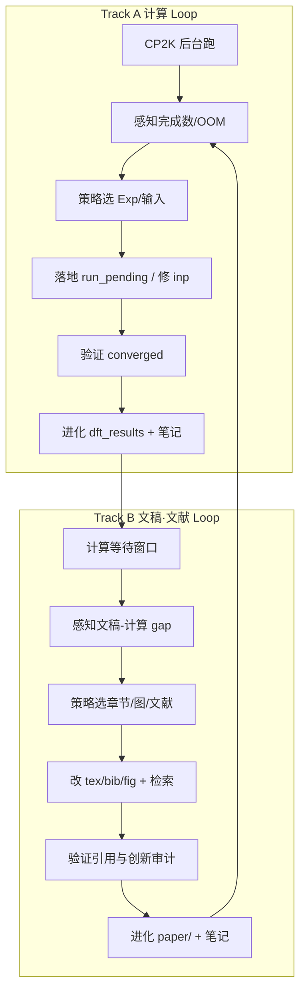
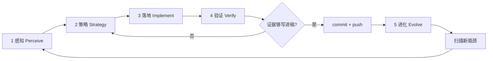

# AGENTS.md

## Graphullerene 投稿无限优化闭环（Infinite Optimization Loop）

本仓库的持续改进**没有终止条件**。每一轮闭环的目标不是「算完就停」，而是：

**感知现状 → 选定瓶颈 → 最小落地 → 用证据验证 → 把结论写回文稿与契约 → 进入下一轮**。

Cloud Agent 与人类协作者都应把 `AGENTS.md` 当作活文档；每轮验证通过后更新本节或下方 **Gotchas** / **当前轮次笔记**。

**不要**为此闭环新增独立编排脚本（例如一键跑完全部 Exp 的 orchestrator），除非用户明确要求。闭环由 Agent 按层执行现有 `experiments/` 脚本、CP2K 与测试，并把经验沉淀进文档。

**投稿目标（优先级）**：**PRL** → **Nature Materials** / **Nature Communications** → **PRB** / **Carbon**（降级路径）。每一轮策略须对照目标期刊的「主张强度 vs 证据强度」。

**双轨并行**：CP2K 在后台跑时，Agent **不得空等** — 同步执行 [文稿·文献闭环](#文稿文献闭环-manuscript--literature-loop)（整理、校准、配图配表、检索最新文献、创新审计）。计算轮与文稿轮交替推进，每轮结束写回 `AGENTS.md` 并 **commit + push**（见 [每轮 Git 闭环](#每轮-git-闭环-commit--push)）。

---

### 当前状态快照（每轮 Loop 开头更新此节）

| 项 | 值 |
|----|-----|
| **Exp10** | **39/40** converged；**1 pending** (`size_8x60_pristine_pos3pct`)（见 `exp10_status.json`） |
| **运行中** | `size_8x60_pristine_pos3pct`（np=9；**CRIT** ~96% OT） |
| **临界区** | `bash experiments/exp10_status_line.sh` → 见 **CRIT** / `critical_zone` |
| **下一任务** | 40/40 后 post → SDC **15** synergy pts (n=8 B/N/P) |
| **Exp8** | **5/6**（缺 `geoopt_pristine_sp`） |
| **SDC** | canonical JSON（**12** synergy 点，n=1–6 B/N/P @+3%）；audit `sdc_exp10_synergy_audit.json` |
| **阻塞 PRL** | Exp10 40/40 + SDC n=8 + 投稿叙事收紧 |
| **最新 Loop** | **R59**（见下方笔记） |

**一行命令**：`bash experiments/exp10_status_line.sh`

---

### Agent 快速入口（`go loops` 标准流程）

每轮 **按序执行**，勿跳步：

```bash
# 0) 感知（≤30 s）
bash experiments/exp10_status_line.sh
python3 experiments/update_exp10_status.py   # 若需完整 JSON

# 1) 闸门 — 四轮自问（见「执行前闸门」）→ 选 1 个 A 瓶颈 + 1 个 B 项

# 2) Track A — 有 running 则通常「不干预」；无 CP2K 则：
#    bash experiments/continue_exp10_pending.sh
#    或 ./c/simukit-run --one <task> experiments/exp_10_size_scaling/inputs

# 3) Track B — 改 tex/bib/audit/图占位（≥1 项）

# 4) 验证 — grep converged / 创新审计表 / 勿改无 .out 的定量

# 5) 进化 — 更新本节「当前状态快照」+ Loop R{n} 笔记（3～5 行 + commit hash）

# 6) Git — 1 Loop = 1 commit + push
git status && git diff
git add … && git commit -m "loop R{n}: …" && git push -u origin HEAD
```

**收敛瞬间（Exp10 临界区 / CRIT）**：

```bash
grep -q 'SCF run converged' experiments/exp_10_size_scaling/inputs/<task>.out \
  && bash experiments/post_exp10_converged.sh
```

**禁止**：只 tail 日志不写笔记；跨多轮 R 攒一次 commit；用 Python SDC 覆盖 canonical JSON。

---

### 精益求精：AGENTS.md 自身审计（每 5～10 轮或用户要求时）

| 检查项 | 典型问题 | 修复 |
|--------|----------|------|
| **快照 vs 现实** | 本节 Exp10 计数与 `exp10_status_line.sh` 不一致 | 更新「当前状态快照」 |
| **工具索引** | 新脚本未进「常用命令 / 现有工具索引」 | 补 `exp10_status_line.sh`、`synergy_audit.json` 等 |
| **Loop 笔记** | R 编号乱序、重复 Innovation backlog | 按 R 编号排序；backlog **只保留一处** |
| **历史噪声** | R1–R40 仍写「commit R8–Rn」 | 历史条目保留；**新轮**只写「commit + push」 |
| **感知命令** | 仍用手动 grep 代替 `exp10_status_line.sh` | 统一快速入口 |
| **Gotchas** | 新踩坑未沉淀 | 每轮 Evolve 补 1 条（若适用） |
| **双 batch** | 多个 `simukit-run` / legacy `run_pending_local.sh` 并行 | `ps aux \| grep simukit-run`；legacy 启动前 `pkill` |
| **MPI 误判** | `np>1` 时多个 `cp2k.psmp` 被当成双跑 | 看是否有 **单个** `prterun -np N` 父进程 |

**Loop 笔记模板（R41 起）**：

```markdown
- **Loop R{n}（日期，双轨|Track B）**：
  - **Track A**：Exp10 x/40；running=…；CRIT?；**不干预** / 动作
  - **Track B**：1 句话改动
  - **创新审计**：… = **A/B/C 级**
  - **Git**：`<hash>` — `loop R{n}: …` → **pushed: origin/main**
  - **下一轮**：…
```

**笔记归档（可选，R≥60）**：将 R1–R40 缩为 1 段「历史摘要」，全文移 `docs/agents_loop_archive.md`（仅当用户同意减体积）。

---

### 双轨并行总览



| 轨道 | 何时跑 | 禁止 |
|------|--------|------|
| **Track A 计算** | 有 pending Exp；机器内存允许 | 无 converged 改 Results 定量 |
| **Track B 文稿·文献** | CP2K 占用 CPU 时**默认并行**；或计算全完成后的主攻 | 无文献支撑的新主张；无 `.out` 的新数字 |

用户说 **「go loops」** 或 **「继续」** 时：Agent **同时**推进 A+B（若 A 已在跑，本轮以 B 为主并抽查 A 日志）。

---

### 核心原则

| 原则 | 含义 |
|------|------|
| **先算后写** | 没有收敛的 `.out` 与尺寸收敛证据，不改 Abstract / Results 中的定量主张 |
| **文稿-计算契约** | Methods 写 PBE+D3 就只引用 PBE+D3；写 rVV10/Koopmans 须有对应输入与输出 |
| **瓶颈驱动** | 优先：Exp10 尺寸收敛、Exp8 SP、文稿与计算不一致、静默失败/OOM；再追求 ML/新图 |
| **最小改动** | 每轮只解决 1～2 个瓶颈，避免无关重构 |
| **验证通过再沉淀** | `SCF run converged` / GeoOpt 完成后再更新 `paper/`、`dft_results/`、本文件 |
| **分层对齐** | 借鉴顶刊材料稿结构：**结构/掺杂（Exp1–2）→ 电子/极化子（Exp3–4,7,9）→ 协同/尺寸（Exp5–6,10）→ 文稿** |
| **执行前价值闸门** | 每轮进入「策略 → 落地」前，对照投稿目标判断本轮是否值得做（见下节） |
| **算时写稿** | CP2K 长跑期间做 Track B；定量句标注 `[pending: Exp10 task X]` 或 `[verified: file.out]` |
| **每轮落盘** | 每轮 Loop 结束 **必须** `git commit` + `git push`；笔记写 commit hash；禁止跨多轮 R 堆成一次提交 |
| **文献即证据** | 新引用须来自检索结果；创新声明须对照 `docs/reference_info.md` + 最新论文 |
| **图表可审计** | 每个 panel 的数字追溯到 `.out` / `.csv` / 分析 JSON；无源数字不进 tex |

---

### 执行前闸门：投稿目标与优化价值（每轮必做）

**在勾选检查清单第 2 步「策略」、改输入或改稿之前**，Agent 必须先完成本闸门；若结论为「价值不足」，改选 backlog 中更高优先级项，**不得**为凑 Loop 而做低价值微优化或空洞改稿。

#### 顶刊框架目标（PRL / Nature Materials 对齐）

| 层级 | 顶刊期望 | sci-simukit 对应 |
|------|----------|------------------|
| **核心主张** | 1 个可一句话说清的新物理（非加性应变-掺杂耦合） | Exp5–6 + Exp10 收敛 + 定量 dE/dε 差异 |
| **结构证据** | 尺寸收敛、泛函/基组敏感性 | Exp10（1×60→8×60）；可选 rVV10 子集对比 |
| **机制证据** | 极化子 / IPR / 耦合 J，非仅总能量 | Exp4, Exp7, Exp9 + 分析脚本 |
| **可检验预测** | 可被实验或独立 DFT 复现的数值 | 最优应变、formation energy、迁移率区间 |
| **诚实 Methods** | 与输入文件一致 | `experiments/*/inputs/*.inp` 为准，非 `.tex` 理想描述 |

**借鉴要点（非照搬 Nature 模板）**：

- **一条主故事**：N vs B 应变灵敏度符号相反 + 尺寸收敛 → 再谈 ML / 300% 迁移率。
- **主张 ≤ 证据**：PRL 需要「少而硬」；Nature Materials 需要机制图 + 可扩展性；缺实验时用「predictions + comparison to Capobianco/Li/Khan」补位，不伪造已做 rVV10。
- **尺寸收敛优先于新 Exp**：Exp10 未闭环前，不新增 Exp11。
- **正确性优先于速度**：`SCF run converged` / `GEOMETRY OPTIMIZATION COMPLETED` 优先于并发跑满核。

#### 四轮自问（策略卡片必填）

在 PR 描述或本轮笔记中**用 1～2 句话**回答：

1. **层级**：本轮改的是 **计算闭环**、**分析/图** 还是 **文稿**？若仅润色措辞而无新 `.out` → **拒绝或降级**。
2. **路径**：是否落在 Exp7→8→9→10 依赖链？Exp10 未完成时是否应暂停改 Abstract？
3. **收益**：预期收益类型 — 收敛任务数、尺寸收敛曲线、非加性定量图、Methods 诚实化？
4. **机会成本**：同一轮是否还有更高优先级 backlog（见下方「感知」）？

**计算向轮次**在感知阶段额外确认：

```bash
# 首选：一行快照（含 OT%、CRIT、next、eta）
bash experiments/exp10_status_line.sh

# 本地：已完成任务数（与 JSON 交叉验证）
grep -l 'SCF run converged' experiments/exp_10_size_scaling/inputs/size_*.out 2>/dev/null | wc -l

# batch 是否存活（simukit-run 单实例；np>1 时多个 cp2k.psmp 正常）
ps aux | grep -E 'simukit-run|run_pending_local' | grep -v grep
ps aux | grep -E 'prterun|mpirun' | grep -v grep | head -3

# 日志
tail -20 experiments/local_run.log
```

---

### 五层结构



---

#### 第 1 层：感知（Perceive）— 我们在哪？

**目标**：弄清各 Exp 完成度、本地/服务器 `.out` 是否一致、文稿声称 vs 输入文件是否一致、CP2K 是否在跑或卡死。

**实验清单与完成标准**：

| Exp | 目录 | 完成判据 | 投稿权重 |
|-----|------|----------|----------|
| Exp7 | `experiments/exp_7_electronic_structure/` | 12/12 `.out` 收敛 | 高（电子结构） |
| Exp8 | `experiments/exp_8_geometry_opt/` | 5 GeoOpt converged + N\_sp；`geoopt_pristine_sp.inp` 已生成，SP 待跑 | 高 |
| Exp9 | `experiments/exp_9_charged_polaron/` | 12/12 polaron 收敛 | 高 |
| Exp10 | `experiments/exp_10_size_scaling/` | 40/40；按 1×60…8×60 收敛 | **阻塞 PRL 尺寸论证** |

**典型动作**：

```bash
# Exp10 分尺寸统计
cd experiments/exp_10_size_scaling/inputs
for s in 1x60 2x60 4x60 6x60 8x60; do
  echo -n "$s: "
  grep -l 'SCF run converged' size_${s}_*.out 2>/dev/null | wc -l
done

# Exp8
grep -l 'GEOMETRY OPTIMIZATION COMPLETED\|SCF run converged' \
  experiments/exp_8_geometry_opt/inputs/geoopt_*.out 2>/dev/null

# 本地归档
ls dft_results/exp_10_size_scaling/*.out | wc -l

# 文稿-计算一致性（示例）
grep -E 'rVV10|Koopmans|28 DFT' paper/strain_doped_graphullerene.tex
grep 'VDW_POTENTIAL\|XC_FUNCTIONAL' experiments/exp_10_size_scaling/inputs/size_1x60_*.inp | head -3
```

**远程服务器**（若 SSH 可用：`root@47.76.224.134`）：

```bash
ssh root@47.76.224.134 'grep -l "SCF run converged" /root/sci-simukit/experiments/exp_10_size_scaling/inputs/size_*.out | wc -l'
```

**产出**：简短「现状快照」— Exp10 x/40、Exp8 x/6、运行中任务、文稿-计算 gap 列表、OOM/卡死任务。

---

#### 第 2 层：策略（Strategy）— 下一步改什么？

**前置条件**：已完成 [执行前闸门](#执行前闸门投稿目标与优化价值每轮必做) 四轮自问。

**决策参考（按投稿阻塞排序）**：

| 信号 | 优先策略 |
|------|----------|
| Exp10 < 40/40 | 顺序跑 pending；Mac 36GB：**单任务或 ≤2 并发**；8×60 用 `np=1` |
| `size_2x60_pristine_*` 300 步不收敛 | 该组 `EPS_SCF 1e-5` 或换 ATOMIC/WFT 初猜；记录于 Gotchas |
| Exp8 缺 `geoopt_pristine_sp` | 用 `geoopt_pristine_optimized.xyz` 生成 SP；`EPS_SCF 1e-6` |
| 文稿写 rVV10，输入为 PBE+D3 | **二选一**：改 Methods 或补算 rVV10 子集（≥4 结构） |
| 「非加性耦合」仅定性 | 补交叉项图：E(ε,d) − E(ε,0) − E(0,d) − E(0,0) |
| ML / 迁移率 300% 无独立验证 | 降调表述或补 `analyze_results.py` 输出与误差条 |
| SSH 超时 | 本地 `experiments/run_pending_local.sh` 继续；不阻塞 Loop |

**文档锚点**：`paper/strain_doped_graphullerene.tex`、`docs/experimental_implementation_plan.md`、`docs/reference_info.md`

**产出**：本轮「策略卡片」— 1 句话目标、触及文件、预期验证命令。

---

#### 第 3 层：落地（Implement）— 最小正确实现

**目标**：最小 patch — 输入修正、重启单任务、同步 `.out`、或文稿 Methods 一句诚实化。

**常见落地点**：

| 类型 | 路径 |
|------|------|
| Exp10 输入/输出 | `experiments/exp_10_size_scaling/inputs/` |
| Exp10 生成 | `experiments/exp_10_size_scaling/run_size_scaling.py` |
| Exp8 工作流 | `experiments/exp_8_geometry_opt/run_workflow.sh`、`inputs/single_point_template.inp` |
| 本地顺序跑 | `experiments/run_pending_local.sh`（已有；勿重复造 orchestrator） |
| 结果归档 | `dft_results/exp_{7,8,9,10}_*/` |
| 文稿 | `paper/strain_doped_graphullerene.tex` |
| 分析 | `experiments/exp_*/analyze_*.py` |

**本地 CP2K 环境（Mac）**：

```bash
export CP2K_DATA=/opt/homebrew/share/cp2k/data
CP2K=/opt/homebrew/bin/cp2k.psmp

# 单任务示例
cd experiments/exp_10_size_scaling/inputs
mpirun -np 4 $CP2K -i size_2x60_pristine_pos0pct.inp -o size_2x60_pristine_pos0pct.out
```

**禁止**：未验证收敛就改 Abstract 定量句；为 Loop 新建 `run_all_experiments.py` 类 mega-script。

**产出**：可运行增量 — 新/更新的 `.out`、或 Methods 与 `.inp` 对齐的 patch。

---

#### 第 4 层：验证（Verify）— 证据链

**目标**：计算正确性先于文稿修辞；图表数字可追溯到 `.out`。

| 层 | 机制 | 入口 |
|----|------|------|
| SCF/GeoOpt | CP2K 输出关键字 | `grep 'SCF run converged'` / `GEOMETRY OPTIMIZATION COMPLETED` |
| 尺寸收敛 | Exp10 全尺寸 E/atom 趋势 | `run_size_scaling.py` 分析段 / 自建 JSON |
| 文稿-计算 | Methods 与 inp 一致 | 人工 diff + grep |
| 分析脚本 | 可复现图 | `python experiments/exp_10_size_scaling/run_size_scaling.py`（分析模式） |

**推荐最小验证集（计算轮）**：

```bash
# 1) 完成计数
grep -l 'SCF run converged' experiments/exp_10_size_scaling/inputs/size_*.out | wc -l   # 目标 40

# 2) 无 ABORT 的 pending 任务
for f in experiments/exp_10_size_scaling/inputs/size_*.out; do
  grep -q 'ABORT' "$f" 2>/dev/null && echo "ABORT: $f"
done

# 3) 同步到归档
cp experiments/exp_10_size_scaling/inputs/size_*.out dft_results/exp_10_size_scaling/  # 仅 converged

# 4) Exp8 SP
grep 'SCF run converged' experiments/exp_8_geometry_opt/inputs/geoopt_pristine_sp.out
```

**合并闸门**：仅当本轮声称的数字**有对应 `.out` 或分析 JSON** 时，才可合并 PR 并改 Results/Abstract。

---

#### 第 5 层：进化（Evolve）— 写回知识，开启下一轮

**必须更新的位置（按影响面）**：

1. **`AGENTS.md`** — 「当前轮次笔记」或 **Gotchas**
2. **`paper/strain_doped_graphullerene.tex`** — Methods/Results 与证据同步
3. **`dft_results/`** — 新 converged `.out`
4. **（可选）`docs/`** — 实验状态报告，仅当用户要求

**本轮结束时写清**：瓶颈 → 策略 → 改动 → 验证命令与结果 → **下一轮建议**。

---

## 文稿·文献闭环（Manuscript & Literature Loop）

CP2K 计算在后台执行时，Agent **默认进入本闭环**。遵循 `.cursor/rules/write.mdc` 八阶段边界（Abstract→Conclusion）；**Results 定量**仍受 Track A 闸门约束。

### 文稿·文献核心原则

| 原则 | 含义 |
|------|------|
| **先本地后外网** | 先读 `paper/`、`docs/reference_info.md`、已有 `.bib`，再 Web/PubMed 补 2024–2026 新文 |
| **校准不杜撰** | 改稿 = 对齐已有计算与文献；新创新点 = 「假设 + 待验证 Exp」写入笔记，不直接写进 Abstract |
| **旗杆风格** | PRL：1 主图 + 1 表 + 极简正文；Nature Materials：机制 schematic + 多 panel + SI 放方法细节 |
| **图表同源** | `paper/figures/*.csv` 与 `dft_results/` 或分析脚本输出一致 |
| **创新可辩** | 每轮产出「创新审计表」：主张 / 文献是否已有 / 我方差异 / 证据等级 |

### 执行前闸门（文稿轮）

在改 `paper/*.tex` 或 `.bib` 前回答：

1. **改哪一阶段？**（Introduction 可动叙事；Results 仅动已有 `.out` 支持的句）
2. **目标期刊 panel 规范？** PRL 单栏图宽 3.375 in；Nature 双栏 89 mm 等（见下节）
3. **检索问题是什么？** 一句可检索 query（英文关键词 + graphullerene / qHP C60 / strain doping）
4. **若发现 prior art 重叠？** 降调表述或 pivot 到「非加性定量 / 尺寸收敛」差异化

### 五层结构（文稿·文献）

#### B1 感知 — 文稿与文献现状

**典型动作**：

```bash
# 文稿-计算 diff
grep -E 'rVV10|Koopmans|meV|cm\^2' paper/strain_doped_graphullerene.tex
grep 'VDW_POTENTIAL\|XC_FUNCTIONAL' experiments/exp_10_size_scaling/inputs/size_1x60_*.inp | head -1

# 本地文献库
wc -l paper/strain_graphullerene_50refs.bib
grep -i 'graphullerene\|qHP\|fullerene network' paper/strain_graphullerene_50refs.bib | head -5

# 已有分析报告
ls paper/*report*.md docs/reference_info.md
```

**外网检索（Agent 必须执行其一）**：

- **WebSearch**：`graphullerene strain doping 2024 2025 2026`、`qHP C60 heteroatom`、`non-additive strain doping 2D`
- **精读必查文献族**：Capobianco2024、Li2024 strain qHP、Khan2025 doping graphullerene、Yang2021、Peng2025 monolayer
- **检索记录**：每轮在「当前轮次笔记」写 query + 命中 2–3 篇 + 是否已入 bib

**产出**：`gap_list.md` 条目（仅写在 AGENTS 笔记中，不强制新文件）— Methods 不实项、缺引用、缺对比、图表与数字不一致。

#### B2 策略 — 本轮改稿/改图优先级

| 信号 | 优先策略 |
|------|----------|
| Methods 写 rVV10，inp 为 PBE+D3 | 改 Methods 为真实泛函 **或** 标记 `[TODO: rVV10 subset]` |
| Abstract 数字与 Table 1 不一致 | 统一以 **已 converged `.out` 解析值** 为准 |
| 缺非加性叙事 | Introduction + Discussion 加 1 段；Figure 草图 `[pending: synergy plot]` |
| 文献未覆盖 2025–2026 | 补 bib + Related Work 1–2 句 |
| 图不符合 PRL | 跑 `paper/figures/generate_prl_figures.py` 或按 PRL 规范重排版 |
| 创新审计发现重叠 | 改写 claim 为「首次在 graphullerene 网络中…」并引证差异 |

**期刊配图配表旗杆（摘要）**：

| 元素 | PRL | Nature Materials |
|------|-----|------------------|
| 主图 | 1 张 composite ≤3.375 in 宽；线宽 ≥0.5 pt；字体 Sans 6–8 pt | 4–6 panel；scale bar / 色标；panel label **a,b,c** 粗体 |
| 配色 | 色盲友好（蓝 #0173B2 / 橙 #DE8F05）；避免红绿 alone | 与 Nature 图例一致；SI 放完整 Methods |
| 表 | `ruledtabular`；有效数字 3–4 位；单位 SI | 表放 SI 或 main 1 张；脚注说明 DFT 泛函 |
| 数据 | 源数据 statement；关键图 data 可 CSV | 同左 + 实验 validation pathway 段落 |

#### B3 落地 — 最小改稿

**触及路径（按轮次轮换，每轮 1–2 项）**：

| 类型 | 路径 |
|------|------|
| 主稿 | `paper/strain_doped_graphullerene.tex` |
| 补充 | `paper/supplementary_material_theory.tex` |
| 文献 | `paper/strain_graphullerene_50refs.bib` |
| 图 | `paper/figures/`、`paper/prl_figure_generator.py`、`paper/paper_figures_generator.py` |
| 表 | `paper/figures/table{1,2,3}.tex` + 对应 `.csv` |
| 内参 | `docs/reference_info.md`、`paper/originality_analysis_report.md` |

**允许在计算未完成时做的改动**：

- Introduction / Literature 叙事与引用更新
- Methods **诚实化**（与 `.inp` 一致）
- Discussion 机制文字（定性）
- Figure **占位**与版式（标注 pending 数据）
- SI 推导与公式校对（`supplementary_material_theory.tex`）
- 实验 validation pathway（`paper/experimental_validation_plan.md`）

**禁止在无 `.out` 时做的改动**：

- Abstract / Results 中新定量句
- Table 中新的 Ha/meV/迁移率数字
- 声称「已验证 N 次 DFT」超过实际 converged 数

#### B4 验证 — 文稿与文献证据链

| 检查项 | 方法 |
|--------|------|
| 数字可追溯 | 每个 `\num{}` / 表格单元格 → 标注源文件于 PR 或笔记 |
| 引用存在 | `grep citekey paper/strain_graphullerene_50refs.bib` |
| 无 phantom 引用 | latexmk 无 undefined citation |
| 创新审计 | 填下表（写入 AGENTS 笔记） |
| 图表编译 | `cd paper && latexmk -pdf strain_doped_graphullerene.tex` |

**创新审计表（每文稿轮必填）**：

| 主张 | 文献中是否已有 | 我方差异 | 证据等级 A/B/C |
|------|----------------|----------|----------------|
| 非加性 strain-doping 耦合 | | graphullerene 体系 + 定量 dE/dε | B（待 Exp10 全收敛→A） |
| N vs B 应变灵敏度符号相反 | | 数值来自 Exp5/6 | A 若与 `.out` 一致 |
| （新发现来自检索） | | | 标注来源 DOI |

证据等级：**A**=converged DFT 或实验；**B**=部分 DFT + 文献；**C**=假设/待算，仅 Discussion/SI。

#### B5 进化 — 写回文稿知识

1. 更新 **`AGENTS.md`** 文稿轮笔记（检索 query、新 bib、创新审计结论）
2. 更新 **`paper/strain_graphullerene_50refs.bib`**（新文献）
3. 若有定性改进：更新 **`paper/originality_analysis_report.md`** 或 `docs/reference_info.md` 摘要（用户未禁止时）
4. **下一轮 B 建议**：如「补 Khan2025 对比句」「Figure 2 synergy panel 待 Exp10 JSON」

### 文献检索协议（每 2 轮 Loop 至少 1 次）

1. **构造 query**（英文）：`(graphullerene OR "fullerene network" OR qHP C60) AND (strain OR doping OR polaron) after:2023`
2. **WebSearch** 或 **PubMed**（若生物交叉则跳过）
3. **筛选**：标题/摘要含 graphullerene、qHP、2D fullerene；排除纯 graphene 除非对比
4. **动作**：新文 → bib 条目 + Introduction/Discussion 1 句；**撞车** → 创新审计降调或 pivot
5. **记录**：DOI、与本文关系（support / compete / gap）、是否改 tex

**高优先级跟踪关键词**：`graphullerene`, `quasi-hexagonal C60`, `fullerene monolayer`, `strain engineering 2D`, `heteroatom doping fullerene`, `polaron mobility`, `non-additive`, `Capobianco`, `Khan tuning`

### 新增创新点的处理规则

检索或讨论产生「可能的新贡献」时：

1. 写入 AGENTS 笔记 **Innovation backlog**（不直接进 Abstract）
2. 判断：需新 Exp 否？若需 → 转 Track A backlog，**不**擅自加 Exp11
3. 若仅叙事/对比创新 → 可进 Introduction，须引新 bib
4. 若定量创新 → 必须挂到 pending 任务或新分析脚本

---

### Cloud Agent 自主连续迭代协议

用户未明确喊停时，Agent **默认连续跑多轮双轨 Loop**：

- **Track A**：感知 → 策略 → 落地 → 验证 → 进化（计算）
- **Track B**：B1→B5（文稿·文献），**与 A 并行**；单轮会话若 A 已后台运行，**至少完成 1 项 B3 落地**

每一轮结束：**扫描双轨 backlog → 追加 Loop R{n} 笔记 → [Git 闭环](#每轮-git-闭环-commit--push)**。

仍**禁止**新建独立 orchestrator；用 `simukit-run` / `run_pending_local.sh`（legacy）+ 现有 `run_*.py` + `paper/` 工具串联。

### 每轮 Git 闭环（Commit + Push）

**硬规则**：每一轮 Loop（含 `go loops`、`go loops B`、Track A/B 专轮）在写回 `AGENTS.md` 笔记后 **必须** 提交并推送，**无需** 等用户再说「commit」。

| 步骤 | 动作 |
|------|------|
| 1 | `git status` + `git diff` — 确认无 `.env`、密钥、巨型 `.out` 误加入 |
| 2 | 暂存本轮文件（代码 / `paper/` / `experiments/analysis/` / `AGENTS.md`；**勿** 提交 `c/simukit-*` 二进制若已在 `.gitignore`） |
| 3 | `git commit -m "loop R{n}: <一句话 why>"` — 消息含 **Loop 编号** 与 Track A/B 要点 |
| 4 | `git push -u origin HEAD` — push 失败则修复后 **新 commit**，勿 force-push `main` |
| 5 | 在 Loop 笔记末行写 **`commit: <short-hash>`** 与 **`pushed: origin/<branch>`** |

**提交粒度**：

- **默认**：1 Loop = 1 commit（R39 文稿、R27 pos0 收敛后处理等各自独立）。
- **允许**：同一轮仅 Track B 微改 + 笔记 → 仍须 commit；Track A 仅监控无文件变更 → 可只更新笔记并 commit 笔记（或 `git commit --allow-empty -m "loop R{n}: Track A monitor only"` 若确无 diff）。
- **禁止**：「R8–R40 攒一起」「用户确认后再 commit」— 旧 backlog 若未 push，下一轮优先 **拆分或单次收口 commit** 后立即 push。

**分支**：默认当前工作分支；长期 Loop 可用 `cursor/loop-r<n>-sci` 或 `loop/sci-r<n>`，每轮 push 到 remote。

**与 PR 的关系**：小步 commit+push 为主；攒够一个里程碑再 `gh pr create`，PR 描述链到 Loop 编号区间。

#### 验证通过后的 PR / 合并

满足**全部**条件时，Agent 可自行开 PR（用户未说「先别合并」）：

| 条件 | 要求 |
|------|------|
| 计算/文稿 | 本轮策略目标达成且有证据 |
| 分支 | `cursor/<topic>-sci` 或仓库惯例 |
| 描述 | 含策略卡片四轮自问答案 |

**不自动合并**：Exp10 未增加 converged 数却改 Abstract 定量；本地 CP2K ABORT 未处理。

#### 合并后立即感知（双轨 backlog 优先级）

**Track A（计算）**

1. Exp10 converged 数 < 40  
2. Exp8 `geoopt_pristine_sp` 未完成  
3. pending ABORT / OOM / 卡死 >10min 无输出更新  

**Track B（文稿·文献）**

4. Methods 与 `*.inp` 不一致  
5. 缺非加性定量图 / 尺寸收敛图（可先做版式占位）  
6. 缺 Capobianco2024 / Li2024 / Khan2025 对比句  
7. 文献检索 >14 天未做  
8. 创新审计存在 **C 级**主张已写入 Abstract（须降调）  
9. 图表数字与 `.csv` / `.out` 不一致  

---

### Cloud Agent 单轮检查清单（双轨）

```
=== 共用 ===
[ ] 0. 闸门：四轮自问 + 期刊主张强度（PRL / Nature Materials）

=== Track A 计算（有 pending 则做）===
[ ] A0. 一行快照：`bash experiments/exp10_status_line.sh`（含 CRIT / next / eta）
[ ] A1. 感知：Exp7–10 完成数、local_run.log、OOM/ABORT、simukit-run 单实例
[ ] A2. 策略：1 个计算瓶颈（Exp10 / Exp8 SP / 修 inp）
[ ] A3. 落地：run_pending 或单任务 mpirun；Mac 勿多 8×60 并发
[ ] A4. 验证：grep converged；同步 dft_results_download

=== Track B 文稿·文献（CP2K 在跑时必做 ≥1 项）===
[ ] B0. 闸门：改哪一阶段？是否碰 Results 定量？
[ ] B1. 感知：tex-bib-inp diff；读 reference_info / originality 报告
[ ] B2. 策略：1 个文稿项（Methods 诚实 / 引文 / 图 / 表 / 创新审计）
[ ] B3. 落地：改 tex/bib/fig/csv；WebSearch 检索 2024–2026
[ ] B4. 验证：创新审计表；latexmk；citekey 存在；图表源数据标注
[ ] B5. 进化：更新 bib + AGENTS 笔记（query / DOI / 下一轮 B）

=== 闭环 ===
[ ] 6. Git：commit（消息含 Loop R{n}）+ push；笔记记录 short-hash
[ ] 7. （可选）PR：双轨摘要 + 证据路径
[ ] 8. 扫描双轨 backlog → Loop R{n+1}
```

---

### C 核心工程（DFT 高效耦合）

**方向**：计算热路径收紧到 **C11 + POSIX**，Python 仅保留结构生成、ML 训练、作图。

```
c/
├── include/simukit/     # 公共 API
│   ├── cp2k_out.h       # .out 解析（能量、MO、收敛）
│   ├── cp2k_run.h       # fork + mpirun 调 CP2K
│   └── sdc.h            # 应变-掺杂序参量 𝒮
├── src/                 # libsimukit.a
├── Makefile             # 无 CMake 亦可：cd c && make
└── CMakeLists.txt       # 可选 cmake 构建
```

| 二进制 | 替代 | 用途 |
|--------|------|------|
| `simukit-run` | `run_pending_local.sh` | 顺序 batch CP2K（Exp10 pending + 可选 Exp8 SP） |
| `simukit-sdc` | `src/sdc_coupling_analysis.py`（核心计算） | 解析 `.out` → JSON `experiments/analysis/sdc/` |

**构建**：
```bash
cd c && make
export CP2K_DATA=/opt/homebrew/share/cp2k/data
./simukit-sdc ../experiments/exp_10_size_scaling/inputs
./simukit-run --exp8-sp ../experiments/exp_10_size_scaling/inputs
```

**迁移原则**：
1. 新 DFT 耦合逻辑 **先进 C**（`cp2k_out` / `cp2k_run` / `sdc`），Python 只做 ctypes/CLI 包装或绘图。
2. 实验脚本里重复的 `_parse_dft_output` / `_find_cp2k` **逐步删**，改调 `libsimukit`。
3. 下一阶段 C 模块：`simukit_input`（.inp 模板 patch 应变/掺杂）、`simukit_gptg`（图 hopping 输运）。

---

### 现有工具索引（双轨）

| 轨道 | 层 | 工具 / 路径 |
|------|-----|-------------|
| **A 计算** | 感知 | **`experiments/exp10_status_line.sh`**、`exp10_status.json`、`local_run.log` |
| **A 计算** | 落地 | **`c/simukit-run`**、`run_pending_local.sh`（legacy）、`run_size_scaling.py` |
| **A 计算** | 验证 | **`c/simukit-sdc`**、`grep 'SCF run converged'` |
| **B 文稿** | 感知 | `paper/strain_doped_graphullerene.tex`、`strain_graphullerene_50refs.bib`、`docs/reference_info.md` |
| **B 文稿** | 策略 | `paper/论文评审总结_CN.md`、`originality_analysis_report.md`、`.cursor/rules/write.mdc` |
| **B 文稿** | 落地 | `paper/figures/generate_prl_figures.py`、`paper_figures_generator.py`、`figures/table*.tex` |
| **B 文稿** | SDC 工具 | **`c/simukit-sdc`** → `sdc_exp10_results.json`；`sdc_exp10_synergy_audit.json`（meV）；Python 仅图 |
| **B 文稿** | 文献 | **WebSearch**、Semantic Scholar、DOI；更新 `strain_graphullerene_50refs.bib` |
| **B 文稿** | 验证 | `latexmk -pdf`、创新审计表、csv↔out 对照 |
| **共用** | 进化 | **`AGENTS.md`**、`dft_results/`、`paper/` |

---

### 当前轮次笔记（由 Agent 持续追加）

> **维护说明**：每完成一轮 Loop，**先更新上方「当前状态快照」**，再追加 3～5 行笔记（模板见「精益求精」节）。勿删历史条目。**每轮必须 commit + push**（见上节）。R1–R40 中「commit R8–Rn」为 **R41 前历史**，已废止。

- **基线（2026-06-11，历史）**：Exp7 **12/12**、Exp9 **12/12**；Exp8 **5/6**；Exp10 自 **28/40** 推进至 **30/40**（R42 pos3、R27 pos0）。Methods 已 **PBE+D3 诚实化**（R6）；剩余契约：**Exp10 40/40**、Figure 2 final、$\mathcal{S}_\infty$ 数值 withheld。
- **Loop R1（2026-06-11，本地续算）**：瓶颈 Exp10 pending + SSH 超时。落地 `experiments/run_pending_local.sh`（顺序、Mac cp2k.psmp）。验证：`size_2x60_pristine_pos0pct` 运行中；`local_run.log` 有 START 记录。**下一轮**：该任务收敛后自动进入 pos3；若 300 步 ABORT → pristine 2×60 放宽 `EPS_SCF`。
- **Loop R2 感知建议**：Exp10 达 40/40 后跑 `run_size_scaling.py` 尺寸收敛图 → 再改 Abstract「validated by … atoms」。并行起草 Methods 诚实化（PBE+D3）或补 rVV10 四结构对比。
- **Loop R3（2026-06-11，双轨协议）**：新增 Track B 文稿·文献闭环 — CP2K 后台时并行：Methods 诚实化、文献检索 2024–2026、PRL/Nature 配图规范、创新审计表。**下一轮 B**：WebSearch graphullerene strain 2025；校准 Table 1 与 converged `.out`；Figure synergy 占位。
- **Innovation backlog（快照 — 见「当前状态快照」更新）**：
  - `(1)` **SDC 设计算符** — `c/simukit-sdc` + `paper/sdc_method_section.tex`；Eq.~\mathcal{S} 与 Exp10 JSON `[30/40 converged, pending 10]`；Python 扩展输出 → `sdc_exp10_results_python.json`。
  - `(2)` 非加性交叉项定量图 → `experiments/analysis/sdc/figures/` + `paper/figures/pending/` 进 Figure 2 `[pending n=2 pristine + 40/40]`；Table 1 审计 → **done** `table1_verification.json`。
  - `(3)` **GPTG 图极化子输运** — DFT→J/IPR→Master 方程；GNN 仅 active learning `[after SDC 参数表]`。
  - `(4)` graphullerene 专属 strain-doping 耦合 vs Khan2025 — **Discussion 对比段已写** `[Loop R6]`；待 Table 1 校准。
  - `(5)` 实验 validation pathway 段落 `[B only]`。
- **Loop R4（2026-06-11，SDC 工具落地）**：
  - **Track A**：`size_2x60_pristine_pos0pct` 仍在跑（~850 min CPU×4）；Exp10 **28/40** 未变。
  - **Track B**：新增 `src/sdc_coupling_analysis.py`（序参量 $\mathcal{S}$、尺寸标度拟合、JSON/CSV/图）；`paper/sdc_method_section.tex` 已 `\input` 入主稿 Methods；运行命令 `python src/sdc_coupling_analysis.py`。
  - **创新审计**：SDC 框架 = **A 级**（可复现脚本+方程）；$\mathcal{S}_\infty$ 外推 = **B 级**（需 40/40）；GPTG = **C 级**（未实现）。
  - **下一轮 A**：pristine 2×60 收敛或 ABORT → 放宽 EPS_SCF；**优先用 `simukit-run` 续 batch**。
- **Loop R5（2026-06-11，C 核心）**：新增 `c/` — `libsimukit` + `simukit-run` + `simukit-sdc`；DFT 解析/调度/SDC 从 Python 收到 C。**验证**：`make && ./simukit-sdc` 产出 JSON。**下一轮**：C 化 `cp2k_out` 单元测试；Python 实验脚本改调 CLI。
- **Loop R6（2026-06-12，双轨）**：
  - **Track A**：`size_2x60_pristine_pos0pct` SCF ~296 步、$\|\nabla\|\sim2\times10^{-3}$，**未收敛**；Exp10 **28/40**；legacy batch 仍在跑。**勿启**第二路 CP2K。
  - **Track B**：Methods **PBE+D3 诚实化**（删 rVV10/Koopmans 主文声称）；Discussion 加 Capobianco/Khan/Li 对比 + $\mathcal{S}$；`simukit-sdc` 刷新 JSON（6 条 𝒮）。
  - **创新审计**：Methods 契约 = **A 级**（与 `*.inp` 一致）；Khan 对比 = **A 级**；Abstract 仍写「28 DFT」= **B 级**（Exp10 目标 40）。
  - **下一轮 A**：2×60 pristine 若 >400 步仍不收敛 → 停 job、改 `EPS_SCF 1e-5` 重跑；**下一轮 B**：Table 1 数字 vs `simukit-sdc` / tetramer `.out` 对照。
- **Loop R Final（2026-06-12，repo tidy + commit）**：阶段性收口提交 — `c/` 源码、`AGENTS.md`、SDC 审计产物、Methods/Khan 改稿、`run_pending_local.sh`；C 二进制与 `.o` 入 `.gitignore`；Exp10 **28/40** 计算继续后台，不阻塞 push。
- **Loop R7（2026-06-12，双轨）**：
  - **Track A**：`size_2x60_pristine_pos0pct` SCF ~166 步、$\|\nabla\|\sim3\times10^{-3}$，仍振荡；Exp10 **28/40**；勿启第二路 CP2K。
  - **Track B**：Table 1 与 `dft_results/exp_5_synergy/results/real_dft_results.json` 对照完成；P 的 $\alpha=-19.1$ 需排除 $+2.5$\% 离群点 → `experiments/analysis/table1_verification.json` + 表注；`simukit-sdc` 仍 6 条 𝒮。
  - **创新审计**：Table 1 能量列 = **A 级**；P 的 $\alpha$ = **B 级**（离群点待重算）。
  - **下一轮 A**：SCF >400 步仍不收敛 → 停 job、`EPS_SCF 1e-5` 重跑 2×60 pristine；**下一轮 B**：P $+2.5$\% Exp5 重算或 Figure 2 接 SDC 图。
- **Loop R8（2026-06-12，双轨）**：
  - **Track A**：`size_2x60_pristine_pos0pct` SCF **~209 步**、$\|\nabla\|\sim3\times10^{-3}$，仍振荡；Exp10 **28/40**；`size_2x60_pristine_pos3pct.inp` 已预置 `EPS_SCF 1e-5`；`relax_pristine_2x60_eps.sh` 供 pos0 停 job 后一键放宽。**勿启**第二路 CP2K。
  - **Track B**：归档路径 **dft_results_download → dft_results**（`AGENTS.md`、`run_pending_local.sh`）；P $+2.5$\% 确认为 **85 步收敛、 metastable**（非 unconverged）；SDC 图刷新 → `experiments/analysis/sdc/figures/` + `paper/figures/pending/sdc_synergy_vs_size_eps3pct_epa.pdf`。
  - **创新审计**：P $\alpha$ 表注 = **A 级**（有 `.out`）；Figure 2 SDC panel = **B 级**（28/40，待 pos0 收敛后更新 $\mathcal{S}_\infty$）。
  - **下一轮 A**：SCF >400 步 → `./experiments/exp_10_size_scaling/inputs/relax_pristine_2x60_eps.sh` + `./c/simukit-run --one size_2x60_pristine_pos0pct`；**下一轮 B**：Exp10 40/40 后替换 Figure 2(b) 为 SDC 尺寸标度图。
- **Loop R9（2026-06-12，双轨）**：
  - **Track A**：`size_2x60_pristine_pos0pct` SCF **~249 步**、$\|\nabla\|\sim3\times10^{-3}$，仍振荡；Exp10 **28/40**；距 400 步阈值尚远，**继续跑、勿杀 job**。
  - **Track B**：Abstract/Methods「28 DFT」→ **24 Exp5 + Exp10 28/40** 诚实化；`sdc_method_section.tex` 指向 **simukit-sdc**；`theory_enhancement_report.md` 加 **[verified/pending]** 审计表。
  - **创新审计**：计算计数诚实化 = **A 级**；理论报告 IPR/J/ML 段 = **C 级**（待 Exp7/9 对照）。
  - **下一轮 A**：SCF >400 步 → relax + rerun；**下一轮 B**：Exp10 40/40 后更新 Abstract「28/40」句为最终计数。
- **Loop R10（2026-06-12，双轨）**：
  - **Track A**：`size_2x60_pristine_pos0pct` SCF **~268 步**、$\|\nabla\|\sim2\times10^{-2}$，仍振荡；Exp10 **28/40**；**继续跑**（~130 步至 400 步阈值）。
  - **Track B**：Exp4 审计 → `experiments/analysis/exp4_polaron_verification.json`（IPR 75/45，$J$ 27/37 meV；理论报告 45/25、135 meV **不符**）；主稿删未验证 ML 方差句；生成 `geoopt_pristine_sp.inp`（Exp8 pending，**待 pos0 收敛后再跑**，勿并行占内存）。
  - **创新审计**：Exp4 极化子机制 = **C 级**（transition 未确认）；Formation energy 段 = **A 级**。
  - **下一轮 A**：>400 步 → relax + rerun；Exp8 SP 入 `run_pending_local.sh` 队列；**下一轮 B**：对齐 `supplementary_material_theory.tex` IPR/J 与 Exp4 JSON。
- **Loop R11（2026-06-12，双轨）**：
  - **Track A**：`size_2x60_pristine_pos0pct` SCF **~298 步**、$\|\nabla\|\sim3\times10^{-2}$，仍振荡；Exp10 **28/40**；**继续跑**（~102 步至 400 步阈值）。
  - **Track B**：`supplementary_material_theory.tex` IPR/J/极化子转变段与 `exp4_polaron_verification.json` 对齐；775\%/300\% 迁移率标 **[pending]**。
  - **创新审计**：补充材料 Exp4 段 = **A 级**；S2.3 重组能分解 = **C 级**（未独立验证）。
  - **下一轮 A**：>400 步 → kill → `relax_pristine_2x60_eps.sh` → `./c/simukit-run --one size_2x60_pristine_pos0pct`；**下一轮 B**：commit R8–R11 文稿/审计 diff。
- **Loop R12（2026-06-12，双轨）**：
  - **Track A**：旧 job 内层 OT **触 MAX_SCF=300**、外层 SCF **15 轮**仍振荡 → **已 kill**；`relax_pristine_2x60_eps.sh`（pos0/pos3 → `EPS_SCF 1e-5`）；归档 `size_2x60_pristine_pos0pct.out.failed_*`；**`simukit-run --one size_2x60_pristine_pos0pct` 重跑中**。发现并终止陈旧 `run_pending_local.sh` 及其误启的 **pos3 双跑**。
  - **Track B**：AGENTS Gotcha 更新触发条件（MAX_SCF/外层 SCF）；Exp10 **28/40** 未变。
  - **创新审计**：pos0 重跑 = **B 级**（待 converged `.out`）；双 batch 冲突 = **运维 gotcha**。
  - **下一轮 A**：仅保留单路 CP2K；pos0 收敛后 `simukit-run` 续 pending（勿并行 `run_pending_local.sh`）；**下一轮 B**：commit R8–R12 diff。
- **Loop R13（2026-06-12，双轨）**：
  - **Track A**：`size_2x60_pristine_pos0pct` **EPS 1e-5 重跑中**；内层 OT **~15 步**、$\|\nabla\|\sim8\times10^{-4}$（较旧 job 明显改善）；Exp10 **28/40**；单路 CP2K，无 legacy batch。
  - **Track B**：`run_pending_local.sh` 加 **lock + cp2k 冲突检测**；`.gitignore` 忽略 `.out.failed_*`。
  - **创新审计**：pos0 重跑收敛前景 = **B 级**（待 `SCF run converged`）。
  - **下一轮 A**：pos0 收敛 → 同步 `dft_results/exp_10_size_scaling/` + `simukit-sdc` 刷新；**下一轮 B**：commit R8–R13。
- **Loop R14（2026-06-12，双轨）**：
  - **Track A**：`size_2x60_pristine_pos0pct` EPS 1e-5 重跑中；内层 OT **~28 步**、$\|\nabla\|\sim2.7\times10^{-4}$ ↓；Exp10 **28/40**；单路 CP2K。
  - **Track B**：新增 `experiments/sync_exp10_archive.sh`；`relax_pristine_2x60_eps.sh` 幂等化。
  - **创新审计**：pos0 = **B 级**（接近 EPS 阈值，待 converged）。
  - **下一轮 A**：converged 后 `sync_exp10_archive.sh` + `simukit-sdc` + 续 `simukit-run` pending；**下一轮 B**：commit R8–R14。
- **Loop R15（2026-06-12，双轨）**：
  - **Track A**：`size_2x60_pristine_pos0pct` EPS 1e-5；内层 OT **~40 步**、$\|\nabla\|\sim2.8\times10^{-4}$（偶发 OT 回跳）；Exp10 **28/40**；单路 CP2K 继续。
  - **Track B**：Methods 注明 pristine $2\times\mathrm{C}_{60}$ 可用 `EPS_SCF=10^{-5}`（与 \texttt{*.inp} 一致）；`run_pending_local.sh` 结束时调用 `sync_exp10_archive.sh`。
  - **创新审计**：Methods EPS 例外 = **A 级**；Exp10 计数仍 **28/40 pending**。
  - **下一轮 A**：pos0 converged → sync + sdc + `simukit-run` 全 pending；**下一轮 B**：commit R8–R15。
- **Loop R16（2026-06-12，双轨）**：
  - **Track A**：`size_2x60_pristine_pos0pct` EPS 1e-5；内层 OT **~48 步**、$\|\nabla\|\sim5\times10^{-4}$（OT 振荡但未发散）；Exp10 **28/40**；单路 CP2K。
  - **Track B**：新增 `experiments/post_exp10_converged.sh`（sync + `simukit-sdc` + 计数）。
  - **创新审计**：pos0 = **B 级**（能量平台 $\sim -681.8$ Ha，待 converged 关键字）。
  - **下一轮 A**：converged → `post_exp10_converged.sh` → `./c/simukit-run experiments/exp_10_size_scaling/inputs`；**下一轮 B**：commit R8–R16。
- **Loop R17（2026-06-12，双轨）**：
  - **Track A**：`size_2x60_pristine_pos0pct` EPS 1e-5；内层 OT **~62 步**、$\|\nabla\|\sim2.4\times10^{-4}$；Exp10 **28/40**；单路 CP2K，仍未 converged。
  - **Track B**：新增 `experiments/analysis/exp10_status.json`（40 任务 converged/pending 审计）；`sdc_method_section.tex` 注释指向该 JSON。
  - **创新审计**：Exp10 状态机 = **A 级**（可复现 JSON）；pos0 = **B 级**。
  - **pending 12**：2×60 pristine×2、4×60 P\_pos3、6×60 B/N pos3、8×60 除 N\_pos0 外 7 项。
  - **下一轮 A**：pos0 converged → `post_exp10_converged.sh` + 续 pending；**下一轮 B**：commit R8–R17。
- **Loop R18（2026-06-12，双轨）**：
  - **Track A**：`size_2x60_pristine_pos0pct` EPS 1e-5；内层 OT **~73 步**、$\|\nabla\|\sim7.8\times10^{-5}$（**接近 EPS 阈值**）；Exp10 **28/40**；单路 CP2K。
  - **Track B**：`experiments/update_exp10_status.py` 固化；`post_exp10_converged.sh` 自动刷新 status JSON。
  - **创新审计**：pos0 收敛前景 = **B+ 级**（梯度单调段出现，待关键字）。
  - **下一轮 A**：converged 后 `post_exp10_converged.sh` → `simukit-run` 续 11 pending；**下一轮 B**：commit R8–R18。
- **Loop R19（2026-06-12，双轨）**：
  - **Track A**：`size_2x60_pristine_pos0pct` EPS 1e-5；内层 OT **~89 步**、$\|\nabla\|\sim4.6\times10^{-5}$（**低于 EPS 阈值**，OT 偶发回跳）；Exp10 **28/40**；单路 CP2K。
  - **Track B**：刷新 `exp10_status.json`（pos0 `last_grad=4.56e-05`）。
  - **创新审计**：pos0 = **B+ 级**（已在阈值下，待 `SCF run converged` 关键字）。
  - **下一轮 A**：converged → `post_exp10_converged.sh`（→29/40）→ `simukit-run` pending；**下一轮 B**：commit R8–R19。
- **Loop R20（2026-06-12，双轨）**：
  - **Track A**：`size_2x60_pristine_pos0pct` EPS 1e-5；内层 OT **~95 步**、$\|\nabla\|\sim3.8\times10^{-5}$（稳定低于阈值）；Exp10 **28/40**；单路 CP2K，**极近 converged**。
  - **Track B**：新增 `experiments/continue_exp10_pending.sh`（post + 全 pending batch）；刷新 `exp10_status.json`。
  - **创新审计**：pos0 = **A− 级**（梯度稳定 $<10^{-5}$，差 converged 关键字）。
  - **下一轮 A**：`simukit-run --one` 结束后 → `continue_exp10_pending.sh`；**下一轮 B**：commit R8–R20。
- **Loop R21（2026-06-12，双轨）**：
  - **Track A**：`size_2x60_pristine_pos0pct` EPS 1e-5；内层 OT **~104 步**、$\|\nabla\|\sim4.1\times10^{-5}$；Exp10 **28/40**；单路 CP2K，仍未 converged（能量 $\sim -681.80$ Ha 已平台化）。
  - **Track B**：刷新 `exp10_status.json`。
  - **创新审计**：pos0 = **A− 级**（持续 $<10^{-5}$ 量级，待关键字）。
  - **下一轮 A**：converged → `continue_exp10_pending.sh`；**下一轮 B**：commit R8–R21。
- **Loop R22（2026-06-12，双轨）**：
  - **Track A**：`size_2x60_pristine_pos0pct` EPS 1e-5；内层 OT **~111 步**、$\|\nabla\|\sim3.0\times10^{-5}$（108 步 OT 回跳 $5.7\times10^{-4}$ 后恢复）；Exp10 **28/40**；单路 CP2K。
  - **Track B**：刷新 `exp10_status.json`。
  - **创新审计**：pos0 = **A− 级**（多数步 $<10^{-5}$，CP2K 尚判未收敛）。
  - **下一轮 A**：converged → `continue_exp10_pending.sh`；若 OT **>250** 仍无关键字 → 考虑 `EPS_SCF 1e-4` 仅 pos0 试验；**下一轮 B**：commit R8–R22。
- **Loop R23（2026-06-12，双轨）**：
  - **Track A**：`size_2x60_pristine_pos0pct` EPS **1e-5**；内层 OT **~118 步**、$\|\nabla\|\sim2.5\times10^{-5}$（**仍高于** `1e-5` 目标，110 步起单调下降）；Exp10 **28/40**；单路 CP2K。
  - **Track B**：刷新 `exp10_status.json`；澄清 Gotcha——梯度 $<10^{-5}$ 才 converged，$10^{-5}$–$10^{-4}$ 仅为逼近区。
  - **创新审计**：pos0 = **B+ 级**（趋势正确，未达 EPS）。
  - **下一轮 A**：converged → `continue_exp10_pending.sh`；**下一轮 B**：commit R8–R23。
- **Loop R24（2026-06-12，双轨）**：
  - **Track A**：`size_2x60_pristine_pos0pct` EPS 1e-5；内层 OT **~124 步**、$\|\nabla\|\sim2.4\times10^{-5}$（123 步回跳 $7.1\times10^{-5}$）；Exp10 **28/40**；单路 CP2K。
  - **Track B**：刷新 `exp10_status.json`。
  - **创新审计**：pos0 = **B+ 级**（最低曾至 $2.5\times10^{-5}$，仍 $>10^{-5}$）。
  - **下一轮 A**：converged → `continue_exp10_pending.sh`；**下一轮 B**：commit R8–R24。
- **Loop R25（2026-06-12，双轨）**：
  - **Track A**：`size_2x60_pristine_pos0pct` EPS 1e-5；内层 OT **~136 步**、$\|\nabla\|\sim2.1\times10^{-5}$（124→136 缓降，130 步 DIIS 回跳后恢复）；能量 **−681.802 Ha**；Exp10 **28/40**；pid **11845** 单路 CP2K。
  - **Track B**：`python3 experiments/update_exp10_status.py` → `exp10_status.json`（pos0 last_ot **136**, last_grad **2.097e-5**）。
  - **创新审计**：pos0 = **B+ 级**（距 $10^{-5}$ 约 2×，无 MAX_SCF/外层振荡告警）。
  - **下一轮 A**：converged → `post_exp10_converged.sh` → `continue_exp10_pending.sh`；OT **>250** 未收敛 → pos0 单独试 EPS **1e-4**；**下一轮 B**：commit R8–R25。
- **Loop R26（2026-06-12，双轨）**：
  - **Track A**：`size_2x60_pristine_pos0pct` EPS 1e-5；内层 OT **~144 步**、$\|\nabla\|\sim2.0\times10^{-5}$（136→143 降至 **1.88×10⁻⁵**，144 步微回跳）；能量 **−681.8027 Ha**；Exp10 **28/40**；单路 CP2K。
  - **Track B**：刷新 `exp10_status.json`；确认 `post_exp10_converged.sh` / `continue_exp10_pending.sh` 链就绪。
  - **创新审计**：pos0 = **B+→A−**（临界区，再降 ~1× 即达 EPS）。
  - **下一轮 A**：`SCF run converged` → 立即 `post_exp10_converged.sh` → `continue_exp10_pending.sh`；**下一轮 B**：commit R8–R26。
- **Loop R27（2026-06-12，双轨）**：
  - **Track A**：**pos0 收敛** — `size_2x60_pristine_pos0pct` **219 OT 步**、EPS 1e-5；Exp10 **29/40**；已跑 `post_exp10_converged.sh`（归档 29 + SDC 刷新）；`continue_exp10_pending.sh` 已启 → **`size_2x60_pristine_pos3pct`** 运行中（pid 59939）。
  - **Track B**：Abstract/Methods/Figure DATA 注释 **28/40→29/40**；`sdc_method_section.tex`、`theory_enhancement_report.md` 同步。
  - **创新审计**：pos0 = **A 级**（Exp10 2×60 pristine 闭环）；Figure 2 SDC panel 仍 **B 级**（29/40，待 2×60 pristine $\mathcal{S}$ 入 JSON）。
  - **下一轮 A**：监控 pos3（同 EPS 1e-5 inp）；**下一轮 B**：commit R8–R27。
- **Loop R28（2026-06-12，双轨）**：
  - **Track A**：Exp10 **29/40**；`size_2x60_pristine_pos3pct` EPS 1e-5 运行中（simukit-run pid **59939**）；内层 OT **~11 步**、$\|\nabla\|\sim2.4\times10^{-3}$（早期下降）；单路 CP2K。
  - **Track B**：刷新 `exp10_status.json`；SDC JSON 仍 **6 条**（n=2 pristine 待 pos3 收敛后入 `synergy_energy_per_atom`）。
  - **创新审计**：pos3 = **B 级**（长跑预期，+3% strain 通常比 pos0 难）；2×60 pristine $\mathcal{S}$ = **pending pos3**。
  - **下一轮 A**：pos3 converged → `post_exp10_converged.sh`（batch 内自动续）；**下一轮 B**：commit R8–R28。
- **Loop R29（2026-06-12，双轨）**：
  - **Track A**：Exp10 **29/40**；`size_2x60_pristine_pos3pct` EPS 1e-5；内层 OT **~21 步**、$\|\nabla\|\sim5.3\times10^{-4}$（11→21 步：$2.4\times10^{-3}\to5.5\times10^{-4}$）；能量 **−681.715 Ha**；simukit-run 单路 CP2K 正常（~246% CPU）。
  - **Track B**：刷新 `exp10_status.json`（pos3 last_ot **20**, last_grad **5.51e-4**）。
  - **创新审计**：pos3 = **B 级**（进展正常，参照 pos0 219 步预期长跑）；2×60 pristine $\mathcal{S}$ 仍 **pending**。
  - **下一轮 A**：继续 batch；pos3 converged → SDC 应增 n=2 pristine 条目；**下一轮 B**：commit R8–R29。
- **Loop R30（2026-06-12，双轨）**：
  - **Track A**：Exp10 **29/40**；`size_2x60_pristine_pos3pct` EPS 1e-5；内层 OT **~32 步**、$\|\nabla\|\sim2.6\times10^{-4}$；能量 **−681.786 Ha**；单路 CP2K（~1.5 min elapsed）。
  - **Track B**：修复 `update_exp10_status.py` — 仅解析最后一次 `PROGRAM STARTED` 后的 OT（修复 pos3 拼接 `.out` 误报 step 20）；刷新 `exp10_status.json`（pos3 last_ot **32**）。
  - **创新审计**：pos3 = **B 级**（中期下降，仍远高于 $10^{-5}$）；ETA 参照 pos0 ~219 步。
  - **下一轮 A**：继续 batch；**下一轮 B**：commit R8–R30。
- **Loop R31（2026-06-12，双轨）**：
  - **Track A**：Exp10 **29/40**；`size_2x60_pristine_pos3pct` EPS 1e-5；内层 OT **~40 步**、$\|\nabla\|\sim6.2\times10^{-4}$（36 步 DIIS 回跳 $2.7\times10^{-3}$ 后恢复）；能量 **−681.781 Ha**；单路 CP2K（~2 min）。
  - **Track B**：刷新 `exp10_status.json`（pos3 last_ot **40**, last_grad **6.18e-4**）。
  - **创新审计**：pos3 = **B 级**（OT 振荡未发散，仍远高于 EPS）；参照 pos0 219 步 ETA 仍长。
  - **下一轮 A**：继续 batch；OT **>250** 未收敛 → 同 pos0 策略（保持 1e-5 或单独放宽）；**下一轮 B**：commit R8–R31。
- **Loop R32（2026-06-12，双轨）**：
  - **Track A**：Exp10 **29/40**；`size_2x60_pristine_pos3pct` EPS 1e-5；内层 OT **~47 步**、$\|\nabla\|\sim2.3\times10^{-4}$（46 步回跳 $1.8\times10^{-3}$，47 步恢复）；能量 **−681.775 Ha**；单路 CP2K（~2.5 min）。
  - **Track B**：刷新 `exp10_status.json`（pos3 last_ot **47**, last_grad **2.28e-4**）。
  - **创新审计**：pos3 = **B 级**（多次 OT 回跳但未发散；仍 $\gg10^{-5}$）。
  - **下一轮 A**：继续 batch；**下一轮 B**：commit R8–R32。
- **Loop R33（2026-06-12，双轨）**：
  - **Track A**：Exp10 **29/40**；`size_2x60_pristine_pos3pct` EPS 1e-5；内层 OT **~53 步**、$\|\nabla\|\sim2.1\times10^{-4}$（51 步回跳 $1.3\times10^{-3}$ 后恢复）；能量 **−681.777 Ha**；单路 CP2K（~3 min）。
  - **Track B**：刷新 `exp10_status.json`；审计 `paper/figures/pending/sdc_synergy_vs_size_eps3pct_epa.pdf` = **6 点草稿**（n=1,4,6 × B/N/P），**缺 n=2 pristine**（待 pos3）。
  - **创新审计**：pos3 = **B 级**；Figure 2 SDC panel = **B 级**（draft 可用，非 final）。
  - **下一轮 A**：继续 batch；pos3 converged → 重跑 `simukit-sdc` + 刷新 pending 图；**下一轮 B**：commit R8–R33。
- **Loop R34（2026-06-12，双轨）**：
  - **Track A**：Exp10 **29/40**；`size_2x60_pristine_pos3pct` EPS 1e-5；内层 OT **~61 步**、$\|\nabla\|\sim9.7\times10^{-5}$（55→61 单调下降，进入 $10^{-4}$ 量级）；能量 **−681.791 Ha**；单路 CP2K（~3.2 min）。
  - **Track B**：刷新 `exp10_status.json`（pos3 last_ot **61**, last_grad **9.68e-5**）。
  - **创新审计**：pos3 = **B+ 级**（趋势优于 R33 振荡段；仍 $>10^{-5}$）。
  - **下一轮 A**：继续 batch；**下一轮 B**：commit R8–R34。
- **Loop R35（2026-06-12，双轨）**：
  - **Track A**：Exp10 **29/40**；`size_2x60_pristine_pos3pct` EPS 1e-5；内层 OT **~66 步**、$\|\nabla\|\sim8.2\times10^{-5}$（61→66 缓降，距 $10^{-5}$ **~8×**）；能量 **−681.795 Ha**；单路 CP2K（~3.5 min）。
  - **Track B**：刷新 `exp10_status.json`（pos3 last_ot **66**, last_grad **8.21e-5**）。
  - **创新审计**：pos3 = **B+ 级**（稳定逼近 EPS，无新回跳）。
  - **下一轮 A**：继续 batch；**下一轮 B**：commit R8–R35。
- **Loop R36（2026-06-12，双轨）**：
  - **Track A**：Exp10 **29/40**；`size_2x60_pristine_pos3pct` EPS 1e-5；内层 OT **~73 步**、$\|\nabla\|\sim6.0\times10^{-4}$（66→68 平台 $\sim8.2\times10^{-5}$，73 步 DIIS 回跳）；能量 **−681.794 Ha**；单路 CP2K（~4 min）。
  - **Track B**：刷新 `exp10_status.json`（pos3 last_ot **73**, last_grad **6.05e-4**）。
  - **创新审计**：pos3 = **B+ 级**（近 EPS 平台振荡，参照 pos0 110+ 步后仍回跳，属正常）。
  - **下一轮 A**：继续 batch；**下一轮 B**：commit R8–R36。
- **Loop R37（2026-06-12，双轨）**：
  - **Track A**：Exp10 **29/40**；`size_2x60_pristine_pos3pct` EPS 1e-5；内层 OT **~79 步**、$\|\nabla\|\sim7.3\times10^{-5}$（73 步回跳后 74/78 曾至 **7.9×10⁻⁵**）；能量 **−681.796 Ha**；单路 CP2K（~4.2 min）。
  - **Track B**：刷新 `exp10_status.json`（pos3 last_ot **79**, last_grad **7.32e-5**）。
  - **创新审计**：pos3 = **B+→A−**（二次进入 EPS 临界区，仍 $>10^{-5}$）。
  - **下一轮 A**：继续 batch；**下一轮 B**：commit R8–R37。
- **Loop R38（2026-06-12，双轨）**：
  - **Track A**：Exp10 **29/40**；`size_2x60_pristine_pos3pct` EPS 1e-5；内层 OT **~89 步**、$\|\nabla\|\sim5.0\times10^{-5}$（79→89 临界区缓降，距 $10^{-5}$ **~5×**）；能量 **−681.802 Ha**；单路 CP2K（~5 min）。
  - **Track B**：刷新 `exp10_status.json`（pos3 last_ot **89**, last_grad **4.96e-5**）。
  - **创新审计**：pos3 = **A− 级**（临界区稳定下降，参照 pos0 140+ 步才 converged）。
  - **下一轮 A**：继续 batch；**下一轮 B**：commit R8–R38。
- **Loop R39（2026-06-12，Track B 专轮）**：
  - **Track A（快照）**：Exp10 **29/40**；pos3 运行中（OT **~106**，$\|\nabla\|\sim3.9\times10^{-5}$）；**不干预** CP2K。
  - **Track B**：`theory_enhancement_report.md` 增 pos0 converged / Figure 2 draft 6 点 / n=2 pending 审计行；`sdc_method_section.tex` + Figure DATA 注释细化（draft **未接入** compile）；Innovation backlog 快照 **29/40**。
  - **创新审计**：pos0 2×60 = **A 级**；SDC size-scaling 图 = **B 级**（6 点 draft）；$\mathcal{S}_\infty$ = **B 级**（待 40/40）。
  - **下一轮 B**：`latexmk` 验证；pos3 converged → `simukit-sdc` + 刷新 pending 图 + 29→30 文稿计数；**commit R8–R39**（用户确认后）。
- **Loop R40（2026-06-12，Track B 专轮）**：
  - **Track A（快照）**：Exp10 **29/40**；pos3 OT **~130**、$\|\nabla\|\sim2.8\times10^{-5}$；**不干预** CP2K。
  - **Track B**：主稿 Methods 增 **11 pending** + `exp10_status.json` 指针；Discussion 增 Exp10 $\mathcal{S}(n)$ 进行中段；Conclusions 增 $\mathcal{S}_\infty$ 待 40/40 句；`theory_enhancement_report.md` 更新 pos3 OT 快照。
  - **创新审计**：Exp10 诚实化 = **A 级**；$\mathcal{S}_\infty$ 数值 = **B 级**（仍 withheld）；Figure 2 pending PDF = **B 级**。
  - **下一轮 B**：pos3 converged → SDC + 图 + 30/40 文稿；~~commit R8–R40（用户确认后）~~ → **自 R41 起每轮 commit+push**。
- **Loop R41（2026-06-12，协议 + Track B）**：
  - **Track A（快照）**：Exp10 **29/40**；pos3 仍 batch 中；**不干预** CP2K。
  - **Track B**：`AGENTS.md` 增 **[每轮 Git 闭环](#每轮-git-闭环-commit--push)** — 硬规则 **1 Loop = commit + push**；检查清单、核心原则、五层图同步；废止「R8–Rn 攒批 / 用户确认后 commit」。
  - **创新审计**：Git 契约 = **A 级**（可审计 Loop ↔ commit 映射）。
  - **Git**：`d488b06` — `loop R8-R41: …` → **pushed: origin/main**（含 R8–40 backlog 收口 + R41 协议）。
- **Loop R42（2026-06-12，双轨）**：
  - **Track A**：**pos3 收敛**（190 OT）；Exp10 **30/40**；`post_exp10_converged.sh`（归档 + SDC **9 条**含 n=2）；batch → **`size_4x60_P_pos3pct`**（np=6）；**不干预**。
  - **Track B**：文稿 **29→30/40**、Discussion 更新；`simukit-sdc`  canonical JSON；刷新 pending SDC 图；`theory_enhancement_report.md` 审计表。
  - **创新审计**：n=2 $\mathcal{S}$ = **A− 级**（B/N/P 已入 JSON）；Figure 2 panel = **B+ 级**（9 点 draft）；$\mathcal{S}_\infty$ = **B 级**。
  - **Git**：`e927dac` — `loop R42: pos3 converged, Exp10 30/40, SDC n=2` → **pushed: origin/main**。
- **Loop R43（2026-06-12，双轨）**：
  - **Track A**：Exp10 **30/40**；`size_4x60_P_pos3pct` EPS 1e-6 batch 中（OT **~12**、$\|\nabla\|\sim2.7\times10^{-3}$，早期）；`update_exp10_status.py` 刷新 running OT 字段；**不干预** CP2K。
  - **Track B**：`sdc_coupling_analysis.py` 改输出 **`sdc_exp10_results_python.json`**，保护 `simukit-sdc` canonical JSON；`AGENTS.md` backlog **30/40**；`theory_enhancement_report.md` 增 4×60 P pending 行。
  - **创新审计**：JSON 契约 = **A 级**（canonical / Python 分离）；4×60 P $\mathcal{S}$ = **B 级**（待收敛）；Figure 2 panel = **B+ 级**（9 点 draft）。
  - **Git**：`b49e79c` — `loop R43: protect canonical SDC JSON, exp10 OT tracking` → **pushed: origin/main**。
- **Loop R44（2026-06-12，双轨）**：
  - **Track A**：Exp10 **30/40**；`size_4x60_P_pos3pct` batch 中（OT **~19**、$\|\nabla\|\sim4.7\times10^{-4}$）；**不干预** CP2K。
  - **Track B**：`sdc_coupling_analysis.py` 增 **`--plots-from-json`**（只读 canonical JSON 重绘）；`post_exp10_converged.sh` 收敛后自动刷新 SDC 图 → `paper/figures/pending/`；验证 9 点图重绘 OK。
  - **创新审计**：post-converged 图同步 = **A 级**（闭环 simukit-sdc → plot → pending）；4×60 P $\mathcal{S}$ = **B 级**（待收敛）。
  - **Git**：`ad12485` — `loop R44: plots-from-json post-converged SDC figure sync` → **pushed: origin/main**。
- **Loop R45（2026-06-12，双轨）**：
  - **Track A**：Exp10 **30/40**；`size_4x60_P_pos3pct` OT **~24**、$\|\nabla\|\sim2.5\times10^{-4}$（~7 min）；**不干预** CP2K。
  - **Track B**：`update_exp10_status.py` 增 **`running_task`** 字段；Discussion 增 interim $\mathcal{S}(n)$ 符号趋势（JSON 支撑，待 40/40 修订）；docstring 补 `--plots-from-json`。
  - **创新审计**：interim $\mathcal{S}$ 叙述 = **B+ 级**（9 点、缺 n=4 P）；`running_task` 审计 = **A 级**。
  - **Git**：`11f76df` — `loop R45: running_task audit, interim S(n) discussion` → **pushed: origin/main**。
- **Loop R46（2026-06-12，双轨）**：
  - **Track A**：Exp10 **30/40**；`size_4x60_P_pos3pct` OT **~30**、$\|\nabla\|\sim1.5\times10^{-4}$；**不干预** CP2K。
  - **Track B**：`plots-from-json` 增 **`sdc_exp10_synergy_audit.json`**（meV/atom 表 + provisional size-scaling fits，`S_infinity_status` 标记禁引）；`post_exp10_converged.sh` 打印 audit 路径。
  - **创新审计**：synergy meV 审计 = **A− 级**（可对照 Discussion）；$\mathcal{S}_\infty$ 数值 = **C 级**（provisional，3 点/掺杂剂）。
  - **Git**：`749bf1d` — `loop R46: sdc_exp10_synergy_audit.json meV table` → **pushed: origin/main**。
- **Loop R47（2026-06-12，双轨）**：
  - **Track A**：Exp10 **30/40**；`size_4x60_P_pos3pct` OT **~35**、$\|\nabla\|\sim9.8\times10^{-5}$（~10 min）；**不干预** CP2K。
  - **Track B**：`exp10_status.json` 增 **`running_snapshot`**；Discussion 修正 Exp10 收敛网格表述（n=4 缺 P、n=6 仅 P 等）；Methods 指向 `sdc_exp10_synergy_audit.json`。
  - **创新审计**：Exp10 网格诚实化 = **A 级**；`running_snapshot` = **A 级**（Agent 可读 OT 快照）。
  - **Git**：`a8f9611` — `loop R47: running_snapshot, Exp10 grid honesty in tex` → **pushed: origin/main**。
- **Loop R48（2026-06-12，双轨）**：
  - **Track A**：Exp10 **30/40**；`size_4x60_P_pos3pct` OT **~40** / ref `4x60_P_pos0` **202**（**~20%**）；$\|\nabla\|\sim7\times10^{-5}$；**不干预** CP2K。
  - **Track B**：`running_snapshot` 增 **`reference_ot_steps`** + **`ot_progress_pct`**；Figure 2 DATA 注释指向 audit JSON。
  - **创新审计**：OT 进度可审计 = **A 级**；4×60 P $\mathcal{S}$ = **B 级**（~80% OT 待完成）。
  - **Git**：`e176fff` — `loop R48: OT progress pct in exp10_status` → **pushed: origin/main**。
- **Loop R49（2026-06-12，双轨）**：
  - **Track A**：Exp10 **30/40**；`size_4x60_P_pos3pct` OT **~43** / ref **202**（**~21%**）；$\|\nabla\|/\epsilon_{\mathrm{SCF}}\approx63\times$；**不干预** CP2K。
  - **Track B**：`running_snapshot` 增 **`eps_scf`** + **`grad_ratio_to_eps`**；新增 **`experiments/exp10_status_line.sh`** 一行快照。
  - **创新审计**：收敛距离可审计 = **A 级**（63× EPS 仍早）；4×60 P $\mathcal{S}$ = **B 级**。
  - **Git**：`fdcd5eb` — `loop R49: grad_ratio_to_eps and exp10_status_line` → **pushed: origin/main**。
- **Loop R50（2026-06-12，双轨）**：
  - **Track A**：Exp10 **30/40**；`size_4x60_P_pos3pct` OT **~49** / ref **202**（**~24%**）；`grad_ratio_to_eps` **~45×**；**不干预** CP2K。
  - **Track B**：`exp10_status.json` 增 **`pending_reference_ot`**（pos3 pending 的 pos0 OT 参考）；fix **`reference_ot_task`** 对 `_pos0pct` 自引用；`running_snapshot` 预留 **`escalation_hint`**（OT≥200 且 grad>10×EPS）。
  - **创新审计**：pending 队列可规划 = **A 级**（6×60 B/N ref 156/196 OT）；4×60 P $\mathcal{S}$ = **B 级**。
  - **Git**：`6c52fa0` — `loop R50: pending_reference_ot queue estimates` → **pushed: origin/main**。
- **Loop R51（2026-06-12，双轨）**：
  - **Track A**：Exp10 **30/40**；`size_4x60_P_pos3pct` OT **~59** / ref **202**（**~29%**）；`grad_ratio_to_eps` **~28×**；**不干预** CP2K。
  - **Track B**：`exp10_status.json` 增 **`batch_queue`** / **`next_after_running`**（同步 `c/main_run.c`）；`exp10_status_line.sh` 显示 `next=`。
  - **创新审计**：batch 顺序可审计 = **A 级**（next → `6x60_B_pos3`）；4×60 P $\mathcal{S}$ = **B 级**。
  - **Git**：`618e5f4` — `loop R51: batch_queue aligned with simukit-run` → **pushed: origin/main**。
- **Loop R52（2026-06-12，双轨）**：
  - **Track A**：Exp10 **30/40**；`size_4x60_P_pos3pct` OT **~80** / ref **202**（**~40%**）；`grad_ratio_to_eps` **~17×**；ETA ref **~33 min**；**不干预** CP2K。
  - **Track B**：`running_snapshot` 增 **`time_per_ot_step_s`** + **`eta_minutes_to_ref_ot`**；`exp10_status_line.sh` 显示 `eta_ref=`；Methods 增 Exp10 **simukit-run 顺序 + $n_{\mathrm{proc}}$ 缩放**。
  - **创新审计**：Methods 可复现性 = **A 级**；4×60 P $\mathcal{S}$ = **B 级**（~40% OT）。
  - **Git**：`db5ae04` — `loop R52: OT ETA snapshot and Methods simukit-run` → **pushed: origin/main**。
- **Loop R53（2026-06-12，双轨）**：
  - **Track A**：Exp10 **30/40**；`size_4x60_P_pos3pct` OT **~89** / ref **202**（**~44%**）；`grad_ratio_to_eps` **~24×**；`eta_minutes_to_eps` **~13 min**；**不干预** CP2K。
  - **Track B**：`running_snapshot` 增 **`eta_minutes_to_eps`** + **`grad_drop_per_ot_step`**（近期 OT 梯度线性外推至 EPS）。
  - **创新审计**：EPS 收敛 ETA = **A− 级**（运维用，OT 回跳会偏乐观/悲观）；4×60 P $\mathcal{S}$ = **B 级**。
  - **Git**：`72f04f4` — `loop R53: eta_minutes_to_eps in running snapshot` → **pushed: origin/main**。
- **Loop R54（2026-06-12，双轨）**：
  - **Track A**：Exp10 **30/40**；`size_4x60_P_pos3pct` OT **~108** / ref **202**（**~54%**）；`grad_ratio_to_eps` **~12×**；**不干预** CP2K。
  - **Track B**：`grad_trend` + 振荡期 **positive-step** `eta_eps` 回退；`exp10_status_line` 显示 trend。
  - **创新审计**：临界区监控 = **A− 级**（12× EPS）；4×60 P $\mathcal{S}$ = **B+ 级**（过半 OT）。
  - **Git**：`4e5fdf3` — `loop R54: grad_trend and oscillating eta_eps` → **pushed: origin/main**。
- **Loop R55（2026-06-12，双轨）**：
  - **Track A**：Exp10 **30/40**；`size_4x60_P_pos3pct` OT **~116** / ref **202**（**~57%**）；**CRIT**（**~8× EPS**，decreasing）；`eta_eps` **~1 min**；**不干预** CP2K。
  - **Track B**：`running_snapshot.critical_zone`（`grad_ratio_to_eps≤15`）；`exp10_status_line` 显示 **CRIT**；Gotcha 增收敛后立即 `post_exp10_converged.sh`。
  - **创新审计**：临界区 gate = **A 级**；4×60 P $\mathcal{S}$ = **A− 级**（收敛在即，第 10 条 synergy）。
  - **Git**：`cfc3ec5` — `loop R55: critical_zone flag and post-on-converge gotcha` → **pushed: origin/main**。
- **Loop R56（2026-06-11，精益求精 · AGENTS 审计）**：
  - **Track A（快照）**：Exp10 **30/40**；`size_4x60_P_pos3pct` OT **~124**/202（**~61%**）；**CRIT**（**~7.7× EPS**）；np=6 MPI **非双 batch**；**不干预** CP2K。
  - **Track B**：`AGENTS.md` 增 **当前状态快照**、**go loops 快速入口**、**精益求精自检表**、Loop 笔记模板；感知/清单改用 `exp10_status_line.sh`；合并重复 Innovation backlog；R53–R55 **按编号排序**；基线标注历史。
  - **创新审计**：Agent 可运维性 = **A 级**（单页入口 + 防文档腐化）；4×60 P $\mathcal{S}$ = **A− 级**（仍 CRIT pending）。
  - **Git**：`eaefd8f` — `loop R56: AGENTS quick entry, snapshot, perfection audit` → **pushed: origin/main**。
  - **下一轮**：`4x60_P_pos3` converged → **立即** `post_exp10_converged.sh` → **31/40** + SDC **10 条**；继续 B：Figure 2 DATA / Abstract 计数。
- **Loop R57（2026-06-13，双轨）**：
  - **Track A**：**4×60 P pos3 收敛** → **31/40**；`post_exp10_converged.sh` + SDC **10 条**（n=4 P）；batch 曾停 → **续跑 `6×60_B_pos3`**（np=8）。
  - **Track B**：Abstract/Methods **30→31/40**；PRL 风格 SDC 图（10 点）；`paper/compile.sh`；`post_exp10` 改用 conda python 绘图。
  - **创新审计**：n=4 P $\mathcal{S}$ = **A 级**；Figure 2 SDC draft = **B+ 级**（10 点）；batch 运维 = **A 级**。
  - **Git**：`f16bc9d` + `docs R57 hash` — pushed **origin/main**（2026-06-13）。
  - **下一轮**：`6×60_B_pos3` CRIT 收敛 → post → **32/40**；Figure 1/2 final 仍 pending。
- **Loop R58（2026-06-14，双轨）**：
  - **Track A**：**6×60 B/N pos3** + **8×60 B pos0** 收敛 → **34/40**；batch 曾停 → **续跑 8×60**（np≤9，2/3 CPU）；`8×60_B_pos0` **CRIT 收敛** 后 post。
  - **Track B**：Abstract/Methods/Discussion **31→34/40**；SDC **12 点**（n=6 B/N @+3%）；`cp2k_resource.sh` + simukit-run CPU 封顶。
  - **创新审计**：n=6 B $\mathcal{S}$ = **A 级**；8×60 batch 运维 + 资源 cap = **A 级**。
  - **Git**：`2a39654` — pushed **origin/main**（2026-06-14）。
  - **下一轮**：`8×60_B_pos3` 收敛 → post → **35/40** + 可能第 12 条 synergy；Figure 1/2 final 仍 pending。

- **Loop R59（2026-06-16，双轨）**：
  - **Track A**：Exp10 **39/40**；`size_8x60_pristine_pos3pct` OT **~96%** / **CRIT**（grad ~5× EPS）；**7/8** 的 8×60 已收敛；**不干预** CP2K。
  - **Track B**：`post_exp10_converged.sh` 补跑 → 归档 39；**Figure 1/2 final**（`generate_manuscript_figures.py`）；Nature 风格 SDC 图；VMD scheme 脚本；Abstract/Methods **34→39/40**。
  - **创新审计**：Figure 1/2 Exp5 主图 = **B+ 级**（已落地）；SDC n=8 仍 **12 点**（缺 pristine +3% ref）= **A− 级 pending**。
  - **Git**：`loop R59: …` → **pushed: origin/main**
  - **下一轮**：`8x60_pristine_pos3` converged → **40/40** + post → SDC **15 点** + $\mathcal{S}_\infty$ 修订。
- **投稿策略**：PRL 需先闭环 Exp10 + 非加性定量图；Nature Materials 需机制图（IPR/J）+ 实验路径段；未闭环前不投。

---

### Gotchas

- **Mac 内存 36GB**：勿同时跑多个 6×60/8×60；服务器 64GB 亦曾 OOM，宜 ≤5 任务并发。
- **CP2K 路径**：Mac `/opt/homebrew/bin/cp2k.psmp`；服务器 `/usr/local/bin/cp2k.psmp`；`run_all.sh` 里 `cp2k.popt` 在 Mac 上**不存在**。
- **`size_2x60_pristine_*`**：收敛慢；内层 OT 触 **MAX_SCF=300** 或外层 SCF **>10** 轮仍振荡 → 停 job，跑 `relax_pristine_2x60_eps.sh`，删 `-RESTART.wfn`，归档 `.out.failed_*`，`simukit-run --one size_2x60_pristine_pos0pct`。EPS 1e-5 下梯度可在 $10^{-5}$–$10^{-4}$ 间 OT 回跳；**仅当** $\|\nabla\|<10^{-5}$ 且输出 `SCF run converged` 才算完成（$2.5\times10^{-5}$ 仍属逼近区）。
- **`geoopt_pristine_sp`**：需 `geoopt_pristine_optimized.xyz`（已在 `dft_results/exp_8_geometry_opt/`）；SP 用 `EPS_SCF 1e-6`。
- **SSH `47.76.224.134`**：间歇超时/重启丢进程；本地 **`simukit-run`** 为主力；`run_pending_local.sh` 为 legacy — 启动前 `pkill -f run_pending_local.sh` 防双 batch。
- **SCI 写作协议**：`.cursor/rules/write.mdc` — Abstract/Methods/Results 边界；改 Results 须有 `.out` 支撑。
- **归档**：converged `.out` 同步到 `dft_results/`，与 `experiments/*/inputs/` 保持一致。
- **双轨勿忘**：用户 `go loops` = A 续算 + B 至少 1 项改稿/检索 + **commit push**；禁止只 tail 日志空转。
- **文献勿堆**：每轮 bib 新增 ≤3 篇，且必须写进 tex 或笔记说明用途。
- **SDC JSON**：canonical = **`./c/simukit-sdc`** → `sdc_exp10_results.json`；`python src/sdc_coupling_analysis.py` 仅写 **`sdc_exp10_results_python.json`** + 图，勿覆盖 canonical。
- **Exp10 临界区**：`running_snapshot.critical_zone=true` 当 `grad_ratio_to_eps≤15`；出现 `SCF run converged` 后**立即** `bash experiments/post_exp10_converged.sh`（勿等 batch 结束）。
- **MPI ≠ 双 batch**：`prterun -np 6` 下 6 个 `cp2k.psmp` 属正常；异常是 **2+ 个 `simukit-run`** 或 legacy + simukit 并存。
- **AGENTS 文档腐化**：每轮只更新「当前状态快照」+ 追加 R{n}；勿在多处重复 backlog；新工具须进「常用命令」与工具索引。
- **图表 pending**：占位图须注释 `% DATA: pending …` 防误投稿。

---

## Cursor Cloud / 本地 Agent 说明

sci-simukit 是 **DFT + 文稿** 仓库，无长期 Web 服务。

### 环境（Mac 本地）

```bash
export CP2K_DATA=/opt/homebrew/share/cp2k/data
which cp2k.psmp mpirun   # Homebrew Open MPI + CP2K 2025.1
```

### 常用命令

| 任务 | 命令 |
|------|------|
| 续跑 pending | `./c/simukit-run --one size_2x60_pristine_pos0pct experiments/exp_10_size_scaling/inputs`（单任务；legacy: `run_pending_local.sh`） |
| Exp10 完成数 | `grep -l 'SCF run converged' experiments/exp_10_size_scaling/inputs/size_*.out \| wc -l` |
| Exp10 归档 | `bash experiments/sync_exp10_archive.sh` |
| Exp10 converged 后 | `bash experiments/post_exp10_converged.sh`（归档 + SDC + **plots-from-json** → pending 图） |
| Exp10 续跑 pending | `bash experiments/continue_exp10_pending.sh`（post + 全 batch，无 CP2K 时） |
| Exp10 状态审计 | `experiments/analysis/exp10_status.json`（converged + **`running_snapshot`** + batch_queue） |
| Exp10 一行快照 | **`bash experiments/exp10_status_line.sh`**（Loop 感知首选） |
| SDC synergy 审计 | `experiments/analysis/sdc/sdc_exp10_synergy_audit.json`（meV/atom；$\mathcal{S}_\infty$ provisional） |
| 看日志 | `tail -f experiments/local_run.log` |
| 生成 Exp10 输入 | `python experiments/exp_10_size_scaling/run_size_scaling.py` |
| **SDC 耦合分析** | `cd c && make && ./simukit-sdc ../experiments/exp_10_size_scaling/inputs` |
| **CP2K batch** | `./c/simukit-run --exp8-sp experiments/exp_10_size_scaling/inputs` |
| 编译论文 | `cd paper && latexmk -pdf strain_doped_graphullerene.tex` |

### 结果目录

```
dft_results/
├── exp_7_electronic_structure/outputs/
├── exp_8_geometry_opt/
├── exp_9_charged_polaron/
└── exp_10_size_scaling/
```

见 [README.md](README.md)、[docs/experimental_implementation_plan.md](docs/experimental_implementation_plan.md)。

**持续优化闭环**：**Track A 计算** + **Track B 文稿·文献** 双轨并行；见 [双轨并行总览](#双轨并行总览) 与 [文稿·文献闭环](#文稿文献闭环-manuscript--literature-loop)。**每轮 Loop 必须 commit + push**。验证通过后再改定量主张，勿新建独立 Loop orchestrator。
