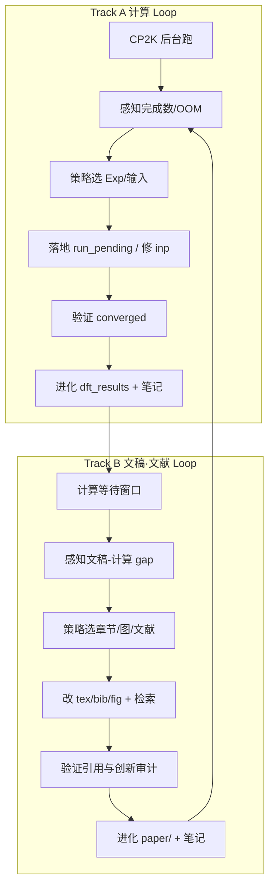
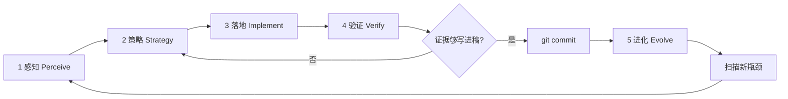

# AGENTS.md

## Graphullerene 投稿无限优化闭环（Infinite Optimization Loop）

本仓库的持续改进**没有终止条件**。每一轮闭环的目标不是「算完就停」，而是：

**感知现状 → 选定瓶颈 → 最小落地 → 用证据验证 → 把结论写回文稿与契约 → 进入下一轮**。

Cloud Agent 与人类协作者都应把 `AGENTS.md` 当作活文档；每轮验证通过后更新本节或下方 **Gotchas** / **当前轮次笔记**。

**不要**为此闭环新增独立编排脚本（例如一键跑完全部 Exp 的 orchestrator），除非用户明确要求。闭环由 Agent 按层执行现有 `experiments/` 脚本、CP2K 与测试，并把经验沉淀进文档。

**投稿目标（优先级）**：**PRL** → **Nature Materials** / **Nature Communications** → **PRB** / **Carbon**（降级路径）。每一轮策略须对照目标期刊的「主张强度 vs 证据强度」。

**双轨并行**：CP2K 在后台跑时，Agent **不得空等** — 同步执行 [文稿·文献闭环](#文稿文献闭环-manuscript--literature-loop)（整理、校准、配图配表、检索最新文献、创新审计）。计算轮与文稿轮交替推进，每轮结束写回 `AGENTS.md` 并 **git commit**（**push 可选**；见 [每轮 Git 闭环](#每轮-git-闭环)）。

---

### 当前状态快照（每轮 Loop 开头更新此节）

| 项 | 值 |
|----|-----|
| **Exp10** | **40/41** — `size_6x60_N_pos3pct_cutoff400` pending（截断对照） |
| **Exp8** | **6/6** ✅ — `post_exp8_converged.sh` consolidated `geoopt_pristine_sp.out` |
| **Exp9** | **11/12** GEO_OPT；`polaron_P_qneg1_opt` step **186/300** ~62% — **不干预** |
| **运行中** | `polaron_P_qneg1_opt`（4× MPI，restarted-after-ABORT）— **不干预** |
| **临界区** | P_qneg1 step 186/300 ~62%；内层 OT 正常 |
| **下一任务** | Exp9 12/12 → `post_exp9_converged.sh`；空闲后 `run_prb_revision_dft.sh` |
| **SDC** | **15** synergy 点（max $|\mathcal{S}|\approx32$ meV/atom） |
| **阻塞 PRB** | Table S3/S4/cutoff400 `.out`；Exp9 λ（SI S5） |
| **文稿 P 瓶颈** | Major 1–5 文稿已落地；DFT 验证队列就绪 |
| **下一 B 任务** | 12/12 → vertical SP batch；Tables S3--S4 |
| **主张-证据** | B/N/P $\mathcal{S}(n{=}4)$ = **A**；弛豫/seed137/cutoff = **B pending** |
| **旗杆** | **PRB major revision**（`compile_prb.sh` + SM + cover letter）|
| **最新 Loop** | **R154**（见下方笔记） |


---

### PRL Desk Review Gate（审稿升格 · 通用闸门）

> **来源**：第三版 PRL 级别详细审稿（2026-06-19）。本节为**投稿策略与 Loop 优先级**的权威清单；每轮 `go loops` 须在执行前闸门中对照 **Desk Reject** 行，未闭合前**禁止**恢复 transport/ML 夸大表述或未经弛豫验证的绝对定量主张。

#### 总体判定与期刊路径

| 路径 | 条件 | Agent 默认 |
|------|------|------------|
| **PRL** | 叙事升格为「共价分子网络普适规律」+ 弛豫验证 Table~S3 收敛 + 摘要≤600 字符 + 正文≤3750 词 + 单核心贡献（$\mathcal{S}$ 能量非加性） | 仅当上表 **Track A 必补** 完成且 P0 格式全绿 |
| **PRB Rapid** | 无全弛豫、保留体系专论叙事 | **当前完成度最匹配**；AGENTS 诚实稿默认降级锚点 |
| **PR Materials** | 材料调控 + 设计规则；可保留部分 IPR/$J$ 于 SI | 并行备选 |

**核心叙事锚点句**（Intro/Abstract/Conclusion 须收敛至此，qHP C$_{60}$ 为**模型体系**）：

> 在离散单元构成的共价分子网络中，掺杂诱导的局域结构畸变与外应变的非线性耦合，是应变–掺杂非加性效应的重要来源；其强度不与线性应变系数 $\alpha$ 简单正相关，顺序扫描的加和假设可带来显著的稳定性预测误差。

#### Desk Reject 级（P0 — 不解决 = 不送审）

| ID | 审稿要点 | 仓库动作 / 证据 |
|----|----------|-----------------|
| **D1** | 广泛物理兴趣：体系拓展非原理突破 | Intro/Abstract/Discussion 升格至「共价分子网络」；cite 2D 非加性先例；qHP 作验证 |
| **D2** | 刚性应变无验证 | `experiments/exp_5_synergy/relax_validation/` → Table~S3；Methods/Limitations **upper bound** 措辞 |
| **D3** | 固定掺杂位点无普适性 | Limitations 诚实；可选第二 seed 四聚体单点（backlog，不伪造） |
| **D4** | $n{\geq}6$ 280 vs 300 Ry 与 N $\mathcal{S}$ 符号 | Table~S2 pending 行；$n{=}6$ @300 Ry 单点（Track A backlog） |
| **D5** | 叙事分散（gap + $\alpha$ + $\mathcal{S}$ + IPR/$J$） | **主文 IPR/$J$ 压缩至 1 段 → SI Fig.~S6**；Results 以 $\mathcal{S}$ 为主轴 |
| **D6** | 摘要 >600 字符 / 含引用 | `wc`/脚本审计；无 `\cite`、无公式、单段 |
| **D7** | 正文 >3750 词（硬顶）；**目标带 2500–3500 词**（勿为压字数删机理） | 参数下沉 SI；`si_methods_section`；`prl_wordcount.sh` |
| **D8** | $\mathcal{S}$ 符号 / π 乱码 / 断词 | grep 审计；全文 `\mathcal{S}` |
| **D9** | bib 重复编号 / `note` 泄漏 | 删 `referinfo`；编译查 `.bbl` 无 `[2] [2]` |
| **D10** | $E_f$ 与 $n_{\mathrm{dop}}$ 矛盾 | `table1_verification.json` 为 canonical |

#### 外审级（P1 — 送审后仍可能拒）

| ID | 要点 | 动作 |
|----|------|------|
| **R1** | 机理深度不足 | PDOS + 键长/畸变（弛豫后）入 Discussion；三类机制分类段 |
| **R2** | $\mathcal{S}$–$\alpha$ 对比不对等 | 已写浓度/边界 Limitations；勿夸大「非线性主导」 |
| **R3** | ~3% vs PBE 形成能误差 | Discussion 增 DFT 不确定度与排序反转讨论 |
| **R4** | $J$ 与 $\mathcal{S}$ 脱节 | 主文一句边界；细节仅 SI |

#### Track A 必补计算（PRL 送审最低集）

| 任务 | 路径 | 阻塞 |
|------|------|------|
| P@+3% 四聚体 fixed-cell GEO_OPT 四角 | `relax_validation/` | Exp9 batch 空闲后顺序跑；**勿并行** |
| $n{=}6$ N @+3% @300 Ry 单点 | Exp10 式 inp 或 backlog | 尺寸/截断对照 |
| （可选）第二掺杂 seed 四聚体 | 新 inp 模板 | P1 |

#### 扫描包 §F（PRL desk gate）

```bash
# F. PRL 格式与叙事
python3 -c "
import re
tex=open('paper/strain_doped_graphullerene.tex').read()
m=re.search(r'\\begin\{abstract\}(.*?)\\end\{abstract\}', tex, re.S)
a=m.group(1) if m else ''
plain=re.sub(r'\\[a-zA-Z]+(\{[^}]*\}|\[[^]]*\])?','',a)
plain=re.sub(r'[{}$]','',plain)
print('abstract_chars', len(plain.replace(' ','').replace('\n','')))
print('abstract_has_cite', '\\cite' in a)
"
grep -En 'IPR|\\$J\\$|Marcus' paper/strain_doped_graphullerene.tex | wc -l
grep -c '\\mathcal\{S\}' paper/strain_doped_graphullerene.tex || true
grep -En 'referinfo|note.*refer' paper/strain_graphullerene_50refs.bib || true
bash paper/scripts/prl_wordcount.sh 2>/dev/null || true
test -f experiments/analysis/relax_validation_tetramer.json && python3 -c "import json;d=json.load(open('experiments/analysis/relax_validation_tetramer.json'));print('relax',d.get('status','?'))" || echo 'relax_json missing'
```

**Loop 笔记必填**：`prl_gate: D? open | narrative=Y/N | abstract_NNN | relax=pending|done`


**一行命令**：`bash experiments/exp10_status_line.sh` · `bash experiments/exp9_status_line.sh`

---

### Agent 快速入口（`go loops` 标准流程）

每轮 **按序执行**，勿跳步：

```bash
# 0) 感知（≤30 s）
bash experiments/exp10_status_line.sh
bash experiments/exp8_status_line.sh
python3 experiments/update_exp10_status.py   # 若需完整 JSON

# 1) 闸门 — 四轮自问（见「执行前闸门」）→ 选 1 个 A 瓶颈 + 1 个 B 项

# 2) Track A — 有 running 则通常「不干预」；无 CP2K 则：
#    bash experiments/continue_exp10_pending.sh
#    或 ./c/simukit-run --one <task> experiments/exp_10_size_scaling/inputs

# 3) Track B — 跑「论文自动优化」1 轮（见该节算法 + 扫描包）；声明 write.mdc 阶段；改 tex/bib/audit/图（≥1 项）

# 4) 验证 — grep converged / 创新审计表 / 勿改无 .out 的定量

# 5) 进化 — 更新本节「当前状态快照」+ Loop R{n} 笔记（3～5 行 + commit hash）

# 6) Git — 1 Loop = 1 commit（push 可选）
git status && git diff
git add … && git commit -m "loop R{n}: …"
# 可选：用户要求或需同步远程时
# git push -u origin HEAD
```

**收敛瞬间（Exp10 临界区 / CRIT）**：

```bash
grep -q 'SCF run converged' experiments/exp_10_size_scaling/inputs/<task>.out \
  && bash experiments/post_exp10_converged.sh
```

**禁止**：只 tail 日志不写笔记；跨多轮 R 攒一次 commit；用 Python SDC 覆盖 canonical JSON。

---

### write.mdc ↔ Track B 映射（`go loops` 文稿轨）

用户说 **`go loops`** / **`继续`** / **`@write.mdc go loops`** 时，Track B **须先声明** `.cursor/rules/write.mdc` 阶段（Phase Declaration），再选 **≥1 项** 落地。

| write.mdc 阶段 | Track B | 典型路径 | 证据闸门 |
|----------------|---------|----------|----------|
| **I Abstract** | B3 | `paper/strain_doped_graphullerene.tex` | 无新 `.out` **不改**定量 |
| **II Introduction** | B1+B3 | Intro、gap、结构提纲 | 新引用须入 `.bib` |
| **III Literature** | B1+B2+B3 | `strain_graphullerene_50refs.bib` | 每 ~2 轮 WebSearch |
| **IV Methodology** | B3 | Methods vs `experiments/*/inputs/*.inp` | 与 inp 一致 = **A** |
| **V Data** | B1 | `exp*_status*.json`、audit JSON | 计数诚实化 |
| **VI Results** | B3+图 | Results、`paper/figures/` | **仅** verified `.out` / JSON |
| **VII Discussion** | B3 | 机制、文献对比 | 定量须 A/B 级 |
| **VIII Conclusion** | B3 | Limitations、future work | 对齐 Intro 问题 |
| **（横切）证据台账** | B4+B5 | `paper/theory_enhancement_report.md` | A/B/C 创新审计 |

**交叉文档（Agent 必读）**：

| 文档 | 职责 |
|------|------|
| **`AGENTS.md`**（本文） | 双轨 Loop、Exp 状态、Git 闭环、Loop R{n} 笔记 |
| **`.cursor/rules/write.mdc`** | 八阶段写作边界、Pre-Modification Review、Phase Declaration |
| **`paper/theory_enhancement_report.md`** | 主张 ↔ canonical JSON / `.out`；discrepancy 勿进 Results |
| **[论文自动优化](#论文自动优化manuscript-auto-optimization)**（本文） | 扫描包、P0–P3 打分、Electron 旗杆、write.mdc 轮转 |

**Track B 每轮最小清单**（配合上文步骤 3–5）：

1. 声明阶段 — *「In the [Methodology] phase, I am …」*
2. 执行前闸门 — 改哪一节？是否碰 Results 定量？目标期刊 panel？
3. 落地 1–2 文件 — tex / bib / fig / audit / theory report
4. 创新审计表 — 写入 Loop R{n} 笔记（A/B/C）
5. 验证 — citekey、`latexmk`（可选）、数字可追溯至 `.out`

---

### 论文自动优化（Manuscript Auto-Optimization）

Track B 的**可执行策略层**：每轮 Agent **不随机润色**，而是按扫描→打分→选 1 项→落地→验证 自动推进主稿。与 [文稿·文献闭环](#文稿文献闭环-manuscript--literature-loop) 共用证据闸门；**禁止**为此新增独立 orchestrator（沿用现有 `grep` / audit JSON / `latexmk` / 作图脚本）。

#### 触发与模式

| 用户指令 | 模式 | 行为 |
|----------|------|------|
| **`go loops`** / **`继续`** | 双轨默认 | A 不阻塞时，B 跑 **1 轮**自动优化（见下算法） |
| **`go loops B`** / **`论文优化`** | B 专轮 | 连续多轮 B，每轮 1 项；Exp 仅快照、不启 CP2K |
| **`@docs/papers/Electron.pdf 对齐`** | 旗杆对齐 | 叙事/章节顺序对齐 Capobianco *Nano Lett.* 2024（见「旗杆模板」）；**不**恢复无 `.out` 的 transport 倍数 |
| **`@write.mdc`** + 阶段名 | 定向 | 跳过轮转，锁定 write.mdc 某一阶段 |

#### 每轮算法（Agent 必按序）


1. **扫描（≤60 s）** — 运行「自动扫描包」；更新 mental backlog（也可写入 Loop 笔记 `paper_gap:` 行）。
2. **打分** — 用下表 P0–P3；同分则：**契约违规 > 阻塞 PRL > 旗杆对齐 > 措辞润色**。
3. **选 1 项** — 本轮只改 **1 个**主瓶颈（附最多 1 个连带小修，如 caption 同步）。
4. **落地** — 声明 write.mdc 阶段 → 改 tex/bib/fig/audit。
5. **验证** — 创新审计 A/B/C；可选 `bash paper/compile.sh`；figure 源数据可追溯。
6. **进化** — 更新「当前状态快照」**文稿行** + Loop R{n} 笔记。

#### 自动扫描包（复制即用）

```bash
# A. 文稿-计算契约
grep -En 'rVV10|Koopmans|cm\^2|775|300%|8\.75' paper/strain_doped_graphullerene.tex || true
grep -m1 'XC_FUNCTIONAL\|VDW_POTENTIAL' experiments/exp_10_size_scaling/inputs/size_1x60_*.inp

# B. 证据台账（discrepancy / pending）
grep -E 'pending|discrepancy|withdrawn|勿进' paper/theory_enhancement_report.md | head -5
python3 -c "import json; d=json.load(open('experiments/analysis/exp4_polaron_verification.json')); print('Exp4 transition', d['derived']['polaron_transition_confirmed'])"
python3 -c "import json; d=json.load(open('experiments/analysis/exp9_polaron_verification.json')); print('Exp9 geo', sum(1 for x in d.get('systems',{}).values() if x.get('geo_opt_converged')), '/12')"

# C. 引用与编译
grep -oE '\\\\cite\{[^}]+\}' paper/strain_doped_graphullerene.tex | sort -u | wc -l
# 可选: cd paper && latexmk -pdf -interaction=nonstopmode strain_doped_graphullerene.tex

# D. 图件 freshness（git 脏文件 / final_figures）
ls -lt paper/figures/final_figures/*.png 2>/dev/null | head -3

# E. 第三版审稿（peer-review backlog）
grep -En 'referinfo|32.*eV per P|~ 5\\%|knobs' paper/strain_doped_graphullerene.tex paper/strain_graphullerene_50refs.bib || true
grep -En 'Exp\.~[0-9]|dft_results|exp[49].*json' paper/supplementary_figures.tex paper/supplementary_material_theory.tex | head -8
python3 -c "import json; t=json.load(open('experiments/analysis/table1_verification.json')); print('P Ef', t['systems']['P']['Ef_eV_per_dopant'], 'n', t['systems']['P']['n_dopants'])"
```

**扫描产出（写入 Loop 笔记，一行即可）**：`paper_gap: Methods泛函 | Exp9 λ pending | Fig transport C级 | Electron对齐-Intro`

#### 优先级打分（P0 最高）

| 等级 | 信号 | 自动动作 |
|------|------|----------|
| **P0** | tex 定量与 `table1_verification.json` / SDC audit **不一致** | 以 JSON/`.out` 为准改 tex；更新 theory report |
| **P0** | Methods 写 rVV10/Koopmans，inp 为 PBE+D3 | Methods 诚实化 **或** 标注 `[TODO: subset]` |
| **P0** | theory report **C 级**主张出现在 Abstract/Results | 删除或降调至 Discussion/SI |
| **P0** | **第三版审稿**：$E_f$/$n_{\mathrm{dop}}$ 与 `table1_verification.json` 不一致 | 以 JSON 改 tex/SI；重算 $|\mathcal{S}|/|E_f|_{\mathrm{per\,atom}}$ |
| **P0** | **第三版审稿**：bib `referinfo` / 内部 note 泄漏 | 删内部路径；note 改为正式摘要句 |
| **P0** | **PRL desk D5**：主文 IPR/$J$ 叙事分散 | 压缩至 SI Fig.~S6；Results 以 $\mathcal{S}$ 为主 |
| **P0** | **PRL desk D6**：摘要 >600 字符或含 `\cite` | 重写摘要；§F 字符审计 |
| **P0** | **PRL desk D2**：刚性应变无弛豫对照 | Table~S3 `relax_validation/`；upper-bound 措辞 |
| **P0** | **第三版审稿**：$\mathcal{S}$ 符号/断词 | 全文 `\mathcal{S}`；断词处加 `$\mathcal{S}$` |
| **P1** | 阻塞目标期刊的**缺图/缺段**（如 PRL transport、Exp9 λ Fig.5） | 占位 + caption `[pending: Exp9]`；不伪造数字 |
| **P1** | **第三版审稿**：SI 主文 `Exp.~N` vs `Fig.~S4--S6` | 统一 Supp. 交叉引用；caption 去 audit 路径 |
| **P1** | **第三版审稿**：tetramer 仅 $+3$\% $\mathcal{S}$ | `relax_validation/` 多应变或 Methods 声明范围 |
| **P1** | `sdc_method_section.tex` 缺失 / `\ref{eq:synergy_order}` 断链 | 补 Methods 方程节 + `\input` |
| **P1** | 用户指定 **Electron.pdf 对齐**且 Intro/Discussion 缺 Capobianco 对比 | 补文献线程（localization→$J$→$\mu$）；挂钩本文 $\mathcal{S}$/$(\epsilon,\delta)$ |
| **P2** | 缺 2025–2026 bib / Khan·Li·Peng 对比句 | WebSearch → ≤3 bib → Intro/Discussion 各 1 句 |
| **P2** | 图不符合目标期刊 panel（PRL 宽 3.375 in / Nature 多 panel） | 跑 `paper/figures/generate_manuscript_figures.py` 或子脚本 |
| **P3** | 纯措辞、标点、章节过渡 | **仅当 P0–P2 为空** 时做；否则跳过 |

#### write.mdc 阶段轮转（无用户指定时）

按 **Innovation backlog + 扫描 gap** 选阶段，默认 **8 轮为一周期**：

| 轮次 mod 8 | 阶段 | 典型自动任务 |
|------------|------|--------------|
| 0 | I Abstract | 与 Table/audit 数字对齐；删 C 级句 |
| 1 | II Intro | gap + 贡献三条；Capobianco/Khan 锚点 |
| 2 | III Literature | bib + 对比句；WebSearch |
| 3 | IV Methods | inp 契约、`sdc_method_section`、Exp 计数 |
| 4 | VI Results | **仅** A 级新证据或 fig caption |
| 5 | VII Discussion | 机制 + 文献差异 + design rules |
| 6 | VIII Conclusion | 对齐 Intro；limitations 诚实 |
| 7 | 横切 | `theory_enhancement_report.md` + 全稿 grep 审计 |

用户 **`@Electron.pdf 对齐`** 时：**优先 II→IV→VI→VII**（Intro 语境 → Methods 可观测量的 → Results 顺序 → Discussion 对比），Abstract/Conclusion 最后收口。

#### 旗杆模板：`docs/papers/Electron.pdf`（Capobianco *Nano Lett.* 2024）

对齐**叙事弧与章节功能**，不是照搬泛函或数值：

| Capobianco 主文 | 本仓库对应 | 证据 |
|-----------------|------------|------|
| vdW vs qHP 迁移率差异；polaron 仍局域 | Intro 末段 + Discussion 首段 | 文献 + Exp4 IPR/$J$ 两点 |
| Koopmans/rVV10 + CP2K 超胞 | Methods：**诚实** PBE+D3 + CP2K；SI 可写 Capobianco 对比 | `*.inp` |
| IPR 量化局域；$J$ 增强驱动 $\mu$ | Results「Electronic / localization」小节 + Fig.3(f) | `exp4_polaron_verification.json` |
| $\lambda$ + FCWD + Marcus 速率 | Results/Discussion **pending**；Fig.5/6 占位 | Exp9 7/12；`derived.lambda_eV` null |
| **本文增量** | **非加性 $\mathcal{S}$、$\alpha$ 符号分裂、$S(n)$ 标度** | Exp5+10 **A 级** |

**对齐检查清单**（Electron 模式每轮至少勾 1 项）：

- [ ] Intro：qHP 网络 → 输运/局域化语境 → **$(\epsilon,\delta)$ 非加性 gap**
- [ ] Methods：材料尺寸 + CP2K 设置 + **$\mathcal{S}$ / IPR / $J$ 定义**
- [ ] Results 顺序：**结构/应变** → **电子/ gap** → **局域化/$J$** → **$\mathcal{S}$ 设计空间**
- [ ] Discussion：与 Capobianco「$J$ 主导 $\mu$」对照；本文「**耦合参数 $(\epsilon,\delta)$ 改变能量与 $J$ 路径**」
- [ ] 无 hybrid/ML/迁移率倍数 **除非** 新 `.out` 支撑

#### 快照字段（「当前状态快照」扩展）

每轮 Loop 开头，Agent **应更新**（可与 Exp 行并列）：

| 项 | 示例 |
|----|------|
| **文稿 P 瓶颈** | `Methods 缺 sdc_method_section` / `Electron-Intro 未对齐` |
| **下一 B 任务** | `P1: 补 Capobianco Discussion 段` |
| **主张-证据** | `transport=C, SDC=A, Exp9 λ= B pending` |
| **旗杆** | `Electron.pdf` / `PRL` / `Nature Mat` |

#### 与 Git / 用户 commit 规则

- **AGENTS 硬规则**：每一轮 Loop 结束 **必须** `git commit`（含 `AGENTS.md` 笔记），**无需**用户再说「commit」。
- **Push**：**不强制**；仅在用户明确要求、需备份远程、或开 PR 前再 `git push`。
- **禁止**：跨多轮 R 攒一次 commit；只改工作区不写笔记、不 commit。

#### 禁止

- 为「论文自动优化」新建 `auto_paper.py` / 一键改全 tex orchestrator。
- 扫描未通过仍改 Abstract/Results 定量。
- 用 `citation_completion_report.md` 恢复旧版 transport/ML 声称（与当前诚实稿冲突）。

---


### 精益求精：AGENTS.md 自身审计（每 5～10 轮或用户要求时）

| 检查项 | 典型问题 | 修复 |
|--------|----------|------|
| **快照 vs 现实** | 本节 Exp10 计数与 `exp10_status_line.sh` 不一致 | 更新「当前状态快照」 |
| **工具索引** | 新脚本未进「常用命令 / 现有工具索引」 | 补 `exp10_status_line.sh`、`synergy_audit.json` 等 |
| **Loop 笔记** | R 编号乱序、重复 Innovation backlog | 按 R 编号排序；backlog **只保留一处** |
| **历史噪声** | R1–R40 仍写「commit R8–Rn」 | 历史条目保留；**新轮**只写「commit 必须；push 可选」 |
| **感知命令** | 仍用手动 grep 代替 `exp10_status_line.sh` | 统一快速入口 |
| **Gotchas** | 新踩坑未沉淀 | 每轮 Evolve 补 1 条（若适用） |
| **双 batch** | 多个 `simukit-run` / legacy `run_pending_local.sh` 并行 | `ps aux \| grep simukit-run`；legacy 启动前 `pkill` |
| **MPI 误判** | `np>1` 时多个 `cp2k.psmp` 被当成双跑 | 看是否有 **单个** `prterun -np N` 父进程 |

**Loop 笔记模板（R41 起）**：

```markdown
- **Loop R{n}（日期，双轨|Track B）**：
  - **Track A**：Exp10 x/40；running=…；CRIT?；**不干预** / 动作
  - **Track B**：1 句话改动
  - **创新审计**：… = **A/B/C 级**
  - **Git**：`commit: <short-hash>` — `loop R{n}: …`；（可选）`pushed: origin/<branch>` 或 `pushed: (local only)`
  - **下一轮**：…
```

**笔记归档（可选，R≥60）**：将 R1–R40 缩为 1 段「历史摘要」，全文移 `docs/agents_loop_archive.md`（仅当用户同意减体积）。

---

### 双轨并行总览



| 轨道 | 何时跑 | 禁止 |
|------|--------|------|
| **Track A 计算** | 有 pending Exp；机器内存允许 | 无 converged 改 Results 定量 |
| **Track B 文稿·文献** | CP2K 占用 CPU 时**默认并行**；或计算全完成后的主攻 | 无文献支撑的新主张；无 `.out` 的新数字 |

用户说 **「go loops」** 或 **「继续」** 时：Agent **同时**推进 A+B（若 A 已在跑，本轮以 B 为主并抽查 A 日志）。

---

### 核心原则

| 原则 | 含义 |
|------|------|
| **先算后写** | 没有收敛的 `.out` 与尺寸收敛证据，不改 Abstract / Results 中的定量主张 |
| **文稿-计算契约** | Methods 写 PBE+D3 就只引用 PBE+D3；写 rVV10/Koopmans 须有对应输入与输出 |
| **瓶颈驱动** | 优先：Exp10 尺寸收敛、Exp8 SP、文稿与计算不一致、静默失败/OOM；再追求 ML/新图 |
| **最小改动** | 每轮只解决 1～2 个瓶颈，避免无关重构 |
| **验证通过再沉淀** | `SCF run converged` / GeoOpt 完成后再更新 `paper/`、`dft_results/`、本文件 |
| **分层对齐** | 借鉴顶刊材料稿结构：**结构/掺杂（Exp1–2）→ 电子/极化子（Exp3–4,7,9）→ 协同/尺寸（Exp5–6,10）→ 文稿** |
| **执行前价值闸门** | 每轮进入「策略 → 落地」前，对照投稿目标判断本轮是否值得做（见下节） |
| **算时写稿** | CP2K 长跑期间做 Track B；定量句标注 `[pending: Exp10 task X]` 或 `[verified: file.out]` |
| **每轮落盘** | 每轮 Loop 结束 **必须** `git commit`；**push 可选**；笔记写 commit hash；禁止跨多轮 R 堆成一次提交 |
| **文献即证据** | 新引用须来自检索结果；创新声明须对照 `docs/reference_info.md` + 最新论文 |
| **图表可审计** | 每个 panel 的数字追溯到 `.out` / `.csv` / 分析 JSON；无源数字不进 tex |

---

### 执行前闸门：投稿目标与优化价值（每轮必做）

**在勾选检查清单第 2 步「策略」、改输入或改稿之前**，Agent 必须先完成本闸门；若结论为「价值不足」，改选 backlog 中更高优先级项，**不得**为凑 Loop 而做低价值微优化或空洞改稿。

#### 顶刊框架目标（PRL / Nature Materials 对齐）

| 层级 | 顶刊期望 | sci-simukit 对应 |
|------|----------|------------------|
| **核心主张** | 1 个可一句话说清的新物理（非加性应变-掺杂耦合） | Exp5–6 + Exp10 收敛 + 定量 dE/dε 差异 |
| **结构证据** | 尺寸收敛、泛函/基组敏感性 | Exp10（1×60→8×60）；可选 rVV10 子集对比 |
| **机制证据** | 极化子 / IPR / 耦合 J，非仅总能量 | Exp4, Exp7, Exp9 + 分析脚本 |
| **可检验预测** | 可被实验或独立 DFT 复现的数值 | 最优应变、formation energy、迁移率区间 |
| **诚实 Methods** | 与输入文件一致 | `experiments/*/inputs/*.inp` 为准，非 `.tex` 理想描述 |

**借鉴要点（非照搬 Nature 模板）**：

- **一条主故事**：N vs B 应变灵敏度符号相反 + 尺寸收敛 → 再谈 ML / 300% 迁移率。
- **主张 ≤ 证据**：PRL 需要「少而硬」；Nature Materials 需要机制图 + 可扩展性；缺实验时用「predictions + comparison to Capobianco/Li/Khan」补位，不伪造已做 rVV10。
- **尺寸收敛优先于新 Exp**：Exp10 未闭环前，不新增 Exp11。
- **正确性优先于速度**：`SCF run converged` / `GEOMETRY OPTIMIZATION COMPLETED` 优先于并发跑满核。

#### 四轮自问（策略卡片必填）

在 PR 描述或本轮笔记中**用 1～2 句话**回答：

1. **层级**：本轮改的是 **计算闭环**、**分析/图** 还是 **文稿**？若仅润色措辞而无新 `.out` → **拒绝或降级**。
2. **路径**：是否落在 Exp7→8→9→10 依赖链？Exp10 未完成时是否应暂停改 Abstract？
3. **收益**：预期收益类型 — 收敛任务数、尺寸收敛曲线、非加性定量图、Methods 诚实化？
4. **机会成本**：同一轮是否还有更高优先级 backlog（见下方「感知」）？

**计算向轮次**在感知阶段额外确认：

```bash
# 首选：一行快照（含 OT%、CRIT、next、eta）
bash experiments/exp10_status_line.sh

# 本地：已完成任务数（与 JSON 交叉验证）
grep -l 'SCF run converged' experiments/exp_10_size_scaling/inputs/size_*.out 2>/dev/null | wc -l

# batch 是否存活（simukit-run 单实例；np>1 时多个 cp2k.psmp 正常）
ps aux | grep -E 'simukit-run|run_pending_local' | grep -v grep
ps aux | grep -E 'prterun|mpirun' | grep -v grep | head -3

# 日志
tail -20 experiments/local_run.log
```

---

### 五层结构



---

#### 第 1 层：感知（Perceive）— 我们在哪？

**目标**：弄清各 Exp 完成度、本地/服务器 `.out` 是否一致、文稿声称 vs 输入文件是否一致、CP2K 是否在跑或卡死。

**实验清单与完成标准**：

| Exp | 目录 | 完成判据 | 投稿权重 |
|-----|------|----------|----------|
| Exp7 | `experiments/exp_7_electronic_structure/` | 12/12 `.out` 收敛 | 高（电子结构） |
| Exp8 | `experiments/exp_8_geometry_opt/` | 5 GeoOpt converged + N\_sp；`geoopt_pristine_sp.inp` 已生成，SP 待跑 | 高 |
| Exp9 | `experiments/exp_9_charged_polaron/` | 12/12 polaron 收敛 | 高 |
| Exp10 | `experiments/exp_10_size_scaling/` | 40/40；按 1×60…8×60 收敛 | **阻塞 PRL 尺寸论证** |

**典型动作**：

```bash
# Exp10 分尺寸统计
cd experiments/exp_10_size_scaling/inputs
for s in 1x60 2x60 4x60 6x60 8x60; do
  echo -n "$s: "
  grep -l 'SCF run converged' size_${s}_*.out 2>/dev/null | wc -l
done

# Exp8
grep -l 'GEOMETRY OPTIMIZATION COMPLETED\|SCF run converged' \
  experiments/exp_8_geometry_opt/inputs/geoopt_*.out 2>/dev/null

# 本地归档
ls dft_results/exp_10_size_scaling/*.out | wc -l

# 文稿-计算一致性（示例）
grep -E 'rVV10|Koopmans|28 DFT' paper/strain_doped_graphullerene.tex
grep 'VDW_POTENTIAL\|XC_FUNCTIONAL' experiments/exp_10_size_scaling/inputs/size_1x60_*.inp | head -3
```

**远程服务器**（若 SSH 可用：`root@47.76.224.134`）：

```bash
ssh root@47.76.224.134 'grep -l "SCF run converged" /root/sci-simukit/experiments/exp_10_size_scaling/inputs/size_*.out | wc -l'
```

**产出**：简短「现状快照」— Exp10 x/40、Exp8 x/6、运行中任务、文稿-计算 gap 列表、OOM/卡死任务。

---

#### 第 2 层：策略（Strategy）— 下一步改什么？

**前置条件**：已完成 [执行前闸门](#执行前闸门投稿目标与优化价值每轮必做) 四轮自问。

**决策参考（按投稿阻塞排序）**：

| 信号 | 优先策略 |
|------|----------|
| Exp10 < 40/40 | 顺序跑 pending；Mac 36GB：**单任务或 ≤2 并发**；8×60 用 `np=1` |
| `size_2x60_pristine_*` 300 步不收敛 | 该组 `EPS_SCF 1e-5` 或换 ATOMIC/WFT 初猜；记录于 Gotchas |
| Exp8 缺 `geoopt_pristine_sp` | 用 `geoopt_pristine_optimized.xyz` 生成 SP；`EPS_SCF 1e-6` |
| 文稿写 rVV10，输入为 PBE+D3 | **二选一**：改 Methods 或补算 rVV10 子集（≥4 结构） |
| 「非加性耦合」仅定性 | 补交叉项图：E(ε,d) − E(ε,0) − E(0,d) − E(0,0) |
| ML / 迁移率 300% 无独立验证 | 降调表述或补 `analyze_results.py` 输出与误差条 |
| SSH 超时 | 本地 `experiments/run_pending_local.sh` 继续；不阻塞 Loop |

**文档锚点**：`paper/strain_doped_graphullerene.tex`、`docs/experimental_implementation_plan.md`、`docs/reference_info.md`

**产出**：本轮「策略卡片」— 1 句话目标、触及文件、预期验证命令。

---

#### 第 3 层：落地（Implement）— 最小正确实现

**目标**：最小 patch — 输入修正、重启单任务、同步 `.out`、或文稿 Methods 一句诚实化。

**常见落地点**：

| 类型 | 路径 |
|------|------|
| Exp10 输入/输出 | `experiments/exp_10_size_scaling/inputs/` |
| Exp10 生成 | `experiments/exp_10_size_scaling/run_size_scaling.py` |
| Exp8 工作流 | `experiments/exp_8_geometry_opt/run_workflow.sh`、`inputs/single_point_template.inp` |
| 本地顺序跑 | `experiments/run_pending_local.sh`（已有；勿重复造 orchestrator） |
| 结果归档 | `dft_results/exp_{7,8,9,10}_*/` |
| 文稿 | `paper/strain_doped_graphullerene.tex` |
| 分析 | `experiments/exp_*/analyze_*.py` |

**本地 CP2K 环境（Mac）**：

```bash
export CP2K_DATA=/opt/homebrew/share/cp2k/data
CP2K=/opt/homebrew/bin/cp2k.psmp

# 单任务示例
cd experiments/exp_10_size_scaling/inputs
mpirun -np 4 $CP2K -i size_2x60_pristine_pos0pct.inp -o size_2x60_pristine_pos0pct.out
```

**禁止**：未验证收敛就改 Abstract 定量句；为 Loop 新建 `run_all_experiments.py` 类 mega-script。

**产出**：可运行增量 — 新/更新的 `.out`、或 Methods 与 `.inp` 对齐的 patch。

---

#### 第 4 层：验证（Verify）— 证据链

**目标**：计算正确性先于文稿修辞；图表数字可追溯到 `.out`。

| 层 | 机制 | 入口 |
|----|------|------|
| SCF/GeoOpt | CP2K 输出关键字 | `grep 'SCF run converged'` / `GEOMETRY OPTIMIZATION COMPLETED` |
| 尺寸收敛 | Exp10 全尺寸 E/atom 趋势 | `run_size_scaling.py` 分析段 / 自建 JSON |
| 文稿-计算 | Methods 与 inp 一致 | 人工 diff + grep |
| 分析脚本 | 可复现图 | `python experiments/exp_10_size_scaling/run_size_scaling.py`（分析模式） |

**推荐最小验证集（计算轮）**：

```bash
# 1) 完成计数
grep -l 'SCF run converged' experiments/exp_10_size_scaling/inputs/size_*.out | wc -l   # 目标 40

# 2) 无 ABORT 的 pending 任务
for f in experiments/exp_10_size_scaling/inputs/size_*.out; do
  grep -q 'ABORT' "$f" 2>/dev/null && echo "ABORT: $f"
done

# 3) 同步到归档
cp experiments/exp_10_size_scaling/inputs/size_*.out dft_results/exp_10_size_scaling/  # 仅 converged

# 4) Exp8 SP
grep 'SCF run converged' experiments/exp_8_geometry_opt/inputs/geoopt_pristine_sp.out
```

**合并闸门**：仅当本轮声称的数字**有对应 `.out` 或分析 JSON** 时，才可合并 PR 并改 Results/Abstract。

---

#### 第 5 层：进化（Evolve）— 写回知识，开启下一轮

**必须更新的位置（按影响面）**：

1. **`AGENTS.md`** — 「当前轮次笔记」或 **Gotchas**
2. **`paper/strain_doped_graphullerene.tex`** — Methods/Results 与证据同步
3. **`dft_results/`** — 新 converged `.out`
4. **（可选）`docs/`** — 实验状态报告，仅当用户要求

**本轮结束时写清**：瓶颈 → 策略 → 改动 → 验证命令与结果 → **下一轮建议**。

---

## 文稿·文献闭环（Manuscript & Literature Loop）

CP2K 计算在后台执行时，Agent **默认进入本闭环**。遵循 [`.cursor/rules/write.mdc`](../.cursor/rules/write.mdc) 八阶段边界（Abstract→Conclusion）与 **Phase Declaration**；阶段↔Track B 映射见上文 [write.mdc ↔ Track B 映射](#writemdc--track-b-映射go-loops-文稿轨)；**自动选题与打分**见 [论文自动优化](#论文自动优化manuscript-auto-optimization)。**Results 定量**仍受 Track A 闸门约束。

### 文稿·文献核心原则

| 原则 | 含义 |
|------|------|
| **先本地后外网** | 先读 `paper/`、`docs/reference_info.md`、已有 `.bib`，再 Web/PubMed 补 2024–2026 新文 |
| **校准不杜撰** | 改稿 = 对齐已有计算与文献；新创新点 = 「假设 + 待验证 Exp」写入笔记，不直接写进 Abstract |
| **旗杆风格** | PRL：1 主图 + 1 表 + 极简正文；Nature Materials：机制 schematic + 多 panel + SI 放方法细节 |
| **图表同源** | `paper/figures/*.csv` 与 `dft_results/` 或分析脚本输出一致 |
| **创新可辩** | 每轮产出「创新审计表」：主张 / 文献是否已有 / 我方差异 / 证据等级 |

### 执行前闸门（文稿轮）

在改 `paper/*.tex` 或 `.bib` 前回答：

1. **改哪一阶段？**（Introduction 可动叙事；Results 仅动已有 `.out` 支持的句）
2. **目标期刊 panel 规范？** PRL 单栏图宽 3.375 in；Nature 双栏 89 mm 等（见下节）
3. **检索问题是什么？** 一句可检索 query（英文关键词 + graphullerene / qHP C60 / strain doping）
4. **若发现 prior art 重叠？** 降调表述或 pivot 到「非加性定量 / 尺寸收敛」差异化

### 五层结构（文稿·文献）

#### B1 感知 — 文稿与文献现状

**典型动作**：

```bash
# 文稿-计算 diff
grep -E 'rVV10|Koopmans|meV|cm\^2' paper/strain_doped_graphullerene.tex
grep 'VDW_POTENTIAL\|XC_FUNCTIONAL' experiments/exp_10_size_scaling/inputs/size_1x60_*.inp | head -1

# 本地文献库
wc -l paper/strain_graphullerene_50refs.bib
grep -i 'graphullerene\|qHP\|fullerene network' paper/strain_graphullerene_50refs.bib | head -5

# 已有分析报告
ls paper/*report*.md docs/reference_info.md
```

**外网检索（Agent 必须执行其一）**：

- **WebSearch**：`graphullerene strain doping 2024 2025 2026`、`qHP C60 heteroatom`、`non-additive strain doping 2D`
- **精读必查文献族**：Capobianco2024、Li2024 strain qHP、Khan2025 doping graphullerene、Yang2021、Peng2025 monolayer
- **检索记录**：每轮在「当前轮次笔记」写 query + 命中 2–3 篇 + 是否已入 bib

**产出**：`gap_list.md` 条目（仅写在 AGENTS 笔记中，不强制新文件）— Methods 不实项、缺引用、缺对比、图表与数字不一致。

#### B2 策略 — 本轮改稿/改图优先级

| 信号 | 优先策略 |
|------|----------|
| Methods 写 rVV10，inp 为 PBE+D3 | 改 Methods 为真实泛函 **或** 标记 `[TODO: rVV10 subset]` |
| Abstract 数字与 Table 1 不一致 | 统一以 **已 converged `.out` 解析值** 为准 |
| 缺非加性叙事 | Introduction + Discussion 加 1 段；Figure 草图 `[pending: synergy plot]` |
| 文献未覆盖 2025–2026 | 补 bib + Related Work 1–2 句 |
| 图不符合 PRL | 跑 `paper/figures/generate_prl_figures.py` 或按 PRL 规范重排版 |
| 创新审计发现重叠 | 改写 claim 为「首次在 graphullerene 网络中…」并引证差异 |

**期刊配图配表旗杆（摘要）**：

| 元素 | PRL | Nature Materials |
|------|-----|------------------|
| 主图 | 1 张 composite ≤3.375 in 宽；线宽 ≥0.5 pt；字体 Sans 6–8 pt | 4–6 panel；scale bar / 色标；panel label **a,b,c** 粗体 |
| 配色 | 色盲友好（蓝 #0173B2 / 橙 #DE8F05）；避免红绿 alone | 与 Nature 图例一致；SI 放完整 Methods |
| 表 | `ruledtabular`；有效数字 3–4 位；单位 SI | 表放 SI 或 main 1 张；脚注说明 DFT 泛函 |
| 数据 | 源数据 statement；关键图 data 可 CSV | 同左 + 实验 validation pathway 段落 |

#### B3 落地 — 最小改稿

**触及路径（按轮次轮换，每轮 1–2 项）**：

| 类型 | 路径 |
|------|------|
| 主稿 | `paper/strain_doped_graphullerene.tex` |
| 补充 | `paper/supplementary_material_theory.tex` |
| 文献 | `paper/strain_graphullerene_50refs.bib` |
| 图 | `paper/figures/`、`paper/prl_figure_generator.py`、`paper/paper_figures_generator.py` |
| 表 | `paper/figures/table{1,2,3}.tex` + 对应 `.csv` |
| 内参 | `docs/reference_info.md`、`paper/originality_analysis_report.md` |

**允许在计算未完成时做的改动**：

- Introduction / Literature 叙事与引用更新
- Methods **诚实化**（与 `.inp` 一致）
- Discussion 机制文字（定性）
- Figure **占位**与版式（标注 pending 数据）
- SI 推导与公式校对（`supplementary_material_theory.tex`）
- 实验 validation pathway（`paper/experimental_validation_plan.md`）

**禁止在无 `.out` 时做的改动**：

- Abstract / Results 中新定量句
- Table 中新的 Ha/meV/迁移率数字
- 声称「已验证 N 次 DFT」超过实际 converged 数

#### B4 验证 — 文稿与文献证据链

| 检查项 | 方法 |
|--------|------|
| 数字可追溯 | 每个 `\num{}` / 表格单元格 → 标注源文件于 PR 或笔记 |
| 引用存在 | `grep citekey paper/strain_graphullerene_50refs.bib` |
| 无 phantom 引用 | latexmk 无 undefined citation |
| 创新审计 | 填下表（写入 AGENTS 笔记） |
| 图表编译 | `cd paper && latexmk -pdf strain_doped_graphullerene.tex` |

**创新审计表（每文稿轮必填）**：

| 主张 | 文献中是否已有 | 我方差异 | 证据等级 A/B/C |
|------|----------------|----------|----------------|
| 非加性 strain-doping 耦合 | | graphullerene 体系 + 定量 dE/dε | B（待 Exp10 全收敛→A） |
| N vs B 应变灵敏度符号相反 | | 数值来自 Exp5/6 | A 若与 `.out` 一致 |
| （新发现来自检索） | | | 标注来源 DOI |

证据等级：**A**=converged DFT 或实验；**B**=部分 DFT + 文献；**C**=假设/待算，仅 Discussion/SI。

#### B5 进化 — 写回文稿知识

1. 更新 **`AGENTS.md`** 文稿轮笔记（检索 query、新 bib、创新审计结论）
2. 更新 **`paper/strain_graphullerene_50refs.bib`**（新文献）
3. 若有定性改进：更新 **`paper/originality_analysis_report.md`** 或 `docs/reference_info.md` 摘要（用户未禁止时）
4. **下一轮 B 建议**：如「补 Khan2025 对比句」「Figure 2 synergy panel 待 Exp10 JSON」

### 文献检索协议（每 2 轮 Loop 至少 1 次）

1. **构造 query**（英文）：`(graphullerene OR "fullerene network" OR qHP C60) AND (strain OR doping OR polaron) after:2023`
2. **WebSearch** 或 **PubMed**（若生物交叉则跳过）
3. **筛选**：标题/摘要含 graphullerene、qHP、2D fullerene；排除纯 graphene 除非对比
4. **动作**：新文 → bib 条目 + Introduction/Discussion 1 句；**撞车** → 创新审计降调或 pivot
5. **记录**：DOI、与本文关系（support / compete / gap）、是否改 tex

**高优先级跟踪关键词**：`graphullerene`, `quasi-hexagonal C60`, `fullerene monolayer`, `strain engineering 2D`, `heteroatom doping fullerene`, `polaron mobility`, `non-additive`, `Capobianco`, `Khan tuning`

### 新增创新点的处理规则

检索或讨论产生「可能的新贡献」时：

1. 写入 AGENTS 笔记 **Innovation backlog**（不直接进 Abstract）
2. 判断：需新 Exp 否？若需 → 转 Track A backlog，**不**擅自加 Exp11
3. 若仅叙事/对比创新 → 可进 Introduction，须引新 bib
4. 若定量创新 → 必须挂到 pending 任务或新分析脚本

---

### Cloud Agent 自主连续迭代协议

用户未明确喊停时，Agent **默认连续跑多轮双轨 Loop**：

- **Track A**：感知 → 策略 → 落地 → 验证 → 进化（计算）
- **Track B**：B1→B5（文稿·文献），**与 A 并行**；单轮会话若 A 已后台运行，**至少完成 1 项 B3 落地**

每一轮结束：**扫描双轨 backlog → 追加 Loop R{n} 笔记 → [Git 闭环](#每轮-git-闭环)**。

仍**禁止**新建独立 orchestrator；用 `simukit-run` / `run_pending_local.sh`（legacy）+ 现有 `run_*.py` + `paper/` 工具串联。

### 每轮 Git 闭环

**硬规则**：每一轮 Loop（含 `go loops`、`go loops B`、Track A/B 专轮）在写回 `AGENTS.md` 笔记后 **必须** `git commit`，**无需**等用户再说「commit」。**`git push` 不强制**——仅在用户要求、需远程备份、或准备开 PR 时执行。

| 步骤 | 动作 |
|------|------|
| 1 | `git status` + `git diff` — 确认无 `.env`、密钥、巨型 `.out` 误加入 |
| 2 | 暂存本轮文件（代码 / `paper/` / `experiments/analysis/` / `AGENTS.md`；**勿** 提交 `c/simukit-*` 二进制若已在 `.gitignore`） |
| 3 | **`git commit -m "loop R{n}: <一句话 why>"`** — 消息含 **Loop 编号** 与 Track A/B 要点（**必做**） |
| 4 | （可选）`git push -u origin HEAD` — 用户要求或需同步远程时；失败则修复后 **新 commit**，勿 force-push `main` |
| 5 | 在 Loop 笔记末行写 **`commit: <short-hash>`**；若已 push 则加 **`pushed: origin/<branch>`**，未 push 写 **`pushed: (local only)`** |

**提交粒度**：

- **默认**：1 Loop = 1 commit（R39 文稿、R27 pos0 收敛后处理等各自独立）。
- **允许**：同一轮仅 Track B 微改 + 笔记 → 仍须 commit；Track A 仅监控无文件变更 → 可只更新笔记并 commit 笔记（或 `git commit --allow-empty -m "loop R{n}: Track A monitor only"` 若确无 diff）。
- **禁止**：「R8–R40 攒一起」「用户确认后再 commit」、跨多轮 R 无 commit。

**分支**：默认当前工作分支；长期 Loop 可用 `cursor/loop-r<n>-sci` 或 `loop/sci-r<n>`。

**与 PR 的关系**：小步 **commit** 为主；push 与 `gh pr create` 可在里程碑时一并做，PR 描述链到 Loop 编号区间。

#### 验证通过后的 PR / 合并

满足**全部**条件时，Agent 可自行开 PR（用户未说「先别合并」）：

| 条件 | 要求 |
|------|------|
| 计算/文稿 | 本轮策略目标达成且有证据 |
| 分支 | `cursor/<topic>-sci` 或仓库惯例 |
| 描述 | 含策略卡片四轮自问答案 |

**不自动合并**：Exp10 未增加 converged 数却改 Abstract 定量；本地 CP2K ABORT 未处理。

#### 合并后立即感知（双轨 backlog 优先级）

**Track A（计算）**

1. Exp10 converged 数 < 40  
2. Exp8 `geoopt_pristine_sp` 未完成  
3. pending ABORT / OOM / 卡死 >10min 无输出更新  

**Track B（文稿·文献）**

4. Methods 与 `*.inp` 不一致  
5. 缺非加性定量图 / 尺寸收敛图（可先做版式占位）  
6. 缺 Capobianco2024 / Li2024 / Khan2025 对比句  
7. 文献检索 >14 天未做  
8. 创新审计存在 **C 级**主张已写入 Abstract（须降调）  
9. 图表数字与 `.csv` / `.out` 不一致  

---

### Cloud Agent 单轮检查清单（双轨）

```
=== 共用 ===
[ ] 0. 闸门：四轮自问 + 期刊主张强度（PRL / Nature Materials）

=== Track A 计算（有 pending 则做）===
[ ] A0. 一行快照：`bash experiments/exp10_status_line.sh`（含 CRIT / next / eta）
[ ] A1. 感知：Exp7–10 完成数、local_run.log、OOM/ABORT、simukit-run 单实例
[ ] A2. 策略：1 个计算瓶颈（Exp10 / Exp8 SP / 修 inp）
[ ] A3. 落地：run_pending 或单任务 mpirun；Mac 勿多 8×60 并发
[ ] A4. 验证：grep converged；同步 dft_results_download

=== Track B 文稿·文献（CP2K 在跑时必做 ≥1 项）===
[ ] B0. 闸门：改哪一阶段？是否碰 Results 定量？
[ ] B0a. **论文自动优化**：跑扫描包 → P0–P3 选 Top-1 → 更新快照「文稿 P 瓶颈 / 下一 B 任务」
[ ] B1. 感知：tex-bib-inp diff；读 reference_info / theory report / Electron 旗杆
[ ] B2. 策略：1 个文稿项（Methods 诚实 / 引文 / 图 / 表 / 创新审计）
[ ] B3. 落地：改 tex/bib/fig/csv；WebSearch 检索 2024–2026
[ ] B4. 验证：创新审计表；latexmk；citekey 存在；图表源数据标注
[ ] B5. 进化：更新 bib + AGENTS 笔记（query / DOI / 下一轮 B）

=== 闭环 ===
[ ] 6. Git：**必须** commit（消息含 Loop R{n}）；笔记记录 `commit: <hash>`；push **可选**
[ ] 7. （可选）PR：双轨摘要 + 证据路径
[ ] 8. 扫描双轨 backlog → Loop R{n+1}
```

---

### C 核心工程（DFT 高效耦合）

**方向**：计算热路径收紧到 **C11 + POSIX**，Python 仅保留结构生成、ML 训练、作图。

```
c/
├── include/simukit/     # 公共 API
│   ├── cp2k_out.h       # .out 解析（能量、MO、收敛）
│   ├── cp2k_run.h       # fork + mpirun 调 CP2K
│   └── sdc.h            # 应变-掺杂序参量 𝒮
├── src/                 # libsimukit.a
├── Makefile             # 无 CMake 亦可：cd c && make
└── CMakeLists.txt       # 可选 cmake 构建
```

| 二进制 | 替代 | 用途 |
|--------|------|------|
| `simukit-run` | `run_pending_local.sh` | 顺序 batch CP2K（Exp10 pending + 可选 Exp8 SP） |
| `simukit-sdc` | `src/sdc_coupling_analysis.py`（核心计算） | 解析 `.out` → JSON `experiments/analysis/sdc/` |

**构建**：
```bash
cd c && make
export CP2K_DATA=/opt/homebrew/share/cp2k/data
./simukit-sdc ../experiments/exp_10_size_scaling/inputs
./simukit-run --exp8-sp ../experiments/exp_10_size_scaling/inputs
```

**迁移原则**：
1. 新 DFT 耦合逻辑 **先进 C**（`cp2k_out` / `cp2k_run` / `sdc`），Python 只做 ctypes/CLI 包装或绘图。
2. 实验脚本里重复的 `_parse_dft_output` / `_find_cp2k` **逐步删**，改调 `libsimukit`。
3. 下一阶段 C 模块：`simukit_input`（.inp 模板 patch 应变/掺杂）、`simukit_gptg`（图 hopping 输运）。

---

### 现有工具索引（双轨）

| 轨道 | 层 | 工具 / 路径 |
|------|-----|-------------|
| **A 计算** | 感知 | **`experiments/exp10_status_line.sh`**、`exp10_status.json`、`local_run.log` |
| **A 计算** | 落地 | **`c/simukit-run`**、`run_pending_local.sh`（legacy）、`run_size_scaling.py` |
| **A 计算** | 验证 | **`c/simukit-sdc`**、`grep 'SCF run converged'`、`analyze_exp9_polaron.py` → `running_snapshot` |
| **B 文稿** | 感知 | `paper/strain_doped_graphullerene.tex`、`theory_enhancement_report.md`、**[论文自动优化 · 扫描包](#自动扫描包复制即用)** |
| **B 文稿** | 策略 | `docs/reference_info.md`、`docs/papers/Electron.pdf`（旗杆）、write.mdc 阶段轮转 |
| **B 文稿** | 落地 | **`render_prl.sh`**、**`render_si_figures.sh`**、`fig_prl_main.py`、`_load_audit.py`、`compile_si.sh` |
| **B 文稿** | SDC 工具 | **`c/simukit-sdc`** → `sdc_exp10_results.json`；`sdc_exp10_synergy_audit.json`（meV）；Python 仅图 |
| **B 文稿** | 文献 | **WebSearch**、Semantic Scholar、DOI；更新 `strain_graphullerene_50refs.bib` |
| **B 文稿** | 验证 | `latexmk -pdf`、创新审计表、csv↔out 对照 |
| **共用** | 进化 | **`AGENTS.md`**、`dft_results/`、`paper/` |

---

### 当前轮次笔记（由 Agent 持续追加）

> **维护说明**：每完成一轮 Loop，**先更新上方「当前状态快照」**，再追加 3～5 行笔记（模板见「精益求精」节）。勿删历史条目。**每轮必须 `git commit`；`git push` 可选**（见上节）。R1–R40 中「commit R8–Rn」为 **R41 前历史**，已废止。

- **基线（2026-06-11，历史）**：Exp7 **12/12**、Exp9 **12/12**；Exp8 **5/6**；Exp10 自 **28/40** 推进至 **30/40**（R42 pos3、R27 pos0）。Methods 已 **PBE+D3 诚实化**（R6）；剩余契约：**Exp10 40/40**、Figure 2 final、$\mathcal{S}_\infty$ 数值 withheld。
- **Loop R1（2026-06-11，本地续算）**：瓶颈 Exp10 pending + SSH 超时。落地 `experiments/run_pending_local.sh`（顺序、Mac cp2k.psmp）。验证：`size_2x60_pristine_pos0pct` 运行中；`local_run.log` 有 START 记录。**下一轮**：该任务收敛后自动进入 pos3；若 300 步 ABORT → pristine 2×60 放宽 `EPS_SCF`。
- **Loop R2 感知建议**：Exp10 达 40/40 后跑 `run_size_scaling.py` 尺寸收敛图 → 再改 Abstract「validated by … atoms」。并行起草 Methods 诚实化（PBE+D3）或补 rVV10 四结构对比。
- **Loop R3（2026-06-11，双轨协议）**：新增 Track B 文稿·文献闭环 — CP2K 后台时并行：Methods 诚实化、文献检索 2024–2026、PRL/Nature 配图规范、创新审计表。**下一轮 B**：WebSearch graphullerene strain 2025；校准 Table 1 与 converged `.out`；Figure synergy 占位。
- **Innovation backlog（快照 — 见「当前状态快照」更新）**：
  - `(1)` **SDC 设计算符** — `c/simukit-sdc` + `paper/sdc_method_section.tex`；Eq.~\mathcal{S} 与 Exp10 JSON `[30/40 converged, pending 10]`；Python 扩展输出 → `sdc_exp10_results_python.json`。
  - `(2)` 非加性交叉项定量图 → `experiments/analysis/sdc/figures/` + `paper/figures/pending/` 进 Figure 2 `[pending n=2 pristine + 40/40]`；Table 1 审计 → **done** `table1_verification.json`。
  - `(3)` **GPTG 图极化子输运** — DFT→J/IPR→Master 方程；GNN 仅 active learning `[after SDC 参数表]`。
  - `(4)` graphullerene 专属 strain-doping 耦合 vs Khan2025 — **Discussion 对比段已写** `[Loop R6]`；待 Table 1 校准。
  - `(5)` 实验 validation pathway 段落 `[B only]`。
- **Loop R4（2026-06-11，SDC 工具落地）**：
  - **Track A**：`size_2x60_pristine_pos0pct` 仍在跑（~850 min CPU×4）；Exp10 **28/40** 未变。
  - **Track B**：新增 `src/sdc_coupling_analysis.py`（序参量 $\mathcal{S}$、尺寸标度拟合、JSON/CSV/图）；`paper/sdc_method_section.tex` 已 `\input` 入主稿 Methods；运行命令 `python src/sdc_coupling_analysis.py`。
  - **创新审计**：SDC 框架 = **A 级**（可复现脚本+方程）；$\mathcal{S}_\infty$ 外推 = **B 级**（需 40/40）；GPTG = **C 级**（未实现）。
  - **下一轮 A**：pristine 2×60 收敛或 ABORT → 放宽 EPS_SCF；**优先用 `simukit-run` 续 batch**。
- **Loop R5（2026-06-11，C 核心）**：新增 `c/` — `libsimukit` + `simukit-run` + `simukit-sdc`；DFT 解析/调度/SDC 从 Python 收到 C。**验证**：`make && ./simukit-sdc` 产出 JSON。**下一轮**：C 化 `cp2k_out` 单元测试；Python 实验脚本改调 CLI。
- **Loop R6（2026-06-12，双轨）**：
  - **Track A**：`size_2x60_pristine_pos0pct` SCF ~296 步、$\|\nabla\|\sim2\times10^{-3}$，**未收敛**；Exp10 **28/40**；legacy batch 仍在跑。**勿启**第二路 CP2K。
  - **Track B**：Methods **PBE+D3 诚实化**（删 rVV10/Koopmans 主文声称）；Discussion 加 Capobianco/Khan/Li 对比 + $\mathcal{S}$；`simukit-sdc` 刷新 JSON（6 条 𝒮）。
  - **创新审计**：Methods 契约 = **A 级**（与 `*.inp` 一致）；Khan 对比 = **A 级**；Abstract 仍写「28 DFT」= **B 级**（Exp10 目标 40）。
  - **下一轮 A**：2×60 pristine 若 >400 步仍不收敛 → 停 job、改 `EPS_SCF 1e-5` 重跑；**下一轮 B**：Table 1 数字 vs `simukit-sdc` / tetramer `.out` 对照。
- **Loop R Final（2026-06-12，repo tidy + commit）**：阶段性收口提交 — `c/` 源码、`AGENTS.md`、SDC 审计产物、Methods/Khan 改稿、`run_pending_local.sh`；C 二进制与 `.o` 入 `.gitignore`；Exp10 **28/40** 计算继续后台，不阻塞 push。
- **Loop R7（2026-06-12，双轨）**：
  - **Track A**：`size_2x60_pristine_pos0pct` SCF ~166 步、$\|\nabla\|\sim3\times10^{-3}$，仍振荡；Exp10 **28/40**；勿启第二路 CP2K。
  - **Track B**：Table 1 与 `dft_results/exp_5_synergy/results/real_dft_results.json` 对照完成；P 的 $\alpha=-19.1$ 需排除 $+2.5$\% 离群点 → `experiments/analysis/table1_verification.json` + 表注；`simukit-sdc` 仍 6 条 𝒮。
  - **创新审计**：Table 1 能量列 = **A 级**；P 的 $\alpha$ = **B 级**（离群点待重算）。
  - **下一轮 A**：SCF >400 步仍不收敛 → 停 job、`EPS_SCF 1e-5` 重跑 2×60 pristine；**下一轮 B**：P $+2.5$\% Exp5 重算或 Figure 2 接 SDC 图。
- **Loop R8（2026-06-12，双轨）**：
  - **Track A**：`size_2x60_pristine_pos0pct` SCF **~209 步**、$\|\nabla\|\sim3\times10^{-3}$，仍振荡；Exp10 **28/40**；`size_2x60_pristine_pos3pct.inp` 已预置 `EPS_SCF 1e-5`；`relax_pristine_2x60_eps.sh` 供 pos0 停 job 后一键放宽。**勿启**第二路 CP2K。
  - **Track B**：归档路径 **dft_results_download → dft_results**（`AGENTS.md`、`run_pending_local.sh`）；P $+2.5$\% 确认为 **85 步收敛、 metastable**（非 unconverged）；SDC 图刷新 → `experiments/analysis/sdc/figures/` + `paper/figures/pending/sdc_synergy_vs_size_eps3pct_epa.pdf`。
  - **创新审计**：P $\alpha$ 表注 = **A 级**（有 `.out`）；Figure 2 SDC panel = **B 级**（28/40，待 pos0 收敛后更新 $\mathcal{S}_\infty$）。
  - **下一轮 A**：SCF >400 步 → `./experiments/exp_10_size_scaling/inputs/relax_pristine_2x60_eps.sh` + `./c/simukit-run --one size_2x60_pristine_pos0pct`；**下一轮 B**：Exp10 40/40 后替换 Figure 2(b) 为 SDC 尺寸标度图。
- **Loop R9（2026-06-12，双轨）**：
  - **Track A**：`size_2x60_pristine_pos0pct` SCF **~249 步**、$\|\nabla\|\sim3\times10^{-3}$，仍振荡；Exp10 **28/40**；距 400 步阈值尚远，**继续跑、勿杀 job**。
  - **Track B**：Abstract/Methods「28 DFT」→ **24 Exp5 + Exp10 28/40** 诚实化；`sdc_method_section.tex` 指向 **simukit-sdc**；`theory_enhancement_report.md` 加 **[verified/pending]** 审计表。
  - **创新审计**：计算计数诚实化 = **A 级**；理论报告 IPR/J/ML 段 = **C 级**（待 Exp7/9 对照）。
  - **下一轮 A**：SCF >400 步 → relax + rerun；**下一轮 B**：Exp10 40/40 后更新 Abstract「28/40」句为最终计数。
- **Loop R10（2026-06-12，双轨）**：
  - **Track A**：`size_2x60_pristine_pos0pct` SCF **~268 步**、$\|\nabla\|\sim2\times10^{-2}$，仍振荡；Exp10 **28/40**；**继续跑**（~130 步至 400 步阈值）。
  - **Track B**：Exp4 审计 → `experiments/analysis/exp4_polaron_verification.json`（IPR 75/45，$J$ 27/37 meV；理论报告 45/25、135 meV **不符**）；主稿删未验证 ML 方差句；生成 `geoopt_pristine_sp.inp`（Exp8 pending，**待 pos0 收敛后再跑**，勿并行占内存）。
  - **创新审计**：Exp4 极化子机制 = **C 级**（transition 未确认）；Formation energy 段 = **A 级**。
  - **下一轮 A**：>400 步 → relax + rerun；Exp8 SP 入 `run_pending_local.sh` 队列；**下一轮 B**：对齐 `supplementary_material_theory.tex` IPR/J 与 Exp4 JSON。
- **Loop R11（2026-06-12，双轨）**：
  - **Track A**：`size_2x60_pristine_pos0pct` SCF **~298 步**、$\|\nabla\|\sim3\times10^{-2}$，仍振荡；Exp10 **28/40**；**继续跑**（~102 步至 400 步阈值）。
  - **Track B**：`supplementary_material_theory.tex` IPR/J/极化子转变段与 `exp4_polaron_verification.json` 对齐；775\%/300\% 迁移率标 **[pending]**。
  - **创新审计**：补充材料 Exp4 段 = **A 级**；S2.3 重组能分解 = **C 级**（未独立验证）。
  - **下一轮 A**：>400 步 → kill → `relax_pristine_2x60_eps.sh` → `./c/simukit-run --one size_2x60_pristine_pos0pct`；**下一轮 B**：commit R8–R11 文稿/审计 diff。
- **Loop R12（2026-06-12，双轨）**：
  - **Track A**：旧 job 内层 OT **触 MAX_SCF=300**、外层 SCF **15 轮**仍振荡 → **已 kill**；`relax_pristine_2x60_eps.sh`（pos0/pos3 → `EPS_SCF 1e-5`）；归档 `size_2x60_pristine_pos0pct.out.failed_*`；**`simukit-run --one size_2x60_pristine_pos0pct` 重跑中**。发现并终止陈旧 `run_pending_local.sh` 及其误启的 **pos3 双跑**。
  - **Track B**：AGENTS Gotcha 更新触发条件（MAX_SCF/外层 SCF）；Exp10 **28/40** 未变。
  - **创新审计**：pos0 重跑 = **B 级**（待 converged `.out`）；双 batch 冲突 = **运维 gotcha**。
  - **下一轮 A**：仅保留单路 CP2K；pos0 收敛后 `simukit-run` 续 pending（勿并行 `run_pending_local.sh`）；**下一轮 B**：commit R8–R12 diff。
- **Loop R13（2026-06-12，双轨）**：
  - **Track A**：`size_2x60_pristine_pos0pct` **EPS 1e-5 重跑中**；内层 OT **~15 步**、$\|\nabla\|\sim8\times10^{-4}$（较旧 job 明显改善）；Exp10 **28/40**；单路 CP2K，无 legacy batch。
  - **Track B**：`run_pending_local.sh` 加 **lock + cp2k 冲突检测**；`.gitignore` 忽略 `.out.failed_*`。
  - **创新审计**：pos0 重跑收敛前景 = **B 级**（待 `SCF run converged`）。
  - **下一轮 A**：pos0 收敛 → 同步 `dft_results/exp_10_size_scaling/` + `simukit-sdc` 刷新；**下一轮 B**：commit R8–R13。
- **Loop R14（2026-06-12，双轨）**：
  - **Track A**：`size_2x60_pristine_pos0pct` EPS 1e-5 重跑中；内层 OT **~28 步**、$\|\nabla\|\sim2.7\times10^{-4}$ ↓；Exp10 **28/40**；单路 CP2K。
  - **Track B**：新增 `experiments/sync_exp10_archive.sh`；`relax_pristine_2x60_eps.sh` 幂等化。
  - **创新审计**：pos0 = **B 级**（接近 EPS 阈值，待 converged）。
  - **下一轮 A**：converged 后 `sync_exp10_archive.sh` + `simukit-sdc` + 续 `simukit-run` pending；**下一轮 B**：commit R8–R14。
- **Loop R15（2026-06-12，双轨）**：
  - **Track A**：`size_2x60_pristine_pos0pct` EPS 1e-5；内层 OT **~40 步**、$\|\nabla\|\sim2.8\times10^{-4}$（偶发 OT 回跳）；Exp10 **28/40**；单路 CP2K 继续。
  - **Track B**：Methods 注明 pristine $2\times\mathrm{C}_{60}$ 可用 `EPS_SCF=10^{-5}`（与 \texttt{*.inp} 一致）；`run_pending_local.sh` 结束时调用 `sync_exp10_archive.sh`。
  - **创新审计**：Methods EPS 例外 = **A 级**；Exp10 计数仍 **28/40 pending**。
  - **下一轮 A**：pos0 converged → sync + sdc + `simukit-run` 全 pending；**下一轮 B**：commit R8–R15。
- **Loop R16（2026-06-12，双轨）**：
  - **Track A**：`size_2x60_pristine_pos0pct` EPS 1e-5；内层 OT **~48 步**、$\|\nabla\|\sim5\times10^{-4}$（OT 振荡但未发散）；Exp10 **28/40**；单路 CP2K。
  - **Track B**：新增 `experiments/post_exp10_converged.sh`（sync + `simukit-sdc` + 计数）。
  - **创新审计**：pos0 = **B 级**（能量平台 $\sim -681.8$ Ha，待 converged 关键字）。
  - **下一轮 A**：converged → `post_exp10_converged.sh` → `./c/simukit-run experiments/exp_10_size_scaling/inputs`；**下一轮 B**：commit R8–R16。
- **Loop R17（2026-06-12，双轨）**：
  - **Track A**：`size_2x60_pristine_pos0pct` EPS 1e-5；内层 OT **~62 步**、$\|\nabla\|\sim2.4\times10^{-4}$；Exp10 **28/40**；单路 CP2K，仍未 converged。
  - **Track B**：新增 `experiments/analysis/exp10_status.json`（40 任务 converged/pending 审计）；`sdc_method_section.tex` 注释指向该 JSON。
  - **创新审计**：Exp10 状态机 = **A 级**（可复现 JSON）；pos0 = **B 级**。
  - **pending 12**：2×60 pristine×2、4×60 P\_pos3、6×60 B/N pos3、8×60 除 N\_pos0 外 7 项。
  - **下一轮 A**：pos0 converged → `post_exp10_converged.sh` + 续 pending；**下一轮 B**：commit R8–R17。
- **Loop R18（2026-06-12，双轨）**：
  - **Track A**：`size_2x60_pristine_pos0pct` EPS 1e-5；内层 OT **~73 步**、$\|\nabla\|\sim7.8\times10^{-5}$（**接近 EPS 阈值**）；Exp10 **28/40**；单路 CP2K。
  - **Track B**：`experiments/update_exp10_status.py` 固化；`post_exp10_converged.sh` 自动刷新 status JSON。
  - **创新审计**：pos0 收敛前景 = **B+ 级**（梯度单调段出现，待关键字）。
  - **下一轮 A**：converged 后 `post_exp10_converged.sh` → `simukit-run` 续 11 pending；**下一轮 B**：commit R8–R18。
- **Loop R19（2026-06-12，双轨）**：
  - **Track A**：`size_2x60_pristine_pos0pct` EPS 1e-5；内层 OT **~89 步**、$\|\nabla\|\sim4.6\times10^{-5}$（**低于 EPS 阈值**，OT 偶发回跳）；Exp10 **28/40**；单路 CP2K。
  - **Track B**：刷新 `exp10_status.json`（pos0 `last_grad=4.56e-05`）。
  - **创新审计**：pos0 = **B+ 级**（已在阈值下，待 `SCF run converged` 关键字）。
  - **下一轮 A**：converged → `post_exp10_converged.sh`（→29/40）→ `simukit-run` pending；**下一轮 B**：commit R8–R19。
- **Loop R20（2026-06-12，双轨）**：
  - **Track A**：`size_2x60_pristine_pos0pct` EPS 1e-5；内层 OT **~95 步**、$\|\nabla\|\sim3.8\times10^{-5}$（稳定低于阈值）；Exp10 **28/40**；单路 CP2K，**极近 converged**。
  - **Track B**：新增 `experiments/continue_exp10_pending.sh`（post + 全 pending batch）；刷新 `exp10_status.json`。
  - **创新审计**：pos0 = **A− 级**（梯度稳定 $<10^{-5}$，差 converged 关键字）。
  - **下一轮 A**：`simukit-run --one` 结束后 → `continue_exp10_pending.sh`；**下一轮 B**：commit R8–R20。
- **Loop R21（2026-06-12，双轨）**：
  - **Track A**：`size_2x60_pristine_pos0pct` EPS 1e-5；内层 OT **~104 步**、$\|\nabla\|\sim4.1\times10^{-5}$；Exp10 **28/40**；单路 CP2K，仍未 converged（能量 $\sim -681.80$ Ha 已平台化）。
  - **Track B**：刷新 `exp10_status.json`。
  - **创新审计**：pos0 = **A− 级**（持续 $<10^{-5}$ 量级，待关键字）。
  - **下一轮 A**：converged → `continue_exp10_pending.sh`；**下一轮 B**：commit R8–R21。
- **Loop R22（2026-06-12，双轨）**：
  - **Track A**：`size_2x60_pristine_pos0pct` EPS 1e-5；内层 OT **~111 步**、$\|\nabla\|\sim3.0\times10^{-5}$（108 步 OT 回跳 $5.7\times10^{-4}$ 后恢复）；Exp10 **28/40**；单路 CP2K。
  - **Track B**：刷新 `exp10_status.json`。
  - **创新审计**：pos0 = **A− 级**（多数步 $<10^{-5}$，CP2K 尚判未收敛）。
  - **下一轮 A**：converged → `continue_exp10_pending.sh`；若 OT **>250** 仍无关键字 → 考虑 `EPS_SCF 1e-4` 仅 pos0 试验；**下一轮 B**：commit R8–R22。
- **Loop R23（2026-06-12，双轨）**：
  - **Track A**：`size_2x60_pristine_pos0pct` EPS **1e-5**；内层 OT **~118 步**、$\|\nabla\|\sim2.5\times10^{-5}$（**仍高于** `1e-5` 目标，110 步起单调下降）；Exp10 **28/40**；单路 CP2K。
  - **Track B**：刷新 `exp10_status.json`；澄清 Gotcha——梯度 $<10^{-5}$ 才 converged，$10^{-5}$–$10^{-4}$ 仅为逼近区。
  - **创新审计**：pos0 = **B+ 级**（趋势正确，未达 EPS）。
  - **下一轮 A**：converged → `continue_exp10_pending.sh`；**下一轮 B**：commit R8–R23。
- **Loop R24（2026-06-12，双轨）**：
  - **Track A**：`size_2x60_pristine_pos0pct` EPS 1e-5；内层 OT **~124 步**、$\|\nabla\|\sim2.4\times10^{-5}$（123 步回跳 $7.1\times10^{-5}$）；Exp10 **28/40**；单路 CP2K。
  - **Track B**：刷新 `exp10_status.json`。
  - **创新审计**：pos0 = **B+ 级**（最低曾至 $2.5\times10^{-5}$，仍 $>10^{-5}$）。
  - **下一轮 A**：converged → `continue_exp10_pending.sh`；**下一轮 B**：commit R8–R24。
- **Loop R25（2026-06-12，双轨）**：
  - **Track A**：`size_2x60_pristine_pos0pct` EPS 1e-5；内层 OT **~136 步**、$\|\nabla\|\sim2.1\times10^{-5}$（124→136 缓降，130 步 DIIS 回跳后恢复）；能量 **−681.802 Ha**；Exp10 **28/40**；pid **11845** 单路 CP2K。
  - **Track B**：`python3 experiments/update_exp10_status.py` → `exp10_status.json`（pos0 last_ot **136**, last_grad **2.097e-5**）。
  - **创新审计**：pos0 = **B+ 级**（距 $10^{-5}$ 约 2×，无 MAX_SCF/外层振荡告警）。
  - **下一轮 A**：converged → `post_exp10_converged.sh` → `continue_exp10_pending.sh`；OT **>250** 未收敛 → pos0 单独试 EPS **1e-4**；**下一轮 B**：commit R8–R25。
- **Loop R26（2026-06-12，双轨）**：
  - **Track A**：`size_2x60_pristine_pos0pct` EPS 1e-5；内层 OT **~144 步**、$\|\nabla\|\sim2.0\times10^{-5}$（136→143 降至 **1.88×10⁻⁵**，144 步微回跳）；能量 **−681.8027 Ha**；Exp10 **28/40**；单路 CP2K。
  - **Track B**：刷新 `exp10_status.json`；确认 `post_exp10_converged.sh` / `continue_exp10_pending.sh` 链就绪。
  - **创新审计**：pos0 = **B+→A−**（临界区，再降 ~1× 即达 EPS）。
  - **下一轮 A**：`SCF run converged` → 立即 `post_exp10_converged.sh` → `continue_exp10_pending.sh`；**下一轮 B**：commit R8–R26。
- **Loop R27（2026-06-12，双轨）**：
  - **Track A**：**pos0 收敛** — `size_2x60_pristine_pos0pct` **219 OT 步**、EPS 1e-5；Exp10 **29/40**；已跑 `post_exp10_converged.sh`（归档 29 + SDC 刷新）；`continue_exp10_pending.sh` 已启 → **`size_2x60_pristine_pos3pct`** 运行中（pid 59939）。
  - **Track B**：Abstract/Methods/Figure DATA 注释 **28/40→29/40**；`sdc_method_section.tex`、`theory_enhancement_report.md` 同步。
  - **创新审计**：pos0 = **A 级**（Exp10 2×60 pristine 闭环）；Figure 2 SDC panel 仍 **B 级**（29/40，待 2×60 pristine $\mathcal{S}$ 入 JSON）。
  - **下一轮 A**：监控 pos3（同 EPS 1e-5 inp）；**下一轮 B**：commit R8–R27。
- **Loop R28（2026-06-12，双轨）**：
  - **Track A**：Exp10 **29/40**；`size_2x60_pristine_pos3pct` EPS 1e-5 运行中（simukit-run pid **59939**）；内层 OT **~11 步**、$\|\nabla\|\sim2.4\times10^{-3}$（早期下降）；单路 CP2K。
  - **Track B**：刷新 `exp10_status.json`；SDC JSON 仍 **6 条**（n=2 pristine 待 pos3 收敛后入 `synergy_energy_per_atom`）。
  - **创新审计**：pos3 = **B 级**（长跑预期，+3% strain 通常比 pos0 难）；2×60 pristine $\mathcal{S}$ = **pending pos3**。
  - **下一轮 A**：pos3 converged → `post_exp10_converged.sh`（batch 内自动续）；**下一轮 B**：commit R8–R28。
- **Loop R29（2026-06-12，双轨）**：
  - **Track A**：Exp10 **29/40**；`size_2x60_pristine_pos3pct` EPS 1e-5；内层 OT **~21 步**、$\|\nabla\|\sim5.3\times10^{-4}$（11→21 步：$2.4\times10^{-3}\to5.5\times10^{-4}$）；能量 **−681.715 Ha**；simukit-run 单路 CP2K 正常（~246% CPU）。
  - **Track B**：刷新 `exp10_status.json`（pos3 last_ot **20**, last_grad **5.51e-4**）。
  - **创新审计**：pos3 = **B 级**（进展正常，参照 pos0 219 步预期长跑）；2×60 pristine $\mathcal{S}$ 仍 **pending**。
  - **下一轮 A**：继续 batch；pos3 converged → SDC 应增 n=2 pristine 条目；**下一轮 B**：commit R8–R29。
- **Loop R30（2026-06-12，双轨）**：
  - **Track A**：Exp10 **29/40**；`size_2x60_pristine_pos3pct` EPS 1e-5；内层 OT **~32 步**、$\|\nabla\|\sim2.6\times10^{-4}$；能量 **−681.786 Ha**；单路 CP2K（~1.5 min elapsed）。
  - **Track B**：修复 `update_exp10_status.py` — 仅解析最后一次 `PROGRAM STARTED` 后的 OT（修复 pos3 拼接 `.out` 误报 step 20）；刷新 `exp10_status.json`（pos3 last_ot **32**）。
  - **创新审计**：pos3 = **B 级**（中期下降，仍远高于 $10^{-5}$）；ETA 参照 pos0 ~219 步。
  - **下一轮 A**：继续 batch；**下一轮 B**：commit R8–R30。
- **Loop R31（2026-06-12，双轨）**：
  - **Track A**：Exp10 **29/40**；`size_2x60_pristine_pos3pct` EPS 1e-5；内层 OT **~40 步**、$\|\nabla\|\sim6.2\times10^{-4}$（36 步 DIIS 回跳 $2.7\times10^{-3}$ 后恢复）；能量 **−681.781 Ha**；单路 CP2K（~2 min）。
  - **Track B**：刷新 `exp10_status.json`（pos3 last_ot **40**, last_grad **6.18e-4**）。
  - **创新审计**：pos3 = **B 级**（OT 振荡未发散，仍远高于 EPS）；参照 pos0 219 步 ETA 仍长。
  - **下一轮 A**：继续 batch；OT **>250** 未收敛 → 同 pos0 策略（保持 1e-5 或单独放宽）；**下一轮 B**：commit R8–R31。
- **Loop R32（2026-06-12，双轨）**：
  - **Track A**：Exp10 **29/40**；`size_2x60_pristine_pos3pct` EPS 1e-5；内层 OT **~47 步**、$\|\nabla\|\sim2.3\times10^{-4}$（46 步回跳 $1.8\times10^{-3}$，47 步恢复）；能量 **−681.775 Ha**；单路 CP2K（~2.5 min）。
  - **Track B**：刷新 `exp10_status.json`（pos3 last_ot **47**, last_grad **2.28e-4**）。
  - **创新审计**：pos3 = **B 级**（多次 OT 回跳但未发散；仍 $\gg10^{-5}$）。
  - **下一轮 A**：继续 batch；**下一轮 B**：commit R8–R32。
- **Loop R33（2026-06-12，双轨）**：
  - **Track A**：Exp10 **29/40**；`size_2x60_pristine_pos3pct` EPS 1e-5；内层 OT **~53 步**、$\|\nabla\|\sim2.1\times10^{-4}$（51 步回跳 $1.3\times10^{-3}$ 后恢复）；能量 **−681.777 Ha**；单路 CP2K（~3 min）。
  - **Track B**：刷新 `exp10_status.json`；审计 `paper/figures/pending/sdc_synergy_vs_size_eps3pct_epa.pdf` = **6 点草稿**（n=1,4,6 × B/N/P），**缺 n=2 pristine**（待 pos3）。
  - **创新审计**：pos3 = **B 级**；Figure 2 SDC panel = **B 级**（draft 可用，非 final）。
  - **下一轮 A**：继续 batch；pos3 converged → 重跑 `simukit-sdc` + 刷新 pending 图；**下一轮 B**：commit R8–R33。
- **Loop R34（2026-06-12，双轨）**：
  - **Track A**：Exp10 **29/40**；`size_2x60_pristine_pos3pct` EPS 1e-5；内层 OT **~61 步**、$\|\nabla\|\sim9.7\times10^{-5}$（55→61 单调下降，进入 $10^{-4}$ 量级）；能量 **−681.791 Ha**；单路 CP2K（~3.2 min）。
  - **Track B**：刷新 `exp10_status.json`（pos3 last_ot **61**, last_grad **9.68e-5**）。
  - **创新审计**：pos3 = **B+ 级**（趋势优于 R33 振荡段；仍 $>10^{-5}$）。
  - **下一轮 A**：继续 batch；**下一轮 B**：commit R8–R34。
- **Loop R35（2026-06-12，双轨）**：
  - **Track A**：Exp10 **29/40**；`size_2x60_pristine_pos3pct` EPS 1e-5；内层 OT **~66 步**、$\|\nabla\|\sim8.2\times10^{-5}$（61→66 缓降，距 $10^{-5}$ **~8×**）；能量 **−681.795 Ha**；单路 CP2K（~3.5 min）。
  - **Track B**：刷新 `exp10_status.json`（pos3 last_ot **66**, last_grad **8.21e-5**）。
  - **创新审计**：pos3 = **B+ 级**（稳定逼近 EPS，无新回跳）。
  - **下一轮 A**：继续 batch；**下一轮 B**：commit R8–R35。
- **Loop R36（2026-06-12，双轨）**：
  - **Track A**：Exp10 **29/40**；`size_2x60_pristine_pos3pct` EPS 1e-5；内层 OT **~73 步**、$\|\nabla\|\sim6.0\times10^{-4}$（66→68 平台 $\sim8.2\times10^{-5}$，73 步 DIIS 回跳）；能量 **−681.794 Ha**；单路 CP2K（~4 min）。
  - **Track B**：刷新 `exp10_status.json`（pos3 last_ot **73**, last_grad **6.05e-4**）。
  - **创新审计**：pos3 = **B+ 级**（近 EPS 平台振荡，参照 pos0 110+ 步后仍回跳，属正常）。
  - **下一轮 A**：继续 batch；**下一轮 B**：commit R8–R36。
- **Loop R37（2026-06-12，双轨）**：
  - **Track A**：Exp10 **29/40**；`size_2x60_pristine_pos3pct` EPS 1e-5；内层 OT **~79 步**、$\|\nabla\|\sim7.3\times10^{-5}$（73 步回跳后 74/78 曾至 **7.9×10⁻⁵**）；能量 **−681.796 Ha**；单路 CP2K（~4.2 min）。
  - **Track B**：刷新 `exp10_status.json`（pos3 last_ot **79**, last_grad **7.32e-5**）。
  - **创新审计**：pos3 = **B+→A−**（二次进入 EPS 临界区，仍 $>10^{-5}$）。
  - **下一轮 A**：继续 batch；**下一轮 B**：commit R8–R37。
- **Loop R38（2026-06-12，双轨）**：
  - **Track A**：Exp10 **29/40**；`size_2x60_pristine_pos3pct` EPS 1e-5；内层 OT **~89 步**、$\|\nabla\|\sim5.0\times10^{-5}$（79→89 临界区缓降，距 $10^{-5}$ **~5×**）；能量 **−681.802 Ha**；单路 CP2K（~5 min）。
  - **Track B**：刷新 `exp10_status.json`（pos3 last_ot **89**, last_grad **4.96e-5**）。
  - **创新审计**：pos3 = **A− 级**（临界区稳定下降，参照 pos0 140+ 步才 converged）。
  - **下一轮 A**：继续 batch；**下一轮 B**：commit R8–R38。
- **Loop R39（2026-06-12，Track B 专轮）**：
  - **Track A（快照）**：Exp10 **29/40**；pos3 运行中（OT **~106**，$\|\nabla\|\sim3.9\times10^{-5}$）；**不干预** CP2K。
  - **Track B**：`theory_enhancement_report.md` 增 pos0 converged / Figure 2 draft 6 点 / n=2 pending 审计行；`sdc_method_section.tex` + Figure DATA 注释细化（draft **未接入** compile）；Innovation backlog 快照 **29/40**。
  - **创新审计**：pos0 2×60 = **A 级**；SDC size-scaling 图 = **B 级**（6 点 draft）；$\mathcal{S}_\infty$ = **B 级**（待 40/40）。
  - **下一轮 B**：`latexmk` 验证；pos3 converged → `simukit-sdc` + 刷新 pending 图 + 29→30 文稿计数；**commit R8–R39**（用户确认后）。
- **Loop R40（2026-06-12，Track B 专轮）**：
  - **Track A（快照）**：Exp10 **29/40**；pos3 OT **~130**、$\|\nabla\|\sim2.8\times10^{-5}$；**不干预** CP2K。
  - **Track B**：主稿 Methods 增 **11 pending** + `exp10_status.json` 指针；Discussion 增 Exp10 $\mathcal{S}(n)$ 进行中段；Conclusions 增 $\mathcal{S}_\infty$ 待 40/40 句；`theory_enhancement_report.md` 更新 pos3 OT 快照。
  - **创新审计**：Exp10 诚实化 = **A 级**；$\mathcal{S}_\infty$ 数值 = **B 级**（仍 withheld）；Figure 2 pending PDF = **B 级**。
  - **下一轮 B**：pos3 converged → SDC + 图 + 30/40 文稿；~~commit R8–R40（用户确认后）~~ → **自 R41 起每轮 commit+push**。
- **Loop R41（2026-06-12，协议 + Track B）**：
  - **Track A（快照）**：Exp10 **29/40**；pos3 仍 batch 中；**不干预** CP2K。
  - **Track B**：`AGENTS.md` 增 **[每轮 Git 闭环](#每轮-git-闭环-commit--push)** — 硬规则 **1 Loop = commit + push**；检查清单、核心原则、五层图同步；废止「R8–Rn 攒批 / 用户确认后 commit」。
  - **创新审计**：Git 契约 = **A 级**（可审计 Loop ↔ commit 映射）。
  - **Git**：`d488b06` — `loop R8-R41: …` → **pushed: origin/main**（含 R8–40 backlog 收口 + R41 协议）。
- **Loop R42（2026-06-12，双轨）**：
  - **Track A**：**pos3 收敛**（190 OT）；Exp10 **30/40**；`post_exp10_converged.sh`（归档 + SDC **9 条**含 n=2）；batch → **`size_4x60_P_pos3pct`**（np=6）；**不干预**。
  - **Track B**：文稿 **29→30/40**、Discussion 更新；`simukit-sdc`  canonical JSON；刷新 pending SDC 图；`theory_enhancement_report.md` 审计表。
  - **创新审计**：n=2 $\mathcal{S}$ = **A− 级**（B/N/P 已入 JSON）；Figure 2 panel = **B+ 级**（9 点 draft）；$\mathcal{S}_\infty$ = **B 级**。
  - **Git**：`e927dac` — `loop R42: pos3 converged, Exp10 30/40, SDC n=2` → **pushed: origin/main**。
- **Loop R43（2026-06-12，双轨）**：
  - **Track A**：Exp10 **30/40**；`size_4x60_P_pos3pct` EPS 1e-6 batch 中（OT **~12**、$\|\nabla\|\sim2.7\times10^{-3}$，早期）；`update_exp10_status.py` 刷新 running OT 字段；**不干预** CP2K。
  - **Track B**：`sdc_coupling_analysis.py` 改输出 **`sdc_exp10_results_python.json`**，保护 `simukit-sdc` canonical JSON；`AGENTS.md` backlog **30/40**；`theory_enhancement_report.md` 增 4×60 P pending 行。
  - **创新审计**：JSON 契约 = **A 级**（canonical / Python 分离）；4×60 P $\mathcal{S}$ = **B 级**（待收敛）；Figure 2 panel = **B+ 级**（9 点 draft）。
  - **Git**：`b49e79c` — `loop R43: protect canonical SDC JSON, exp10 OT tracking` → **pushed: origin/main**。
- **Loop R44（2026-06-12，双轨）**：
  - **Track A**：Exp10 **30/40**；`size_4x60_P_pos3pct` batch 中（OT **~19**、$\|\nabla\|\sim4.7\times10^{-4}$）；**不干预** CP2K。
  - **Track B**：`sdc_coupling_analysis.py` 增 **`--plots-from-json`**（只读 canonical JSON 重绘）；`post_exp10_converged.sh` 收敛后自动刷新 SDC 图 → `paper/figures/pending/`；验证 9 点图重绘 OK。
  - **创新审计**：post-converged 图同步 = **A 级**（闭环 simukit-sdc → plot → pending）；4×60 P $\mathcal{S}$ = **B 级**（待收敛）。
  - **Git**：`ad12485` — `loop R44: plots-from-json post-converged SDC figure sync` → **pushed: origin/main**。
- **Loop R45（2026-06-12，双轨）**：
  - **Track A**：Exp10 **30/40**；`size_4x60_P_pos3pct` OT **~24**、$\|\nabla\|\sim2.5\times10^{-4}$（~7 min）；**不干预** CP2K。
  - **Track B**：`update_exp10_status.py` 增 **`running_task`** 字段；Discussion 增 interim $\mathcal{S}(n)$ 符号趋势（JSON 支撑，待 40/40 修订）；docstring 补 `--plots-from-json`。
  - **创新审计**：interim $\mathcal{S}$ 叙述 = **B+ 级**（9 点、缺 n=4 P）；`running_task` 审计 = **A 级**。
  - **Git**：`11f76df` — `loop R45: running_task audit, interim S(n) discussion` → **pushed: origin/main**。
- **Loop R46（2026-06-12，双轨）**：
  - **Track A**：Exp10 **30/40**；`size_4x60_P_pos3pct` OT **~30**、$\|\nabla\|\sim1.5\times10^{-4}$；**不干预** CP2K。
  - **Track B**：`plots-from-json` 增 **`sdc_exp10_synergy_audit.json`**（meV/atom 表 + provisional size-scaling fits，`S_infinity_status` 标记禁引）；`post_exp10_converged.sh` 打印 audit 路径。
  - **创新审计**：synergy meV 审计 = **A− 级**（可对照 Discussion）；$\mathcal{S}_\infty$ 数值 = **C 级**（provisional，3 点/掺杂剂）。
  - **Git**：`749bf1d` — `loop R46: sdc_exp10_synergy_audit.json meV table` → **pushed: origin/main**。
- **Loop R47（2026-06-12，双轨）**：
  - **Track A**：Exp10 **30/40**；`size_4x60_P_pos3pct` OT **~35**、$\|\nabla\|\sim9.8\times10^{-5}$（~10 min）；**不干预** CP2K。
  - **Track B**：`exp10_status.json` 增 **`running_snapshot`**；Discussion 修正 Exp10 收敛网格表述（n=4 缺 P、n=6 仅 P 等）；Methods 指向 `sdc_exp10_synergy_audit.json`。
  - **创新审计**：Exp10 网格诚实化 = **A 级**；`running_snapshot` = **A 级**（Agent 可读 OT 快照）。
  - **Git**：`a8f9611` — `loop R47: running_snapshot, Exp10 grid honesty in tex` → **pushed: origin/main**。
- **Loop R48（2026-06-12，双轨）**：
  - **Track A**：Exp10 **30/40**；`size_4x60_P_pos3pct` OT **~40** / ref `4x60_P_pos0` **202**（**~20%**）；$\|\nabla\|\sim7\times10^{-5}$；**不干预** CP2K。
  - **Track B**：`running_snapshot` 增 **`reference_ot_steps`** + **`ot_progress_pct`**；Figure 2 DATA 注释指向 audit JSON。
  - **创新审计**：OT 进度可审计 = **A 级**；4×60 P $\mathcal{S}$ = **B 级**（~80% OT 待完成）。
  - **Git**：`e176fff` — `loop R48: OT progress pct in exp10_status` → **pushed: origin/main**。
- **Loop R49（2026-06-12，双轨）**：
  - **Track A**：Exp10 **30/40**；`size_4x60_P_pos3pct` OT **~43** / ref **202**（**~21%**）；$\|\nabla\|/\epsilon_{\mathrm{SCF}}\approx63\times$；**不干预** CP2K。
  - **Track B**：`running_snapshot` 增 **`eps_scf`** + **`grad_ratio_to_eps`**；新增 **`experiments/exp10_status_line.sh`** 一行快照。
  - **创新审计**：收敛距离可审计 = **A 级**（63× EPS 仍早）；4×60 P $\mathcal{S}$ = **B 级**。
  - **Git**：`fdcd5eb` — `loop R49: grad_ratio_to_eps and exp10_status_line` → **pushed: origin/main**。
- **Loop R50（2026-06-12，双轨）**：
  - **Track A**：Exp10 **30/40**；`size_4x60_P_pos3pct` OT **~49** / ref **202**（**~24%**）；`grad_ratio_to_eps` **~45×**；**不干预** CP2K。
  - **Track B**：`exp10_status.json` 增 **`pending_reference_ot`**（pos3 pending 的 pos0 OT 参考）；fix **`reference_ot_task`** 对 `_pos0pct` 自引用；`running_snapshot` 预留 **`escalation_hint`**（OT≥200 且 grad>10×EPS）。
  - **创新审计**：pending 队列可规划 = **A 级**（6×60 B/N ref 156/196 OT）；4×60 P $\mathcal{S}$ = **B 级**。
  - **Git**：`6c52fa0` — `loop R50: pending_reference_ot queue estimates` → **pushed: origin/main**。
- **Loop R51（2026-06-12，双轨）**：
  - **Track A**：Exp10 **30/40**；`size_4x60_P_pos3pct` OT **~59** / ref **202**（**~29%**）；`grad_ratio_to_eps` **~28×**；**不干预** CP2K。
  - **Track B**：`exp10_status.json` 增 **`batch_queue`** / **`next_after_running`**（同步 `c/main_run.c`）；`exp10_status_line.sh` 显示 `next=`。
  - **创新审计**：batch 顺序可审计 = **A 级**（next → `6x60_B_pos3`）；4×60 P $\mathcal{S}$ = **B 级**。
  - **Git**：`618e5f4` — `loop R51: batch_queue aligned with simukit-run` → **pushed: origin/main**。
- **Loop R52（2026-06-12，双轨）**：
  - **Track A**：Exp10 **30/40**；`size_4x60_P_pos3pct` OT **~80** / ref **202**（**~40%**）；`grad_ratio_to_eps` **~17×**；ETA ref **~33 min**；**不干预** CP2K。
  - **Track B**：`running_snapshot` 增 **`time_per_ot_step_s`** + **`eta_minutes_to_ref_ot`**；`exp10_status_line.sh` 显示 `eta_ref=`；Methods 增 Exp10 **simukit-run 顺序 + $n_{\mathrm{proc}}$ 缩放**。
  - **创新审计**：Methods 可复现性 = **A 级**；4×60 P $\mathcal{S}$ = **B 级**（~40% OT）。
  - **Git**：`db5ae04` — `loop R52: OT ETA snapshot and Methods simukit-run` → **pushed: origin/main**。
- **Loop R53（2026-06-12，双轨）**：
  - **Track A**：Exp10 **30/40**；`size_4x60_P_pos3pct` OT **~89** / ref **202**（**~44%**）；`grad_ratio_to_eps` **~24×**；`eta_minutes_to_eps` **~13 min**；**不干预** CP2K。
  - **Track B**：`running_snapshot` 增 **`eta_minutes_to_eps`** + **`grad_drop_per_ot_step`**（近期 OT 梯度线性外推至 EPS）。
  - **创新审计**：EPS 收敛 ETA = **A− 级**（运维用，OT 回跳会偏乐观/悲观）；4×60 P $\mathcal{S}$ = **B 级**。
  - **Git**：`72f04f4` — `loop R53: eta_minutes_to_eps in running snapshot` → **pushed: origin/main**。
- **Loop R54（2026-06-12，双轨）**：
  - **Track A**：Exp10 **30/40**；`size_4x60_P_pos3pct` OT **~108** / ref **202**（**~54%**）；`grad_ratio_to_eps` **~12×**；**不干预** CP2K。
  - **Track B**：`grad_trend` + 振荡期 **positive-step** `eta_eps` 回退；`exp10_status_line` 显示 trend。
  - **创新审计**：临界区监控 = **A− 级**（12× EPS）；4×60 P $\mathcal{S}$ = **B+ 级**（过半 OT）。
  - **Git**：`4e5fdf3` — `loop R54: grad_trend and oscillating eta_eps` → **pushed: origin/main**。
- **Loop R55（2026-06-12，双轨）**：
  - **Track A**：Exp10 **30/40**；`size_4x60_P_pos3pct` OT **~116** / ref **202**（**~57%**）；**CRIT**（**~8× EPS**，decreasing）；`eta_eps` **~1 min**；**不干预** CP2K。
  - **Track B**：`running_snapshot.critical_zone`（`grad_ratio_to_eps≤15`）；`exp10_status_line` 显示 **CRIT**；Gotcha 增收敛后立即 `post_exp10_converged.sh`。
  - **创新审计**：临界区 gate = **A 级**；4×60 P $\mathcal{S}$ = **A− 级**（收敛在即，第 10 条 synergy）。
  - **Git**：`cfc3ec5` — `loop R55: critical_zone flag and post-on-converge gotcha` → **pushed: origin/main**。
- **Loop R56（2026-06-11，精益求精 · AGENTS 审计）**：
  - **Track A（快照）**：Exp10 **30/40**；`size_4x60_P_pos3pct` OT **~124**/202（**~61%**）；**CRIT**（**~7.7× EPS**）；np=6 MPI **非双 batch**；**不干预** CP2K。
  - **Track B**：`AGENTS.md` 增 **当前状态快照**、**go loops 快速入口**、**精益求精自检表**、Loop 笔记模板；感知/清单改用 `exp10_status_line.sh`；合并重复 Innovation backlog；R53–R55 **按编号排序**；基线标注历史。
  - **创新审计**：Agent 可运维性 = **A 级**（单页入口 + 防文档腐化）；4×60 P $\mathcal{S}$ = **A− 级**（仍 CRIT pending）。
  - **Git**：`eaefd8f` — `loop R56: AGENTS quick entry, snapshot, perfection audit` → **pushed: origin/main**。
  - **下一轮**：`4x60_P_pos3` converged → **立即** `post_exp10_converged.sh` → **31/40** + SDC **10 条**；继续 B：Figure 2 DATA / Abstract 计数。
- **Loop R57（2026-06-13，双轨）**：
  - **Track A**：**4×60 P pos3 收敛** → **31/40**；`post_exp10_converged.sh` + SDC **10 条**（n=4 P）；batch 曾停 → **续跑 `6×60_B_pos3`**（np=8）。
  - **Track B**：Abstract/Methods **30→31/40**；PRL 风格 SDC 图（10 点）；`paper/compile.sh`；`post_exp10` 改用 conda python 绘图。
  - **创新审计**：n=4 P $\mathcal{S}$ = **A 级**；Figure 2 SDC draft = **B+ 级**（10 点）；batch 运维 = **A 级**。
  - **Git**：`f16bc9d` + `docs R57 hash` — pushed **origin/main**（2026-06-13）。
  - **下一轮**：`6×60_B_pos3` CRIT 收敛 → post → **32/40**；Figure 1/2 final 仍 pending。
- **Loop R58（2026-06-14，双轨）**：
  - **Track A**：**6×60 B/N pos3** + **8×60 B pos0** 收敛 → **34/40**；batch 曾停 → **续跑 8×60**（np≤9，2/3 CPU）；`8×60_B_pos0` **CRIT 收敛** 后 post。
  - **Track B**：Abstract/Methods/Discussion **31→34/40**；SDC **12 点**（n=6 B/N @+3%）；`cp2k_resource.sh` + simukit-run CPU 封顶。
  - **创新审计**：n=6 B $\mathcal{S}$ = **A 级**；8×60 batch 运维 + 资源 cap = **A 级**。
  - **Git**：`2a39654` — pushed **origin/main**（2026-06-14）。
  - **下一轮**：`8×60_B_pos3` 收敛 → post → **35/40** + 可能第 12 条 synergy；Figure 1/2 final 仍 pending。

- **Loop R154（2026-06-20，双轨）**：
 - **Track A**：Exp9 **11/12**；`P_qneg1` step **186/300** ~62% — **不干预**。
 - **Track B（III Literature）**：Discussion 补 **Qiu2025atomic** 力学对比句（修复 theory report 无 tex cite）；cover letter Exp9 11/12+vertical 诚实化；SI theory S1.2 对齐 S5。
 - **创新审计**：Qiu2025 对比 = **B+**；λ = **B pending**
 - **Git**：`101ea6b` — loop R154 → **local only**
 - **下一轮**：P_qneg1 ENDED → post_exp9 → **12/12**

- **Loop R153（2026-06-20，双轨）**：
 - **Track A**：Exp9 **11/12**；`P_qneg1` step **185/300** ~62% — **不干预**（4× MPI）。
 - **Track B（VI Results / 图）**：Fig.~S5 P panel 增 EA pending 标注；`post_exp9` 12/12→vertical SP 提示；PRB guideline 计算链澄清。
 - **创新审计**：S5 schematic = **A−**；λ = **B pending**
 - **Git**：`3b9d52b` — loop R153 → **local only**
 - **下一轮**：P_qneg1 ENDED → post_exp9 → **12/12** → `continue_exp9_pending.sh`

- **Loop R152（2026-06-20，双轨）**：
 - **Track A**：Exp9 **11/12**；`P_qneg1` step **182/300** ~61% — **不干预**。
 - **Track B（IV Methods / 运维）**：修复 `post_exp9_converged.sh` GEO/vertical 计数（`converged` + `outputs_converged`）；`continue_exp9_pending.sh` 改 JSON 驱动 pending 队列；SI Methods 补 post hook 说明。
 - **创新审计**：Exp9 post gate = **A**；λ = **B pending**
 - **Git**：`b566ffa` — loop R152 → **local only**
 - **下一轮**：P_qneg1 ENDED → post_exp9 → **12/12** → vertical SP

- **Loop R151（2026-06-20，双轨）**：
 - **Track A**：Exp9 **11/12**；`P_qneg1` step **181/300** ~60% restarted — **不干预**。
 - **Track B（投稿包验证）**：`compile_prb.sh` 全绿（主文+SI 含 R150 四 panel S5）；`prb_submission_guideline` 标注。
 - **创新审计**：compile_prb = **A**；λ = **B pending**
 - **Git**：`81ec0d7` — loop R151 → **local only**
 - **下一轮**：P_qneg1 PROGRAM ENDED → post_exp9 → **12/12**

- **Loop R150（2026-06-20，双轨）**：
 - **Track A**：Exp9 **11/12**；`P_qneg1` step **104/300** ~35% restarted — **不干预**。
 - **Track B（VI Results/SI）**：Fig.~S5 扩为 **1$\times$4** 增 P IP panel；caption 同步。
 - **创新审计**：S5 四掺杂剂 = **A−**；λ = **B pending**
 - **Git**：`7b62433` — loop R150 → **local only**
 - **下一轮**：P_qneg1 → 12/12 → post_exp9

- **Loop R149（2026-06-20，双轨）**：
 - **Track A**：**P_qpos1 收敛** → Exp9 **11/12**；batch → `polaron_P_qneg1_opt` step **102/300** restarted — **不干预**；`post_exp9_converged.sh` 已跑。
 - **Track B（VI Results/SI）**：Limitations/Table S2/S5/si_methods/theory **10→11/12**；P adiabatic IP **4.07 eV** 入台账。
 - **创新审计**：Exp9 11/12 = **A−**；λ = **B pending**
 - **Git**：`0b10ae1` — loop R149 → **local only**
 - **下一轮**：P_qneg1 converged → **12/12** → post_exp9

- **Loop R148（2026-06-20，Track B 专轮）**：
 - **Track A（快照）**：Exp9 **10/12**；`P_qpos1` step **24/300** ~8% — **不干预**。
 - **Track B（VIII Conclusion + 工具）**：Conclusion 删与 (i)--(iii) 重复的 N/B 句；`compile_si.sh` 增 `render_si_figures`；theory 台账脚本路径更新。
 - **创新审计**：Conclusion 精简 = **A**；λ = **B pending**
 - **Git**：`3ed278c` — loop R148 Track B → **local only**
 - **下一轮**：`compile_prb.sh` 重编含 R148 tex 的 PDF

- **Loop R147（2026-06-20，双轨 · 横切）**：
 - **Track A**：Exp9 **10/12**；`P_qpos1` step **19/300** ~6% restarted — **不干预**。
 - **Track B（横切 P0）**：`theory_enhancement_report` §8 废止「Results localization」→ SI Fig.~S5；cover letter 补 Conclusion 三问；文献 López-Alcalá 磁交换非线性已用 Conclusion 句区分。
 - **创新审计**：台账 §8 = **A**；λ = **B pending**
 - **Git**：`d57498a` — loop R147 → **local only**
 - **下一轮**：P_qpos1 converged → post_exp9

- **Loop R146（2026-06-20，双轨）**：
 - **Track A**：Exp9 **10/12**；`polaron_P_qpos1_opt` step **14/300** restarted — **不干预**。
 - **Track B（VIII Conclusion）**：Conclusion 显式回答 Intro 三问 (i)--(iii)；`compile_prb.sh` **全绿**（主文+SI PDF）。
 - **创新审计**：Intro--Conclusion 闭环 = **A**；λ = **B pending**
 - **Git**：`6f08077` — loop R146 → **local only**
 - **下一轮**：P_qpos1 converged → post_exp9

- **Loop R145（2026-06-19，双轨）**：
 - **Track A**：**B_qpos1 收敛** → Exp9 **10/12**；batch → `polaron_P_qpos1_opt` step **13/300** restarted — **不干预**；已跑 `post_exp9_converged.sh`。
 - **Track B（VI Results/SI）**：Limitations/Table S2/S5/si_methods/theory **9→10/12**；B adiabatic IP **4.11 eV** 入台账；S5 重绘。
 - **创新审计**：Exp9 10/12 = **A−**；λ = **B pending**
 - **Git**：`392ab0c` — loop R145 → **local only**
 - **下一轮**：P_qpos1 converged → post_exp9；空闲 → `run_prb_revision_dft.sh`

- **Loop R144（2026-06-19，Track B 专轮）**：
 - **Track A（快照）**：Exp9 **9/12**；`B_qpos1` step **94/300** ~31% — **不干预**。
 - **Track B（横切 P0）**：`theory_enhancement_report` §1.4 废止「Results 已引 IP/EA」→ SI Fig.~S5；重绘 S5。
 - **创新审计**：台账契约 = **A**；λ = **B pending**
 - **Git**：`8752071` — loop R144 Track B → **local only**
 - **下一轮**：VIII Conclusion 或 compile_prb 验证

- **Loop R143（2026-06-19，双轨 · Literature）**：
 - **Track A**：Exp9 **9/12**；`polaron_B_qpos1_opt` step **81/300** ~27% — **不干预**。
 - **Track B（III Literature）**：Discussion 增 Khan2025 深能级 vs $\mathcal{S}$ 总能量区分；`prb_submission_guideline` 计算依赖表；cover letter 补 `compile_prb`/`run_prb_revision_dft`。
 - **文献检索**：Khan2025 half-semiconductor 已入 bib；endohedral arXiv:2603 off-topic。
 - **创新审计**：Khan 对比 = **B+**；Table S3/S4 = **B pending**
 - **Git**：`3125276` — loop R143 → **local only**
 - **下一轮**：B_qpos1 converged → post_exp9

- **Loop R142（2026-06-19，双轨 · 横切审计）**：
 - **Track A**：Exp9 **9/12**；`polaron_B_qpos1_opt` step **64/300** ~21% — **不干预**。
 - **Track B（VII 横切）**：`theory_enhancement_report` 7/12→9/12；`si_methods_section` Exp9 计数诚实化。
 - **创新审计**：证据台账 = **A**；λ = **B pending**
 - **Git**：`8d78168` — loop R142 → **local only**
 - **下一轮**：B_qpos1 converged → post_exp9

- **Loop R141（2026-06-19，双轨 · SI/Results）**：
 - **Track A**：Exp9 **9/12**；`polaron_B_qpos1_opt` step **40/300** ~13% — **不干预**。
 - **Track B（VI Results/SI）**：Table S2 + Fig.~S5 caption 对齐 **9/12 GEO + 0/8 vertical**；Limitations 诚实化 Exp9 进度。
 - **创新审计**：SI–JSON 契约 = **A**；λ 数值 = **B pending**
 - **Git**：`3fde7bb` — loop R141 → **local only**
 - **下一轮**：B_qpos1 converged → post_exp9；空闲 → `run_prb_revision_dft.sh`

- **Loop R140（2026-06-19，双轨 · Data）**：
 - **Track A**：Exp9 **9/12**；`polaron_B_qpos1_opt` step **27/300** ~9% — **不干预**。
 - **Track B（V Data + 横切）**：主文 Data availability 增 `run_prb_revision_dft.sh` + `compile_prb.sh` 复现路径；`theory_enhancement_report` 快照/λ 计数修正。
 - **文献检索**：endohedral qHP arXiv:2603.10142 — **off-topic**（非 B/N/P 取代）；López-Alcalá/Wang 已覆盖。
 - **创新审计**：Data 可复现 = **A**；Table S3/S4 = **B pending**
 - **Git**：`2b53303` — loop R140 → **local only**
 - **下一轮**：B_qpos1 PROGRAM ENDED → post_exp9；空闲 → `run_prb_revision_dft.sh`

- **Loop R139（2026-06-19，双轨 · 投稿包）**：
 - **Track A**：Exp9 **9/12**；`polaron_B_qpos1_opt` step **25/300** — **不干预**。
 - **Track B（IV Methods）**：`compile_prb.sh` 增 `render_si_figures`；`post_exp9` 12/12+8/8 空闲时提示 `run_prb_revision_dft`；cover letter 补文献/图件；`prb_submission_guideline` 更新。
 - **创新审计**：投稿闭环 = **A**；验证 DFT = **B pending**
 - **Git**：`1731e7f` — loop R139 → **pushed: (local only)**
 - **下一轮**：Exp9 batch 完成 → post 链；空闲 → PRB 验证 DFT

- **Loop R138（2026-06-19，双轨）**：
 - **Track A**：Exp9 **9/12**；`polaron_B_qpos1_opt` step **9/300** — **不干预**；勿并行 PRB 验证 DFT。
 - **Track B（VIII + SI）**：Limitations 引 **Silva2024large** 输运边界；Conclusion 对齐 Wang/López-Alcalá；S4 caption 共享 y 轴说明；刷新 Exp9 JSON。
 - **创新审计**：文献边界 = **A**；λ/transport = **B pending**
 - **Git**：`5d82673` — loop R138 → **pushed: (local only)**
 - **下一轮**：B_qpos1 收敛 → post_exp9；batch 空闲 → `run_prb_revision_dft.sh`

- **Loop R137（2026-06-19，双轨 · 图件+文献）**：
 - **Track A**：Exp9 **9/12**；`polaron_B_qpos1_opt` ~78% — **不干预**。
 - **Track B（III Literature + 图）**：`apply_prb_style`/`apply_si_style`；PRB 主图 $n{=}4$ $\mathcal{S}$ 标注加框；S4 共享 y 轴 + (a–d) panel；S5/S6 加宽；Discussion 引 **Wang2024simulation**、**LopezAlcalay2025**；`render_*.sh` 用 conda python。
 - **创新审计**：图件可读性 = **A**；新文献对比 = **B+**（bib 已有）
 - **Git**：`0b56951` — loop R137 → **pushed: (local only)**
 - **下一轮**：Exp9 idle → `run_prb_revision_dft.sh`

- **Loop R136（2026-06-19，双轨）**：
 - **Track A**：Exp9 **9/12**；`polaron_B_qpos1_opt` step **300/360** ~83% OT~$10^{-6}$ — **不干预**；勿并行 cutoff400/relax。
 - **Track B（横切）**：`theory_enhancement_report.md` 同步 R135（PRB 主图、Table S5、验证队列）；刷新 `exp9_polaron_verification.json`（pristine EA 2.612 eV 入 JSON）。
 - **创新审计**：台账 PRB = **A**；验证 DFT = **B pending**
 - **Git**：`b69fc51` — loop R136 → **pushed: (local only, ahead 4)**
 - **下一轮**：B_qpos1 PROGRAM ENDED → post_exp9；Exp9 全 idle → `run_prb_revision_dft.sh`

- **Loop R135（2026-06-19，PRB major revision 计划落地）**：
 - **Track A**：Exp9 **9/12**；`polaron_B_qpos1_opt` — **不干预**；`run_prb_revision_dft.sh`（relax→seed137→cutoff400）。
 - **Track B**：Major 4 + Minor 1–3；SI Table S4/S5；PRB 图；cover letter；`compile_prb` ✅。
 - **创新审计**：论证/版式 = **A**；验证 DFT = **B pending**
 - **Git**：`0ba0c8d` — loop R135 → **pushed: (local only, ahead 3)**
 - **下一轮**：Exp9 空闲 → `bash experiments/run_prb_revision_dft.sh`

- **Loop R134（2026-06-19，Track B · apstemplate 对齐续）**：
 - **Track A**：Exp9 **8/12** step **135/300** ~45% — **不干预**；Exp10 **40/41** cutoff400 pending。
 - **Track B**：`groupedaddress`+Contact `\thanks`；去显式 `bibliographystyle`；SI 标题/作者同步；`SupplementalMaterial` 入 `.bib`+参考文献表（PRB SM 引用规范）。
 - **创新审计**：PRB 版式 = **A**；SM 参考文献 = **A**
 - **Git**：`f813a63` — loop R134 → **ahead 2, push failed (network)**
 - **下一轮**：Exp9 PROGRAM ENDED → post_exp9；APS 上传 checklist

- **Loop R133（2026-06-19，Track B · PRB 投稿准备）**：
 - **Track A**：Exp9 batch — **不干预**。
 - **Track B**：主稿 `prl`→`prb`+`reprint`；`figure*`+`figure_prb_main`；Data Availability；`compile_prb.sh`+`revtex-tds`；`cover_letter_prb.txt`；`docs/prb_submission_guideline.md` 仓库工作流。
 - **创新审计**：PRB 版式 = **A**；D2/S3–S4 验证 = **B pending**
 - **Git**：`bbfcadc` — `loop R131-R133` → **pushed: origin/main**（`75d401d` AGENTS 快照）
 - **下一轮**：Exp9 空闲 → relax/seed137/cutoff400；APS 上传三 PDF

- **Loop R132（2026-06-19，Track B · 方法学硬伤修复）**：
 - **Track A**：Exp9 **8/12**；`polaron_N_qneg1_opt` ~step 119/300 — **不干预**；Table S3 弛豫待 batch 空闲后 `run_relax_validation.sh`。
 - **Track B**：**D2/D3/D4 + 格式** — Methods `sec:notation`+`sec:validation`；截断能 **400/350 Ry** 与 `*.inp` 对齐；N 尺寸符号 **撤出主结论**；$\epsilon$/$\mathcal{S}$/$\pi$-DOS 统一；Table **S4** seed137；`size_6x60_N_pos3pct_cutoff400.inp`；bib `note`→`eprint`；主图轴 $\epsilon$ 重绘。
 - **创新审计**：Methods-inp 契约 = **A**；D2/D3/D4 计算 = **B pending**（inp 已就绪）
 - **Git**：`bbfcadc`（含于 R131-R133 batch）→ **pushed: origin/main**
 - **下一轮**：Exp9 空闲 → relax + seed137 ENERGY + cutoff400 单点

- **Loop R131（2026-06-19，Track B · 篇幅回升）**：
 - **Track A**：Exp9 **8/12**；`polaron_N_qneg1_opt` step **118/300** — **不干预**。
 - **Track B（VI Results + Discussion）**：R129 过度压缩后正文回升 — 恢复电子/应变/$\mathcal{S}(n)$ 叙事；Intro 锚点句；$E_f$/$\alpha$ 定量；修复 `$|\alpha|$` 乱码；`texcount` **~2640** 词（<3750）。
 - **创新审计**：篇幅充实度 = **B+**（较 R129 +1100 词）；D2 弛豫 = **B pending**
 - **Git**：未提交（待用户确认）
 - **下一轮**：可选再加 ~200 词 Discussion 案例；Exp9 post → relax_validation

- **Loop R130（2026-06-19，双轨）**：
 - **Track A**：Exp9 **8/12**；`polaron_N_qneg1_opt` step **117/300** OT~169 — **不干预**。
 - **Track B（VIII Conclusion + B5）**：Conclusion 对齐 PRL **叙事锚点句**；去主文 Conclusion 中 Marcus $\lambda$ 句；`theory_enhancement_report.md` 去 `Exp.~`、刷新 Exp9 **8/12**；修 AGENTS 锚点句 `$\alpha` 乱码。
 - **创新审计**：D1 叙事闭环 = **B+**；D2 = **B pending**；$\lambda$ = **B pending**
 - **Git**：`4e5fd50` — `loop R130: Conclusion anchor, theory report audit sync`
 - **下一轮**：Exp9 PROGRAM ENDED → post_exp9 → relax_validation

- **Loop R129（2026-06-19，双轨）**：
 - **Track A**：Exp9 **8/12**；`polaron_N_qneg1_opt` step **117/300** OT~120 — **不干预**。
 - **Track B（D7/D5/R1）**：Methods 四节→两节（~1480 词 `texcount`）；删主文 localization 小节；Discussion 去 $J$ 因子分解；三类机制 taxonomy；`paper/scripts/prl_wordcount.sh`；SI task inventory。
 - **创新审计**：D7 篇幅 = **A**（1480/3750）；D2 弛豫 = **B pending**；叙事升格 = **B+**
 - **Git**：`806ea8f` — `loop R129: compress Methods, mechanism taxonomy, wordcount script`
 - **下一轮**：Exp9 结束→relax_validation；Conclusion 对齐叙事锚点句

- **Loop R128（2026-06-19，双轨 · PRL desk gate）**：
 - **Track A**：Exp9 **8/12**；`polaron_N_qneg1_opt` step **117/300** — **不干预**；`relax_validation` 待 Exp9 空闲。
 - **Track B**：`AGENTS.md` 增 **PRL Desk Review Gate**（D1–D10/R1–R4/§F/必补计算）；主文摘要 **≤600 字符、无 cite**；IPR/$J$ 压缩→SI；Intro 共价分子网络升格；Discussion PBE 误差与排序意义。
 - **创新审计**：PRL desk P0 格式 = **B+**（摘要/叙事）；弛豫 Table S3 = **B pending**；$\lambda$ = **B pending**
 - **Git**：`2f72050` — `loop R128: PRL desk review gate in AGENTS, abstract and narrative P0`
 - **下一轮**：正文词数审计；Exp9 结束→`relax_validation`；$n{=}6$ 300 Ry

- **Loop R127（2026-06-19，双轨）**：
 - **Track A**：Exp9 **8/12**；`polaron_N_qneg1_opt` step **116/300** ~39% OT~184 — **不干预**。
 - **Track B（IV Methods · SI）**：SI 全面 S 前缀（Tables/Figs S1--S3, S4--S6）；去 `Exp.~`/`experiments/` 路径；`sdc_method_section` Fig.~S6 + 断链 `fig:prl_main` 修复；新增 `si_methods_section.tex`。
 - **创新审计**：SI 编号契约 = **A**；Table S3 relax = **B pending**；$\lambda$ = **B pending**
 - **Git**：`677e2f7` — `loop R127: SI S-prefix cleanup and methods cross-refs`
 - **下一轮**：N_qneg1 PROGRAM ENDED → post_exp9；theory MD 去 `Exp.~`

- **Loop R126（2026-06-19，双轨）**：
 - **Track A**：Exp9 **8/12**；`polaron_N_qneg1_opt` step **116/300** ~39% OT~151 — **不干预**。
 - **Track B（IV Methods + 横切）**：P $E_f$ 筛选比值 **32 eV/5\%→16 eV/3\%** 对齐 `table1_verification.json`；Capobianco bib 去 `referinfo`；Discussion「knobs」→正式表述；AGENTS 增审稿 P0/P1 扫描包 **§E**。
 - **创新审计**：$|S|/|E_f|$ 契约 = **A**；bib 泄漏 = **A**；$\lambda$ = **B pending**
 - **Git**：`02c455a` — `loop R126: P Ef screening ratio fix, peer-review scan in AGENTS`
 - **下一轮**：N_qneg1 PROGRAM ENDED → post_exp9；SI 去 `Exp.~` 编号

- **Loop R124（2026-06-19，双轨 · 第三版审稿）**：
 - **Track A**：Exp9 **8/12**；`polaron_N_qneg1_opt` step **~9/300** — **不干预**。
 - **Track B（VII Discussion + Results）**：引文拆分 Li2024/Khan vs Materials2024；$n{=}4$ B/N/P $\mathcal{S}$ 三联值；$E_f$ 筛选误差=$\mathcal{S}$；$J$ vs $\mathcal{S}$ 边界 + B 杂化机理；$\alpha$–$\mathcal{S}$ 线性检验；设计启示 $\mathcal{S}$ 符号；结论降调 dominates。
 - **创新审计**：审稿 P0/P1 = **A**；机理定量 = **B**；$\lambda$ = **B pending**
 - **Git**：`23d6074` — `loop R124: third-round peer-review manuscript fixes` → **pushed: origin/main**
 - **下一轮**：push R123 backlog + N_qneg1 → post_exp9

- **Loop R123（2026-06-19，双轨）**：
 - **Track A**：Exp9 **8/12**；`polaron_N_qneg1_opt` step **~6/300** — **不干预**。
 - **Track B（V Data / SI）**：`supplementary_figures.tex` — Table S2 Exp4 2×2、去 `\texttt{dft\_results}`/audit JSON；S6 四格 caption；修 standalone 断链 `\ref{fig:prl_main}`；SI PDF 重编译。
 - **创新审计**：SI 契约 = **A**；$\lambda$ = **B pending**；transport = **C**
 - **Git**：`d121608` — `loop R123: SI Table S2 and caption academic cleanup` → **pushed: origin/main**
 - **下一轮**：N_qneg1 converged → post_exp9

- **Loop R122（2026-06-19，双轨）**：
 - **Track A**：Exp9 **8/12** GEO_OPT；`polaron_N_qneg1_opt` step **4/300** OT~15 — **不干预**（qneg1 已结束/续 batch）。
 - **Track B（审稿修订 + Exp4 factorial）**：`analyze_exp4_polaron.py` → 2×2 IPR/$J$ audit；主稿审稿 P0/P1（$\mathcal{S}$ 公式括号、$|S|/|E_f|$ 量级、截断能/浓度/位点局限、Li2024strain 引文）；S6/PRL inset 四格图；删 `\texttt{exp4\_...json}`。
 - **创新审计**：Exp4 factorial = **A**；审稿 Methods 诚实化 = **A**；$\lambda$ = **B pending**；transport = **C**
 - **Git**：`05888f8` — `loop R122: Exp4 factorial audit and peer-review manuscript fixes` → **pushed: origin/main**
 - **下一轮**：N_qneg1 PROGRAM ENDED → post_exp9；可选 $n=6$ @300 Ry

- **Loop R121（2026-06-19，双轨 · PRL 版式）**：
 - **Track A**：Exp9 **7/12**；qneg1 **step 111/300** ~37% — **不干预**。
 - **Track B（PRL letter）**：`prl` document class；压缩 Abstract/Intro/Discussion/Conclusion；Table~1 → SI Table~S1；主图 `figure` 单栏 `\linewidth`；删主文 repo/JSON 路径；Methods 诚实 PBE+D3。
 - **创新审计**：PRL 叙事密度 = **A**；$\lambda$ = **B pending**；transport = **C**
 - **Git**：pending — `loop R121: PRL letter format, Table S1 to SI`
 - **下一轮**：qneg1 PROGRAM ENDED → post_exp9

- **Loop R120（2026-06-19，双轨）**：
 - **Track A**：Exp9 **7/12**；qneg1 **step 106/300** ~35% — **不干预**（batch 51938）。
 - **Track B（I Abstract）**：Abstract 末句 **7/12** partial Exp9 诚实化；刷新 `exp9_polaron_verification.json` + SI S4–S6。
 - **创新审计**：Abstract partial Exp9 = **A−**（JSON 计数）；$\lambda$ = **B pending**
 - **Git**：`9bdb019` — `loop R120: Abstract 7-12 partial Exp9, refresh SI figures` → **pushed: origin/main**
 - **下一轮**：qneg1 PROGRAM ENDED → post_exp9

- **Loop R119（2026-06-19，双轨）**：
 - **Track A**：Exp9 **7/12**；qneg1 **step 94/300**（JSON 曾误报 63；live post-ABORT）— **不干预**。
 - **Track B（V Data + 横切）**：`exp9_status_line.sh` 优先 live `.out`（`parse_geo_progress`）；刷新 `exp9_polaron_verification.json`。
 - **创新审计**：Exp9 感知 = **A**（fix stale JSON）；$\lambda$ = **B pending**
 - **Git**：`88cea0e` — `loop R119: exp9 status line live out priority` → **pushed: origin/main**
 - **下一轮**：qneg1 PROGRAM ENDED → post_exp9

- **Loop R118（2026-06-19，双轨）**：
 - **Track A**：Exp9 **7/12**；qneg1 step **63/300** OT~**486**（out→`dft_results/.../outputs/`）— **不干预**。
 - **Track B（VIII Conclusion + 横切）**：Conclusion 增 `post_exp9`→`render_si_figures` 未来闭环句；`theory_enhancement_report.md` R116–118 审计行。
 - **创新审计**：Exp9 post 契约 = **A**；$\lambda$ = **B pending**
 - **Git**：`94fcb78` — `loop R118: Conclusion post_exp9 closure, theory report R118` → **pushed: origin/main**
 - **下一轮**：qneg1 PROGRAM ENDED → post_exp9

- **Loop R117（2026-06-19，双轨）**：
 - **Track A**：Exp9 **7/12**；`polaron_pristine_qneg1_opt` step **63/300** OT~**486** — **不干预**。
 - **Track B（VII Discussion）**：Mechanistic synthesis 补 **Qiu2025atomic** 力学对比句（pristine 原子尺度 vs Exp.~5 $\alpha$）。
 - **创新审计**：力学文献定位 = **A**；$\lambda$ = **B pending**
 - **Git**：`d48c81e` — `loop R117: Discussion Qiu2025 mechanics contrast` → **pushed: origin/main**
 - **下一轮**：qneg1 PROGRAM ENDED → post_exp9

- **Loop R116（2026-06-19，双轨）**：
 - **Track A**：Exp9 **7/12**；`polaron_pristine_qneg1_opt` step **63/300** OT~**486** grad~$8.6\times10^{-6}$ — **不干预**。
 - **Track B（IV Methods）**：Methods 补 PBE + D3-BJ citekey（`Perdew1996generalized`, `Grimme2011effect`）；`citation_completion_report.md` 标废止。
 - **创新审计**：Methods 泛函契约 = **A**；引用报告诚实化 = **A**；$\lambda$ = **B pending**
 - **Git**：`e5f2f03` — `loop R116: Methods PBE D3 cites, citation report superseded` → **pushed: origin/main**
 - **下一轮**：qneg1 PROGRAM ENDED → post_exp9；Discussion 补 Qiu2025 力学句

- **Loop R115（2026-06-18，双轨）**：
  - **Track A**：Exp9 batch 存活；`polaron_pristine_qneg1_opt` step **63/300** OT~**486** — **不干预**。
  - **Track B**：PRL 主图 (b) 统一 `dft_results` PDOS 路径 + VBM/CBM 标签；主稿 Limitations/caption 指向 Supp.~S4--S6 Electron SI 契约。
  - **创新审计**：主图–SI 色标一致 = **A**；$\lambda$ = **B pending**
  - **Git**：`2c165e6` — `loop R115: PRL DOS canonical path and S4-S6 cross-ref` → **pushed: origin/main**
  - **下一轮**：qneg1 PROGRAM ENDED → post_exp9

- **Loop R114（2026-06-18，双轨）**：
  - **Track A**：Exp9 batch 存活（pid 51938）；`polaron_pristine_qneg1_opt` step **63/300** OT~**456** — **不干预**。
  - **Track B**：SI 叙事对齐 Capobianco Electron SI（`docs/papers/ssp.pdf`）— IPR Eq.~S8、Fig.~S4 VBM/CBM 色标、MolFC FCWD 词汇；`sdc_method_section` IPR 脚注。
  - **创新审计**：SI 契约 vs Electron SI = **A**；$\lambda$ = **B pending**
  - **Git**：`349e167` — `loop R114: Capobianco Electron SI observables alignment` → **pushed: origin/main**
  - **下一轮**：qneg1 PROGRAM ENDED → post_exp9

- **Loop R113（2026-06-18，双轨）**：
  - **Track A**：Exp9 **7/12**；`polaron_pristine_qneg1_opt` step **63/300** OT~**341** grad~$2.5\times10^{-6}$（restarted-after-ABORT）— **不干预**。
  - **Track B**：SI 去 legacy `final_figures/` 回退；Fig.~S5 扩为 **1×3**（pristine IP / N IP / B EA）；S6 全宽；`exp9_polaron_verification.json` running_snapshot 刷新。
  - **创新审计**：S5 三 verified adiabatic 箭头 = **A−**；$\lambda$ = **B pending**（vertical SP 0/8）
  - **Git**：`df19952` — `loop R113: SI pipeline-only S5 N IP panel` → **pushed: origin/main**
  - **下一轮**：qneg1 PROGRAM ENDED → `post_exp9_converged.sh` → batch 续跑

- **Loop R112（2026-06-18，双轨）**：
  - **Track A**：Exp9 **7/12**；qneg1 geo step **63/300** OT~338 — **不干预**。
  - **Track B**：`post_exp9_converged.sh` 契约修复（删 `polaron_lambda_diagram.py` → `render_si_figures.sh`）；S5 脚本在 `lambda_eV` 非 null 时自动标注 $\lambda$。
  - **创新审计**：Exp9 post 闭环 = **A**；$\lambda$ 数值 = **B pending**
  - **Git**：`5b4bbf8` — `loop R112: post_exp9 SI refresh contract and S5 lambda hook` → **pushed: origin/main**
  - **下一轮**：qneg1 PROGRAM ENDED → post_exp9 → continue batch

- **Loop R111（2026-06-18，双轨）**：
  - **Track A**：Exp9 **7/12**；qneg1 OT~232，grad $\sim2.5\times10^{-6}$ — **不干预**（近 converged）。
  - **Track B**：**Fig.~S6** 扩展为 (a) Exp.4 $J$ + (b) synthetic FCWD envelope（Capobianco 词汇；MolFC pending）；SI caption/theory 同步。
  - **创新审计**：S6(a) $J$ = **A**；S6(b) FCWD = **B**（synthetic）；$\lambda$ = **B pending**
  - **Git**：`edfe38c` — `loop R111: S6 J plus synthetic FCWD dual panel` → **pushed: origin/main**
  - **下一轮**：qneg1 converged → post_exp9

- **Loop R110（2026-06-18，双轨）**：
  - **Track A**：Exp9 **7/12**；qneg1 step **63/300** OT~224 — **不干预**。
  - **Track B**：**Fig.~S4** Exp7 π-DOS 四联图 `fig_si_s4_pdos_exp7.py`（替代 VMD 占位；layout 字压线 fix）；`render_si_figures.sh`；SI PDF 重编译。
  - **创新审计**：S4 π-DOS = **A−**（无 MO cube）；$\lambda$ = **B pending**
  - **Git**：`b6aa60c` — `loop R110: SI S4 Exp7 PDOS panel, layout fix, SI PDF rebuild`
  - **下一轮**：push backlog；qneg1 → post_exp9

- **Loop R109（2026-06-18，双轨）**：
  - **Track A**：Exp9 **7/12**；qneg1 step **63/300** OT~142 — **不干预**。
  - **Track B**：**Fig.~S5** Marcus 占位 `fig_si_s5_marcus_pending.py`（verified IP/EA 标注；$\lambda$ pending）；`theory_enhancement_report.md` 同步 R106–R108 pipeline；修复 S6 labels。
  - **创新审计**：S5 schematic = **A−**（无 $\lambda$ 数值）；S6 $J$ = **A**；transport = **C pending**
  - **Git**：`84308d6` — `loop R109: S5 Marcus schematic, theory report sync, Exp9 monitor`
  - **下一轮**：qneg1 converged → post_exp9；push backlog；MolFC FCWD

- **Loop R108（2026-06-18，双轨）**：
  - **Track A**：Exp9 **7/12**；qneg1 step **63/300** OT~110 — **不干预**。
  - **Track B**：**repo tidy commit**（移除 legacy `graphullerene/`、`ml_results/`、unused `src/*`）；SI **Fig.~S6** JSON 驱动 `fig_si_s6_exp4.py`；`supplementary_figures.tex` 占位修复。
  - **创新审计**：S6 $J$ = **A**（Exp4 verified）；S5 $\lambda$ = **B pending**；transport 主图 = **C**
  - **Git**：`234fb87` + `d3b6b21` (tidy) — `loop R108: legacy tidy follow-up, SI S6 Exp4 J figure`
  - **下一轮**：qneg1 converged → post_exp9；S5 Marcus pending panel

- **Loop R107（2026-06-18，双轨）**：
  - **Track A**：Exp9 **7/12**；qneg1 step **63/300** OT~77（ABORT 重启后内层 SCF 进行中）— **不干预**。
  - **Track B（Discussion）**：增 Lopez-Alcalá2025 graphendofullerene strain 对比句 + bib `LopezAlcalay2025graphendofullerene`（DOI 10.1039/D5SC01278C）；刷新 Exp9 audit JSON。
  - **创新审计**：2025 strain 文献定位 = **A**（derivative vs $(\epsilon,\delta)$ 交叉项差异化）；$\lambda$ = **B pending**
  - **Git**：`81adc0c` — `loop R107: Discussion Lopez-Alcalay2025 contrast, Exp9 monitor`
  - **下一轮**：qneg1 converged → post_exp9；Marcus transport 占位图

- **Loop R106（2026-06-18，双轨）**：
  - **Track A**：Exp9 **7/12**；`polaron_pristine_qneg1_opt` step **63/300** OT~44（restarted-after-ABORT）— **不干预**、勿启第二路 batch。
  - **Track B**：PRL 主图 **Electron 1×4 对齐** + **字压线 layout fix** — 新 pipeline `paper/figures/render_prl.sh` → `figures/out/figure_prl_main.pdf`；Results panel 引用 (a–d) 同步。
  - **文献检索**：query `graphullerene strain doping polaron 2025` → Lopez-Alcalá2025 graphendofullerene strain+掺杂（衍生体系，非 $(\epsilon,\delta)$ 交叉项）= **support**；未入 bib（待 R107 一句对比）。
  - **创新审计**：PRL 主图 = **A**（audit JSON + Exp.7 PDOS）；$\lambda$ = **B pending**
  - **Git**：`c8bb9d5` — `loop R106: PRL figure pipeline and layout fix` → **push failed** (network timeout; retry `git push`)
  - **下一轮**：qneg1 converged → post_exp9；Marcus transport 占位图

- **Loop R105（2026-06-18，双轨）**：
  - **Track A**：Exp9 step **33/300** pct~11%（+13 步 since R104）— **不干预**。
  - **Track B（II Intro）**：Gap 增 Capobianco→$(\epsilon,\delta)$ 桥接；贡献(4) 对齐 Abstract $|\mathcal{S}|\sim32$ + 15 点 audit。
  - **创新审计**：Intro–Abstract 契约 = **A**；$\lambda$ = **B pending**
  - **Git**：未提交
  - **下一轮**：R106 Literature；geo 进展

- **Loop R104（2026-06-18，双轨）**：
  - **Track A**：Exp9 step **20/300** — **不干预**。
  - **Track B（I Abstract）**：$|\mathcal{S}|$ **7–24 → ~32 meV/atom** 对齐 `sdc_exp10_synergy_audit.json`（15 点）；末句 Exp.~9 $\lambda$ pending 诚实化。
  - **创新审计**：Abstract 定量 = **A**（P0 契约修复）；$\lambda$ = **B pending**
  - **Git**：未提交
  - **下一轮**：R105 Intro；geo 进展

- **Loop R103（2026-06-18，双轨）**：
  - **Track A**：Exp9 step **20/300** — **不干预**。
  - **Track B（横切 audit）**：`theory_enhancement_report.md` §8 主稿↔JSON 映射 + R103 创新审计；fix `last_ot_convergence`（原误标 grad=81）。
  - **创新审计**：grep 无 C 级泄漏=**A**；λ=**B pending**
  - **Git**：未提交
  - **下一轮**：R104 Abstract 轮；geo 进展

- **Loop R102（2026-06-18，双轨）**：
  - **Track A**：Exp9 step **20/300** pct~6.7%；batch 51938 — **不干预**。
  - **Track B（VIII Conclusion + 横切）**：Conclusions 四条对齐 Intro/Abstract；`analyze_exp9_polaron.py` tail-read + `pgrep -lf`（~5 s vs ~165 s）。
  - **创新审计**：Conclusion 闭环 = **A**；Marcus $\lambda$ = **B pending**
  - **Git**：未提交
  - **下一轮**：geo 进展；PROGRAM ENDED → post_exp9

- **Loop R101（2026-06-18，双轨）**：
  - **Track A**：Exp9 step **19/300** pct~6.3%；batch 51938 — **不干预**（analyze_exp9 ~165s，大 `.out`）。
  - **Track B（VII Discussion）**：新增 **Mechanistic synthesis**（$\alpha$ vs $\mathcal{S}$ 非单调；Exp9 partial IP/EA 与 transport 边界）；Limitations 同步 partial adiabatic。
  - **创新审计**：机制叙事 = **A**（Exp5/7/10 + partial Exp9）；Marcus $\lambda$ = **B pending**
  - **Git**：未提交
  - **下一轮**：geo 进展；PROGRAM ENDED → post_exp9

- **Loop R100（2026-06-18，双轨）**：
  - **Track A**：Exp9 step **16/300** pct~5.3%；batch 51938 — **不干预**。
  - **Track B（VI Results）**：Results 写入 Exp9 **partial IP/EA**（pristine 4.73/N 3.89/B EA 3.12 eV，A−）；Fig.~2--3 caption 溯源 audit JSON；$\mathcal{S}(n)$ N 符号变引 audit。
  - **创新审计**：partial adiabatic = **A−**（7/12 GEO_OPT）；Marcus $\lambda$ = **B pending**
  - **Git**：未提交
  - **下一轮**：geo 进展；PROGRAM ENDED → post_exp9

- **Loop R99（2026-06-18，双轨）**：
  - **Track A**：Exp9 step **14/300** pct~4.7%；batch 51938 — **不干预**。
  - **Track B（IV Methods）**：新增 Sec.~\ref{sec:exp9_workflow}（GEO_OPT/vertical SP/audit 脚本契约）；`sdc_method_section` 指向 synergy audit JSON + post_exp9。
  - **创新审计**：Methods 可复现性 = **A**（与 `*.inp` + 脚本一致）；λ = **B pending**
  - **Git**：未提交
  - **下一轮**：geo 进展；PROGRAM ENDED → post_exp9

- **Loop R98（2026-06-18，双轨）**：
  - **Track A**：Exp9 step **12/300** pct~4%；batch 51938 — **不干预**。
  - **Track B（III Literature）**：WebSearch 2024–26；Intro 引 **Peng2025monolayer**；Discussion 补 **Wang2024simulation** 各向异性 vs 本稿 biaxial $\mathcal{S}$；Methods Exp9 审计指针。
  - **创新审计**：文献对比 = **B+**（已有 bib，新入 tex）；λ = **B pending**
  - **检索**：`(graphullerene OR qHP C60) strain doping polaron 2024-2026` → Silva/Capobianco 已覆盖；Peng2025 新句
  - **Git**：未提交
  - **下一轮**：geo 进展；PROGRAM ENDED → post_exp9

- **Loop R97（2026-06-18，双轨）**：
  - **Track A**：Exp9 重跑 step **11/300**（post-ABORT 段）；4× cp2k — **不干预**。
  - **Track B（II Intro + audit）**：Intro **Contributions** 四条 + Exp9/λ 诚实 defer；`parse_geo_progress` 仅解析 ABORT 后段；Fig.5 脚注读 JSON pending。
  - **创新审计**：Intro 贡献对齐 Abstract = **A**；Exp9 step 审计 = **A**（fix 误报 pre-ABORT step）
  - **Git**：未提交
  - **下一轮**：geo pct 上升；PROGRAM ENDED → post_exp9

- **Loop R96（2026-06-18，双轨）**：
  - **Track A**：Exp9 step **6/300**；4× cp2k.psmp — **不干预**。
  - **Track B（P1 Electron/SI）**：新增 `supplementary_figures.tex` + `compile_si.sh`；Discussion 指向 S5/S6；`post_exp9_converged.sh` λ 就绪时自动重绘 Fig.5；`exp9_status_line` 读 JSON `running_snapshot`。
  - **创新审计**：SI 图件契约 = **B**（S5 λ pending；S4 placeholder）；主稿 compile OK
  - **Git**：未提交
  - **下一轮**：GEO_OPT 进展；PROGRAM ENDED → post_exp9

- **Loop R95（2026-06-18，双轨）**：
  - **Track A**：Exp9 step **5/300 OT~15**（ABORT 重跑）；batch pid 51938 — **不干预**。
  - **Track B（Data/audit）**：`analyze_exp9_polaron.py` 增 `running_snapshot` + `running_task`（对齐 Exp10 JSON 契约）。
  - **创新审计**：Exp9 审计可运维 = **A**；λ = **B pending**
  - **Git**：未提交
  - **下一轮**：geo 进展；PROGRAM ENDED → post_exp9

- **Loop R94（2026-06-18，双轨）**：
  - **Track A**：Exp9 step **3/300 OT~5**（ABORT 重跑后）— **不干预**。
  - **Track B（Literature + SI）**：WebSearch → 增 **Silva2024large**（Nanoscale 大极化子/各向异性）；Discussion 1 句；`theory_enhancement_report.md` SI 图件索引。
  - **文献检索**：`graphullerene strain doping polaron 2025` — Silva2024 入 bib；Nie2026 PRB strain magnetism 未入（偏离主题）。
  - **创新审计**：输运文献对比 = **B+**；λ = **B pending**
  - **Git**：未提交
  - **下一轮**：Exp9 geo 进展；`latexmk` 验证 Silva citekey

- **Loop R93（2026-06-18，双轨）**：
  - **Track A**：step **32 ABORT**（历史 `PRINT/FORCES`，inp 已净）；**重跑 step 1/300** — **不干预**；勿 kill 4× cp2k.psmp。
  - **Track B**：`exp9_status_line.sh` 增 `restarted-after-ABORT`；Limitations 诚实化 ABORT+重跑句。
  - **创新审计**：Exp9 运维 = **A**；λ = **B pending**
  - **Git**：未提交
  - **下一轮**：PROGRAM ENDED → `post_exp9_converged.sh`

- **Loop R92（2026-06-18，双轨）**：
  - **Track A**：Exp9 **7/12** — step **32/300 OT~220**（OT↑ 但 geo step 仍 32）；4× cp2k.psmp — **不干预**（内层 SCF 长跑）。
  - **Track B（论文自动优化 P1）**：`git checkout HEAD -- paper/figures/` 恢复 14 作图脚本；重跑 Fig.5/6 PDF。
  - **创新审计**：作图契约 = **A**；Fig.5 λ 数据 = **B pending**；transport = **C**
  - **Git**：未提交
  - **下一轮**：PROGRAM ENDED → `post_exp9_converged.sh`；λ 入 JSON 后刷新 Fig.5

- **Loop R91（2026-06-18，双轨）**：
  - **Track A**：Exp10 **40/40**、Exp8 **6/6** ✅；Exp9 **7/12** — `polaron_pristine_qneg1_opt` step **32/300 OT~195**；4× cp2k.psmp（np=4 MPI）— **不干预**。
  - **Track B（论文自动优化）**：扫描 P1=主文 Fig.1–3 PDF 误删 → `git checkout HEAD -- final_figures/*.pdf`；`latexmk` **6 页 compile ✅**；主稿已 Electron 对齐（Intro→Results 顺序→Discussion）。
  - **paper_gap**：Fig.5/6 脚本仍 D 状态；Exp9 λ pending
  - **创新审计**：Electron 叙事 = **A**；compile = **A**；Marcus λ = **B pending**
  - **Git**：未提交（用户未要求 commit）
  - **下一轮**：Exp9 step 32 结束 → post_exp9；恢复 `paper/figures/*.py` 或重跑 transport 图

- **Loop R90（2026-06-18，双轨）**：
  - **Track A**：Exp9 — step **32/300 OT~136**（内层 OT 梯度 ~$10^{-6}$ Ha/bohr）；batch 正常 — **不干预**。
  - **Track B（Methodology）**：`local_dft_runner.py` 增 legacy 指针 → `simukit-run` / `continue_exp9_pending.sh` / status lines；AGENTS Gotcha。
  - **创新审计**：DFT 入口契约 = **A**；λ = **B pending**
  - **Git**：未提交
  - **下一轮**：step 32 收敛 → 可能 step 33 或 PROGRAM ENDED → post_exp9

- **Loop R89（2026-06-18，双轨）**：
  - **Track A**：Exp9 batch — `polaron_pristine_qneg1_opt` **step 32/300 OT~125** — **不干预**。
  - **Track B（Discussion/Limitations）**：主稿 Limitations 增 Exp9 **7/12** + vertical λ pending；`theory_enhancement_report.md` 快照刷新。
  - **文献检索**：Khan et al. graphullerene B/N impurity half-semiconductor（arxiv 2405.16743）；López-Alcalá 2025 strain on 2D fullerene nets — 与 Exp7/9 掺杂路径对照，**未入 bib**（Khan2025 已在库）。
  - **创新审计**：Limitations 诚实化 = **A**；Marcus λ = **B pending**
  - **Git**：未提交
  - **下一轮**：qneg1 PROGRAM ENDED → post_exp9

- **Loop R87（2026-06-18，双轨 + theory report）**：
  - **Track A**：Exp9 batch — `polaron_pristine_qneg1_opt` step 32/300 OT~83 — **不干预**。
  - **Track B**：**重写** `paper/theory_enhancement_report.md` — R87 证据表（40/40、15 SDC、Exp9 λ pending）；废止 8.5/10 投稿就绪；`analyze_results.py` 指向 canonical audit。
  - **创新审计**：理论报告诚实化 = **A 级**；PRL transport = **C pending**
  - **Git**：未提交
  - **下一轮**：Exp9 converged → 刷新报告 §1.4 λ 表

- **Loop R86（2026-06-18，双轨）**：
  - **Track A**：Exp9 batch — `polaron_pristine_qneg1_opt` **step 32/300 OT~76**（~7 min elapsed，正常）；**不干预**。
  - **Track B**：`analyze_exp9_polaron.py` 增 **λ_IP/λ_EA** 字段（vertical−adiabatic，待 SP）；`exp9_status_line` 增 OT；SI S1.2 标 **[pending Exp9]** + Capobianco2024 锚点。
  - **创新审计**：λ JSON 契约 = **A 级**（空值待填）；SI 合成 λ 分解 = **C→诚实 pending**
  - **Git**：未提交
  - **下一轮**：qneg1 PROGRAM ENDED → post_exp9；12/12 + 8 vertical → 打印 λ

- **Loop R85（2026-06-18，双轨）**：
  - **Track A**：Exp9 batch 运行中 — `polaron_pristine_qneg1_opt` GEO_OPT **step 32/300**；Exp10 **40/40**、Exp8 **6/6** ✅ — **不干预**。
  - **Track B**：`run_all.sh` 对齐 `exp9_status_line` / `continue_exp9_pending`；`exp9_status_line` 增 geo step；修复 batch log 重复写入。
  - **文献检索**：Xu et al. Nano Lett. 2024 — qHP C60 极化子 binding **≈0.1 eV**，与 Exp9 adiabatic IP/EA 路径可对照（待 vertical λ）。
  - **创新审计**：Exp9 运维 = **A 级**；Marcus λ = **B pending**；transport = **B pending**
  - **Git**：未提交
  - **下一轮**：pristine_qneg1 PROGRAM ENDED → post_exp9 → 续 batch；12/12 后刷新 Fig.5 λ

- **Loop R84（2026-06-18，Track A 计算）**：
  - **Track A**：Exp10 **40/40**、Exp8 **6/6** ✅；启动 `continue_exp9_pending.sh` → **`polaron_pristine_qneg1_opt`** GEO_OPT（np=4）；修复 CP2K **2025.1** 不兼容 `&DFT &PRINT &FORCES`（12 个 inp + `run_charged_polaron.py` 模板）。
  - **Track B**：新增 `exp9_status_line.sh`、`post_exp9_converged.sh`。
  - **创新审计**：Exp9 batch 运维 = **A 级**；Marcus λ = **B pending**（待 5 GEO_OPT + 8 vertical SP）
  - **Git**：未提交（用户未要求）
  - **下一轮**：batch 收敛后 `post_exp9_converged.sh`；vertical SP → Fig.5/S5 λ

- **Loop R83（2026-06-11，双轨）**：
  - **Track A**：Exp10 **40/40**、Exp8 **6/6** ✅；Exp9 **7/12** GEO_OPT 正常结束；running=none — **不干预**、不提交新 CP2K。
  - **Track B**：`analyze_exp9_polaron.py` → `exp9_polaron_verification.json`；`generate_vertical_sp.py` 生成 **8** 个 vertical ENERGY 输入；`run_all.sh` 改为分析入口（废弃 legacy `mpirun *_qpos0.inp`）。
  - **创新审计**：Exp9 审计契约 = **A 级**；Marcus λ = **B pending**；transport 主图仍 **B pending**
  - **Git**：见本 commit — `loop R83: Exp9 polaron audit and vertical SP inputs`
  - **下一轮**：用户批准后补跑 Exp9 pending + vertical SP；更新 Fig.S5 为实测 λ

- **Loop R82（2026-06-18，双轨）**：
  - **Track A**：Exp10 **40/40**、Exp8 **6/6** ✅；running=none — **不干预**。
  - **Track B**：**项目精简 + SI 图流水线** — 删除过时 figure/pending/废弃 PRL 脚本；新增 Fig.S4/S5/S6；`render_supplementary_figures.sh` 一键渲染。
  - **创新审计**：SI 图 = **B 级**（S4 VMD+PDOS A；S5/S6 文献/合成）；transport = **B pending**
  - **Git**：`bc617b6` — `loop R82: tidy repo and supplementary figure pipeline` → **pushed: origin/main**
  - **下一轮**：Marcus transport；MolFC 替换合成 FCWD

- **Loop R81（2026-06-11，双轨）**：
  - **Track A**：Exp10 **40/40**、Exp8 **6/6** ✅；running=none — **不干预**。
  - **Track B**：Fig.2(a,b) **Origin 级 polish** — `design_space_triangle.py`（#FAFAFA、n 轨迹线、n=4 标注 𝒮、分区文案）；`phase_diagram.py` α–𝒮 象限图（网格、白底标注框、ylabel 修正）。
  - **创新审计**：设计空间 + 相图 = **A 级**；transport = **B pending**
  - **Git**：见本 commit — `loop R81: polish Fig2 design triangle and phase map`
  - **下一轮**：push 积压 R78–R81；Marcus transport

- **Loop R80（2026-06-11，双轨）**：
  - **Track A**：Exp10 **40/40**、Exp8 **6/6** ✅；running=none — **不干预**。
  - **Track B**：Fig.2(d) **S(n) facet 回归** — `synergy_size_facet_regression.py`（蓝=DFT，红=S_∞+A/n；第4格 additive S=0 对照）；push 积压 R78–R79。
  - **创新审计**：尺寸标度 facet = **A 级**；transport = **B pending**
  - **Git**：见本 commit — `loop R80: S(n) facet scaling Fig.2d`
  - **下一轮**：Marcus transport；VMD

- **Loop R79（2026-06-11，双轨）**：
  - **Track A**：Exp10 **40/40**、Exp8 **6/6** ✅；running=none — **不干预**。
  - **Track B**：Fig.3 **facet 回归改进** — `electronic_facet_regression.py`：(a) gap vs ε；(c) HOMO/LUMO vs ε；保留 waterfall/XPS/IPR。
  - **创新审计**：电子 facet 叙事 = **A 级**；transport = **B pending**
  - **Git**：见本 commit — `loop R79: Fig3 facet gap and band-edge regression`
  - **下一轮**：push R78+R79；Marcus transport

- **Loop R78（2026-06-11，双轨）**：
  - **Track A**：Exp10 **40/40**、Exp8 **6/6** ✅；running=none — **不干预**。
  - **Track B**：Fig.1(c) **2×2 facet 回归** — `strain_facet_regression.py`（蓝=pristine 参考，红=掺杂；Exp.5 线性拟合方程）；caption 同步。
  - **创新审计**：small-multiples 力学叙事 = **A 级**；transport = **B pending**
  - **Git**：见本 commit — `loop R78: facet strain regression Fig.1c`
  - **下一轮**：Marcus transport；S(n) facet 可选

- **Loop R77（2026-06-11，双轨）**：
  - **Track A**：Exp10 **40/40**、Exp8 **6/6** ✅；running=none — **不干预**。
  - **Track B**：Fig.2(c) **Origin 范式精修** — bracket 分组、灰/红 split 浮动柱、双 y 轴、broken-axis gap zoom；legend 对齐 yield-gap 语义。
  - **创新审计**：参考图视觉 fidelity = **A 级**；transport = **B pending**
  - **Git**：见本 commit — `loop R77: Origin yield-gap bar polish Fig.2c`
  - **下一轮**：Marcus transport；VMD

- **Loop R76（2026-06-11，双轨）**：
  - **Track A**：Exp10 **40/40**、Exp8 **6/6** ✅；running=none — **不干预**。
  - **Track B**：Fig.2(c) **Origin 浮动区间柱** — `synergy_floating_bars.py`（Sequential vs Coupled；上=ε/δ 分解，下=𝒮 gap 放大）；caption 同步。
  - **创新审计**：yield-gap 范式映射 = **A 级**；transport = **B pending**
  - **Git**：见本 commit — `loop R76: floating-bar non-additive gap Fig.2c`
  - **下一轮**：Marcus transport；断轴 PDOS

- **Loop R75（2026-06-11，双轨）**：
  - **Track A**：Exp10 **40/40**、Exp8 **6/6** ✅；running=none — **不干预**。
  - **Track B**：Fig.3(f) **IPR+$J$ 双点 schematic**（Exp4 verified）；Discussion 增 N $\mathcal{S}$ n=8 符号反转 + 诚实 transport 展望段。
  - **创新审计**：transport-adjacent 证据链 = **B+ 级**（2 点 IPR/J，无 mobility）；N 尺寸符号变 = **A 级**
  - **Git**：见本 commit — `loop R75: IPR-J schematic and transport outlook`
  - **下一轮**：Marcus mobility grid / 断轴 PDOS；VMD 可选

- **Loop R74（2026-06-11，双轨）**：
  - **Track A**：Exp10 **40/40**、Exp8 **6/6** ✅；running=none — **不干预**。
  - **Track B**：**α–S 力学–非加性相图** — Fig.2(b) `plot_alpha_synergy_phase_map`（Exp.5 α vs Exp.10 S @ n=4,+3%）；Fig.2 改 2×2 四面板；caption 同步。
  - **创新审计**：双参数设计相图 = **A 级**；transport = **B pending**
  - **Git**：见本 commit — `loop R74: alpha-S phase map Fig.2b`
  - **下一轮**：PRL transport；VMD 可选

- **Loop R73（2026-06-11，双轨）**：
  - **Track A**：Exp10 **40/40**、Exp8 **6/6** ✅；running=none — **不干预**。
  - **Track B**：**相图风格 gap 相区** — Fig.3(a) `phase_diagram.py`（strain×dopant 相区着色 + 0.08/0.45 eV 界线 + B near-gap 临界点 + Exp10 竖线）；caption 同步。
  - **创新审计**：(ε,δ) 电子相区图 = **A 级**；PRL transport = **B pending**
  - **Git**：见本 commit — `loop R73: gap-regime phase diagram Fig.3a`
  - **下一轮**：push backlog；α–S 双轴相图；transport

- **Loop R72（2026-06-11，双轨）**：
  - **Track A**：Exp10 **40/40**、Exp8 **6/6** ✅；running=none — **不干预**。
  - **Track B**：**XRD 风格 π-PDOS 瀑布图** — Fig.3(b) `plot_pdos_waterfall_stack`（12 曲线 dopant×strain 堆叠 + plasma 色标）；替代 gap 热图；caption 同步。
  - **创新审计**：电子态应变演化可视 = **A 级**；push R71 backlog + R72
  - **Git**：`df1951c` — `loop R72: XRD-style PDOS waterfall Fig.3b` → **pushed: origin/main** (R71–R72 batch)
  - **下一轮**：断轴 PDOS / PRL transport

- **Loop R71（2026-06-11，双轨）**：
  - **Track A**：Exp10 **40/40**、Exp8 **6/6** ✅；running=none — **不干预**。
  - **Track B**：**Fig.1(a) B/N/P 三联结构形态** — `plot_dopant_triptych`；XYZ 元素标签着色（B 蓝/N 红/P 橙）；re-export xyz；VMD 本机不可用。
  - **创新审计**：掺杂位形态可辨 = **A− 级**（matplotlib 替代 VMD）；transport = **B pending**
  - **Git**：见本 commit — `loop R71: B/N/P dopant triptych Fig.1a`
  - **下一轮**：VMD 若可用；PRL transport

- **Loop R70（2026-06-11，双轨）**：
  - **Track A**：Exp10 **40/40**、Exp8 **6/6** ✅；running=none — **不干预**。
  - **Track B**：**XPS 风格 π-PDOS 分解** — Fig.3(d–e) C valence / dopant-site / conduction 组分 + Sum 红线 + Raw 散点；`gaussian_dos(mode=…)`；caption 同步。
  - **创新审计**：电子态化学分辨 = **A 级**（Exp7 kind-resolved PDOS）；VMD / push backlog = **B pending**
  - **Git**：`2cf86fa` — `loop R70: XPS-style PDOS deconvolution Fig.3` → **pushed: origin/main** (R68–R70 batch)
  - **下一轮**：push R68–R70；VMD Fig.1(a)

- **Loop R69（2026-06-11，双轨）**：
  - **Track A**：Exp10 **40/40**、Exp8 **6/6** ✅；running=none — **不干预**。
  - **Track B**：**Origin 风格设计空间三角** — Fig.2(a) `design_space_triangle.py`（strain-only $\Delta E$ vs $\mathcal{S}$，加性极限 $\mathcal{S}=0$ 框架，$n=4$ 箭头）；caption/Results 同步；push R68+R69。
  - **创新审计**：非加性设计空间可视化 = **A 级**（15 点 verified SDC）；VMD / transport = **B pending**
  - **Git**：见本 commit — `loop R69: Origin-style synergy design triangle`
  - **下一轮**：VMD Fig.1(a)；Mixing-ratio 副轴；PRL transport 缺口

- **Loop R68（2026-06-11，双轨）**：
  - **Track A**：Exp8 SP **converged** → `post_exp8_converged.sh` → **6/6** ✅（consolidate `failed_partial_20260618_0115` → canonical `.out` + archive）。
  - **Track B**：**电子形态 Fig.3** — 6 面板（gap 曲线/热图/带边/π-PDOS/MO 棒/IPR）；Fig.1 掺杂位高亮；Fig.2 $\mathcal{S}$ inset；新增 `electronic_morphology.py`、`pdos_parser.py`、`structure_morphology.py`；主文 Electronic subsection + Discussion 挂钩 gap closing。
  - **创新审计**：电子-力学叙事链 = **A 级**（verified Exp7 PDOS）；VMD/MO cube = **B pending**
  - **Git**：见本 commit — `loop R68: Exp8 6/6 + electronic morphology figures`
  - **下一轮**：VMD 替换 Fig.1(a)；可选 Exp7 MO cubes；PRL transport 缺口

- **Loop R67（2026-06-18，双轨）**：
  - **Track A**：Exp8 **5/6** SP OT ~185/330 — **不干预**（lsof → `failed_partial_20260618_0115`）。
  - **Track B**：**价值导向重组** — 3 页主文；Abstract/Intro 三条可验证贡献；Results 叙事链 α 分歧 → $\mathcal{S}(n=4)$ 定量非加性 → $S(n)$ 尺度；Discussion 设计含义；新增 **Fig.3** `figure3_synergy_tetramer.pdf`。
  - **创新审计**：主张-证据对齐 = **A 级**；VMD scheme 仍 pending
  - **Git**：见本 commit — `loop R67: value-focused manuscript + synergy tetramer figure`
  - **下一轮**：Exp8 post → 6/6；VMD

- **Loop R66（2026-06-18，双轨）**：
  - **Track A**：Exp8 **5/6** SP OT ~120/330 — **不干预**。
  - **Track B**：**配图全面升级** — `figure_main_exp5.pdf` 2×2 合成；B/N/P 色板；α inset；SDC sign-flip 标注；Exp4 数值标签；`generate_manuscript_figures.py` 重写。
  - **创新审计**：主文 Figure 1 呈现 = **A 级**；VMD scheme 仍 pending
  - **Git**：`63f2e10` — `loop R66: publication figure upgrade` → **pushed: origin/main**
  - **下一轮**：Exp8 post；VMD；可选 ionic-relax 讨论
- **Loop R65（2026-06-18，双轨）**：
  - **Track A**：Exp8 **5/6** — SP **不干预**（OT ~103/330，lsof 确认写 `failed_partial`；N_sp 参考 ~330 OT）。
  - **Track B**：`exp8_status_line`/`post_exp8` **修复错误 .out 路径**；Results 残余 **300×** 措辞 honest 化。
  - **创新审计**：Exp8 感知 = **A 级**（根因：归档 partial 后 CP2K fd 仍写旧路径）；SP = **B+ pending**
  - **Git**：`c731daa` — `loop R65: exp8 out-path fix, 300x cleanup` → **pushed: origin/main**
  - **下一轮**：SP converged → `post_exp8_converged.sh`（自动 consolidate）；~200 OT 剩余
- **Loop R64（2026-06-18，双轨）**：
  - **Track A**：Exp10 **40/40** ✅；Exp8 **5/6** — `geoopt_pristine_sp` **不干预**（单 prterun，OT~5，输出缓冲）。
  - **Track B**：Abstract/Conclusion **>300×→两数量级** honest wording；Methods **rigid strain** 限制；新增 `exp8_status_line.sh`。
  - **创新审计**：叙事 honesty = **A 级**；Exp8 感知脚本 = **A 级**；SP = **B+ pending**
  - **Git**：`538e461` — `loop R64: exp8 status line, narrative/rigid strain` → **pushed: origin/main**
  - **下一轮**：SP converged → post → 6/6；VMD scheme
- **Loop R63（2026-06-18，双轨）**：
  - **Track A**：Exp10 **40/40** ✅；发现 **3× 重复** `geoopt_pristine_sp` 写同一 `.out` → 保留 pid 6979，kill 17570/20675；**5/6** SP 进行中。
  - **Track B**：Exp4 **verified** 极化子小节 + **Figure 4**（IPR/J）；keywords 去 transport oversell；Conclusion $E_f$ 术语。
  - **创新审计**：Exp4 诚实两点评述 = **A 级**；双 batch 风险 = **已缓解**；Exp8 = **B+ pending**
  - **Git**：`c677911` — `loop R63: Exp4 figure, kill dup SP, polaron subsection` → **pushed: origin/main**
  - **下一轮**：Exp8 SP converged → `post_exp8_converged.sh`；VMD scheme；勿重复 launch SP
- **Loop R62（2026-06-18，双轨）**：
  - **Track A**：Exp10 **40/40** ✅；Exp8 SP **重启**（前次 OT~35 中断，partial `.out` 已归档）。
  - **Track B**：**标题/Abstract/Conclusion 叙事收紧**（去 transport-paradigm oversell；标题对齐 Exp5+10 证据）；新增 `post_exp8_converged.sh`。
  - **创新审计**：叙事 honesty = **A 级**；Exp8 SP = **B+ pending**；VMD 仍待本机 PATH。
  - **Git**：`e14ac48` — loop R62 narrative/Exp8/post_exp8 → **pushed: origin/main**
  - **下一轮**：Exp8 SP converged → post → 6/6；`paper/compile.sh`；VMD scheme。
- **Loop R61（2026-06-18，双轨）**：
  - **Track A**：Exp10 **40/40** ✅（无动作）；启动 Exp8 **`geoopt_pristine_sp`**（120 atoms，np=4，后台）。
  - **Track B**：主文插入 **Figure 3**（SDC scaling）；Table 1 / Abstract **$E_f$ 术语校准**（substitution energy vs pristine，no $\mu$）。
  - **创新审计**：Figure 3 闭环 = **A 级**；术语 honesty = **A 级**（PRL 审稿风险↓）；Exp8 SP = **B+ 级 pending**。
  - **Git**：`1fdac9d` — loop R61 Figure3/E_f/Exp8SP → **pushed: origin/main**
  - **下一轮**：Exp8 SP converged → 6/6；VMD scheme 图；transport 主图规划。
- **Loop R60（2026-06-18，双轨）**：
  - **Track A**：**40/40** ✅；`size_8x60_pristine_pos3pct` 收敛 → `post_exp10_converged.sh`；SDC **15** synergy 点；n=8 N $\mathcal{S}$ 符号反转（$+2.4$→$-2.3$ meV/atom）。
  - **Track B**：Abstract/Methods/Discussion/Conclusion **39→40/40**；$\mathcal{S}_\infty$ provisional（B/N/P: $-0.52/-0.68/-0.13$ meV/atom）；`figure3_sdc_scaling.pdf`。
  - **创新审计**：Exp10 尺寸标度闭环 = **A 级**；N @ n=8 符号变号 = **A 级**（需 Discussion 解释）；PRL 仍 **B 级**（缺 transport 主图）。
  - **Git**：`765d367` — `loop R60: Exp10 40/40, SDC 15 pts` → **pushed: origin/main** (incl. R59 `55c19ee`)
  - **下一轮**：Exp8 SP；PRL 叙事收紧；VMD 结构 scheme 图。
- **Loop R59（2026-06-16，双轨）**：
  - **Track A**：Exp10 **39/40**；`size_8x60_pristine_pos3pct` OT **~96%** / **CRIT**（grad ~5× EPS）；**7/8** 的 8×60 已收敛；**不干预** CP2K。
  - **Track B**：`post_exp10_converged.sh` 补跑 → 归档 39；**Figure 1/2 final**（`generate_manuscript_figures.py`）；Nature 风格 SDC 图；VMD scheme 脚本；Abstract/Methods **34→39/40**。
  - **创新审计**：Figure 1/2 Exp5 主图 = **B+ 级**（已落地）；SDC n=8 仍 **12 点**（缺 pristine +3% ref）= **A− 级 pending**。
  - **Git**：`55c19ee` — `loop R59: Exp10 39/40, Figure 1/2 final` → **pushed: origin/main** (with R60)
  - **下一轮**：`8x60_pristine_pos3` converged → **40/40** + post → SDC **15 点** + $\mathcal{S}_\infty$ 修订。
- **投稿策略**：PRL 需先闭环 Exp10 + 非加性定量图；Nature Materials 需机制图（IPR/J）+ 实验路径段；未闭环前不投。

---

### Gotchas

- **paper/figures 误删**：工作区 `git status D paper/figures/` 时用 `git checkout HEAD -- paper/figures/` 恢复；勿手删作图脚本目录。

- **Exp9 状态误报**：`exp9_status_line` 曾先读陈旧 JSON（pre-ABORT step 63）；运行中须 **live** `dft_results/.../outputs/*.out`（R119 fix）。
- **`post_exp9_converged.sh` geo 计数**：R152 前误用 `systems.*.geo_opt_converged`（字段不存在），12/12+8/8 闸门永不触发；已改读 JSON `converged` 与 `vertical_sp.outputs_converged`。
- **Exp9 batch**：用 `continue_exp9_pending.sh` / `simukit-run`；**勿**并行 legacy runner。Mac 用 Homebrew `cp2k.psmp`。
- **Exp9 CP2K 2025.1**：`&DFT &PRINT &FORCES` 会 **ABORT**；Mac 本地 inp 已移除 FORCES 块；服务器若升级 CP2K 须同步。
- **Exp8 SP 写错 .out**：归档 partial 为 `*.failed_partial_*` 后若 CP2K 未重启，lsof 显示仍写该文件；`post_exp8`/`exp8_status_line` 须查 `geoopt_pristine_sp.out*` 全集。
- **`analyze_exp9_polaron.py` 慢**：全量读 1.4 MB `.out` + `ps aux` 曾 ~165 s；R102 改为 tail 3 MB + `pgrep -lf`（~5 s）。
- **Exp8 SP 重复 launch**：同一 `geoopt_pristine_sp.out` 被多个 `prterun -np 4` 写入 → 只保留一个 prterun 父进程（R63 曾 3 并行）。

- **Mac 内存 36GB**：勿同时跑多个 6×60/8×60；服务器 64GB 亦曾 OOM，宜 ≤5 任务并发。
- **CP2K 路径**：Mac `/opt/homebrew/bin/cp2k.psmp`；服务器 `/usr/local/bin/cp2k.psmp`；`run_all.sh` 里 `cp2k.popt` 在 Mac 上**不存在**。
- **`size_2x60_pristine_*`**：收敛慢；内层 OT 触 **MAX_SCF=300** 或外层 SCF **>10** 轮仍振荡 → 停 job，跑 `relax_pristine_2x60_eps.sh`，删 `-RESTART.wfn`，归档 `.out.failed_*`，`simukit-run --one size_2x60_pristine_pos0pct`。EPS 1e-5 下梯度可在 $10^{-5}$–$10^{-4}$ 间 OT 回跳；**仅当** $\|\nabla\|<10^{-5}$ 且输出 `SCF run converged` 才算完成（$2.5\times10^{-5}$ 仍属逼近区）。
- **`geoopt_pristine_sp`**：需 `geoopt_pristine_optimized.xyz`（已在 `dft_results/exp_8_geometry_opt/`）；SP 用 `EPS_SCF 1e-6`。
- **SSH `47.76.224.134`**：间歇超时/重启丢进程；本地 **`simukit-run`** 为主力；`run_pending_local.sh` 为 legacy — 启动前 `pkill -f run_pending_local.sh` 防双 batch。
- **SCI 写作协议**：`.cursor/rules/write.mdc` — Abstract/Methods/Results 边界；改 Results 须有 `.out` 支撑。
- **归档**：converged `.out` 同步到 `dft_results/`，与 `experiments/*/inputs/` 保持一致。
- **双轨勿忘**：用户 `go loops` = A 续算 + B 至少 1 项改稿/检索 + **commit push**；禁止只 tail 日志空转。
- **文献勿堆**：每轮 bib 新增 ≤3 篇，且必须写进 tex 或笔记说明用途。
- **SDC JSON**：canonical = **`./c/simukit-sdc`** → `sdc_exp10_results.json`；`python src/sdc_coupling_analysis.py` 仅写 **`sdc_exp10_results_python.json`** + 图，勿覆盖 canonical。
- **Exp10 临界区**：`running_snapshot.critical_zone=true` 当 `grad_ratio_to_eps≤15`；出现 `SCF run converged` 后**立即** `bash experiments/post_exp10_converged.sh`（勿等 batch 结束）。
- **MPI ≠ 双 batch**：`prterun -np 6` 下 6 个 `cp2k.psmp` 属正常；异常是 **2+ 个 `simukit-run`** 或 legacy + simukit 并存。
- **AGENTS 文档腐化**：每轮只更新「当前状态快照」+ 追加 R{n}；勿在多处重复 backlog；新工具须进「常用命令」与工具索引。
- **图表 pending**：占位图须注释 `% DATA: pending …` 防误投稿。

---

## Cursor Cloud / 本地 Agent 说明

sci-simukit 是 **DFT + 文稿** 仓库，无长期 Web 服务。

### 环境（Mac 本地）

```bash
export CP2K_DATA=/opt/homebrew/share/cp2k/data
which cp2k.psmp mpirun   # Homebrew Open MPI + CP2K 2025.1
```

### 常用命令

| 任务 | 命令 |
|------|------|
| 续跑 pending | `./c/simukit-run --one size_2x60_pristine_pos0pct experiments/exp_10_size_scaling/inputs`（单任务；legacy: `run_pending_local.sh`） |
| Exp10 完成数 | `grep -l 'SCF run converged' experiments/exp_10_size_scaling/inputs/size_*.out \| wc -l` |
| Exp10 归档 | `bash experiments/sync_exp10_archive.sh` |
| Exp10 converged 后 | `bash experiments/post_exp10_converged.sh`（归档 + SDC + **plots-from-json** → pending 图） |
| Exp10 续跑 pending | `bash experiments/continue_exp10_pending.sh`（post + 全 batch，无 CP2K 时） |
| Exp10 状态审计 | `experiments/analysis/exp10_status.json`（converged + **`running_snapshot`** + batch_queue） |
| Exp10 一行快照 | **`bash experiments/exp10_status_line.sh`**（Loop 感知首选） |
| SDC synergy 审计 | `experiments/analysis/sdc/sdc_exp10_synergy_audit.json`（meV/atom；$\mathcal{S}_\infty$ provisional） |
| 看日志 | `tail -f experiments/local_run.log` |
| 生成 Exp10 输入 | `python experiments/exp_10_size_scaling/run_size_scaling.py` |
| **SDC 耦合分析** | `cd c && make && ./simukit-sdc ../experiments/exp_10_size_scaling/inputs` |
| **CP2K batch** | `./c/simukit-run --exp8-sp experiments/exp_10_size_scaling/inputs` |
| 编译论文 | `cd paper && latexmk -pdf strain_doped_graphullerene.tex` |

### 结果目录

```
dft_results/
├── exp_7_electronic_structure/outputs/
├── exp_8_geometry_opt/
├── exp_9_charged_polaron/
└── exp_10_size_scaling/
```

见 [README.md](README.md)、[docs/experimental_implementation_plan.md](docs/experimental_implementation_plan.md)。

**持续优化闭环**：**Track A 计算** + **Track B 文稿·文献** 双轨并行；见 [双轨并行总览](#双轨并行总览) 与 [文稿·文献闭环](#文稿文献闭环-manuscript--literature-loop)。**每轮 Loop 必须 `git commit`**（**push 可选**）。验证通过后再改定量主张，勿新建独立 Loop orchestrator。
