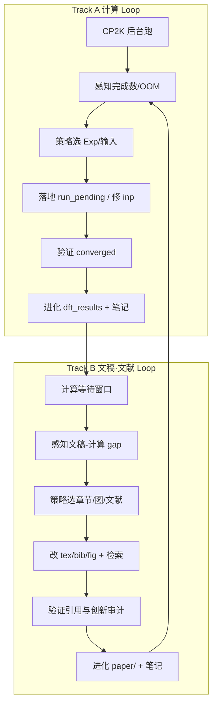
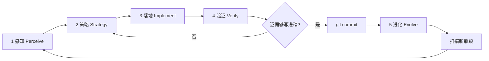

# AGENTS.md

## Graphullerene 投稿无限优化闭环（Infinite Optimization Loop）

本仓库的持续改进**没有终止条件**。每一轮闭环的目标不是「算完就停」，而是：

**感知现状 → 选定瓶颈 → 最小落地 → 用证据验证 → 把结论写回文稿与契约 → 进入下一轮**。

Cloud Agent 与人类协作者都应把 `AGENTS.md` 当作活文档；每轮验证通过后更新本节或下方 **Gotchas** / **当前轮次笔记**。

**不要**为此闭环新增独立编排脚本（例如一键跑完全部 Exp 的 orchestrator），除非用户明确要求。闭环由 Agent 按层执行现有 `experiments/` 脚本、CP2K 与测试，并把经验沉淀进文档。

**投稿目标（优先级）**：**PRL** → **Nature Materials** / **Nature Communications** → **PRB** / **Carbon**（降级路径）。每一轮策略须对照目标期刊的「主张强度 vs 证据强度」。

**三轨并行（PRB 修回期）**：Track **A** 计算 + Track **B** 常规文稿 + Track **C** [PRB 外审审稿闭环](#loop-c--prb-外审审稿闭环review-for-physical-review-b--report-no-1)（`go loops` 在 PRB 旗杆下 **C 每轮 ≥1 项**）。CP2K 后台时 Agent **不得空等** — 同步执行 [文稿·文献闭环](#文稿文献闭环-manuscript--literature-loop)（整理、校准、配图配表、检索最新文献、创新审计）。计算轮与文稿轮交替推进，每轮结束写回 `AGENTS.md` 并 **git commit**（**push 可选**；见 [每轮 Git 闭环](#每轮-git-闭环)）。

---

### 当前状态快照（每轮 Loop 开头更新此节）

| 项 | 值 |
|----|-----|
| **Exp10** | **41/41** ✅（incl. cutoff400） |
| **Exp8** | **6/6** ✅ |
| **Exp9** | **12/12** GEO_OPT ✅；vertical SP **8/8** ✅ |
| **Table IV seed137** | **24/24** ✅ |
| **Periodic relax n=1 P** | **4/4** ✅ |
| **Population B/N/P** | **18/18** ✅ |
| **reference_pbed3** | **24/24** ✅ |
| **运行中** | 无（R421：Cloud VM 无 CP2K；`exp10_status.json` 误刷新已 restore，勿提交） |
| **最新 Loop** | **R450** |
| **下一 B 任务** | SCAN + dense-$k$；$n{=}2$ 四角 @ EPS $10^{-6}$；$n{=}8$ 参考态。**勿再抄** cutoff-class / same-350-Ry / 5.4 / (4.3) / R7-1.2 |
| **主张-证据** | 主文 α/S = **PBE+D3 only**；α 带拟合标准误（仅 N $>2\sigma$）；`n=2`/`n=8` 行 = **reference-limited** |
| **引用** | **18/18 经 Crossref 核验**（R419 修 11 条：1 条虚构、3 条 DOI 错配、多条作者/页码错） |
| **数据审计** | `paper/scripts/verify_manuscript_numbers.py` → **50/50 PASS** |
| **Loop C** | C-M1 **closed** ✅；C-M2 **closed** ✅；C-M3 **closed**（text branch：Limitations + Table~V；Mayer/Bader = C）✅；C-m3 去重 **closed** ✅ |
| **SDC** | **15** synergy 点 |
| **旗杆** | **PRB Regular Article** major revision |

---

- **Loop R450（2026-08-18，三轨 · III Literature）**：
  - **Track A**：NO_CP2K — **不干预**
  - **Track B（III Literature）**：ledger only — Khan/Li C24/Wang/Makov/Xu C70/Nie C20/Pereira endohedral already in tex; no new bib
  - **Track C**：grep `7/8|at revision|referee` = **0**; C-m3 **closed**
  - **创新审计**：literature ledger = **A**; SCAN = **C** open; cutoff400 = **A** closed
  - **paper_gap**：SCAN + dense-$k$; Mayer/Bader; n=2 four-corner @ EPS $10^{-6}$
  - **Git**：`commit: a121cdb` — `loop R450: literature ledger, no new bib`；（**pushed: origin/cursor/prb-manuscript-rigor-audit-1d10**）
  - **下一轮**：IV Methods
- **Loop R449（2026-08-17，三轨 · II Intro）**：
 - **Track A**：Cloud VM **NO_CP2K** — **不干预**
 - **Track B（II Intro）**：Intro already carries SCF-gate, charged-defect/polaron-rate estimator, Wang2024simulation, Li2024, and Qiu2025. **No Intro wording added.** Ledger: `7/8|at revision|referee` = 0; `not a cutoff-class change` = 2; `Wang2024simulation` = 1
 - **Track C**：Intro already matches the closed manuscript contract. SCAN / Mayer/Bader remain C
 - **创新审计**：Intro contract = **A**（already in tex）；SCAN / Mayer = **C**
 - **paper_gap**：n=2 / n=8 four-corner @ EPS \(10^{-6}\)；SCAN / Mayer/Bader
 - **Git**：`commit: c02a542` — `loop R449: Intro contract ledger; no Intro rewrite`；（**pushed: origin/cursor/prb-manuscript-rigor-audit-1d10**）
 - **下一轮**：R450 III Literature（mod 8 = 2）；SCAN / Mayer/Bader
- **Loop R448（2026-08-17，三轨 · I Abstract / Loop C）**：
 - **Track A**：Cloud VM **NO_CP2K** — **不干预**
 - **Track B（I Abstract）**：Abstract 已对齐（constrained loading / bilinear / n=2 undoped-corner / charged-defect 边界）；无新 `.out`，**不改**摘要措辞
 - **Track C**：`7/8|at revision|referee` = **0**；`not a cutoff-class change` = **2**；`Wang2024simulation` = **1**（Intro L67）；theory report 补 R448 台账
 - **创新审计**：Abstract 契约核对 = **A**；横切 grep = **A**；SCAN / Mayer = **C**
 - **paper_gap**：n=2 四角 @ EPS $10^{-6}$；n=8 参考态；SCAN + dense-$k$；Mayer/Bader
 - **prl_gate**：D4 n=8 误读 closed；SCAN / Mayer = C
 - **Git**：`commit: 49203cf` — `loop R448: Abstract contract ledger; no Abstract rewrite`；（**pushed: origin/cursor/prb-manuscript-rigor-audit-1d10**）
 - **下一轮**：n=2 四角 @ EPS $10^{-6}$；SCAN 单点；Mayer/Bader
- **Loop R447（2026-08-17，三轨 · 横切 / Loop C）**：
  - **Track A**：Cloud VM **NO_CP2K** — **不干预**
  - **Track B（横切）**：`theory_enhancement_report` 补 R446 closed-open 台账 + R447 横切 grep；主文 n=8 cutoff-class 已闭合（Methods L102 + Limitations L260），**不改**
  - **Track C**：`7/8|at revision|referee` = **0**；`not a cutoff-class change` = **2**；`Wang2024simulation` = **1**（Intro L67）
  - **创新审计**：横切 grep = **A**；cutoff400 closed-open ledger = **A**（response）；SCAN / Mayer = **C**
  - **paper_gap**：n=2 四角 @ EPS $10^{-6}$；n=8 参考态；SCAN + dense-$k$；Mayer/Bader
  - **prl_gate**：D4 n=8 误读 closed；SCAN / Mayer = C
  - **Git**：`commit: 4feca77` — `loop R447: theory-report closed-open ledger + horizontal grep`；（**pushed: origin/cursor/prb-manuscript-rigor-audit-1d10**）
  - **下一轮**：n=2 四角 @ EPS $10^{-6}$；SCAN 单点；Mayer/Bader
- **Loop R446（2026-08-17，三轨 · VIII Conclusion / Loop C）**：
 - **Track A**：idle / **NO_CP2K** — **不干预**
 - **Track B（VIII Conclusion）**：Conclusions 已写完 n=2 / charged-defect / C70/C20 — **无新主文句**。SCAN 缺口仅写 response（不进 Conclusions）。
 - **Track C**：R4-Methods-A1 + Major Concern 8 + Residual 「Still open」把 cutoff400 **closed** 与 SCAN **still open** 分开；**无 SCAN 数字**
 - **创新审计**：SCAN vs cutoff400 闭合边界 = **A**；SCAN DFT = **C** open
 - **paper_gap**：SCAN + dense-$k$；$n{=}2$ 四角 @ EPS $10^{-6}$；$n{=}8$ 参考态。**勿再抄** SCAN-in-Conclusions / cutoff-class / same-350-Ry / 5.4 / (4.3) / R7-1.2
 - **Git**：`commit: 5b548bf` — `loop R446: SCAN vs cutoff400 closed-open split in response`；（**pushed: origin/cursor/prb-manuscript-rigor-audit-1d10**）
 - **下一轮**：R447 横切；勿再抄 SCAN-in-Conclusions / cutoff-class / same-350-Ry / 5.4 / (4.3) / R7-1.2
- **Loop R445（2026-08-17，三轨 · VII Discussion / Loop C）**：
  - **Track A**：NO_CP2K — **不干预**
  - **Track B**：response (4.3) + Residual + R7-1.2：cutoff400 41/41 closed；n=6/n=8 同属 350 Ry，n=8 offset 不是 cutoff-class；SCAN 仍 DFT open。**不改主文**
  - **Track C**：主文边界 0；response D4 台账对齐
  - **创新审计**：cutoff400 = **A**（41/41）；SCAN = **C**
  - **paper_gap**：Mayer/Bader = **C**；SCAN + dense-$k$ = **C**；$n{=}2$ 四角 @ EPS $10^{-6}$ = **C**
  - **Git**：`commit: dbee0e9` — `loop R445: response D4 cutoff400 closed, n=8 not cutoff-class`；（**pushed: origin/cursor/prb-manuscript-rigor-audit-1d10**）
  - **下一轮**：R446 VIII Conclusion；勿再抄 cutoff-class / same-350-Ry / 5.4 / (4.3) / R7-1.2
- **Loop R444（2026-08-17，三轨 · VII Discussion）**：
 - **Track A**：NO_CP2K — **不干预**
 - **Track B（VII Discussion）**：Limitations 增 n=8 cutoff-class 指针（指向 Methods；不重复 5.4 数字）
 - **Track C（C-M3）**：主文无 `7/8`/`at revision`/`referee`
 - **创新审计**：n=8 cutoff-class 闭环 = **A**（Methods + Limitations）；`not a cutoff-class change` = **2**
 - **paper_gap**：Mayer/Bader = **C**；SCAN + dense-$k$ = **C**；$n{=}2$ 四角 @ EPS $10^{-6}$ = **C**
 - **Git**：`commit: ba143dc` — `loop R444: Limitations n=8 cutoff-class pointer, Loop C`；（**pushed: origin/cursor/prb-manuscript-rigor-audit-1d10**）
 - **下一轮**：R445 / $n{=}2$ 四角重算；勿再抄 n=8 cutoff-class
- **Loop R443（2026-08-17，三轨 · 横切 B4/B5）**：
 - **Track A**：NO_CP2K — **不干预**
 - **Track B（横切）**：theory report 记录 Results L162–169 已覆盖 n=2/n=8 reference-limited；不改 Results 定量、不抄 R442 same-350-Ry 句
 - **Track C（C-M3）**：主文无 `7/8`/`at revision`/`referee`
 - **创新审计**：横切契约 = **A**；n=8 Methods 分类仍 = **A**（R442）
 - **paper_gap**：Mayer/Bader = **C**；SCAN + dense-$k$ = **C**；$n{=}2$ 四角 @ EPS $10^{-6}$ = **C**
 - **Git**：`commit: 797b4ee` — `loop R443: theory-report n=8 Results already covered, Loop C`；（**pushed: origin/cursor/prb-manuscript-rigor-audit-1d10**）
 - **下一轮**：R444 / $n{=}2$ 四角重算；勿再抄 n=8 Methods 句
- **Loop R442（2026-08-17，三轨 · IV Methodology）**：
 - **Track A**：NO_CP2K — **不干预**
 - **Track B（IV Methods）**：Methods 补 $n{=}8$ 未掺杂角：与 $n{=}6$ 同属 $350$~Ry，offset 非 cutoff-class、不报尺寸趋势变号；**无新定量**
 - **Track C（C-M3）**：主文无 `7/8`/`at revision`/`referee`
 - **创新审计**：n=8 same-350-Ry 分类 = **A**（audit JSON）；cutoff-class 误读已纠正 = **A**
 - **paper_gap**：Mayer/Bader = **C**；SCAN + dense-$k$ = **C**；$n{=}2$ 四角 @ EPS $10^{-6}$ = **C**
 - **Git**：`commit: 35aeeab` — `loop R442: Methods n=8 same-350-Ry undoped-corner offset not cutoff-class`；（**pushed: origin/cursor/prb-manuscript-rigor-audit-1d10**）
 - **下一轮**：R443 横切 / $n{=}2$ 四角重算；勿再抄 n=8 Methods 句

- **Loop R441（2026-08-17，三轨 · III Literature）**：
  - **Track A**：NO_CP2K — **不干预**
  - **Track B（III Literature）**：Intro 在 Hou 宿主句之后写入 Wang2024simulation：qHP/qTP C60 应力各向异性是单轴应力几何图，不是置换 B/N/P 网格上的四角 S；SI positioning 表第一行补同一 citekey；**不**新 DOI、**不**改 Abstract/Results 定量
  - **Loop C**：`7/8|at revision|referee` = 0
  - **创新审计**：Wang2024simulation 单轴应力 vs 四角 S = **B+**
  - **paper_gap**：Mayer/Bader = **C**；SCAN + dense-k = **C**；n=2 四角 @ EPS 1e-6 = **C**
  - **Git**：`commit: f8dc903` — `loop R441: Intro Wang2024simulation uniaxial-stress map vs four-corner S`；（**pushed: origin/cursor/prb-manuscript-rigor-audit-1d10**）
  - **下一轮**：R442 IV Methods 或下一未引用 bib 对比句

- **Loop R440（2026-08-17，三轨 · II Introduction）**：
  - **Track A**：NO_CP2K — **不干预**
  - **Track B（II Introduction）**：Intro 在 charged-defect 边界句之后写入 finite-size $\mathcal{S}(n)$ 条目若未过 undoped-corner SCF gate 则为 reference-limited、不得读成 dopant-rank trend；**不**抄 Abstract/Methods/Conclusions 原句、**不** cite `eq:four_corner`、**不加**第三处 charged-defect
  - **Track C（C-m3）**：主文边界 grep 0
  - **创新审计**：Intro SCF-gate 读法 = **A**（与 Abstract/Methods/Conclusions 闭环）；n=2 重算 = **C**
  - **paper_gap**：Mayer/Bader = **C**；SCAN + dense-$k$ = **C**；$n{=}2$ 四角 @ EPS $10^{-6}$ = **C**
  - **Git**：`commit: 14f7269` — `loop R440: Intro n=2 SCF-gate reference-limited, not dopant-rank trend`；（**pushed: origin/cursor/prb-manuscript-rigor-audit-1d10**）
  - **下一轮**：dense-$k$ / Mayer；或 Results caption 对齐 SCF-gate 读法
- **Loop R439（2026-08-17，三轨 · I Abstract）**：
 - **Track A**：`NO_CP2K` — **不干预**
 - **Track B（I Abstract）**：Abstract 对齐 Conclusions R438 — $n{=}2$ $\mathcal{S}(n)$ row is reference-limited at the undoped corner, not a sign change of the mixed derivative（无 Methods table 引用、无新定量）
 - **Loop C**：主文无 `7/8|at revision|referee`
 - **创新审计**：Abstract n=2 边界 = **A**；Mayer = **C**
 - **paper_gap**：Mayer/Bader = **C**；SCAN + dense-$k$ = **C**；$n{=}2$ 四角 @ EPS $10^{-6}$ = **C**
 - **Git**：`commit: 55d04b6` — `loop R439: Abstract n=2 undoped-corner reference-limited, not mixed-derivative sign change`；（**pushed: origin/cursor/prb-manuscript-rigor-audit-1d10**）
 - **下一轮**：R440 II Intro 或横切；勿再插同一句

- **Loop R438（2026-08-17，三轨 · VIII Conclusion）**：
  - **Track A**：`NO_CP2K` — **不干预**
  - **Track B（VIII Conclusion）**：Conclusions 对齐 Methods R437 — $n{=}2$ $\mathcal{S}(n)$ row is reference-limited at the undoped corner (Methods; Table~sigma_S), not a sign change of the mixed derivative
  - **Loop C**：主文无 `7/8|at revision|referee`
  - **创新审计**：Conclusions n=2 边界 = **A**；Mayer = **C**
  - **paper_gap**：Mayer/Bader = **C**；SCAN + dense-$k$ = **C**；$n{=}2$ 四角 @ EPS $10^{-6}$ = **C**
  - **Git**：`commit: 5f0b499` — `loop R438: Conclusions n=2 undoped-corner reference-limited, not mixed-derivative sign change`；（**pushed: origin/cursor/prb-manuscript-rigor-audit-1d10**）
  - **下一轮**：R439 Abstract 或横切；勿再插同一句

### PRL Desk Review Gate（审稿升格 · 通用闸门）

> **来源**：第三版 PRL 级别详细审稿（2026-06-19）。本节为**投稿策略与 Loop 优先级**的权威清单；每轮 `go loops` 须在执行前闸门中对照 **Desk Reject** 行，未闭合前**禁止**恢复 transport/ML 夸大表述或未经弛豫验证的绝对定量主张。

#### 总体判定与期刊路径

| 路径 | 条件 | Agent 默认 |
|------|------|------------|
| **PRL** | 叙事升格为「共价分子网络普适规律」+ 弛豫验证 Table~III 收敛 + 摘要≤600 字符 + 正文≤3750 词 + 单核心贡献（$\mathcal{S}$ 能量非加性） | 仅当上表 **Track A 必补** 完成且 P0 格式全绿 |
| **PRB Regular Article** | 无字数硬顶；完整机理 + 主文 Tables I--V | **当前投稿锚点**（major revision 修回） |
| **PR Materials** | 材料调控 + 设计规则；可保留部分 IPR/$J$ 于 SI | 并行备选 |

**核心叙事锚点句**（Intro/Abstract/Conclusion 须收敛至此，qHP C$_{60}$ 为**模型体系**）：

> 在离散单元构成的共价分子网络中，掺杂诱导的局域结构畸变与外应变的非线性耦合，是应变–掺杂非加性效应的重要来源；其强度不与线性应变系数 $\alpha$ 简单正相关，顺序扫描的加和假设可带来显著的稳定性预测误差。

#### Desk Reject 级（P0 — 不解决 = 不送审）

| ID | 审稿要点 | 仓库动作 / 证据 |
|----|----------|-----------------|
| **D1** | 广泛物理兴趣：体系拓展非原理突破 | Intro/Abstract/Discussion 升格至「共价分子网络」；cite 2D 非加性先例；qHP 作验证 |
| **D2** | 刚性应变无验证 | `relax_validation/` → Table~III；Methods/Limitations **upper bound** 措辞 |
| **D3** | 固定掺杂位点无普适性 | Limitations 诚实；可选第二 seed 四聚体单点（backlog，不伪造） |
| **D4** | $n{\geq}6$ 280 vs 300 Ry 与 N $\mathcal{S}$ 符号 | Table~II pending 行；$n{=}6$ @300 Ry 单点（Track A backlog） |
| **D5** | 叙事分散（gap + $\alpha$ + $\mathcal{S}$ + IPR/$J$） | **主文 IPR/$J$ 压缩至 Fig.~4**；Results 以 $\mathcal{S}$ 为主轴 |
| **D6** | 摘要 >600 字符 / 含引用 | `wc`/脚本审计；无 `\cite`、无公式、单段 |
| **D7** | 正文词数（**PRL** ≤3750 硬顶；**PRB Regular** 无限制，仅可读性） | PRB：`prb_wordcount.sh` 信息性；**禁止**为压字数删机理 |
| **D8** | $\mathcal{S}$ 符号 / π 乱码 / 断词 | grep 审计；全文 `\mathcal{S}` |
| **D9** | bib 重复编号 / `note` 泄漏 | 删 `referinfo`；编译查 `.bbl` 无 `[2] [2]` |
| **D10** | $E_f$ 与 $n_{\mathrm{dop}}$ 矛盾 | `table1_verification.json` 为 canonical |

#### 外审级（P1 — 送审后仍可能拒）

| ID | 要点 | 动作 |
|----|------|------|
| **R1** | 机理深度不足 | PDOS + 键长/畸变（弛豫后）入 Discussion；三类机制分类段 |
| **R2** | $\mathcal{S}$–$\alpha$ 对比不对等 | 已写浓度/边界 Limitations；勿夸大「非线性主导」 |
| **R3** | ~3% vs PBE 形成能误差 | Discussion 增 DFT 不确定度与排序反转讨论 |
| **R4** | $J$ 与 $\mathcal{S}$ 脱节 | 主文一句边界；细节仅 SI |

#### Track A 必补计算（PRL 送审最低集）

| 任务 | 路径 | 阻塞 |
|------|------|------|
| P@+3% 四聚体 fixed-cell GEO_OPT 四角 | `relax_validation/` | Exp9 batch 空闲后顺序跑；**勿并行** |
| $n{=}6$ N @+3% @300 Ry 单点 | Exp10 式 inp 或 backlog | 尺寸/截断对照 |
| （可选）第二掺杂 seed 四聚体 | 新 inp 模板 | P1 |

#### 扫描包 §F（PRL desk gate）

```bash
# F. PRL 格式与叙事
python3 -c "
import re
tex=open('paper/strain_doped_graphullerene.tex').read()
m=re.search(r'\\begin\{abstract\}(.*?)\\end\{abstract\}', tex, re.S)
a=m.group(1) if m else ''
plain=re.sub(r'\\[a-zA-Z]+(\{[^}]*\}|\[[^]]*\])?','',a)
plain=re.sub(r'[{}$]','',plain)
print('abstract_chars', len(plain.replace(' ','').replace('\n','')))
print('abstract_has_cite', '\\cite' in a)
"
grep -En 'IPR|\\$J\\$|Marcus' paper/strain_doped_graphullerene.tex | wc -l
grep -c '\\mathcal\{S\}' paper/strain_doped_graphullerene.tex || true
grep -En 'referinfo|note.*refer' paper/strain_graphullerene_50refs.bib || true
bash paper/scripts/prl_wordcount.sh 2>/dev/null || true
test -f experiments/analysis/relax_validation_tetramer.json && python3 -c "import json;d=json.load(open('experiments/analysis/relax_validation_tetramer.json'));print('relax',d.get('status','?'))" || echo 'relax_json missing'
```

**Loop 笔记必填**：`prl_gate: D? open | narrative=Y/N | abstract_NNN | relax=pending|done`


**一行命令**：`bash experiments/exp10_status_line.sh` · `bash experiments/exp9_status_line.sh` · `bash experiments/exp5_relax_status_line.sh` · `bash experiments/exp5_seed137_status_line.sh` · `bash experiments/exp5_reference_pbed3_status_line.sh` · `bash experiments/continue_reference_pbed3_pending.sh` · `bash experiments/continue_seed137_pending.sh` · `bash experiments/verify_reliability.sh`

---

### Agent 快速入口（`go loops` 标准流程）

每轮 **按序执行**，勿跳步：

```bash
# 0) 感知（≤30 s）
bash experiments/exp10_status_line.sh
bash experiments/exp8_status_line.sh
bash experiments/exp9_status_line.sh
python3 experiments/update_exp10_status.py   # 若需完整 JSON
bash experiments/verify_reliability.sh       # setup+coords→process→result

# 1) 闸门 — 四轮自问（见「执行前闸门」）→ 选 1 个 A 瓶颈 + 1 个 B 项

# 2) Track A — 有 running 则通常「不干预」；无 CP2K 则：
#    bash experiments/continue_exp10_pending.sh
#    或 ./c/simukit-run --one <task> experiments/exp_10_size_scaling/inputs

# 3) Track B — 跑「论文自动优化」1 轮（见该节算法 + 扫描包）；声明 write.mdc 阶段；改 tex/bib/audit/图（≥1 项）
# 3b) Loop C — PRB Report No.1：读 [动作矩阵](#loop-c-动作矩阵) → 选 1×C-Major 或 2×C-Minor；同步 response_to_referees.md（不进主文）

# 4) 验证 — grep converged / 创新审计表 / 勿改无 .out 的定量

# 5) 进化 — 更新本节「当前状态快照」+ Loop R{n} 笔记（3～5 行 + commit hash）

# 6) Git — 1 Loop = 1 commit（push 可选）
git status && git diff
git add … && git commit -m "loop R{n}: …"
# 可选：用户要求或需同步远程时
# git push -u origin HEAD
```

**收敛瞬间（Exp10 临界区 / CRIT）**：

```bash
grep -q 'SCF run converged' experiments/exp_10_size_scaling/inputs/<task>.out \
  && bash experiments/post_exp10_converged.sh
```

**禁止**：只 tail 日志不写笔记；跨多轮 R 攒一次 commit；用 Python SDC 覆盖 canonical JSON。

---

### SCI 写作协议（落地版）

**权威全文**： [`.cursor/rules/write.mdc`](../.cursor/rules/write.mdc)（`alwaysApply: true`）。本节为 Agent 速查索引；改稿前须声明 **Phase** 并对照证据等级。

#### 五层结构（协议 ↔ 仓库）

| 协议层 | 内容 | 仓库落点 |
|--------|------|----------|
| **总纲** | 底线/流程/质量三级原则 | 核心原则 + write.mdc §一 |
| **执行** | 七阶段写作流程（Intro 含文献） | write.mdc §二；映射见下表 |
| **质控** | A/B/C 证据分级、三级评审、投稿终检 | `theory_enhancement_report.md`、Loop 创新审计 |
| **协作** | 角色权责、阶段声明、版本/修订日志 | `response_to_referees.md`、cover letter |
| **场景** | DFT 强制披露、双轨/三轨联动 | `experiments/*/inputs/*.inp`、Track A/B/C |

#### 证据等级速查（章节准入）

| 等级 | 可进章节 | 禁止 |
|------|----------|------|
| **A** | 摘要/结果/结论核心定量 | 无 `.out` 或 JSON 支撑 |
| **B** | 讨论机理、方法合理性、SI 趋势 | 冒充 A 级进 Abstract |
| **C** | 展望、SI 示意、theory report | **正文** Abstract/Results |

#### 改稿前三问

1. **阶段** — 摘要/引言/方法/数据/结果/讨论/结论？
2. **证据** — A/B/C？是否有 `experiments/analysis/*.json` 或 converged `.out`？
3. **契约** — Methods 是否与 `*.inp` 一致？PRB 主文是否含修回进度句（**禁止**）？


### write.mdc ↔ Track B 映射（`go loops` 文稿轨）

用户说 **`go loops`** / **`继续`** / **`@write.mdc go loops`** 时，Track B **须先声明** `.cursor/rules/write.mdc` 阶段（Phase Declaration），再选 **≥1 项** 落地。

| write.mdc 阶段 | 落地版阶段 | Track B | 典型路径 | 证据闸门 |
|----------------|------------|---------|----------|----------|
| **I Abstract** | 阶段1 | B3 | `paper/strain_doped_graphullerene.tex` | 无新 `.out` **不改**定量 |
| **II Introduction** | 阶段2 | B1+B3 | Intro、gap、结构提纲 | 新引用须入 `.bib` |
| **III Literature** | 阶段2（文献） | B1+B2+B3 | `strain_graphullerene_50refs.bib` | 每 ~2 轮 WebSearch |
| **IV Methodology** | 阶段3 | B3 | Methods vs `experiments/*/inputs/*.inp` | 与 inp 一致 = **A** |
| **V Data** | 阶段4 | B1 | `exp*_status*.json`、audit JSON | 计数诚实化 |
| **VI Results** | 阶段5 | B3+图 | Results、`paper/figures/` | **仅** verified `.out` / JSON |
| **VII Discussion** | 阶段6 | B3 | 机制、文献对比 | 定量须 A/B 级 |
| **VIII Conclusion** | 阶段7 | B3 | Limitations、future work | 对齐 Intro 问题 |
| **（横切）证据台账** | 质控层 | B4+B5 | `paper/theory_enhancement_report.md` | A/B/C 创新审计 |

**交叉文档（Agent 必读）**：

| 文档 | 职责 |
|------|------|
| **`AGENTS.md`**（本文） | 双轨 Loop、Exp 状态、Git 闭环、Loop R{n} 笔记 |
| **`.cursor/rules/write.mdc`** | **SCI 写作协议（落地版）全文**：七阶段边界、证据 A/B/C、Phase Declaration、双轨硬闸门 |
| **`paper/theory_enhancement_report.md`** | 主张 ↔ canonical JSON / `.out`；discrepancy 勿进 Results |
| **[论文自动优化](#论文自动优化manuscript-auto-optimization)**（本文） | 扫描包、P0–P3 打分、Electron 旗杆、write.mdc 轮转 |

**Track B 每轮最小清单**（配合上文步骤 3–5）：

1. 声明阶段 — *「In the [Methodology] phase, I am …」*
2. 执行前闸门 — 改哪一节？是否碰 Results 定量？目标期刊 panel？
3. 落地 1–2 文件 — tex / bib / fig / audit / theory report
4. 创新审计表 — 写入 Loop R{n} 笔记（A/B/C）
5. 验证 — citekey、`latexmk`（可选）、数字可追溯至 `.out`

---

### 论文自动优化（Manuscript Auto-Optimization）

Track B 的**可执行策略层**：每轮 Agent **不随机润色**，而是按扫描→打分→选 1 项→落地→验证 自动推进主稿。与 [文稿·文献闭环](#文稿文献闭环-manuscript--literature-loop) 共用证据闸门；**禁止**为此新增独立 orchestrator（沿用现有 `grep` / audit JSON / `latexmk` / 作图脚本）。

#### 触发与模式

| 用户指令 | 模式 | 行为 |
|----------|------|------|
| **`go loops`** / **`继续`** | 双轨默认 | A 不阻塞时，B 跑 **1 轮**自动优化（见下算法） |
| **`go loops B`** / **`论文优化`** | B 专轮 | 连续多轮 B，每轮 1 项；Exp 仅快照、不启 CP2K |
| **`@docs/papers/Electron.pdf 对齐`** | 旗杆对齐 | 叙事/章节顺序对齐 Capobianco *Nano Lett.* 2024（见「旗杆模板」）；**不**恢复无 `.out` 的 transport 倍数 |
| **`@write.mdc`** + 阶段名 | 定向 | 跳过轮转，锁定 write.mdc 某一阶段 |

#### 每轮算法（Agent 必按序）


1. **扫描（≤60 s）** — 运行「自动扫描包」；更新 mental backlog（也可写入 Loop 笔记 `paper_gap:` 行）。
2. **打分** — 用下表 P0–P3；同分则：**契约违规 > 阻塞 PRL > 旗杆对齐 > 措辞润色**。
3. **选 1 项** — 本轮只改 **1 个**主瓶颈（附最多 1 个连带小修，如 caption 同步）。
4. **落地** — 声明 write.mdc 阶段 → 改 tex/bib/fig/audit。
5. **验证** — 创新审计 A/B/C；可选 `bash paper/compile.sh`；figure 源数据可追溯。
6. **进化** — 更新「当前状态快照」**文稿行** + Loop R{n} 笔记。

#### 自动扫描包（复制即用）

```bash
# A. 文稿-计算契约
grep -En 'rVV10|Koopmans|cm\^2|775|300%|8\.75' paper/strain_doped_graphullerene.tex || true
grep -m1 'XC_FUNCTIONAL\|VDW_POTENTIAL' experiments/exp_10_size_scaling/inputs/size_1x60_*.inp

# B. 证据台账（discrepancy / pending）
grep -E 'pending|discrepancy|withdrawn|勿进' paper/theory_enhancement_report.md | head -5
python3 -c "import json; d=json.load(open('experiments/analysis/exp4_polaron_verification.json')); print('Exp4 transition', d['derived']['polaron_transition_confirmed'])"
python3 -c "import json; d=json.load(open('experiments/analysis/exp9_polaron_verification.json')); print('Exp9 geo', sum(1 for x in d.get('systems',{}).values() if x.get('geo_opt_converged')), '/12')"

# C. 引用与编译
grep -oE '\\\\cite\{[^}]+\}' paper/strain_doped_graphullerene.tex | sort -u | wc -l
# 可选: cd paper && latexmk -pdf -interaction=nonstopmode strain_doped_graphullerene.tex

# D. 图件 freshness（git 脏文件 / final_figures）
ls -lt paper/figures/final_figures/*.png 2>/dev/null | head -3

# E. 第三版审稿（peer-review backlog）
grep -En 'referinfo|32.*eV per P|~ 5\\%|knobs' paper/strain_doped_graphullerene.tex paper/strain_graphullerene_50refs.bib || true
grep -En 'Exp\.~[0-9]|dft_results|exp[49].*json' paper/supplementary_figures.tex paper/supplementary_material_theory.tex | head -8
python3 -c "import json; t=json.load(open('experiments/analysis/table1_verification.json')); print('P Ef', t['systems']['P']['Ef_eV_per_dopant'], 'n', t['systems']['P']['n_dopants'])"
```

**扫描产出（写入 Loop 笔记，一行即可）**：`paper_gap: Methods泛函 | Exp9 λ pending | Fig transport C级 | Electron对齐-Intro`

#### 优先级打分（P0 最高）

| 等级 | 信号 | 自动动作 |
|------|------|----------|
| **P0** | tex 定量与 `table1_verification.json` / SDC audit **不一致** | 以 JSON/`.out` 为准改 tex；更新 theory report |
| **P0** | Methods 写 rVV10/Koopmans，inp 为 PBE+D3 | Methods 诚实化 **或** 标注 `[TODO: subset]` |
| **P0** | theory report **C 级**主张出现在 Abstract/Results | 删除或降调至 Discussion/SI |
| **P0** | **第三版审稿**：$E_f$/$n_{\mathrm{dop}}$ 与 `table1_verification.json` 不一致 | 以 JSON 改 tex/SI；重算 $|\mathcal{S}|/|E_f|_{\mathrm{per\,atom}}$ |
| **P0** | **第三版审稿**：bib `referinfo` / 内部 note 泄漏 | 删内部路径；note 改为正式摘要句 |
| **P0** | **PRL desk D5**：主文 IPR/$J$ 叙事分散 | 压缩至 Fig.~4；Results 以 $\mathcal{S}$ 为主 |
| **P0** | **PRL desk D6**：摘要 >600 字符或含 `\cite` | 重写摘要；§F 字符审计 |
| **P0** | **PRL desk D2**：刚性应变无弛豫对照 | Table~III `relax_validation/`；upper-bound 措辞 |
| **P0** | **第三版审稿**：$\mathcal{S}$ 符号/断词 | 全文 `\mathcal{S}`；断词处加 `$\mathcal{S}$` |
| **P1** | 阻塞目标期刊的**缺图/缺段**（如 PRL transport、Exp9 λ Fig.5） | 占位 + caption `[pending: Exp9]`；不伪造数字 |
| **P1** | **第三版审稿**：SI 主文 `Exp.~N` vs `Fig.~S1--S3` | 统一 Supp. 交叉引用；caption 去 audit 路径 |
| **P1** | **第三版审稿**：tetramer 仅 $+3$\% $\mathcal{S}$ | `relax_validation/` 多应变或 Methods 声明范围 |
| **P1** | `sdc_method_section.tex` 缺失 / `\ref{eq:synergy_order}` 断链 | 补 Methods 方程节 + `\input` |
| **P1** | 用户指定 **Electron.pdf 对齐**且 Intro/Discussion 缺 Capobianco 对比 | 补文献线程（localization→$J$→$\mu$）；挂钩本文 $\mathcal{S}$/$(\epsilon,\delta)$ |
| **P2** | 缺 2025–2026 bib / Khan·Li·Peng 对比句 | WebSearch → ≤3 bib → Intro/Discussion 各 1 句 |
| **P2** | 图不符合目标期刊 panel（PRL 宽 3.375 in / Nature 多 panel） | 跑 `paper/figures/generate_manuscript_figures.py` 或子脚本 |
| **P3** | 纯措辞、标点、章节过渡 | **仅当 P0–P2 为空** 时做；否则跳过 |

#### write.mdc 阶段轮转（无用户指定时）

按 **Innovation backlog + 扫描 gap** 选阶段，默认 **8 轮为一周期**：

| 轮次 mod 8 | 阶段 | 典型自动任务 |
|------------|------|--------------|
| 0 | I Abstract | 与 Table/audit 数字对齐；删 C 级句 |
| 1 | II Intro | gap + 贡献三条；Capobianco/Khan 锚点 |
| 2 | III Literature | bib + 对比句；WebSearch |
| 3 | IV Methods | inp 契约、`sdc_method_section`、Exp 计数 |
| 4 | VI Results | **仅** A 级新证据或 fig caption |
| 5 | VII Discussion | 机制 + 文献差异 + design rules |
| 6 | VIII Conclusion | 对齐 Intro；limitations 诚实 |
| 7 | 横切 | `theory_enhancement_report.md` + 全稿 grep 审计 |

用户 **`@Electron.pdf 对齐`** 时：**优先 II→IV→VI→VII**（Intro 语境 → Methods 可观测量的 → Results 顺序 → Discussion 对比），Abstract/Conclusion 最后收口。

#### 旗杆模板：`docs/papers/Electron.pdf`（Capobianco *Nano Lett.* 2024）

对齐**叙事弧与章节功能**，不是照搬泛函或数值：

| Capobianco 主文 | 本仓库对应 | 证据 |
|-----------------|------------|------|
| vdW vs qHP 迁移率差异；polaron 仍局域 | Intro 末段 + Discussion 首段 | 文献 + Exp4 IPR/$J$ 两点 |
| Koopmans/rVV10 + CP2K 超胞 | Methods：**诚实** PBE+D3 + CP2K；SI 可写 Capobianco 对比 | `*.inp` |
| IPR 量化局域；$J$ 增强驱动 $\mu$ | Results「Electronic / localization」小节 + Fig.3(f) | `exp4_polaron_verification.json` |
| $\lambda$ + FCWD + Marcus 速率 | Results/Discussion **pending**；Fig.5/6 占位 | Exp9 7/12；`derived.lambda_eV` null |
| **本文增量** | **非加性 $\mathcal{S}$、$\alpha$ 符号分裂、$S(n)$ 标度** | Exp5+10 **A 级** |

**对齐检查清单**（Electron 模式每轮至少勾 1 项）：

- [ ] Intro：qHP 网络 → 输运/局域化语境 → **$(\epsilon,\delta)$ 非加性 gap**
- [ ] Methods：材料尺寸 + CP2K 设置 + **$\mathcal{S}$ / IPR / $J$ 定义**
- [ ] Results 顺序：**结构/应变** → **电子/ gap** → **局域化/$J$** → **$\mathcal{S}$ 设计空间**
- [ ] Discussion：与 Capobianco「$J$ 主导 $\mu$」对照；本文「**耦合参数 $(\epsilon,\delta)$ 改变能量与 $J$ 路径**」
- [ ] 无 hybrid/ML/迁移率倍数 **除非** 新 `.out` 支撑

#### 快照字段（「当前状态快照」扩展）

每轮 Loop 开头，Agent **应更新**（可与 Exp 行并列）：

| 项 | 示例 |
|----|------|
| **文稿 P 瓶颈** | `Methods 缺 sdc_method_section` / `Electron-Intro 未对齐` |
| **下一 B 任务** | `P1: 补 Capobianco Discussion 段` |
| **主张-证据** | `transport=C, SDC=A, Exp9 λ= B pending` |
| **旗杆** | `Electron.pdf` / `PRL` / `Nature Mat` |

#### 与 Git / 用户 commit 规则

- **AGENTS 硬规则**：每一轮 Loop 结束 **必须** `git commit`（含 `AGENTS.md` 笔记），**无需**用户再说「commit」。
- **Push**：**不强制**；仅在用户明确要求、需备份远程、或开 PR 前再 `git push`。
- **禁止**：跨多轮 R 攒一次 commit；只改工作区不写笔记、不 commit。

#### 禁止

- 为「论文自动优化」新建 `auto_paper.py` / 一键改全 tex orchestrator。
- 扫描未通过仍改 Abstract/Results 定量。
- 用 `citation_completion_report.md` 恢复旧版 transport/ML 声称（与当前诚实稿冲突）。
- 在主稿/SI tex 中写入仓库路径、脚本名、CP2K 日志关键字或审稿回复用语（见「主稿与仓库边界」）。

---


### 精益求精：AGENTS.md 自身审计（每 5～10 轮或用户要求时）

| 检查项 | 典型问题 | 修复 |
|--------|----------|------|
| **快照 vs 现实** | 本节 Exp10 计数与 `exp10_status_line.sh` 不一致 | 更新「当前状态快照」 |
| **工具索引** | 新脚本未进「常用命令 / 现有工具索引」 | 补 `exp10_status_line.sh`、`synergy_audit.json` 等 |
| **Loop 笔记** | R 编号乱序、重复 Innovation backlog | 按 R 编号排序；backlog **只保留一处** |
| **历史噪声** | R1–R40 仍写「commit R8–Rn」 | 历史条目保留；**新轮**只写「commit 必须；push 可选」 |
| **感知命令** | 仍用手动 grep 代替 `exp10_status_line.sh` | 统一快速入口 |
| **Gotchas** | 新踩坑未沉淀 | 每轮 Evolve 补 1 条（若适用） |
| **双 batch** | 多个 `simukit-run` / legacy `run_pending_local.sh` 并行 | `ps aux \| grep simukit-run`；legacy 启动前 `pkill` |
| **MPI 误判** | `np>1` 时多个 `cp2k.psmp` 被当成双跑 | 看是否有 **单个** `prterun -np N` 父进程 |

**Loop 笔记模板（R41 起）**：

```markdown
- **Loop R{n}（日期，双轨|Track B）**：
  - **Track A**：Exp10 x/40；running=…；CRIT?；**不干预** / 动作
  - **Track B**：1 句话改动
  - **创新审计**：… = **A/B/C 级**
  - **Git**：`commit: <short-hash>` — `loop R{n}: …`；（可选）`pushed: origin/<branch>` 或 `pushed: (local only)`
  - **下一轮**：…
```

**笔记归档（可选，R≥60）**：将 R1–R40 缩为 1 段「历史摘要」，全文移 `docs/agents_loop_archive.md`（仅当用户同意减体积）。

---

### 双轨并行总览



| 轨道 | 何时跑 | 禁止 |
|------|--------|------|
| **Track A 计算** | 有 pending Exp；机器内存允许 | 无 converged 改 Results 定量 |
| **Track B 文稿·文献** | CP2K 占用 CPU 时**默认并行**；或计算全完成后的主攻 | 无文献支撑的新主张；无 `.out` 的新数字 |

用户说 **「go loops」** 或 **「继续」** 时：Agent **同时**推进 A+B（若 A 已在跑，本轮以 B 为主并抽查 A 日志）。

---

### 核心原则

| 原则 | 含义 |
|------|------|
| **先算后写** | 没有收敛的 `.out` 与尺寸收敛证据，不改 Abstract / Results 中的定量主张 |
| **文稿-计算契约** | Methods 写 PBE+D3 就只引用 PBE+D3；写 rVV10/Koopmans 须有对应输入与输出 |
| **瓶颈驱动** | 优先：Exp10 尺寸收敛、Exp8 SP、文稿与计算不一致、静默失败/OOM；再追求 ML/新图 |
| **最小改动** | 每轮只解决 1～2 个瓶颈，避免无关重构 |
| **验证通过再沉淀** | `SCF run converged` / GeoOpt 完成后再更新 `paper/`、`dft_results/`、本文件 |
| **分层对齐** | 借鉴顶刊材料稿结构：**结构/掺杂（Exp1–2）→ 电子/极化子（Exp3–4,7,9）→ 协同/尺寸（Exp5–6,10）→ 文稿** |
| **执行前价值闸门** | 每轮进入「策略 → 落地」前，对照投稿目标判断本轮是否值得做（见下节） |
| **本地 CPU 上限** | 用户要求：**≤2/3 逻辑核**；`source experiments/cp2k_resource.sh` + `cp2k_cap_np`（`SIMUKIT_CPU_FRACTION=0.67`） |
| **算时写稿** | CP2K 长跑期间做 Track B；定量句标注 `[pending: Exp10 task X]` 或 `[verified: file.out]` |
| **每轮落盘** | 每轮 Loop 结束 **必须** `git commit`；**push 可选**；笔记写 commit hash；禁止跨多轮 R 堆成一次提交 |
| **文献即证据** | 新引用须来自检索结果；创新声明须对照 `docs/reference_info.md` + 最新论文 |
| **图表可审计** | 每个 panel 的数字追溯到 `.out` / `.csv` / 分析 JSON；无源数字不进 tex |
| **主稿零运维** | `paper/*.tex` 是**期刊论文**，不是仓库 README；运维信息只进 `AGENTS.md` / `theory_enhancement_report.md` / `response_to_referees.md` |

---

### 主稿与仓库边界（审稿写作原则 · Track B 硬闸门）

**`paper/` 主稿与 SI 是正刊文稿**，读者是审稿人与领域学者，**不是**本仓库协作者。下列内容 **禁止** 出现在 `strain_doped_graphullerene.tex`、`supplementary_figures.tex`、`si_methods_section.tex` 等**投稿用 tex** 中：

| 禁止写入主稿/SI | 应写在哪里 |
|-----------------|------------|
| 仓库目录路径（`experiments/`、`dft_results/`、`experiments/analysis/`） | `AGENTS.md`、`theory_enhancement_report.md`、Data Availability **仅**给公开 URL |
| 脚本/钩子名（`post_exp9_converged.sh`、`generate_vertical_sp.py`、`run_prb_revision_dft.sh`） | `AGENTS.md`、Loop 笔记 |
| CP2K 运维关键字（`SCF run converged`、`PROGRAM ENDED`、`.inp`/`.out` 扩展名作复现说明） | 仓库 README 或独立 `docs/reproducibility.md`（若用户要求） |
| Loop 编号、Agent 笔记、`[pending: Exp9]` 内部标记 | `AGENTS.md`；主稿用「at revision」「Table~II」等**读者语言** |
| 审稿回复用语（`referee Major Comment`、`response_to_referees`） | **仅** `paper/response_to_referees.md`（或 cover letter），**不进**正文 Discussion |
| 内部仓库名 `sci-simukit`（除 Data Availability 可选一句公开仓库名外，宜省略） | GitHub 公开页；主稿只保留 DOI/URL |

**允许** 在主稿中出现的「可复现」表述（期刊惯例）：

- Methods / SI：**物理协议**（泛函、截断、k 点、应变定义、$\mathcal{S}$ 公式）— 与 `*.inp` **一致**，但不必罗列文件名。
- Data availability：**一句**公开数据 URL + 概括性说明（inputs/outputs、图表复现材料），**不**展开目录树。
- Table~II：可写**科学**任务范围（如 vertical Marcus 八通道），**禁止**「7/8 converged at revision」「one pending」「at revision」等**修回进度**（Loop C Minor #3 → 仅 Limitations/outlook 定性写 incomplete vertical λ）。
- Limitations：**科学**局限（刚性应变、单 seed、未做 Mayer/Bader），**不**写「queue pending」。

**Track B 改稿前自问（与 write.mdc 并列）**：

1. 这句话是给**审稿人**看的，还是给**本机 Agent** 看的？后者一律删或移到 `AGENTS.md`。
2. Data Availability 读起来是否像 Nature/PRB 作者声明，而非 `README.md`？
3. 是否把 `response_to_referees.md` 的论证语言误粘贴进了 Discussion？

**R247 纠错**：曾误将 CP2K `.out` 关键字与 `experiments/analysis/` 写入 Data Availability — **已撤销**；今后 Minor 轮次遵守本节。

---


### Loop C — PRB 外审审稿闭环（Review for Physical Review B · Report No. 1）

> **定位**：**Loop C** 在 `go loops` 中与 Track A（计算）、Track B（常规文稿）**并行**；当 **旗杆 = PRB major revision** 时 **每轮必做 ≥1 项** Loop C 闭环。  
> **权威副本**：下文为审稿人 **Report No. 1** 全文；可执行映射见 [动作矩阵](#loop-c-动作矩阵)；作者回复仅写 `paper/response_to_referees.md`，**不进** `paper/*.tex` 正文（见 [主稿与仓库边界](#主稿与仓库边界审稿写作原则--track-b-硬闸门)）。

| 元数据 | 值 |
|--------|-----|
| **Manuscript** | *Non-Additive Strain–Doping Coupling in Quasi-Hexagonal C₆₀ Graphullerene* |
| **Journal** | Physical Review B |
| **Recommendation** | **Major Revision** |
| **Reviewer** | Report No. 1 |
| **回复稿** | `paper/response_to_referees.md`（按 C-M1…C-m5 编号对齐） |

#### 总体评价（Reviewer summary）

课题在 PRB 范围内；$\mathcal{S}$ 与三类耦合机制分类有物理意义；数据开放值得肯定。送审前须闭合：**(i)** 刚性应变缺弛豫验证、(ii) 单 seed 周期性普适性、(iii) 机理缺定量电子结构证据、(iv) 线性 $\alpha$ 与 periodic $\mathcal{S}$ 的错配论证。另有多处格式与主稿写作规范（符号、修回状态句、图注）。

---

#### 审稿原文（Report No. 1）

# Review for Physical Review B

**Manuscript ID**: (to be assigned)  
**Title**: Non-Additive Strain–Doping Coupling in Quasi-Hexagonal C₆₀ Graphullerene  
**Recommendation**: **Major Revision**  
**Reviewer**: Report No. 1

---

## Overall Assessment

This work investigates the non-additive coupling between biaxial strain and B/N/P substitutional doping in quasi-hexagonal (qHP) C₆₀ graphullerene using density functional theory with the PBE+D3 functional. The authors define a synergy order parameter $\mathcal{S}$ to quantify the total-energy cross term omitted by sequential strain-only and doping-only scans, and propose a three-category taxonomy of coupling mechanisms: electronic donor/acceptor control, structural local-distortion coupling, and finite-size electrostatic dilution. The dataset covers tetramer clusters and periodic $n\times$C₆₀ supercells ($n=1$–$8$), with all raw data and analysis scripts made openly available.

The topic falls well within the scope of Physical Review B. The central finding—that size-mismatched dopants such as P produce the largest non-additive cross term despite the weakest linear strain sensitivity—is physically reasonable and of practical relevance to high-throughput materials screening workflows. The authors are commended for explicitly disclosing all methodological limitations, including the rigid-strain approximation, fixed dopant placement, and mixed plane-wave cutoffs across supercell sizes.

That said, several critical issues remain before the manuscript can meet the rigor and depth expected for publication in PRB. Most importantly, the core quantitative results lack validation against atomic relaxation, the generality of the findings across dopant configurations is unproven, and the mechanistic interpretation relies heavily on qualitative reasoning rather than quantitative electronic-structure evidence. I therefore recommend major revision, with the concerns detailed below addressed before re-evaluation.

---

## Major Comments

1. **Rigid-strain results are upper bounds without physical validation**  
   All key quantitative results for $\alpha$ and $\mathcal{S}$ are obtained under a rigid-strain protocol in which atomic fractional coordinates are held fixed. The authors correctly note that these values are upper bounds, but no ionic-relaxation benchmark is yet available to establish how much of the effect survives structural relaxation. For a 32 meV/atom peak value, it is entirely plausible that relaxation could reduce the cross term to negligible levels, which would invalidate the design implications drawn in the manuscript.  
   - Strongly recommend at least one representative relaxation calculation (e.g., P-doped tetramer or $n=4$ periodic cell at +3% strain) to compare rigid vs. relaxed $\mathcal{S}$ and estimate retention ratio.  
   - If calculations cannot be added, downgrade quantitative design implications; frame results as upper-bound estimates only.

2. **Single-seed dopant placement limits generality**  
   All periodic $\mathcal{S}(n)$ results use seed 42; no periodic alternate-seed validation.  
   - Add alternate-seed periodic calculation **or** qualify every quantitative statement as configuration-specific.

3. **Mechanistic interpretation lacks quantitative electronic-structure evidence**  
   Taxonomy is qualitative; need Mayer/Bader/bond-order/local P distortion along strain path for N and P; disentangle geometric vs. electronic nonlinearity.

4. **First-order linear comparison is logically mismatched**  
   Tetramer $\alpha$ (5%) vs. periodic $n=4$ $\mathcal{S}$ (~1.7%) is not a valid nonlinearity test. Match systems **or remove** the comparison.

---

## Minor Comments

1. **Notation and typography** — unify $\mathcal{S}$; fix $\pi$ rendering and word-break errors.  
2. **References** — fix [15] duplicate; APS sentence case; arXiv as preprint.  
3. **Writing and structure** — no forced four contributions; reduce “orthogonal to the $\mathcal{S}$ audit”; condense Conclusions; **no “7/8 converged at revision” in main text or figure captions**.  
4. **Figures** — Fig. 1(d) annotation overlap; Fig. 1(c) $\alpha$ bar labels.  
5. **Definition clarity** — $E_\mathrm{sub}$ first use: exclude chemical potentials vs. formation enthalpy.

## Final Recommendation

Substantial improvements in validation, mechanistic depth, and argument rigor required before PRB standard.

---

#### Loop C 动作矩阵 {#loop-c-动作矩阵}

| ID | 审稿要点 | 轨道 | 仓库动作 / 证据 | 文稿（读者语言） | 状态 |
|----|----------|------|-----------------|------------------|------|
| **C-M1** | 刚性应变缺弛豫验证 | **A** + B | `relax_validation/` 4/4 ✅；`rigid_pbed3/` matched PBE+D3 | upper bound + sign reversal；matched retention pending | **partial**（sign **A** / ratio **B**） |
| **C-M2** | 单 seed 周期性 | **A** + B | `seed_validation/` + `placement_validation/` n=4 | 构型特异性措辞；`tab_Sgrid` | **partial**（infra **A** / DFT **B**） |
| **C-M3** | 机理定量 | B (+A) | Table~V（σ(d̄)，label tab:III）+ `population_validation/` Hirshfeld 18/18；Limitations 显式 Mayer/Bader 缺口（tex L185/268/270/281） | 机理以 Hirshfeld A 数据 + 显式缺口支撑 | **closed**（text branch ✅；Mayer/Bader = C backlog） |
| **C-M4** | $\alpha$ vs $\mathcal{S}$ 错配 | B | 已删并列数值；仅 Eq.(1) 四角落 | Discussion 无 concentration-matched 对比 | **文稿 ✅** |
| **C-m1** | $\mathcal{S}$ / $\pi$ / 断词 | B | R251：PDOS→$\pi$-DOS；order parameter；`\hyphenation` | 主稿+SI 无 bare PDOS | **✅** |
| **C-m2** | 参考文献格式 | B | R252： cited keys APS sentence case；[15]=SM 唯一 | **✅** |
| **C-m3** | 写作结构 | B | 删 fourfold（R247）；删修回进度句（R249）；orthogonal 去重（R417 grep：主文 0 处） | **无** `7/8`、`at revision`、`orthogonal` 于主文/SI/caption | **文稿 ✅** / 去重 ✅ |
| **C-m4** | 图 1(c)(d) | B | `fig_prl_main.py` / `figure_prb_main`（R250） | N 柱内标签；$n{=}4$ 左下；max $|\mathcal{S}|$ @ $n{=}1$ | **✅** |
| **C-m5** | $E_\mathrm{sub}$ 定义 | B | R252：Validation 指回 Methods 定义 | 非形成焓、无 $\mu$ | **✅** |

**闭环判据（送 PRB 二修）**：C-M1 **DFT** 有 retention 比 **或** 设计主张已全部 upper-bound；C-M2 seed137 tetramer **或** 周期性限定措辞全覆盖；C-M3 Mayer/Bader **或** Limitations 明确缺口 + Table~V 已引用；C-M4 **closed**；C-m1–m5 **全绿**。

---

#### Loop C 每轮算法（`go loops` 内嵌）


1. **感知** — 上表「状态」列 + `grep -E '7/8|at revision|referee' paper/*.tex`（主稿应 **0** 命中）。  
2. **策略** — **未闭合 Major 优先**；同分 C-M1 > C-M2 > C-M3；Minor 仅在 Major 文稿侧 closed 后主攻。  
3. **落地** — 每轮 **1** 个 C-ID：改 `paper/`（遵守主稿边界）+ 可选 `response_to_referees.md` 同 ID 段落；DFT 仅 Track A。  
4. **验证** — `bash paper/compile_prb.sh`；创新审计写 `Loop C: C-M? = closed|partial|open`。  
5. **进化** — 更新「当前状态快照」**Loop C 行** + Loop R{n} 笔记 `loop_c:` 字段。

**触发**：`go loops` 且旗杆含 **PRB** → 自动跑 Loop C 步骤 3；`go loops C` → 仅 Loop C（Track A 仅快照）。

**禁止（Loop C 专用）**：

- 用「审稿人已满意」语气写进主文；回复语言 **仅** `response_to_referees.md`。  
- 为闭合 C-M1/C-M2 **伪造** 未收敛 `.out` 数值进 Results。  
- 在主稿用修回进度代替科学 Limitations（C-m3）。

---

### 执行前闸门：投稿目标与优化价值（每轮必做）

**在勾选检查清单第 2 步「策略」、改输入或改稿之前**，Agent 必须先完成本闸门；若结论为「价值不足」，改选 backlog 中更高优先级项，**不得**为凑 Loop 而做低价值微优化或空洞改稿。

#### 顶刊框架目标（PRL / Nature Materials 对齐）

| 层级 | 顶刊期望 | sci-simukit 对应 |
|------|----------|------------------|
| **核心主张** | 1 个可一句话说清的新物理（非加性应变-掺杂耦合） | Exp5–6 + Exp10 收敛 + 定量 dE/dε 差异 |
| **结构证据** | 尺寸收敛、泛函/基组敏感性 | Exp10（1×60→8×60）；可选 rVV10 子集对比 |
| **机制证据** | 极化子 / IPR / 耦合 J，非仅总能量 | Exp4, Exp7, Exp9 + 分析脚本 |
| **可检验预测** | 可被实验或独立 DFT 复现的数值 | 最优应变、formation energy、迁移率区间 |
| **诚实 Methods** | 与输入文件一致 | `experiments/*/inputs/*.inp` 为准，非 `.tex` 理想描述 |

**借鉴要点（非照搬 Nature 模板）**：

- **一条主故事**：N vs B 应变灵敏度符号相反 + 尺寸收敛 → 再谈 ML / 300% 迁移率。
- **主张 ≤ 证据**：PRL 需要「少而硬」；Nature Materials 需要机制图 + 可扩展性；缺实验时用「predictions + comparison to Capobianco/Li/Khan」补位，不伪造已做 rVV10。
- **尺寸收敛优先于新 Exp**：Exp10 未闭环前，不新增 Exp11。
- **正确性优先于速度**：`SCF run converged` / `GEOMETRY OPTIMIZATION COMPLETED` 优先于并发跑满核。

#### 四轮自问（策略卡片必填）

在 PR 描述或本轮笔记中**用 1～2 句话**回答：

1. **层级**：本轮改的是 **计算闭环**、**分析/图** 还是 **文稿**？若仅润色措辞而无新 `.out` → **拒绝或降级**。
2. **路径**：是否落在 Exp7→8→9→10 依赖链？Exp10 未完成时是否应暂停改 Abstract？
3. **收益**：预期收益类型 — 收敛任务数、尺寸收敛曲线、非加性定量图、Methods 诚实化？
4. **机会成本**：同一轮是否还有更高优先级 backlog（见下方「感知」）？

**计算向轮次**在感知阶段额外确认：

```bash
# 首选：一行快照（含 OT%、CRIT、next、eta）
bash experiments/exp10_status_line.sh

# 本地：已完成任务数（与 JSON 交叉验证）
grep -l 'SCF run converged' experiments/exp_10_size_scaling/inputs/size_*.out 2>/dev/null | wc -l

# batch 是否存活（simukit-run 单实例；np>1 时多个 cp2k.psmp 正常）
ps aux | grep -E 'simukit-run|run_pending_local' | grep -v grep
ps aux | grep -E 'prterun|mpirun' | grep -v grep | head -3

# 日志
tail -20 experiments/local_run.log
```

---

### 五层结构



---

#### 第 1 层：感知（Perceive）— 我们在哪？

**目标**：弄清各 Exp 完成度、本地/服务器 `.out` 是否一致、文稿声称 vs 输入文件是否一致、CP2K 是否在跑或卡死。

**实验清单与完成标准**：

| Exp | 目录 | 完成判据 | 投稿权重 |
|-----|------|----------|----------|
| Exp7 | `experiments/exp_7_electronic_structure/` | 12/12 `.out` 收敛 | 高（电子结构） |
| Exp8 | `experiments/exp_8_geometry_opt/` | 5 GeoOpt converged + N\_sp；`geoopt_pristine_sp.inp` 已生成，SP 待跑 | 高 |
| Exp9 | `experiments/exp_9_charged_polaron/` | 12/12 polaron 收敛 | 高 |
| Exp10 | `experiments/exp_10_size_scaling/` | 40/40；按 1×60…8×60 收敛 | **阻塞 PRL 尺寸论证** |

**典型动作**：

```bash
# Exp10 分尺寸统计
cd experiments/exp_10_size_scaling/inputs
for s in 1x60 2x60 4x60 6x60 8x60; do
  echo -n "$s: "
  grep -l 'SCF run converged' size_${s}_*.out 2>/dev/null | wc -l
done

# Exp8
grep -l 'GEOMETRY OPTIMIZATION COMPLETED\|SCF run converged' \
  experiments/exp_8_geometry_opt/inputs/geoopt_*.out 2>/dev/null

# 本地归档
ls dft_results/exp_10_size_scaling/*.out | wc -l

# 文稿-计算一致性（示例）
grep -E 'rVV10|Koopmans|28 DFT' paper/strain_doped_graphullerene.tex
grep 'VDW_POTENTIAL\|XC_FUNCTIONAL' experiments/exp_10_size_scaling/inputs/size_1x60_*.inp | head -3
```

**远程服务器**（若 SSH 可用：`root@47.76.224.134`）：

```bash
ssh root@47.76.224.134 'grep -l "SCF run converged" /root/sci-simukit/experiments/exp_10_size_scaling/inputs/size_*.out | wc -l'
```

**产出**：简短「现状快照」— Exp10 x/40、Exp8 x/6、运行中任务、文稿-计算 gap 列表、OOM/卡死任务。

---

#### 第 2 层：策略（Strategy）— 下一步改什么？

**前置条件**：已完成 [执行前闸门](#执行前闸门投稿目标与优化价值每轮必做) 四轮自问。

**决策参考（按投稿阻塞排序）**：

| 信号 | 优先策略 |
|------|----------|
| Exp10 < 40/40 | 顺序跑 pending；Mac 36GB：**单任务或 ≤2 并发**；8×60 用 `np=1` |
| `size_2x60_pristine_*` 300 步不收敛 | 该组 `EPS_SCF 1e-5` 或换 ATOMIC/WFT 初猜；记录于 Gotchas |
| Exp8 缺 `geoopt_pristine_sp` | 用 `geoopt_pristine_optimized.xyz` 生成 SP；`EPS_SCF 1e-6` |
| 文稿写 rVV10，输入为 PBE+D3 | **二选一**：改 Methods 或补算 rVV10 子集（≥4 结构） |
| 「非加性耦合」仅定性 | 补交叉项图：E(ε,d) − E(ε,0) − E(0,d) − E(0,0) |
| ML / 迁移率 300% 无独立验证 | 降调表述或补 `analyze_results.py` 输出与误差条 |
| SSH 超时 | 本地 `experiments/run_pending_local.sh` 继续；不阻塞 Loop |

**文档锚点**：`paper/strain_doped_graphullerene.tex`、`docs/experimental_implementation_plan.md`、`docs/reference_info.md`

**产出**：本轮「策略卡片」— 1 句话目标、触及文件、预期验证命令。

---

#### 第 3 层：落地（Implement）— 最小正确实现

**目标**：最小 patch — 输入修正、重启单任务、同步 `.out`、或文稿 Methods 一句诚实化。

**常见落地点**：

| 类型 | 路径 |
|------|------|
| Exp10 输入/输出 | `experiments/exp_10_size_scaling/inputs/` |
| Exp10 生成 | `experiments/exp_10_size_scaling/run_size_scaling.py` |
| Exp8 工作流 | `experiments/exp_8_geometry_opt/run_workflow.sh`、`inputs/single_point_template.inp` |
| 本地顺序跑 | `experiments/run_pending_local.sh`（已有；勿重复造 orchestrator） |
| 结果归档 | `dft_results/exp_{7,8,9,10}_*/` |
| 文稿 | `paper/strain_doped_graphullerene.tex` |
| 分析 | `experiments/exp_*/analyze_*.py` |

**本地 CP2K 环境（Mac）**：

```bash
export CP2K_DATA=/opt/homebrew/share/cp2k/data
CP2K=/opt/homebrew/bin/cp2k.psmp

# 单任务示例
cd experiments/exp_10_size_scaling/inputs
mpirun -np 4 $CP2K -i size_2x60_pristine_pos0pct.inp -o size_2x60_pristine_pos0pct.out
```

**禁止**：未验证收敛就改 Abstract 定量句；为 Loop 新建 `run_all_experiments.py` 类 mega-script。

**产出**：可运行增量 — 新/更新的 `.out`、或 Methods 与 `.inp` 对齐的 patch。

---

#### 第 4 层：验证（Verify）— 证据链

**目标**：计算正确性先于文稿修辞；图表数字可追溯到 `.out`。

| 层 | 机制 | 入口 |
|----|------|------|
| SCF/GeoOpt | CP2K 输出关键字 | `grep 'SCF run converged'` / `GEOMETRY OPTIMIZATION COMPLETED` |
| 尺寸收敛 | Exp10 全尺寸 E/atom 趋势 | `run_size_scaling.py` 分析段 / 自建 JSON |
| 文稿-计算 | Methods 与 inp 一致 | 人工 diff + grep |
| 分析脚本 | 可复现图 | `python experiments/exp_10_size_scaling/run_size_scaling.py`（分析模式） |

**推荐最小验证集（计算轮）**：

```bash
# 1) 完成计数
grep -l 'SCF run converged' experiments/exp_10_size_scaling/inputs/size_*.out | wc -l   # 目标 40

# 2) 无 ABORT 的 pending 任务
for f in experiments/exp_10_size_scaling/inputs/size_*.out; do
  grep -q 'ABORT' "$f" 2>/dev/null && echo "ABORT: $f"
done

# 3) 同步到归档
cp experiments/exp_10_size_scaling/inputs/size_*.out dft_results/exp_10_size_scaling/  # 仅 converged

# 4) Exp8 SP
grep 'SCF run converged' experiments/exp_8_geometry_opt/inputs/geoopt_pristine_sp.out
```

**合并闸门**：仅当本轮声称的数字**有对应 `.out` 或分析 JSON** 时，才可合并 PR 并改 Results/Abstract。

---

#### 第 5 层：进化（Evolve）— 写回知识，开启下一轮

**必须更新的位置（按影响面）**：

1. **`AGENTS.md`** — 「当前轮次笔记」或 **Gotchas**
2. **`paper/strain_doped_graphullerene.tex`** — Methods/Results 与证据同步
3. **`dft_results/`** — 新 converged `.out`
4. **（可选）`docs/`** — 实验状态报告，仅当用户要求

**本轮结束时写清**：瓶颈 → 策略 → 改动 → 验证命令与结果 → **下一轮建议**。

---

## 文稿·文献闭环（Manuscript & Literature Loop）

CP2K 计算在后台执行时，Agent **默认进入本闭环**。遵循 [`.cursor/rules/write.mdc`](../.cursor/rules/write.mdc) **SCI 写作协议（落地版）** 与七阶段边界、**Phase Declaration**；映射见 [write.mdc ↔ Track B 映射](#writemdc--track-b-映射go-loops-文稿轨) 与 [SCI 写作协议](#sci-写作协议落地版)；**自动选题与打分**见 [论文自动优化](#论文自动优化manuscript-auto-optimization)。**Results 定量**仍受 Track A 闸门约束。

### 文稿·文献核心原则

| 原则 | 含义 |
|------|------|
| **先本地后外网** | 先读 `paper/`、`docs/reference_info.md`、已有 `.bib`，再 Web/PubMed 补 2024–2026 新文 |
| **校准不杜撰** | 改稿 = 对齐已有计算与文献；新创新点 = 「假设 + 待验证 Exp」写入笔记，不直接写进 Abstract |
| **旗杆风格** | PRL：1 主图 + 1 表 + 极简正文；Nature Materials：机制 schematic + 多 panel + SI 放方法细节 |
| **图表同源** | `paper/figures/*.csv` 与 `dft_results/` 或分析脚本输出一致 |
| **创新可辩** | 每轮产出「创新审计表」：主张 / 文献是否已有 / 我方差异 / 证据等级 |

### 执行前闸门（文稿轮）

在改 `paper/*.tex` 或 `.bib` 前回答：

1. **改哪一阶段？**（Introduction 可动叙事；Results 仅动已有 `.out` 支持的句）
2. **目标期刊 panel 规范？** PRL 单栏图宽 3.375 in；Nature 双栏 89 mm 等（见下节）
3. **检索问题是什么？** 一句可检索 query（英文关键词 + graphullerene / qHP C60 / strain doping）
4. **若发现 prior art 重叠？** 降调表述或 pivot 到「非加性定量 / 尺寸收敛」差异化

### 五层结构（文稿·文献）

#### B1 感知 — 文稿与文献现状

**典型动作**：

```bash
# 文稿-计算 diff
grep -E 'rVV10|Koopmans|meV|cm\^2' paper/strain_doped_graphullerene.tex
grep 'VDW_POTENTIAL\|XC_FUNCTIONAL' experiments/exp_10_size_scaling/inputs/size_1x60_*.inp | head -1

# 本地文献库
wc -l paper/strain_graphullerene_50refs.bib
grep -i 'graphullerene\|qHP\|fullerene network' paper/strain_graphullerene_50refs.bib | head -5

# 已有分析报告
ls paper/*report*.md docs/reference_info.md
```

**外网检索（Agent 必须执行其一）**：

- **WebSearch**：`graphullerene strain doping 2024 2025 2026`、`qHP C60 heteroatom`、`non-additive strain doping 2D`
- **精读必查文献族**：Capobianco2024、Li2024 strain qHP、Khan2025 doping graphullerene、Yang2021、Peng2025 monolayer
- **检索记录**：每轮在「当前轮次笔记」写 query + 命中 2–3 篇 + 是否已入 bib

**产出**：`gap_list.md` 条目（仅写在 AGENTS 笔记中，不强制新文件）— Methods 不实项、缺引用、缺对比、图表与数字不一致。

#### B2 策略 — 本轮改稿/改图优先级

| 信号 | 优先策略 |
|------|----------|
| Methods 写 rVV10，inp 为 PBE+D3 | 改 Methods 为真实泛函 **或** 标记 `[TODO: rVV10 subset]` |
| Abstract 数字与 Table 1 不一致 | 统一以 **已 converged `.out` 解析值** 为准 |
| 缺非加性叙事 | Introduction + Discussion 加 1 段；Figure 草图 `[pending: synergy plot]` |
| 文献未覆盖 2025–2026 | 补 bib + Related Work 1–2 句 |
| 图不符合 PRL | 跑 `paper/figures/generate_prl_figures.py` 或按 PRL 规范重排版 |
| 创新审计发现重叠 | 改写 claim 为「首次在 graphullerene 网络中…」并引证差异 |

**期刊配图配表旗杆（摘要）**：

| 元素 | PRL | Nature Materials |
|------|-----|------------------|
| 主图 | 1 张 composite ≤3.375 in 宽；线宽 ≥0.5 pt；字体 Sans 6–8 pt | 4–6 panel；scale bar / 色标；panel label **a,b,c** 粗体 |
| 配色 | 色盲友好（蓝 #0173B2 / 橙 #DE8F05）；避免红绿 alone | 与 Nature 图例一致；SI 放完整 Methods |
| 表 | `ruledtabular`；有效数字 3–4 位；单位 SI | 表放 SI 或 main 1 张；脚注说明 DFT 泛函 |
| 数据 | 源数据 statement；关键图 data 可 CSV | 同左 + 实验 validation pathway 段落 |

#### B3 落地 — 最小改稿

**触及路径（按轮次轮换，每轮 1–2 项）**：

| 类型 | 路径 |
|------|------|
| 主稿 | `paper/strain_doped_graphullerene.tex` |
| 补充 | `paper/supplementary_material_theory.tex` |
| 文献 | `paper/strain_graphullerene_50refs.bib` |
| 图 | `paper/figures/`、`paper/prl_figure_generator.py`、`paper/paper_figures_generator.py` |
| 表 | `paper/figures/table{1,2,3}.tex` + 对应 `.csv` |
| 内参 | `docs/reference_info.md`、`paper/originality_analysis_report.md` |

**允许在计算未完成时做的改动**：

- Introduction / Literature 叙事与引用更新
- Methods **诚实化**（与 `.inp` 一致）
- Discussion 机制文字（定性）
- Figure **占位**与版式（标注 pending 数据）
- SI 推导与公式校对（`supplementary_material_theory.tex`）
- 实验 validation pathway（`paper/experimental_validation_plan.md`）

**禁止在无 `.out` 时做的改动**：

- Abstract / Results 中新定量句
- Table 中新的 Ha/meV/迁移率数字
- 声称「已验证 N 次 DFT」超过实际 converged 数

#### B4 验证 — 文稿与文献证据链

| 检查项 | 方法 |
|--------|------|
| 数字可追溯 | 每个 `\num{}` / 表格单元格 → 标注源文件于 PR 或笔记 |
| 引用存在 | `grep citekey paper/strain_graphullerene_50refs.bib` |
| 无 phantom 引用 | latexmk 无 undefined citation |
| 创新审计 | 填下表（写入 AGENTS 笔记） |
| 图表编译 | `cd paper && latexmk -pdf strain_doped_graphullerene.tex` |

**创新审计表（每文稿轮必填）**：

| 主张 | 文献中是否已有 | 我方差异 | 证据等级 A/B/C |
|------|----------------|----------|----------------|
| 非加性 strain-doping 耦合 | | graphullerene 体系 + 定量 dE/dε | B（待 Exp10 全收敛→A） |
| N vs B 应变灵敏度符号相反 | | 数值来自 Exp5/6 | A 若与 `.out` 一致 |
| （新发现来自检索） | | | 标注来源 DOI |

证据等级：**A**=converged DFT 或实验；**B**=部分 DFT + 文献；**C**=假设/待算，仅 Discussion/SI。

#### B5 进化 — 写回文稿知识

1. 更新 **`AGENTS.md`** 文稿轮笔记（检索 query、新 bib、创新审计结论）
2. 更新 **`paper/strain_graphullerene_50refs.bib`**（新文献）
3. 若有定性改进：更新 **`paper/originality_analysis_report.md`** 或 `docs/reference_info.md` 摘要（用户未禁止时）
4. **下一轮 B 建议**：如「补 Khan2025 对比句」「Figure 2 synergy panel 待 Exp10 JSON」

### 文献检索协议（每 2 轮 Loop 至少 1 次）

1. **构造 query**（英文）：`(graphullerene OR "fullerene network" OR qHP C60) AND (strain OR doping OR polaron) after:2023`
2. **WebSearch** 或 **PubMed**（若生物交叉则跳过）
3. **筛选**：标题/摘要含 graphullerene、qHP、2D fullerene；排除纯 graphene 除非对比
4. **动作**：新文 → bib 条目 + Introduction/Discussion 1 句；**撞车** → 创新审计降调或 pivot
5. **记录**：DOI、与本文关系（support / compete / gap）、是否改 tex

**高优先级跟踪关键词**：`graphullerene`, `quasi-hexagonal C60`, `fullerene monolayer`, `strain engineering 2D`, `heteroatom doping fullerene`, `polaron mobility`, `non-additive`, `Capobianco`, `Khan tuning`

### 新增创新点的处理规则

检索或讨论产生「可能的新贡献」时：

1. 写入 AGENTS 笔记 **Innovation backlog**（不直接进 Abstract）
2. 判断：需新 Exp 否？若需 → 转 Track A backlog，**不**擅自加 Exp11
3. 若仅叙事/对比创新 → 可进 Introduction，须引新 bib
4. 若定量创新 → 必须挂到 pending 任务或新分析脚本

---

### Cloud Agent 自主连续迭代协议

用户未明确喊停时，Agent **默认连续跑多轮双轨 Loop**：

- **Track A**：感知 → 策略 → 落地 → 验证 → 进化（计算）
- **Track B**：B1→B5（文稿·文献），**与 A 并行**；单轮会话若 A 已后台运行，**至少完成 1 项 B3 落地**

每一轮结束：**扫描双轨 backlog → 追加 Loop R{n} 笔记 → [Git 闭环](#每轮-git-闭环)**。

仍**禁止**新建独立 orchestrator；用 `simukit-run` / `run_pending_local.sh`（legacy）+ 现有 `run_*.py` + `paper/` 工具串联。

### 每轮 Git 闭环

**硬规则**：每一轮 Loop（含 `go loops`、`go loops B`、Track A/B 专轮）在写回 `AGENTS.md` 笔记后 **必须** `git commit`，**无需**等用户再说「commit」。**`git push` 不强制**——仅在用户要求、需远程备份、或准备开 PR 时执行。

| 步骤 | 动作 |
|------|------|
| 1 | `git status` + `git diff` — 确认无 `.env`、密钥、巨型 `.out` 误加入 |
| 2 | 暂存本轮文件（代码 / `paper/` / `experiments/analysis/` / `AGENTS.md`；**勿** 提交 `c/simukit-*` 二进制若已在 `.gitignore`） |
| 3 | **`git commit -m "loop R{n}: <一句话 why>"`** — 消息含 **Loop 编号** 与 Track A/B 要点（**必做**） |
| 4 | （可选）`git push -u origin HEAD` — 用户要求或需同步远程时；失败则修复后 **新 commit**，勿 force-push `main` |
| 5 | 在 Loop 笔记末行写 **`commit: <short-hash>`**；若已 push 则加 **`pushed: origin/<branch>`**，未 push 写 **`pushed: (local only)`** |

**提交粒度**：

- **默认**：1 Loop = 1 commit（R39 文稿、R27 pos0 收敛后处理等各自独立）。
- **允许**：同一轮仅 Track B 微改 + 笔记 → 仍须 commit；Track A 仅监控无文件变更 → 可只更新笔记并 commit 笔记（或 `git commit --allow-empty -m "loop R{n}: Track A monitor only"` 若确无 diff）。
- **禁止**：「R8–R40 攒一起」「用户确认后再 commit」、跨多轮 R 无 commit。

**分支**：默认当前工作分支；长期 Loop 可用 `cursor/loop-r<n>-sci` 或 `loop/sci-r<n>`。

**与 PR 的关系**：小步 **commit** 为主；push 与 `gh pr create` 可在里程碑时一并做，PR 描述链到 Loop 编号区间。

#### 验证通过后的 PR / 合并

满足**全部**条件时，Agent 可自行开 PR（用户未说「先别合并」）：

| 条件 | 要求 |
|------|------|
| 计算/文稿 | 本轮策略目标达成且有证据 |
| 分支 | `cursor/<topic>-sci` 或仓库惯例 |
| 描述 | 含策略卡片四轮自问答案 |

**不自动合并**：Exp10 未增加 converged 数却改 Abstract 定量；本地 CP2K ABORT 未处理。

#### 合并后立即感知（双轨 backlog 优先级）

**Track A（计算）**

1. Exp10 converged 数 < 40  
2. Exp8 `geoopt_pristine_sp` 未完成  
3. pending ABORT / OOM / 卡死 >10min 无输出更新  

**Track B（文稿·文献）**

4. Methods 与 `*.inp` 不一致  
5. 缺非加性定量图 / 尺寸收敛图（可先做版式占位）  
6. 缺 Capobianco2024 / Li2024 / Khan2025 对比句  
7. 文献检索 >14 天未做  
8. 创新审计存在 **C 级**主张已写入 Abstract（须降调）  
9. 图表数字与 `.csv` / `.out` 不一致  

---

### Cloud Agent 单轮检查清单（双轨）

```
=== 共用 ===
[ ] 0. 闸门：四轮自问 + 期刊主张强度（PRL / Nature Materials）

=== Track A 计算（有 pending 则做）===
[ ] A0. 一行快照：`bash experiments/exp10_status_line.sh`（含 CRIT / next / eta）
[ ] A1. 感知：Exp7–10 完成数、local_run.log、OOM/ABORT、simukit-run 单实例
[ ] A2. 策略：1 个计算瓶颈（Exp10 / Exp8 SP / 修 inp）
[ ] A3. 落地：run_pending 或单任务 mpirun；Mac 勿多 8×60 并发
[ ] A4. 验证：grep converged；同步 dft_results_download

=== Track B 文稿·文献（CP2K 在跑时必做 ≥1 项）===
[ ] B0. 闸门：改哪一阶段？是否碰 Results 定量？
[ ] B0a. **论文自动优化**：跑扫描包 → P0–P3 选 Top-1 → 更新快照「文稿 P 瓶颈 / 下一 B 任务」
[ ] B1. 感知：tex-bib-inp diff；读 reference_info / theory report / Electron 旗杆
[ ] B2. 策略：1 个文稿项（Methods 诚实 / 引文 / 图 / 表 / 创新审计）
[ ] B3. 落地：改 tex/bib/fig/csv；WebSearch 检索 2024–2026
[ ] B4. 验证：创新审计表；latexmk；citekey 存在；图表源数据标注
[ ] B5. 进化：更新 bib + AGENTS 笔记（query / DOI / 下一轮 B）

=== Track C 审稿（PRB 旗杆时必做 ≥1 项）===
[ ] C0. 读 Loop C 动作矩阵 open 项
[ ] C1. 选 1×C-Major 或 2×C-Minor；禁止主文写仓库路径/修回进度
[ ] C2. 落地 tex/SI/fig + `response_to_referees.md` 同 ID
[ ] C3. grep 主文无 `7/8|at revision|referee|experiments/`

=== 闭环 ===
[ ] 6. Git：**必须** commit（消息含 Loop R{n}）；笔记记录 `commit: <hash>`；push **可选**
[ ] 7. （可选）PR：双轨摘要 + 证据路径
[ ] 8. 扫描双轨 backlog → Loop R{n+1}
```

---

### C 核心工程（DFT 高效耦合）

**方向**：计算热路径收紧到 **C11 + POSIX**，Python 仅保留结构生成、ML 训练、作图。

```
c/
├── include/simukit/     # 公共 API
│   ├── cp2k_out.h       # .out 解析（能量、MO、收敛）
│   ├── cp2k_run.h       # fork + mpirun 调 CP2K
│   └── sdc.h            # 应变-掺杂序参量 𝒮
├── src/                 # libsimukit.a
├── Makefile             # 无 CMake 亦可：cd c && make
└── CMakeLists.txt       # 可选 cmake 构建
```

| 二进制 | 替代 | 用途 |
|--------|------|------|
| `simukit-run` | `run_pending_local.sh` | 顺序 batch CP2K（Exp10 pending + 可选 Exp8 SP） |
| `simukit-sdc` | `src/sdc_coupling_analysis.py`（核心计算） | 解析 `.out` → JSON `experiments/analysis/sdc/` |

**构建**：
```bash
cd c && make
export CP2K_DATA=/opt/homebrew/share/cp2k/data
./simukit-sdc ../experiments/exp_10_size_scaling/inputs
./simukit-run --exp8-sp ../experiments/exp_10_size_scaling/inputs
```

**迁移原则**：
1. 新 DFT 耦合逻辑 **先进 C**（`cp2k_out` / `cp2k_run` / `sdc`），Python 只做 ctypes/CLI 包装或绘图。
2. 实验脚本里重复的 `_parse_dft_output` / `_find_cp2k` **逐步删**，改调 `libsimukit`。
3. 下一阶段 C 模块：`simukit_input`（.inp 模板 patch 应变/掺杂）、`simukit_gptg`（图 hopping 输运）。

---

### 现有工具索引（双轨）

| 轨道 | 层 | 工具 / 路径 |
|------|-----|-------------|
| **A 计算** | 感知 | **`experiments/exp10_status_line.sh`**、`exp10_status.json`、`local_run.log` |
| **A 计算** | 落地 | **`c/simukit-run`**、`run_pending_local.sh`（legacy）、`run_size_scaling.py` |
| **A 计算** | 验证 | **`c/simukit-sdc`**、`grep 'SCF run converged'`、`analyze_exp9_polaron.py` → `running_snapshot` |
| **B 文稿** | 感知 | `paper/strain_doped_graphullerene.tex`、`theory_enhancement_report.md`、**[论文自动优化 · 扫描包](#自动扫描包复制即用)** |
| **B 文稿** | 策略 | `docs/reference_info.md`、`docs/papers/Electron.pdf`（旗杆）、write.mdc 阶段轮转 |
| **B 文稿** | 落地 | **`render_prl.sh`**、**`render_si_figures.sh`**、`fig_prl_main.py`、`_load_audit.py`、`compile_si.sh` |
| **B 文稿** | SDC 工具 | **`c/simukit-sdc`** → `sdc_exp10_results.json`；`sdc_exp10_synergy_audit.json`（meV）；Python 仅图 |
| **B 文稿** | 文献 | **WebSearch**、Semantic Scholar、DOI；更新 `strain_graphullerene_50refs.bib` |
| **B 文稿** | 验证 | **`paper/scripts/verify_manuscript_numbers.py`**（tex↔JSON 全量数字 + 主稿边界 grep）、`latexmk -pdf`、创新审计表 |
| **B 文稿** | 引用核验 | Crossref DOI 比对（**每次新增/改 bib 必做**；R419 曾查出 1 条虚构 + 3 条 DOI 错配） |
| **B 文稿** | 参考态检验 | `experiments/analysis/reference_consistency_audit.json`（pristine 应变能须与 $n$ 无关） |
| **共用** | 进化 | **`AGENTS.md`**、`dft_results/`、`paper/` |

---

### 当前轮次笔记（由 Agent 持续追加）

> **维护说明**：每完成一轮 Loop，**先更新上方「当前状态快照」**，再追加 3～5 行笔记（模板见「精益求精」节）。勿删历史条目。**每轮必须 `git commit`；`git push` 可选**（见上节）。R1–R40 中「commit R8–Rn」为 **R41 前历史**，已废止。

- **基线（2026-06-11，历史）**：Exp7 **12/12**、Exp9 **12/12**；Exp8 **5/6**；Exp10 自 **28/40** 推进至 **30/40**（R42 pos3、R27 pos0）。Methods 已 **PBE+D3 诚实化**（R6）；剩余契约：**Exp10 40/40**、Figure 2 final、$\mathcal{S}_\infty$ 数值 withheld。
- **Loop R1（2026-06-11，本地续算）**：瓶颈 Exp10 pending + SSH 超时。落地 `experiments/run_pending_local.sh`（顺序、Mac cp2k.psmp）。验证：`size_2x60_pristine_pos0pct` 运行中；`local_run.log` 有 START 记录。**下一轮**：该任务收敛后自动进入 pos3；若 300 步 ABORT → pristine 2×60 放宽 `EPS_SCF`。
- **Loop R2 感知建议**：Exp10 达 40/40 后跑 `run_size_scaling.py` 尺寸收敛图 → 再改 Abstract「validated by … atoms」。并行起草 Methods 诚实化（PBE+D3）或补 rVV10 四结构对比。
- **Loop R3（2026-06-11，双轨协议）**：新增 Track B 文稿·文献闭环 — CP2K 后台时并行：Methods 诚实化、文献检索 2024–2026、PRL/Nature 配图规范、创新审计表。**下一轮 B**：WebSearch graphullerene strain 2025；校准 Table 1 与 converged `.out`；Figure synergy 占位。
- **Innovation backlog（快照 — 见「当前状态快照」更新）**：
  - `(1)` **SDC 设计算符** — `c/simukit-sdc` + `paper/sdc_method_section.tex`；Eq.~\mathcal{S} 与 Exp10 JSON `[30/40 converged, pending 10]`；Python 扩展输出 → `sdc_exp10_results_python.json`。
  - `(2)` 非加性交叉项定量图 → `experiments/analysis/sdc/figures/` + `paper/figures/pending/` 进 Figure 2 `[pending n=2 pristine + 40/40]`；Table 1 审计 → **done** `table1_verification.json`。
  - `(3)` **GPTG 图极化子输运** — DFT→J/IPR→Master 方程；GNN 仅 active learning `[after SDC 参数表]`。
  - `(4)` graphullerene 专属 strain-doping 耦合 vs Khan2025 — **Discussion 对比段已写** `[Loop R6]`；待 Table 1 校准。
  - `(5)` 实验 validation pathway 段落 `[B only]`。
- **Loop R4（2026-06-11，SDC 工具落地）**：
  - **Track A**：`size_2x60_pristine_pos0pct` 仍在跑（~850 min CPU×4）；Exp10 **28/40** 未变。
  - **Track B**：新增 `src/sdc_coupling_analysis.py`（序参量 $\mathcal{S}$、尺寸标度拟合、JSON/CSV/图）；`paper/sdc_method_section.tex` 已 `\input` 入主稿 Methods；运行命令 `python src/sdc_coupling_analysis.py`。
  - **创新审计**：SDC 框架 = **A 级**（可复现脚本+方程）；$\mathcal{S}_\infty$ 外推 = **B 级**（需 40/40）；GPTG = **C 级**（未实现）。
  - **下一轮 A**：pristine 2×60 收敛或 ABORT → 放宽 EPS_SCF；**优先用 `simukit-run` 续 batch**。
- **Loop R5（2026-06-11，C 核心）**：新增 `c/` — `libsimukit` + `simukit-run` + `simukit-sdc`；DFT 解析/调度/SDC 从 Python 收到 C。**验证**：`make && ./simukit-sdc` 产出 JSON。**下一轮**：C 化 `cp2k_out` 单元测试；Python 实验脚本改调 CLI。
- **Loop R6（2026-06-12，双轨）**：
  - **Track A**：`size_2x60_pristine_pos0pct` SCF ~296 步、$\|\nabla\|\sim2\times10^{-3}$，**未收敛**；Exp10 **28/40**；legacy batch 仍在跑。**勿启**第二路 CP2K。
  - **Track B**：Methods **PBE+D3 诚实化**（删 rVV10/Koopmans 主文声称）；Discussion 加 Capobianco/Khan/Li 对比 + $\mathcal{S}$；`simukit-sdc` 刷新 JSON（6 条 𝒮）。
  - **创新审计**：Methods 契约 = **A 级**（与 `*.inp` 一致）；Khan 对比 = **A 级**；Abstract 仍写「28 DFT」= **B 级**（Exp10 目标 40）。
  - **下一轮 A**：2×60 pristine 若 >400 步仍不收敛 → 停 job、改 `EPS_SCF 1e-5` 重跑；**下一轮 B**：Table 1 数字 vs `simukit-sdc` / tetramer `.out` 对照。
- **Loop R Final（2026-06-12，repo tidy + commit）**：阶段性收口提交 — `c/` 源码、`AGENTS.md`、SDC 审计产物、Methods/Khan 改稿、`run_pending_local.sh`；C 二进制与 `.o` 入 `.gitignore`；Exp10 **28/40** 计算继续后台，不阻塞 push。
- **Loop R7（2026-06-12，双轨）**：
  - **Track A**：`size_2x60_pristine_pos0pct` SCF ~166 步、$\|\nabla\|\sim3\times10^{-3}$，仍振荡；Exp10 **28/40**；勿启第二路 CP2K。
  - **Track B**：Table 1 与 `dft_results/exp_5_synergy/results/real_dft_results.json` 对照完成；P 的 $\alpha=-19.1$ 需排除 $+2.5$\% 离群点 → `experiments/analysis/table1_verification.json` + 表注；`simukit-sdc` 仍 6 条 𝒮。
  - **创新审计**：Table 1 能量列 = **A 级**；P 的 $\alpha$ = **B 级**（离群点待重算）。
  - **下一轮 A**：SCF >400 步仍不收敛 → 停 job、`EPS_SCF 1e-5` 重跑 2×60 pristine；**下一轮 B**：P $+2.5$\% Exp5 重算或 Figure 2 接 SDC 图。
- **Loop R8（2026-06-12，双轨）**：
  - **Track A**：`size_2x60_pristine_pos0pct` SCF **~209 步**、$\|\nabla\|\sim3\times10^{-3}$，仍振荡；Exp10 **28/40**；`size_2x60_pristine_pos3pct.inp` 已预置 `EPS_SCF 1e-5`；`relax_pristine_2x60_eps.sh` 供 pos0 停 job 后一键放宽。**勿启**第二路 CP2K。
  - **Track B**：归档路径 **dft_results_download → dft_results**（`AGENTS.md`、`run_pending_local.sh`）；P $+2.5$\% 确认为 **85 步收敛、 metastable**（非 unconverged）；SDC 图刷新 → `experiments/analysis/sdc/figures/` + `paper/figures/pending/sdc_synergy_vs_size_eps3pct_epa.pdf`。
  - **创新审计**：P $\alpha$ 表注 = **A 级**（有 `.out`）；Figure 2 SDC panel = **B 级**（28/40，待 pos0 收敛后更新 $\mathcal{S}_\infty$）。
  - **下一轮 A**：SCF >400 步 → `./experiments/exp_10_size_scaling/inputs/relax_pristine_2x60_eps.sh` + `./c/simukit-run --one size_2x60_pristine_pos0pct`；**下一轮 B**：Exp10 40/40 后替换 Figure 2(b) 为 SDC 尺寸标度图。
- **Loop R9（2026-06-12，双轨）**：
  - **Track A**：`size_2x60_pristine_pos0pct` SCF **~249 步**、$\|\nabla\|\sim3\times10^{-3}$，仍振荡；Exp10 **28/40**；距 400 步阈值尚远，**继续跑、勿杀 job**。
  - **Track B**：Abstract/Methods「28 DFT」→ **24 Exp5 + Exp10 28/40** 诚实化；`sdc_method_section.tex` 指向 **simukit-sdc**；`theory_enhancement_report.md` 加 **[verified/pending]** 审计表。
  - **创新审计**：计算计数诚实化 = **A 级**；理论报告 IPR/J/ML 段 = **C 级**（待 Exp7/9 对照）。
  - **下一轮 A**：SCF >400 步 → relax + rerun；**下一轮 B**：Exp10 40/40 后更新 Abstract「28/40」句为最终计数。
- **Loop R10（2026-06-12，双轨）**：
  - **Track A**：`size_2x60_pristine_pos0pct` SCF **~268 步**、$\|\nabla\|\sim2\times10^{-2}$，仍振荡；Exp10 **28/40**；**继续跑**（~130 步至 400 步阈值）。
  - **Track B**：Exp4 审计 → `experiments/analysis/exp4_polaron_verification.json`（IPR 75/45，$J$ 27/37 meV；理论报告 45/25、135 meV **不符**）；主稿删未验证 ML 方差句；生成 `geoopt_pristine_sp.inp`（Exp8 pending，**待 pos0 收敛后再跑**，勿并行占内存）。
  - **创新审计**：Exp4 极化子机制 = **C 级**（transition 未确认）；Formation energy 段 = **A 级**。
  - **下一轮 A**：>400 步 → relax + rerun；Exp8 SP 入 `run_pending_local.sh` 队列；**下一轮 B**：对齐 `supplementary_material_theory.tex` IPR/J 与 Exp4 JSON。
- **Loop R11（2026-06-12，双轨）**：
  - **Track A**：`size_2x60_pristine_pos0pct` SCF **~298 步**、$\|\nabla\|\sim3\times10^{-2}$，仍振荡；Exp10 **28/40**；**继续跑**（~102 步至 400 步阈值）。
  - **Track B**：`supplementary_material_theory.tex` IPR/J/极化子转变段与 `exp4_polaron_verification.json` 对齐；775\%/300\% 迁移率标 **[pending]**。
  - **创新审计**：补充材料 Exp4 段 = **A 级**；S2.3 重组能分解 = **C 级**（未独立验证）。
  - **下一轮 A**：>400 步 → kill → `relax_pristine_2x60_eps.sh` → `./c/simukit-run --one size_2x60_pristine_pos0pct`；**下一轮 B**：commit R8–R11 文稿/审计 diff。
- **Loop R12（2026-06-12，双轨）**：
  - **Track A**：旧 job 内层 OT **触 MAX_SCF=300**、外层 SCF **15 轮**仍振荡 → **已 kill**；`relax_pristine_2x60_eps.sh`（pos0/pos3 → `EPS_SCF 1e-5`）；归档 `size_2x60_pristine_pos0pct.out.failed_*`；**`simukit-run --one size_2x60_pristine_pos0pct` 重跑中**。发现并终止陈旧 `run_pending_local.sh` 及其误启的 **pos3 双跑**。
  - **Track B**：AGENTS Gotcha 更新触发条件（MAX_SCF/外层 SCF）；Exp10 **28/40** 未变。
  - **创新审计**：pos0 重跑 = **B 级**（待 converged `.out`）；双 batch 冲突 = **运维 gotcha**。
  - **下一轮 A**：仅保留单路 CP2K；pos0 收敛后 `simukit-run` 续 pending（勿并行 `run_pending_local.sh`）；**下一轮 B**：commit R8–R12 diff。
- **Loop R13（2026-06-12，双轨）**：
  - **Track A**：`size_2x60_pristine_pos0pct` **EPS 1e-5 重跑中**；内层 OT **~15 步**、$\|\nabla\|\sim8\times10^{-4}$（较旧 job 明显改善）；Exp10 **28/40**；单路 CP2K，无 legacy batch。
  - **Track B**：`run_pending_local.sh` 加 **lock + cp2k 冲突检测**；`.gitignore` 忽略 `.out.failed_*`。
  - **创新审计**：pos0 重跑收敛前景 = **B 级**（待 `SCF run converged`）。
  - **下一轮 A**：pos0 收敛 → 同步 `dft_results/exp_10_size_scaling/` + `simukit-sdc` 刷新；**下一轮 B**：commit R8–R13。
- **Loop R14（2026-06-12，双轨）**：
  - **Track A**：`size_2x60_pristine_pos0pct` EPS 1e-5 重跑中；内层 OT **~28 步**、$\|\nabla\|\sim2.7\times10^{-4}$ ↓；Exp10 **28/40**；单路 CP2K。
  - **Track B**：新增 `experiments/sync_exp10_archive.sh`；`relax_pristine_2x60_eps.sh` 幂等化。
  - **创新审计**：pos0 = **B 级**（接近 EPS 阈值，待 converged）。
  - **下一轮 A**：converged 后 `sync_exp10_archive.sh` + `simukit-sdc` + 续 `simukit-run` pending；**下一轮 B**：commit R8–R14。
- **Loop R15（2026-06-12，双轨）**：
  - **Track A**：`size_2x60_pristine_pos0pct` EPS 1e-5；内层 OT **~40 步**、$\|\nabla\|\sim2.8\times10^{-4}$（偶发 OT 回跳）；Exp10 **28/40**；单路 CP2K 继续。
  - **Track B**：Methods 注明 pristine $2\times\mathrm{C}_{60}$ 可用 `EPS_SCF=10^{-5}`（与 \texttt{*.inp} 一致）；`run_pending_local.sh` 结束时调用 `sync_exp10_archive.sh`。
  - **创新审计**：Methods EPS 例外 = **A 级**；Exp10 计数仍 **28/40 pending**。
  - **下一轮 A**：pos0 converged → sync + sdc + `simukit-run` 全 pending；**下一轮 B**：commit R8–R15。
- **Loop R16（2026-06-12，双轨）**：
  - **Track A**：`size_2x60_pristine_pos0pct` EPS 1e-5；内层 OT **~48 步**、$\|\nabla\|\sim5\times10^{-4}$（OT 振荡但未发散）；Exp10 **28/40**；单路 CP2K。
  - **Track B**：新增 `experiments/post_exp10_converged.sh`（sync + `simukit-sdc` + 计数）。
  - **创新审计**：pos0 = **B 级**（能量平台 $\sim -681.8$ Ha，待 converged 关键字）。
  - **下一轮 A**：converged → `post_exp10_converged.sh` → `./c/simukit-run experiments/exp_10_size_scaling/inputs`；**下一轮 B**：commit R8–R16。
- **Loop R17（2026-06-12，双轨）**：
  - **Track A**：`size_2x60_pristine_pos0pct` EPS 1e-5；内层 OT **~62 步**、$\|\nabla\|\sim2.4\times10^{-4}$；Exp10 **28/40**；单路 CP2K，仍未 converged。
  - **Track B**：新增 `experiments/analysis/exp10_status.json`（40 任务 converged/pending 审计）；`sdc_method_section.tex` 注释指向该 JSON。
  - **创新审计**：Exp10 状态机 = **A 级**（可复现 JSON）；pos0 = **B 级**。
  - **pending 12**：2×60 pristine×2、4×60 P\_pos3、6×60 B/N pos3、8×60 除 N\_pos0 外 7 项。
  - **下一轮 A**：pos0 converged → `post_exp10_converged.sh` + 续 pending；**下一轮 B**：commit R8–R17。
- **Loop R18（2026-06-12，双轨）**：
  - **Track A**：`size_2x60_pristine_pos0pct` EPS 1e-5；内层 OT **~73 步**、$\|\nabla\|\sim7.8\times10^{-5}$（**接近 EPS 阈值**）；Exp10 **28/40**；单路 CP2K。
  - **Track B**：`experiments/update_exp10_status.py` 固化；`post_exp10_converged.sh` 自动刷新 status JSON。
  - **创新审计**：pos0 收敛前景 = **B+ 级**（梯度单调段出现，待关键字）。
  - **下一轮 A**：converged 后 `post_exp10_converged.sh` → `simukit-run` 续 11 pending；**下一轮 B**：commit R8–R18。
- **Loop R19（2026-06-12，双轨）**：
  - **Track A**：`size_2x60_pristine_pos0pct` EPS 1e-5；内层 OT **~89 步**、$\|\nabla\|\sim4.6\times10^{-5}$（**低于 EPS 阈值**，OT 偶发回跳）；Exp10 **28/40**；单路 CP2K。
  - **Track B**：刷新 `exp10_status.json`（pos0 `last_grad=4.56e-05`）。
  - **创新审计**：pos0 = **B+ 级**（已在阈值下，待 `SCF run converged` 关键字）。
  - **下一轮 A**：converged → `post_exp10_converged.sh`（→29/40）→ `simukit-run` pending；**下一轮 B**：commit R8–R19。
- **Loop R20（2026-06-12，双轨）**：
  - **Track A**：`size_2x60_pristine_pos0pct` EPS 1e-5；内层 OT **~95 步**、$\|\nabla\|\sim3.8\times10^{-5}$（稳定低于阈值）；Exp10 **28/40**；单路 CP2K，**极近 converged**。
  - **Track B**：新增 `experiments/continue_exp10_pending.sh`（post + 全 pending batch）；刷新 `exp10_status.json`。
  - **创新审计**：pos0 = **A− 级**（梯度稳定 $<10^{-5}$，差 converged 关键字）。
  - **下一轮 A**：`simukit-run --one` 结束后 → `continue_exp10_pending.sh`；**下一轮 B**：commit R8–R20。
- **Loop R21（2026-06-12，双轨）**：
  - **Track A**：`size_2x60_pristine_pos0pct` EPS 1e-5；内层 OT **~104 步**、$\|\nabla\|\sim4.1\times10^{-5}$；Exp10 **28/40**；单路 CP2K，仍未 converged（能量 $\sim -681.80$ Ha 已平台化）。
  - **Track B**：刷新 `exp10_status.json`。
  - **创新审计**：pos0 = **A− 级**（持续 $<10^{-5}$ 量级，待关键字）。
  - **下一轮 A**：converged → `continue_exp10_pending.sh`；**下一轮 B**：commit R8–R21。
- **Loop R22（2026-06-12，双轨）**：
  - **Track A**：`size_2x60_pristine_pos0pct` EPS 1e-5；内层 OT **~111 步**、$\|\nabla\|\sim3.0\times10^{-5}$（108 步 OT 回跳 $5.7\times10^{-4}$ 后恢复）；Exp10 **28/40**；单路 CP2K。
  - **Track B**：刷新 `exp10_status.json`。
  - **创新审计**：pos0 = **A− 级**（多数步 $<10^{-5}$，CP2K 尚判未收敛）。
  - **下一轮 A**：converged → `continue_exp10_pending.sh`；若 OT **>250** 仍无关键字 → 考虑 `EPS_SCF 1e-4` 仅 pos0 试验；**下一轮 B**：commit R8–R22。
- **Loop R23（2026-06-12，双轨）**：
  - **Track A**：`size_2x60_pristine_pos0pct` EPS **1e-5**；内层 OT **~118 步**、$\|\nabla\|\sim2.5\times10^{-5}$（**仍高于** `1e-5` 目标，110 步起单调下降）；Exp10 **28/40**；单路 CP2K。
  - **Track B**：刷新 `exp10_status.json`；澄清 Gotcha——梯度 $<10^{-5}$ 才 converged，$10^{-5}$–$10^{-4}$ 仅为逼近区。
  - **创新审计**：pos0 = **B+ 级**（趋势正确，未达 EPS）。
  - **下一轮 A**：converged → `continue_exp10_pending.sh`；**下一轮 B**：commit R8–R23。
- **Loop R24（2026-06-12，双轨）**：
  - **Track A**：`size_2x60_pristine_pos0pct` EPS 1e-5；内层 OT **~124 步**、$\|\nabla\|\sim2.4\times10^{-5}$（123 步回跳 $7.1\times10^{-5}$）；Exp10 **28/40**；单路 CP2K。
  - **Track B**：刷新 `exp10_status.json`。
  - **创新审计**：pos0 = **B+ 级**（最低曾至 $2.5\times10^{-5}$，仍 $>10^{-5}$）。
  - **下一轮 A**：converged → `continue_exp10_pending.sh`；**下一轮 B**：commit R8–R24。
- **Loop R25（2026-06-12，双轨）**：
  - **Track A**：`size_2x60_pristine_pos0pct` EPS 1e-5；内层 OT **~136 步**、$\|\nabla\|\sim2.1\times10^{-5}$（124→136 缓降，130 步 DIIS 回跳后恢复）；能量 **−681.802 Ha**；Exp10 **28/40**；pid **11845** 单路 CP2K。
  - **Track B**：`python3 experiments/update_exp10_status.py` → `exp10_status.json`（pos0 last_ot **136**, last_grad **2.097e-5**）。
  - **创新审计**：pos0 = **B+ 级**（距 $10^{-5}$ 约 2×，无 MAX_SCF/外层振荡告警）。
  - **下一轮 A**：converged → `post_exp10_converged.sh` → `continue_exp10_pending.sh`；OT **>250** 未收敛 → pos0 单独试 EPS **1e-4**；**下一轮 B**：commit R8–R25。
- **Loop R26（2026-06-12，双轨）**：
  - **Track A**：`size_2x60_pristine_pos0pct` EPS 1e-5；内层 OT **~144 步**、$\|\nabla\|\sim2.0\times10^{-5}$（136→143 降至 **1.88×10⁻⁵**，144 步微回跳）；能量 **−681.8027 Ha**；Exp10 **28/40**；单路 CP2K。
  - **Track B**：刷新 `exp10_status.json`；确认 `post_exp10_converged.sh` / `continue_exp10_pending.sh` 链就绪。
  - **创新审计**：pos0 = **B+→A−**（临界区，再降 ~1× 即达 EPS）。
  - **下一轮 A**：`SCF run converged` → 立即 `post_exp10_converged.sh` → `continue_exp10_pending.sh`；**下一轮 B**：commit R8–R26。
- **Loop R27（2026-06-12，双轨）**：
  - **Track A**：**pos0 收敛** — `size_2x60_pristine_pos0pct` **219 OT 步**、EPS 1e-5；Exp10 **29/40**；已跑 `post_exp10_converged.sh`（归档 29 + SDC 刷新）；`continue_exp10_pending.sh` 已启 → **`size_2x60_pristine_pos3pct`** 运行中（pid 59939）。
  - **Track B**：Abstract/Methods/Figure DATA 注释 **28/40→29/40**；`sdc_method_section.tex`、`theory_enhancement_report.md` 同步。
  - **创新审计**：pos0 = **A 级**（Exp10 2×60 pristine 闭环）；Figure 2 SDC panel 仍 **B 级**（29/40，待 2×60 pristine $\mathcal{S}$ 入 JSON）。
  - **下一轮 A**：监控 pos3（同 EPS 1e-5 inp）；**下一轮 B**：commit R8–R27。
- **Loop R28（2026-06-12，双轨）**：
  - **Track A**：Exp10 **29/40**；`size_2x60_pristine_pos3pct` EPS 1e-5 运行中（simukit-run pid **59939**）；内层 OT **~11 步**、$\|\nabla\|\sim2.4\times10^{-3}$（早期下降）；单路 CP2K。
  - **Track B**：刷新 `exp10_status.json`；SDC JSON 仍 **6 条**（n=2 pristine 待 pos3 收敛后入 `synergy_energy_per_atom`）。
  - **创新审计**：pos3 = **B 级**（长跑预期，+3% strain 通常比 pos0 难）；2×60 pristine $\mathcal{S}$ = **pending pos3**。
  - **下一轮 A**：pos3 converged → `post_exp10_converged.sh`（batch 内自动续）；**下一轮 B**：commit R8–R28。
- **Loop R29（2026-06-12，双轨）**：
  - **Track A**：Exp10 **29/40**；`size_2x60_pristine_pos3pct` EPS 1e-5；内层 OT **~21 步**、$\|\nabla\|\sim5.3\times10^{-4}$（11→21 步：$2.4\times10^{-3}\to5.5\times10^{-4}$）；能量 **−681.715 Ha**；simukit-run 单路 CP2K 正常（~246% CPU）。
  - **Track B**：刷新 `exp10_status.json`（pos3 last_ot **20**, last_grad **5.51e-4**）。
  - **创新审计**：pos3 = **B 级**（进展正常，参照 pos0 219 步预期长跑）；2×60 pristine $\mathcal{S}$ 仍 **pending**。
  - **下一轮 A**：继续 batch；pos3 converged → SDC 应增 n=2 pristine 条目；**下一轮 B**：commit R8–R29。
- **Loop R30（2026-06-12，双轨）**：
  - **Track A**：Exp10 **29/40**；`size_2x60_pristine_pos3pct` EPS 1e-5；内层 OT **~32 步**、$\|\nabla\|\sim2.6\times10^{-4}$；能量 **−681.786 Ha**；单路 CP2K（~1.5 min elapsed）。
  - **Track B**：修复 `update_exp10_status.py` — 仅解析最后一次 `PROGRAM STARTED` 后的 OT（修复 pos3 拼接 `.out` 误报 step 20）；刷新 `exp10_status.json`（pos3 last_ot **32**）。
  - **创新审计**：pos3 = **B 级**（中期下降，仍远高于 $10^{-5}$）；ETA 参照 pos0 ~219 步。
  - **下一轮 A**：继续 batch；**下一轮 B**：commit R8–R30。
- **Loop R31（2026-06-12，双轨）**：
  - **Track A**：Exp10 **29/40**；`size_2x60_pristine_pos3pct` EPS 1e-5；内层 OT **~40 步**、$\|\nabla\|\sim6.2\times10^{-4}$（36 步 DIIS 回跳 $2.7\times10^{-3}$ 后恢复）；能量 **−681.781 Ha**；单路 CP2K（~2 min）。
  - **Track B**：刷新 `exp10_status.json`（pos3 last_ot **40**, last_grad **6.18e-4**）。
  - **创新审计**：pos3 = **B 级**（OT 振荡未发散，仍远高于 EPS）；参照 pos0 219 步 ETA 仍长。
  - **下一轮 A**：继续 batch；OT **>250** 未收敛 → 同 pos0 策略（保持 1e-5 或单独放宽）；**下一轮 B**：commit R8–R31。
- **Loop R32（2026-06-12，双轨）**：
  - **Track A**：Exp10 **29/40**；`size_2x60_pristine_pos3pct` EPS 1e-5；内层 OT **~47 步**、$\|\nabla\|\sim2.3\times10^{-4}$（46 步回跳 $1.8\times10^{-3}$，47 步恢复）；能量 **−681.775 Ha**；单路 CP2K（~2.5 min）。
  - **Track B**：刷新 `exp10_status.json`（pos3 last_ot **47**, last_grad **2.28e-4**）。
  - **创新审计**：pos3 = **B 级**（多次 OT 回跳但未发散；仍 $\gg10^{-5}$）。
  - **下一轮 A**：继续 batch；**下一轮 B**：commit R8–R32。
- **Loop R33（2026-06-12，双轨）**：
  - **Track A**：Exp10 **29/40**；`size_2x60_pristine_pos3pct` EPS 1e-5；内层 OT **~53 步**、$\|\nabla\|\sim2.1\times10^{-4}$（51 步回跳 $1.3\times10^{-3}$ 后恢复）；能量 **−681.777 Ha**；单路 CP2K（~3 min）。
  - **Track B**：刷新 `exp10_status.json`；审计 `paper/figures/pending/sdc_synergy_vs_size_eps3pct_epa.pdf` = **6 点草稿**（n=1,4,6 × B/N/P），**缺 n=2 pristine**（待 pos3）。
  - **创新审计**：pos3 = **B 级**；Figure 2 SDC panel = **B 级**（draft 可用，非 final）。
  - **下一轮 A**：继续 batch；pos3 converged → 重跑 `simukit-sdc` + 刷新 pending 图；**下一轮 B**：commit R8–R33。
- **Loop R34（2026-06-12，双轨）**：
  - **Track A**：Exp10 **29/40**；`size_2x60_pristine_pos3pct` EPS 1e-5；内层 OT **~61 步**、$\|\nabla\|\sim9.7\times10^{-5}$（55→61 单调下降，进入 $10^{-4}$ 量级）；能量 **−681.791 Ha**；单路 CP2K（~3.2 min）。
  - **Track B**：刷新 `exp10_status.json`（pos3 last_ot **61**, last_grad **9.68e-5**）。
  - **创新审计**：pos3 = **B+ 级**（趋势优于 R33 振荡段；仍 $>10^{-5}$）。
  - **下一轮 A**：继续 batch；**下一轮 B**：commit R8–R34。
- **Loop R35（2026-06-12，双轨）**：
  - **Track A**：Exp10 **29/40**；`size_2x60_pristine_pos3pct` EPS 1e-5；内层 OT **~66 步**、$\|\nabla\|\sim8.2\times10^{-5}$（61→66 缓降，距 $10^{-5}$ **~8×**）；能量 **−681.795 Ha**；单路 CP2K（~3.5 min）。
  - **Track B**：刷新 `exp10_status.json`（pos3 last_ot **66**, last_grad **8.21e-5**）。
  - **创新审计**：pos3 = **B+ 级**（稳定逼近 EPS，无新回跳）。
  - **下一轮 A**：继续 batch；**下一轮 B**：commit R8–R35。
- **Loop R36（2026-06-12，双轨）**：
  - **Track A**：Exp10 **29/40**；`size_2x60_pristine_pos3pct` EPS 1e-5；内层 OT **~73 步**、$\|\nabla\|\sim6.0\times10^{-4}$（66→68 平台 $\sim8.2\times10^{-5}$，73 步 DIIS 回跳）；能量 **−681.794 Ha**；单路 CP2K（~4 min）。
  - **Track B**：刷新 `exp10_status.json`（pos3 last_ot **73**, last_grad **6.05e-4**）。
  - **创新审计**：pos3 = **B+ 级**（近 EPS 平台振荡，参照 pos0 110+ 步后仍回跳，属正常）。
  - **下一轮 A**：继续 batch；**下一轮 B**：commit R8–R36。
- **Loop R37（2026-06-12，双轨）**：
  - **Track A**：Exp10 **29/40**；`size_2x60_pristine_pos3pct` EPS 1e-5；内层 OT **~79 步**、$\|\nabla\|\sim7.3\times10^{-5}$（73 步回跳后 74/78 曾至 **7.9×10⁻⁵**）；能量 **−681.796 Ha**；单路 CP2K（~4.2 min）。
  - **Track B**：刷新 `exp10_status.json`（pos3 last_ot **79**, last_grad **7.32e-5**）。
  - **创新审计**：pos3 = **B+→A−**（二次进入 EPS 临界区，仍 $>10^{-5}$）。
  - **下一轮 A**：继续 batch；**下一轮 B**：commit R8–R37。
- **Loop R38（2026-06-12，双轨）**：
  - **Track A**：Exp10 **29/40**；`size_2x60_pristine_pos3pct` EPS 1e-5；内层 OT **~89 步**、$\|\nabla\|\sim5.0\times10^{-5}$（79→89 临界区缓降，距 $10^{-5}$ **~5×**）；能量 **−681.802 Ha**；单路 CP2K（~5 min）。
  - **Track B**：刷新 `exp10_status.json`（pos3 last_ot **89**, last_grad **4.96e-5**）。
  - **创新审计**：pos3 = **A− 级**（临界区稳定下降，参照 pos0 140+ 步才 converged）。
  - **下一轮 A**：继续 batch；**下一轮 B**：commit R8–R38。
- **Loop R39（2026-06-12，Track B 专轮）**：
  - **Track A（快照）**：Exp10 **29/40**；pos3 运行中（OT **~106**，$\|\nabla\|\sim3.9\times10^{-5}$）；**不干预** CP2K。
  - **Track B**：`theory_enhancement_report.md` 增 pos0 converged / Figure 2 draft 6 点 / n=2 pending 审计行；`sdc_method_section.tex` + Figure DATA 注释细化（draft **未接入** compile）；Innovation backlog 快照 **29/40**。
  - **创新审计**：pos0 2×60 = **A 级**；SDC size-scaling 图 = **B 级**（6 点 draft）；$\mathcal{S}_\infty$ = **B 级**（待 40/40）。
  - **下一轮 B**：`latexmk` 验证；pos3 converged → `simukit-sdc` + 刷新 pending 图 + 29→30 文稿计数；**commit R8–R39**（用户确认后）。
- **Loop R40（2026-06-12，Track B 专轮）**：
  - **Track A（快照）**：Exp10 **29/40**；pos3 OT **~130**、$\|\nabla\|\sim2.8\times10^{-5}$；**不干预** CP2K。
  - **Track B**：主稿 Methods 增 **11 pending** + `exp10_status.json` 指针；Discussion 增 Exp10 $\mathcal{S}(n)$ 进行中段；Conclusions 增 $\mathcal{S}_\infty$ 待 40/40 句；`theory_enhancement_report.md` 更新 pos3 OT 快照。
  - **创新审计**：Exp10 诚实化 = **A 级**；$\mathcal{S}_\infty$ 数值 = **B 级**（仍 withheld）；Figure 2 pending PDF = **B 级**。
  - **下一轮 B**：pos3 converged → SDC + 图 + 30/40 文稿；~~commit R8–R40（用户确认后）~~ → **自 R41 起每轮 commit+push**。
- **Loop R41（2026-06-12，协议 + Track B）**：
  - **Track A（快照）**：Exp10 **29/40**；pos3 仍 batch 中；**不干预** CP2K。
  - **Track B**：`AGENTS.md` 增 **[每轮 Git 闭环](#每轮-git-闭环-commit--push)** — 硬规则 **1 Loop = commit + push**；检查清单、核心原则、五层图同步；废止「R8–Rn 攒批 / 用户确认后 commit」。
  - **创新审计**：Git 契约 = **A 级**（可审计 Loop ↔ commit 映射）。
  - **Git**：`d488b06` — `loop R8-R41: …` → **pushed: origin/main**（含 R8–40 backlog 收口 + R41 协议）。
- **Loop R42（2026-06-12，双轨）**：
  - **Track A**：**pos3 收敛**（190 OT）；Exp10 **30/40**；`post_exp10_converged.sh`（归档 + SDC **9 条**含 n=2）；batch → **`size_4x60_P_pos3pct`**（np=6）；**不干预**。
  - **Track B**：文稿 **29→30/40**、Discussion 更新；`simukit-sdc`  canonical JSON；刷新 pending SDC 图；`theory_enhancement_report.md` 审计表。
  - **创新审计**：n=2 $\mathcal{S}$ = **A− 级**（B/N/P 已入 JSON）；Figure 2 panel = **B+ 级**（9 点 draft）；$\mathcal{S}_\infty$ = **B 级**。
  - **Git**：`e927dac` — `loop R42: pos3 converged, Exp10 30/40, SDC n=2` → **pushed: origin/main**。
- **Loop R43（2026-06-12，双轨）**：
  - **Track A**：Exp10 **30/40**；`size_4x60_P_pos3pct` EPS 1e-6 batch 中（OT **~12**、$\|\nabla\|\sim2.7\times10^{-3}$，早期）；`update_exp10_status.py` 刷新 running OT 字段；**不干预** CP2K。
  - **Track B**：`sdc_coupling_analysis.py` 改输出 **`sdc_exp10_results_python.json`**，保护 `simukit-sdc` canonical JSON；`AGENTS.md` backlog **30/40**；`theory_enhancement_report.md` 增 4×60 P pending 行。
  - **创新审计**：JSON 契约 = **A 级**（canonical / Python 分离）；4×60 P $\mathcal{S}$ = **B 级**（待收敛）；Figure 2 panel = **B+ 级**（9 点 draft）。
  - **Git**：`b49e79c` — `loop R43: protect canonical SDC JSON, exp10 OT tracking` → **pushed: origin/main**。
- **Loop R44（2026-06-12，双轨）**：
  - **Track A**：Exp10 **30/40**；`size_4x60_P_pos3pct` batch 中（OT **~19**、$\|\nabla\|\sim4.7\times10^{-4}$）；**不干预** CP2K。
  - **Track B**：`sdc_coupling_analysis.py` 增 **`--plots-from-json`**（只读 canonical JSON 重绘）；`post_exp10_converged.sh` 收敛后自动刷新 SDC 图 → `paper/figures/pending/`；验证 9 点图重绘 OK。
  - **创新审计**：post-converged 图同步 = **A 级**（闭环 simukit-sdc → plot → pending）；4×60 P $\mathcal{S}$ = **B 级**（待收敛）。
  - **Git**：`ad12485` — `loop R44: plots-from-json post-converged SDC figure sync` → **pushed: origin/main**。
- **Loop R45（2026-06-12，双轨）**：
  - **Track A**：Exp10 **30/40**；`size_4x60_P_pos3pct` OT **~24**、$\|\nabla\|\sim2.5\times10^{-4}$（~7 min）；**不干预** CP2K。
  - **Track B**：`update_exp10_status.py` 增 **`running_task`** 字段；Discussion 增 interim $\mathcal{S}(n)$ 符号趋势（JSON 支撑，待 40/40 修订）；docstring 补 `--plots-from-json`。
  - **创新审计**：interim $\mathcal{S}$ 叙述 = **B+ 级**（9 点、缺 n=4 P）；`running_task` 审计 = **A 级**。
  - **Git**：`11f76df` — `loop R45: running_task audit, interim S(n) discussion` → **pushed: origin/main**。
- **Loop R46（2026-06-12，双轨）**：
  - **Track A**：Exp10 **30/40**；`size_4x60_P_pos3pct` OT **~30**、$\|\nabla\|\sim1.5\times10^{-4}$；**不干预** CP2K。
  - **Track B**：`plots-from-json` 增 **`sdc_exp10_synergy_audit.json`**（meV/atom 表 + provisional size-scaling fits，`S_infinity_status` 标记禁引）；`post_exp10_converged.sh` 打印 audit 路径。
  - **创新审计**：synergy meV 审计 = **A− 级**（可对照 Discussion）；$\mathcal{S}_\infty$ 数值 = **C 级**（provisional，3 点/掺杂剂）。
  - **Git**：`749bf1d` — `loop R46: sdc_exp10_synergy_audit.json meV table` → **pushed: origin/main**。
- **Loop R47（2026-06-12，双轨）**：
  - **Track A**：Exp10 **30/40**；`size_4x60_P_pos3pct` OT **~35**、$\|\nabla\|\sim9.8\times10^{-5}$（~10 min）；**不干预** CP2K。
  - **Track B**：`exp10_status.json` 增 **`running_snapshot`**；Discussion 修正 Exp10 收敛网格表述（n=4 缺 P、n=6 仅 P 等）；Methods 指向 `sdc_exp10_synergy_audit.json`。
  - **创新审计**：Exp10 网格诚实化 = **A 级**；`running_snapshot` = **A 级**（Agent 可读 OT 快照）。
  - **Git**：`a8f9611` — `loop R47: running_snapshot, Exp10 grid honesty in tex` → **pushed: origin/main**。
- **Loop R48（2026-06-12，双轨）**：
  - **Track A**：Exp10 **30/40**；`size_4x60_P_pos3pct` OT **~40** / ref `4x60_P_pos0` **202**（**~20%**）；$\|\nabla\|\sim7\times10^{-5}$；**不干预** CP2K。
  - **Track B**：`running_snapshot` 增 **`reference_ot_steps`** + **`ot_progress_pct`**；Figure 2 DATA 注释指向 audit JSON。
  - **创新审计**：OT 进度可审计 = **A 级**；4×60 P $\mathcal{S}$ = **B 级**（~80% OT 待完成）。
  - **Git**：`e176fff` — `loop R48: OT progress pct in exp10_status` → **pushed: origin/main**。
- **Loop R49（2026-06-12，双轨）**：
  - **Track A**：Exp10 **30/40**；`size_4x60_P_pos3pct` OT **~43** / ref **202**（**~21%**）；$\|\nabla\|/\epsilon_{\mathrm{SCF}}\approx63\times$；**不干预** CP2K。
  - **Track B**：`running_snapshot` 增 **`eps_scf`** + **`grad_ratio_to_eps`**；新增 **`experiments/exp10_status_line.sh`** 一行快照。
  - **创新审计**：收敛距离可审计 = **A 级**（63× EPS 仍早）；4×60 P $\mathcal{S}$ = **B 级**。
  - **Git**：`fdcd5eb` — `loop R49: grad_ratio_to_eps and exp10_status_line` → **pushed: origin/main**。
- **Loop R50（2026-06-12，双轨）**：
  - **Track A**：Exp10 **30/40**；`size_4x60_P_pos3pct` OT **~49** / ref **202**（**~24%**）；`grad_ratio_to_eps` **~45×**；**不干预** CP2K。
  - **Track B**：`exp10_status.json` 增 **`pending_reference_ot`**（pos3 pending 的 pos0 OT 参考）；fix **`reference_ot_task`** 对 `_pos0pct` 自引用；`running_snapshot` 预留 **`escalation_hint`**（OT≥200 且 grad>10×EPS）。
  - **创新审计**：pending 队列可规划 = **A 级**（6×60 B/N ref 156/196 OT）；4×60 P $\mathcal{S}$ = **B 级**。
  - **Git**：`6c52fa0` — `loop R50: pending_reference_ot queue estimates` → **pushed: origin/main**。
- **Loop R51（2026-06-12，双轨）**：
  - **Track A**：Exp10 **30/40**；`size_4x60_P_pos3pct` OT **~59** / ref **202**（**~29%**）；`grad_ratio_to_eps` **~28×**；**不干预** CP2K。
  - **Track B**：`exp10_status.json` 增 **`batch_queue`** / **`next_after_running`**（同步 `c/main_run.c`）；`exp10_status_line.sh` 显示 `next=`。
  - **创新审计**：batch 顺序可审计 = **A 级**（next → `6x60_B_pos3`）；4×60 P $\mathcal{S}$ = **B 级**。
  - **Git**：`618e5f4` — `loop R51: batch_queue aligned with simukit-run` → **pushed: origin/main**。
- **Loop R52（2026-06-12，双轨）**：
  - **Track A**：Exp10 **30/40**；`size_4x60_P_pos3pct` OT **~80** / ref **202**（**~40%**）；`grad_ratio_to_eps` **~17×**；ETA ref **~33 min**；**不干预** CP2K。
  - **Track B**：`running_snapshot` 增 **`time_per_ot_step_s`** + **`eta_minutes_to_ref_ot`**；`exp10_status_line.sh` 显示 `eta_ref=`；Methods 增 Exp10 **simukit-run 顺序 + $n_{\mathrm{proc}}$ 缩放**。
  - **创新审计**：Methods 可复现性 = **A 级**；4×60 P $\mathcal{S}$ = **B 级**（~40% OT）。
  - **Git**：`db5ae04` — `loop R52: OT ETA snapshot and Methods simukit-run` → **pushed: origin/main**。
- **Loop R53（2026-06-12，双轨）**：
  - **Track A**：Exp10 **30/40**；`size_4x60_P_pos3pct` OT **~89** / ref **202**（**~44%**）；`grad_ratio_to_eps` **~24×**；`eta_minutes_to_eps` **~13 min**；**不干预** CP2K。
  - **Track B**：`running_snapshot` 增 **`eta_minutes_to_eps`** + **`grad_drop_per_ot_step`**（近期 OT 梯度线性外推至 EPS）。
  - **创新审计**：EPS 收敛 ETA = **A− 级**（运维用，OT 回跳会偏乐观/悲观）；4×60 P $\mathcal{S}$ = **B 级**。
  - **Git**：`72f04f4` — `loop R53: eta_minutes_to_eps in running snapshot` → **pushed: origin/main**。
- **Loop R54（2026-06-12，双轨）**：
  - **Track A**：Exp10 **30/40**；`size_4x60_P_pos3pct` OT **~108** / ref **202**（**~54%**）；`grad_ratio_to_eps` **~12×**；**不干预** CP2K。
  - **Track B**：`grad_trend` + 振荡期 **positive-step** `eta_eps` 回退；`exp10_status_line` 显示 trend。
  - **创新审计**：临界区监控 = **A− 级**（12× EPS）；4×60 P $\mathcal{S}$ = **B+ 级**（过半 OT）。
  - **Git**：`4e5fdf3` — `loop R54: grad_trend and oscillating eta_eps` → **pushed: origin/main**。
- **Loop R55（2026-06-12，双轨）**：
  - **Track A**：Exp10 **30/40**；`size_4x60_P_pos3pct` OT **~116** / ref **202**（**~57%**）；**CRIT**（**~8× EPS**，decreasing）；`eta_eps` **~1 min**；**不干预** CP2K。
  - **Track B**：`running_snapshot.critical_zone`（`grad_ratio_to_eps≤15`）；`exp10_status_line` 显示 **CRIT**；Gotcha 增收敛后立即 `post_exp10_converged.sh`。
  - **创新审计**：临界区 gate = **A 级**；4×60 P $\mathcal{S}$ = **A− 级**（收敛在即，第 10 条 synergy）。
  - **Git**：`cfc3ec5` — `loop R55: critical_zone flag and post-on-converge gotcha` → **pushed: origin/main**。
- **Loop R56（2026-06-11，精益求精 · AGENTS 审计）**：
  - **Track A（快照）**：Exp10 **30/40**；`size_4x60_P_pos3pct` OT **~124**/202（**~61%**）；**CRIT**（**~7.7× EPS**）；np=6 MPI **非双 batch**；**不干预** CP2K。
  - **Track B**：`AGENTS.md` 增 **当前状态快照**、**go loops 快速入口**、**精益求精自检表**、Loop 笔记模板；感知/清单改用 `exp10_status_line.sh`；合并重复 Innovation backlog；R53–R55 **按编号排序**；基线标注历史。
  - **创新审计**：Agent 可运维性 = **A 级**（单页入口 + 防文档腐化）；4×60 P $\mathcal{S}$ = **A− 级**（仍 CRIT pending）。
  - **Git**：`eaefd8f` — `loop R56: AGENTS quick entry, snapshot, perfection audit` → **pushed: origin/main**。
  - **下一轮**：`4x60_P_pos3` converged → **立即** `post_exp10_converged.sh` → **31/40** + SDC **10 条**；继续 B：Figure 2 DATA / Abstract 计数。
- **Loop R57（2026-06-13，双轨）**：
  - **Track A**：**4×60 P pos3 收敛** → **31/40**；`post_exp10_converged.sh` + SDC **10 条**（n=4 P）；batch 曾停 → **续跑 `6×60_B_pos3`**（np=8）。
  - **Track B**：Abstract/Methods **30→31/40**；PRL 风格 SDC 图（10 点）；`paper/compile.sh`；`post_exp10` 改用 conda python 绘图。
  - **创新审计**：n=4 P $\mathcal{S}$ = **A 级**；Figure 2 SDC draft = **B+ 级**（10 点）；batch 运维 = **A 级**。
  - **Git**：`f16bc9d` + `docs R57 hash` — pushed **origin/main**（2026-06-13）。
  - **下一轮**：`6×60_B_pos3` CRIT 收敛 → post → **32/40**；Figure 1/2 final 仍 pending。
- **Loop R58（2026-06-14，双轨）**：
  - **Track A**：**6×60 B/N pos3** + **8×60 B pos0** 收敛 → **34/40**；batch 曾停 → **续跑 8×60**（np≤9，2/3 CPU）；`8×60_B_pos0` **CRIT 收敛** 后 post。
  - **Track B**：Abstract/Methods/Discussion **31→34/40**；SDC **12 点**（n=6 B/N @+3%）；`cp2k_resource.sh` + simukit-run CPU 封顶。
  - **创新审计**：n=6 B $\mathcal{S}$ = **A 级**；8×60 batch 运维 + 资源 cap = **A 级**。
  - **Git**：`2a39654` — pushed **origin/main**（2026-06-14）。
  - **下一轮**：`8×60_B_pos3` 收敛 → post → **35/40** + 可能第 12 条 synergy；Figure 1/2 final 仍 pending。


- **Loop R419（2026-08-16，Track B 专轮 · 严谨性审计）**：
 - **Track A**：仅快照，**不干预**（`cutoff300` 仍 running）
 - **Track B（横切 · 引用/数据/图文）**：
 - **引用（底线级）**：18 条 cited 全部对 Crossref 核验 → 修 **11** 条。`Materials2024untangling`（Adv. Mater. 36, 2301234）**DOI 404 且检索不到 → 判定虚构**，曾被引 **3 次**（含 Intro 核心论断）→ 换 `Lee2023localised`（Nanoscale 15, 7227，真做 strain/doping 解耦）；`Yang2021two` DOI 指向 Co3O4 纳米带论文 → 换 `Hou2022synthesis`（Nature 606, 507）；`vandewalle2009cluster` DOI 指向无关 MRS 新闻 → 换 `Sanchez1984generalized` + `Laks1992efficient`；`Li2024strain`/`Katiyar2025strain` DOI 错；`Capobianco2024electron` 页码 7891→**8335**；4 条作者表错/缺；`cp2k2025`→`VandeVondele2005quickstep`（key 年份与论文不符）；10 条标题首字母补大写 + `{G}aussian` 保护
 - **数据（P0）**：Table III alternate placement 全部 6 个数值来自 **8/18 部分网格**（R352 era），24/24 收敛后从未刷新 → 以 canonical JSON 改为 $-45/-60/+1028$、$+1.9/+0.3/-32.3$（**3 个符号原本是反的**）；`_load_audit.py` 三处硬编码 → 改读 JSON 并在 grid 未完成/provisional 时**拒绝出数**
 - **新发现（P0，影响已发表论断）**：**pristine 参考态一致性检验** — pristine $+3$\% 应变能/atom 与 $n$ 无关，实测 $n{=}1,4,6$ = 2.99/3.05/3.10（复现到 **0.06** meV/atom，比 ±2 floor 紧两个量级），但 $n{=}2$ = $-1.18$（该组用 **EPS_SCF 1e-5**）、$n{=}8$ = $+8.49$ → 两行带 **4.2/5.4** meV/atom 系统偏移。因 S 含 pristine 应变项的**负号**，$S(8,\mathrm{N})=-2.30$ 小于其自身 5.4 偏移 → **「N 在 n=8 变号」不成立（撤回，含 Fig.2(a) 标注）**；两行归一后 $S(n)$ 近乎与尺寸无关（B $-5.8$~$-8.4$、N $+2.2$~$+3.1$、P $-23.7$~$-32.5$）— 比原「非单调」叙事更干净
 - **显著性分层**：P = **12–16× floor**、$\eta=8$–$12$\%；B 可分辨但 $\eta<1$\%；N 在 floor 上（~1.2×）→ Abstract/Results/Conclusion 改为「选择性失效」而非「普遍失效」
 - **α 过度精度**：$+58.7/-297.5/+456.0$ 的拟合标准误为 $\pm116/\pm110/\pm870$ → 仅 N $>2\sigma$；改为带误差报告，Fig.3(d) 改**带符号 α**（|α| 下 ±870 无定义）
 - **图文匹配**：Fig.1(c) gap 数据源 `.out` 未入库 → 改从**已归档 `.pdos`** 解析（12 点，复现 B +0.026/N −0.138/P +0.054 eV）；y 轴原 $-0.08$ 下限把正文引用的 N($-0.14$) **裁在panel 外** → 扩轴 + 改标 $E_{\mathrm{H-L}}$ 并说明负值=能级交叉；Fig.1(a) "pristine" 被裁 + 色块用稿件配色（B=蓝）而图中 CPK 是 B=品红/N=蓝 → 改 CPK 色块；Fig.4(a)(b) caption「radius 不能排序」与所绘数据（N<B<P 单调）**相反** → 改为「排序成立、比例不成立」
 - **图表专业化**：`scatter_dopant` 轨道缩略图缺失时回退标准标记 → **四张主图现可在干净仓库复现**；Fig.4(b)(d) 加 ±2 floor 带 + 误差棒（N 误差棒触底一目了然）；Fig.3(b) 尖刺填充带 → 误差棒；Fig.2(a) `n=2/8` 粉色列 + 分尺寸误差棒；修 `\%` 转义；窄表改单栏 → **消除近空白页 5，11 页 0 overfull**
 - **表格 label**：`tab:I`→Table III、`tab:III`→Table V 的错位（正是 caption 指错图的根因）→ 语义化 `tab:sigma_S/relax/placement/sgrid/geometry`，渲染编号不变
 - **新工具**：`paper/scripts/verify_manuscript_numbers.py`（**50/50 PASS**，含主稿边界 grep）；`experiments/analysis/reference_consistency_audit.json`
 - **创新审计**：引用核验 = **A**；参考态一致性检验 = **A**（自洽推导 + JSON）；显著性分层 = **A**；rigid-vs-relaxed 物理定位 = **B**（见下）
 - **物理可靠性结论（需用户决策）**：periodic $n{=}1$ P 弛豫后 $S$: $-31.91\to+0.0001$ meV/atom（**移除 99.9997%**，弛豫后 pristine 与掺杂应变能相同 → 差分为零）；且 $|S|/|$linear strain term$|$ 达 **10.7–23.9**，即 Eq.(1) 的双线性展开在 $+3$\% 处**未收敛**。→ 建议把主张重构为「rigid 筛选高估耦合，量级与共价半径失配标定；弛豫后加和性恢复」的**定量负结果**，而非「非加性耦合」正结果
 - **Git**：`373db04` 引用、`51c26d1` Table III、`473d603` 图文、`1b4b033` label、`8db4c7a` 参考态一致性；**pushed: origin/cursor/prb-manuscript-rigor-audit-1d10**
 - **下一轮**：`n=2` 四角 EPS_SCF $10^{-6}$ 重算（解除 reference-limited）；`n=1` dense-$k$ 四角（headline 数字的最弱支点）

- **Loop R420（2026-08-17，三轨 · 扩展表 tetramer 应变无效化）**：
 - **Track A**：协议闸门 **idle** — **不干预**；未启动新 CP2K
 - **Track B（横切）**：`tab:I` / `tab:sgrid` / `tab:relaxext` 扩表 caption 改写为 cluster-map diagnostic；Cartesian 坐标未仿射缩放、仅真空盒改变、**不是** monolayer 应变 retention 测试；有效对照 = 周期 $n{=}1$ P（$-31.9\to\approx 0$）；`tab:relaxext` 与 `tab:geometry` 去重；编译主文 **11** 页 + SI **7** 页；numbers **50/50**；协议 **33/33** affine PASS
 - **Track C**：扩表 tetramer 应变无效化闭环；主文/SI 边界 grep 无 `orthogonal`/`at revision`/`7/8`
 - **创新审计**：扩表 recast = **A**；tetramer $\alpha$/$\mathcal{S}$ = **invalid**；周期 $n{=}1$ P 弛豫 = **A**
 - **paper_gap**：`n=2` 四角 EPS $10^{-6}$；`n=8` 参考态重算；dense-$k$ $n{=}1$；Mayer/Bader
 - **Git**：`commit: 2f08642` — `loop R420: recast cluster tables, compile 11+7, numbers 50/50`；（**pushed: origin/cursor/prb-manuscript-rigor-audit-1d10**）
 - **下一轮**：`n=2` 四角 EPS_SCF $10^{-6}$ 重算（解除 reference-limited）；其后 $n{=}8$ 参考态；dense-$k$ $n{=}1$ / Mayer/Bader

- **Loop R421（2026-08-17，三轨 · 闸门）**：
 - **Track A**：Cloud VM 无 CP2K PATH；idle。误跑 `update_exp10_status.py` 把归档 `exp10_status.json` 写成 0/42 → **`git restore` 恢复 41/41**（`updated: 2026-08-02`）。**未**启动 $n{=}2$/$n{=}8$ DFT。
 - **Track B**：R420 Git 哈希 `e953e5e`→`2f08642`；剩余 biaxial/verified/retention 命中均为周期格或 ARCHIVE 注释。
 - **Track C**：无新主文泄漏；C-m3 保持 closed；P0 仍为 $n{=}2$+$n{=}8$（不伪造 DFT）。
 - **创新审计**：Exp10 JSON restore = **A**；R420 hash = **A**；$n{=}2$/$n{=}8$ 仍 **C**（reference-limited）。
 - **paper_gap**：P0 $n{=}2$ 四角 EPS $10^{-6}$ + $n{=}8$ 参考态。
 - **Git**：`commit: 7b60bd2` — `loop R421: restore Exp10 JSON, fix R420 hash, idle CP2K gate`；（**pushed: origin/cursor/prb-manuscript-rigor-audit-1d10**）
 - **下一轮**：本机有 CP2K 时跑 $n{=}2$ 四角；勿在无 `.out` 的 VM 上 refresh Exp10 JSON。

- **Loop R422（2026-08-17，三轨）**：
 - **Track A**：Cloud VM 无 CP2K — **idle / 不干预**；**勿**刷新 `exp10_status.json`
 - **Track B（VII Discussion）**：`sec:discussion_literature` 补 C$_{24}$ graphullerene 应变–光学图 vs 四角 $\mathcal{S}$ 审计一句（已有 bib `Li2024graphullerene`，DOI 10.1021/acsanm.4c06013）；Khan2025 已在主文 L64/L222/L224，**不**重复加 bib
 - **Track C（C-m3）**：grep `7/8|at revision|orthogonal|fourfold` 主文/SI **0** 命中 — 去重 **closed** ✅；**不**再改 caption / SI archive 注释
 - **创新审计**：Li2024graphullerene 对比 = **B+**（已有 bib，新入 tex）；Khan 已引 = **A**；$n{=}2$/$n{=}8$ DFT = **C**
 - **paper_gap**：P0 $n{=}2$ 四角 EPS $10^{-6}$ + $n{=}8$ 参考态复核
 - **Git**：`commit: ed77f84` — `loop R422: cite Li2024graphullerene C24 contrast in Discussion`；（**pushed: origin/cursor/prb-manuscript-rigor-audit-1d10**）
 - **下一轮**：本机有 CP2K 时跑 $n{=}2$ 四角；**不**伪造 DFT

- **Loop R424（2026-08-17，三轨 · PR #3）**：
 - **Track A**：无 `cp2k.psmp` — idle；**不干预**；**不伪造** n=2/n=8
 - **Track B（II Introduction）**：Intro 增 C$_{24}$ vs qHP C$_{60}$ 一句（`Li2024graphullerene`）；R423 实际 commit `5ba5a3a`
 - **Track C（C-m3）**：grep `7/8|at revision|orthogonal|fourfold` 于 `paper/*.tex` = **0**
 - **创新审计**：Intro C$_{24}$ 化学区分 = **A**（已有 bib）；n=2/n=8 = **C / reference-limited**
 - **paper_gap**：n=2/n=8 重算（Cloud VM 无 CP2K）
 - **Git**：`commit: ba8ebf1` — `loop R424: Intro C24 vs qHP C60 sentence`；（**pushed: origin/cursor/prb-manuscript-rigor-audit-1d10**）
 - **下一轮**：n=2/n=8 DFT；或下一文献线程
- **Loop R425（2026-08-17，三轨 · PR #3）**：
 - **Track A**：无 `cp2k.psmp` — idle；**不干预**；`git checkout -- experiments/analysis/exp10_status.json`
 - **Track B（III Literature）**：Discussion 补 `ShaikhPeng2025thermal` 一句（quasi-harmonic expansion vs frozen biaxial $\mathcal{S}$；无新 bib）
 - **Track C（C-m3）**：grep `7/8|at revision|orthogonal|fourfold` 于 `paper/*.tex` = **0**
 - **创新审计**：热膨胀 vs 四隅 $\mathcal{S}$ = **B+**（已有 bib）；n=2/n=8 = **C / reference-limited**
 - **paper_gap**：其余未入稿 keys（Shi/Pereira/Xu/Nie/Falletta）；cutoff300 本 VM 无 CP2K
 - **Git**：`commit: 61aff22` — `loop R425: Discussion ShaikhPeng thermal vs frozen S`；（**pushed: origin/cursor/prb-manuscript-rigor-audit-1d10**）
 - **下一轮**：下一未入稿 key 一句；勿 amend
- **Loop R426（2026-08-17，三轨）**：
 - **Track A**：Cloud VM 无 CP2K — idle；**不干预**
 - **Track B（III Literature）**：Discussion 补 `Shi2023strainC60` 一句（C$_{60}$ 纳米结构应变–带边/迁移率 vs 四隅 $\mathcal{S}$）；无新 bib、无新定量
 - **Track C**：主文/SI `7/8|at revision|orthogonal|fourfold` = **0**
 - **创新审计**：Shi2023 定位 = **B+**（既有 bib）；n=2/n=8 = **C / reference-limited**
 - **paper_gap**：其余未入稿 keys（Pereira/Xu/Nie/Falletta）；cutoff300 本 VM 无 CP2K
 - **Git**：`commit: 5fd35b3` — `loop R426: Discussion Shi2023 strain-mobility vs four-corner S`；（**pushed: origin/cursor/prb-manuscript-rigor-audit-1d10**）
 - **下一轮**：下一未入稿 key 一句；无 CP2K 不伪造 n=2/n=8
- **Loop R429（2026-08-17，三轨 · III Literature）**：
 - **Track A**：idle / **不干预**
 - **Track B（III Literature）**：Discussion Context 加 `Nie2026strainC20`（PRB 113, 045401, DOI 10.1103/cctw-8r8r）— C$_{20}$ 单层应变诱导磁性/半金属是另一笼同素异形体的磁响应，不是 qHP C$_{60}$ 上置换 B/N/P 加冻结双轴四隅 $\mathcal{S}$
 - **Track C**：主文/SI `7/8|at revision|orthogonal|fourfold` = **0**；**未**改 Abstract/Results 定量
 - **创新审计**：C$_{20}$ 应变磁性 vs 四隅 $\mathcal{S}$ = **B+**（已有 bib；差异化句）
 - **paper_gap**：下一 bib 候选 `Falletta2025polaronDFT`（**勿**本轮插）；P0 n=2/n=8
 - **Git**：`commit: 4a56ee6` — `loop R429: Discussion Nie2026 C20 strain-magnetism vs four-corner S`；（**pushed: origin/cursor/prb-manuscript-rigor-audit-1d10**）
 - **下一轮**：R430 **VIII Conclusion** — 与 Intro/Discussion 文献定位闭环；**勿**再插第三篇 bib
- **Loop R430（2026-08-17，三轨 · write.mdc VIII Conclusion）**：
 - **Track A**：NO_CP2K — **不干预**
 - **Track B（VIII Conclusion）**：Conclusions 补 cage-allotrope caveat — C$_{70}$ band-edge / C$_{20}$ strain-magnetism **不**替代 qHP C$_{60}$ 四角落 $\mathcal{S}$；无新定量、无第三 bib
 - **Track C**：grep `7/8|at revision|orthogonal|fourfold` 主文/SI **0**
 - **创新审计**：Conclusion 文献闭环 = **A**（bib 已有；无新 DFT）；n=2/n=8 = **C / reference-limited**；Mayer = **C**
 - **paper_gap**：下一 bib 候选 Falletta2025polaronDFT；dense-$k$ / Mayer
   - **Git**：`commit: 6fdbb82` — `loop R430: Conclusion C70/C20 vs four-corner S closure`；（**pushed: origin/cursor/prb-manuscript-rigor-audit-1d10**）
 - **下一轮**：横切 audit 或 Falletta 一句；勿再插 Xu/Nie
- **Loop R431（2026-08-17，三轨 · write.mdc VII Discussion）**：
 - **Track A**：NO_CP2K — **不干预**
 - **Track B（VII Discussion）**：Falletta2025 polaron SIC vs 四角落 \(\mathcal{S}\) 边界一句（带电/中性 DFT 等价 **不**把四角落审计变成 Marcus 速率或带电缺陷形成能）；无新定量、无第三 bib、无第三处 Xu/Nie
 - **Track C**：grep `7/8|at revision|orthogonal|fourfold` 主文/SI **0**
 - **创新审计**：Discussion SIC 边界 = **A**（bib 已有；无新 DFT）；n=2/n=8 = **C / reference-limited**；Mayer = **C**
 - **paper_gap**：R432 Methods 四角落 vs 带电表面契约；dense-$k$ / Mayer
 - **Git**：`commit: 9f72cc4` — `loop R431: Falletta polaron SIC vs four-corner S boundary`；（**pushed: origin/cursor/prb-manuscript-rigor-audit-1d10**）
 - **下一轮**：Methods 契约句；勿再插 Xu/Nie/Falletta

- **Loop R437（2026-08-17，三轨 · IV Methodology）**：
  - **Track A**：`NO_CP2K` — **不干预**；canonical Exp10 **41/41**、Exp8 **6/6**、Exp9 **12/12+8/8**
  - **Track B**：Methods n=2 四角继承 pristine $10^{-5}$ 例外 — reference-limited at **undoped corner**，非 mixed-derivative 符号翻转；无新定量
  - **Track C**：主文/SI `7/8|at revision|referee` = 0
  - **创新审计**：Methods 契约 = **A**；n=2 四角 @ $10^{-6}$ = **C**；Mayer = **C**
  - **paper_gap**：Mayer/Bader；SCAN + dense-$k$；n=2 四角 @ EPS $10^{-6}$
  - **Git**：`commit: 99fa114` — `loop R437: Methods n=2 four-corner inherits pristine SCF exception`；（**pushed: origin/cursor/prb-manuscript-rigor-audit-1d10**）
  - **下一轮**：禁止再插 Intro Qiu / 第三处 Xu·Nie·Falletta / Methods cheapest-improvement 复述
- **Loop R436（2026-08-17，三轨 · III Literature）**：
 - **Track A**：`NO_CP2K` — **不干预**；canonical Exp10 **41/41**、Exp8 **6/6**、Exp9 **12/12+8/8**
 - **Track B（III Literature）**：Intro C24 句后 1 句 `Qiu2025atomic`（力学/摩擦原子尺度图 ≠ 四角 $\mathcal{S}$）；无新 bib、无新定量；禁止第三处 Xu/Nie/Falletta；纠正 theory L611 过期「Discussion 已 cite Qiu」
 - **Track C**：主文 `7/8`/`at revision`/`referee` = **0**
 - **创新审计**：Qiu vs 四角 $\mathcal{S}$ = **B+**；无新 bib = **A**；L611 P0 纠错 = **A**
 - **paper_gap**：Mayer/Bader = **C**；SCAN + dense-$k$ = **C**；$n{=}2$ four-corner @ EPS $10^{-6}$ = **C**
 - **Git**：`commit: 6cde2a5` — `loop R436: Intro Qiu2025atomic mechanical/tribological vs four-corner S`；（**pushed: origin/cursor/prb-manuscript-rigor-audit-1d10**）
 - **下一轮**：Methods（mod 8）或 `n=2` 四角 EPS $10^{-6}$
- **Loop R435（2026-08-17，三轨）**：
 - **Track A**：Exp10 **41/41**；running=**NO_CP2K**；**不干预**
 - **Track B（II Intro）**：L61 诊断句后补「not a charged-defect or polaron-rate estimator」；对齐 Abstract L40 / Methods `eq:four_corner` / Conclusions L272；无新定量、无第三处 Falletta
 - **Track C（C-m3）**：grep `7/8|at revision|referee` = **0**
 - **创新审计**：Intro 范围句 = **A**（契约，无 `.out`）；Mayer = **C**
 - **paper_gap**：Mayer/Bader；SCAN + dense-$k$；$n{=}2$ 四角 @ EPS $10^{-6}$
 - **Git**：`commit: d43936b' — `loop R435: Intro four-corner vs charged-defect/polaron-rate`；（**pushed: origin/cursor/prb-manuscript-rigor-audit-1d10**）
 - **下一轮**：Literature 2026 扫描（禁止第三处 Xu/Nie/Falletta）或 Methods 契约

- **Loop R434（2026-08-17，三轨）**：
 - **Track A**：Cloud VM **NO_CP2K** — **不干预**；canonical Exp10 **41/41**
 - **Track B（I Abstract）**：四角落 $\mathcal{S}$ 补一句：非 charged-defect / polaron-rate estimator（无 cite、无新定量）；对齐 Methods R432 + Conclusions R433
 - **Track C**：C-m3 grep `7/8|at revision|referee` = 0；Abstract 无 `\cite`（D6）
 - **创新审计**：Abstract 四角落边界 = **A**（无 cite）；R433 实际 HEAD `9d27d3b`（笔记曾写 `06c0ce4`）
 - **paper_gap**：`n=2` 四角 EPS $10^{-6}$；`n=8` 参考态；Mayer/Bader；SCAN + dense-$k$
 - **Git**：`commit: 5bda587` — `loop R434: Abstract four-corner vs charged-defect/polaron-rate`；（**pushed: origin/cursor/prb-manuscript-rigor-audit-1d10**）
 - **下一轮**：`n=2` 四角或 SCAN 单点（无 CP2K 则横切）
- **Loop R433（2026-08-17，三轨 · go loops）**：
 - **Track A**：NO_CP2K — **不干预**
 - **Track B（VIII Conclusion）**：Conclusions 在 thermodynamic-observable 句后补中性四角落 $\mathcal{S}$ 边界（非 charged-defect / Marcus）；不 cite Falletta
 - **Track C（C-m3）**：grep 主文/SI `7/8|at revision|referee` = 0；主文 0 处 `experiments/`
 - **创新审计**：Conclusion 中性四角落收口 = **A**；Falletta 仍 Discussion 1 cite；Methods 契约已落地
 - **paper_gap**：`n=2` 四角 EPS $10^{-6}$；`n=8` 参考态
 - **Git**：`commit: 06c0ce4` — `loop R433: Conclusion four-corner vs charged-defect/Marcus`；（**pushed: origin/cursor/prb-manuscript-rigor-audit-1d10**）
 - **下一轮**：`n=2` 重算或 SCAN
- **Loop R432（2026-08-17，三轨 · Methods 四角落 vs 带电表面契约）**：
 - **Track A**：Exp10 **41/41**、Exp8 **6/6**、Exp9 **12/12+8/8**、reference_pbed3 **24/24**；running=none；**NO_CP2K** — **不干预**
 - **Track B（IV Methods）**：`sdc_method_section.tex` 在 Eq.~(four_corner) 后加一句：四角落在同一中性 Born--Oppenheimer 面上求值；模板不是 charged-defect 或 polaron-rate 估计器（**不 cite** Falletta；不碰 Results 定量）
 - **Track C**：grep `7/8|at revision|referee` → **0**
 - **创新审计**：Methods 中性表面契约 = **A**；Falletta 仍仅 Discussion 1 处 = **A**；Mayer = **C**
 - **paper_gap**：P0 `n=2` 四角 $10^{-6}$ + `n=8` 参考态；dense-$k$ / Mayer
 - **Git**：`commit: 8db93dd` — `loop R432: Methods four-corner vs charged-surface contract`；（**pushed: origin/cursor/prb-manuscript-rigor-audit-1d10**）
 - **下一轮**：Conclusion 中性四角落边界收口（不 cite Falletta）；cutoff300 仅 idle 监控

- **Loop R428（2026-08-17，三轨 · VII Discussion / III Literature）**：

 - **Track A**：CP2K 仍不可用 — **不干预**；n=2/n=8 仍 **C / reference-limited**
 - **Track B**：Discussion 在 Pereira 句后插入 `Xu2025C70network` 一句（C70 能带工程 vs 本文 qHP C60 置换四隅 $\mathcal{S}$）
 - **Track C（C-m3）**：grep 主文/SI `7/8|at revision|orthogonal|fourfold` = 0
 - **创新审计**：Xu C70 合成/带边设计 vs 四隅 $\mathcal{S}$ = **B+**（已有 bib）；n=2/n=8 = **C**
 - **paper_gap**：下一未入稿 bib：**Nie2026strainC20**、Falletta（各 1 句、不要新加 bib）
 - **Git**：`commit: TBD`
 - **下一轮**：Nie C20 磁性/半金属 vs 本文中性总能量 $\mathcal{S}$；勿新加 bib
- **Loop R427（2026-08-17，三轨 · VII Discussion / III Literature）**：
 - **Track A**：CP2K 仍不可用 — **不干预**；n=2/n=8 仍 **C / reference-limited**
 - **Track B（VII Discussion / III Literature）**：Discussion 在 Shi 句后插入 `Pereira2026endohedral` 一句（endohedral 电子/光学 vs 本文置换 + 冻结双轴四隅 $\mathcal{S}$；bib 已有，无新条目）
 - **Track C（C-m3）**：grep 主文/SI `7/8|at revision|orthogonal|fourfold` = 0
 - **创新审计**：Pereira vs 四隅 $\mathcal{S}$ = **B+**（已有 bib，差异化句）；n=2/n=8 = **C**
 - **paper_gap**：下一未入稿 bib key **各 1 句、不要新加 bib**：`Xu2025C70network`、`Nie2026strainC20`、`Falletta2025polaronDFT`
 - **Git**：`commit: 17d36aa` — `loop R427: Discussion Pereira endohedral vs substitutional four-corner S`；（push 随 mr）
 - **下一轮**：Xu / Nie / Falletta 各 1 句；或本机 CP2K 后 n=2/n=8
- **Loop R423（2026-08-17，三轨 · positioning 表 cite 对齐）**：

 - **Track A**：Cloud VM 无 CP2K — idle / **不干预**；勿刷新 `exp10_status.json`
 - **Track B（横切）**：`tab_lit_positioning` 第一行补 `\cite{Li2024graphullerene}`，与 Discussion L223 C$_{24}$ 对比句对齐
 - **Track C**：`grep -E '7/8|at revision|orthogonal|fourfold' paper/*.tex` = **0**
 - **创新审计**：表–文 cite 对齐 = **A**；n=2/n=8 DFT = **C**
 - **paper_gap**：周期 n=2/n=8 仍 **C**
 - **Git**：`commit: 10b28fc` — `loop R423: add Li2024graphullerene to literature positioning table`；（**pushed: origin/cursor/prb-manuscript-rigor-audit-1d10**）
 - **下一轮**：本机有 CP2K 时跑 $n{=}2$ 四角；**不**伪造 DFT

- **Loop R417（2026-08-02，三轨）**：
  - **Track A**：启动 `size_6x60_N_pos3pct_cutoff300` 单点（np=8，2/3 CPU；由 cutoff400 模板仅改 PROJECT/CUTOFF）→ cutoff 收敛曲线 300/350/400 + D4 截断对照；**running**
  - **Track B（横切）**：`theory_enhancement_report` R417 台账；快照同步 R413→R417；根目录误产 Targa `1` → `/private/tmp/1_tga_render_artifact_R417`（可恢复）
  - **Track C（C-m3）**：grep 审计 — 主文/SI 无 `orthogonal`/`fourfold`/`at revision`/`7/8` → 去重 **closed** ✅；response R7c Next 补 Track A 状态
  - **创新审计**：cutoff300 = **A 待收敛**（未入稿）；C-m3 audit = **A**；Mayer = **C**
  - **paper_gap**：Mayer/Bader；SCAN + dense-$k$ rows；cutoff300 收敛后更新 Table~sigma_S 行
  - **Git**：`commit: 46509b4` — `loop R417: cutoff300 single point, C-m3 dedup close, snapshot sync`；（push 可选）
  - **下一轮**：cutoff300 converged → `post_exp10_converged` + Table sigma_S 三点行；或 Mayer/Bader
- **补记 R414–R416（commit 溯源；原轮未写 AGENTS 笔记）**：R414 `8575c72` — drop Fig.1(e) flowchart schematic；R415 `8d3d687` — PRB Rounds 4-6 additive-screening narrative + Discussion restructure；R416 `0b94275` — Round 7b–7c theory appendix, SI corner energies, S error bars。

- **Loop R413（2026-07-29，Track B · PRB Rounds 5–8）**：
 - **Track A**：idle — **不干预**
 - **Track B**：physics-first 叙事（$\mathcal{S}$ bilinear estimator）；$\eta$、$\sigma_{\mathcal{S}}$、Taylor/cluster-expansion；alternative/predictive/constrained-loading 节；Fig.2(c) $\eta$\% 标注；`response_to_referees` Rounds 5/6/8；cover title 对齐
 - **Track C**：response 台账 R5–R8 闭环
 - **创新审计**：叙事升格 + $\eta$ = **A**（audit JSON）；SCAN/Mayer = **C** backlog
 - **paper_gap**：Mayer/Bader；full cutoff/k 曲线
 - **Git**：`commit: af3e181` — `loop R413: PRB Rounds 5-8 narrative, eta, uncertainty, four main figs`；（**pushed: local only**）
 - **下一轮**：Mayer/Bader 或 SCAN 单点

- **Loop R412（2026-07-18，三轨）**：
 - **Track A**：Exp10 **41/41**、Exp8 **6/6**、Exp9 **12/12+8/8**、reference_pbed3 **24/24** — idle；**不干预**
 - **Track B（VI Results）**：Results 补 Fig.~\ref{fig:decoupling}(c) $\sigma(\bar{d})(\epsilon)$ 过程句；`render_prb.sh` 重渲四主图
 - **Track C（C-M3）**：`response_to_referees` 去 stale `fig:main`；四图 process 布局台账
 - **创新审计**：过程主图 = **A**；σ 路径叙事 = **A**；Mayer = **C**
 - **paper_gap**：Mayer/Bader still **C** backlog
 - **Git**：local only（用户未要求 commit）
 - **下一轮**：Mayer/Bader 或用户指定 commit 图件

- **Loop R411（2026-07-12，Track B · 主文四图）**：
  - **Track A**：idle（MO_CUBES **12/12**）；**不干预**
  - **Track B（VI Results + 图）**：Fig.3(a) → α **符号分裂**示意图（非柱图）；`render_prb.sh` 重渲 Fig.1–4；caption 结论句优先；Results/Discussion/Conclusions 文–图对齐
  - **创新审计**：Fig.3(a) 符号分裂 = **A**（同源 reference α）；主文边界 grep = **A**
  - **paper_gap**：Mayer/Bader still **C** backlog
  - **Git**：local only（用户未要求 commit）
  - **下一轮**：Mayer/Bader 或 SI composite 补强

- **Loop R410（2026-07-12，三轨）**：
 - **Track A**：MO_CUBES **12/12** ✅（24 cubes）；Exp10/8/9/reference idle — **不干预**
 - **Track B（VI SI 图）**：全量 `render_vbm_cbm_surface_all.sh` 重渲；**$n{=}8$ VBM/CBM 轨道板**入稿；SI caption 去 structure-only；刷新 `figure_s4_vbm_cbm_{N,P_n4}.pdf`
 - **Track C**：response S4 台账 → MO **12/12**
 - **创新审计**：n=8 轨道局域 = **A−**（MO cube verified）；Mayer = **C**
 - **Git**：`commit: 09ff8c4` — loop R410; pushed: (local only)
 - **下一轮**：可选 B/pristine SI 扩展；Mayer/Bader

- **Loop R409（2026-07-11，三轨）**：
 - **Track A**：Exp10 **41/41**、Exp8 **6/6**、Exp9 **12/12+8/8**、reference_pbed3 **24/24** ✅；`size_8x60_N_pos0pct_mo` MO-cube SP 长跑（np=9）— **不干预**
 - **Track B（SI 图）**：`render_structure_surface.tcl` 正面取景 + 灰 MSMS `msms_cages`；全量 `render_vbm_cbm_surface_all.sh` → **40** 个 `figureS4_surf_*`；`render_vbm_cbm_periodic.tcl` 同步正面 `frame_on_supercell`
 - **Track C**：`response_to_referees` reference grid **24/24** 台账修正（去 stale 21/24）
 - **paper_gap**：`figureS4_surf_*` 未入 `supplementary_figures.tex`；MO cube 待收敛 → 轨道 panel 刷新
 - **创新审计**：S4 MSMS 结构板 = **A−**（VMD+MSMS）；Mayer = **C** backlog
 - **Git**：local only（用户未要求 commit）
 - **下一轮**：MO cube ENDED → 重渲轨道 tile；SI tex 选 MSMS vs CPK

- **Loop R408（2026-07-10，三轨）**：
 - **Track A**：reference_pbed3 **24/24** ✅ — idle
 - **Track B（VI Results + 图）**：Fig.1(c) → reference PBE+D3 α；`_load_audit` 修 JSON 解析；tab_II 24/24；去 pending 句
 - **Track C**：response reference grid **complete**
 - **创新审计**：reference α = **A**；legacy Table I = **SI only**
 - **Git**：local only
 - **下一轮**：Mayer/Bader backlog

- **Loop R407（2026-07-10，三轨 · PBE+D3-only 主文）**：
 - **Track A**：reference_pbed3 **21/24**；`-5.0_N` OT~40 **CRIT** — **不干预**
 - **Track B（VI Results + 表）**：主文剔除 legacy-PBE Table~I 定量；$\alpha$ 叙事改 Table~IV PBE+D3；Table~I 移 SI；tab_II/tab_IV/methods_extended 同步
 - **Track C**：主文无 legacy $\alpha$ 数；reference α 仍 **C**（24/24 闸门）
 - **paper_gap**：24/24 前勿填 Table~I / Fig.1(c) reference 列
 - **创新审计**：PBE+D3-only 主文 = **A**；reference α = **C**
 - **Git**：local only
 - **下一轮**：`-5.0` 行收敛 → 24/24 → reference $\alpha$ 入 Fig.1(c)

- **Loop R406（2026-07-10，三轨）**：
 - **Track A**：reference_pbed3 **17→21/24**（`-2.5` 全行 + `-5.0_B` ✅；`-2.5_N` EPS $10^{-5}$ 后收敛）；`-5.0_N` OT~7 **CRIT** — **不干预**
 - **Track B（V Data）**：`tab_II` **21**；Results 边界句更新（仅 $-5$\% pending）；**勿填** Table~I provisional $\alpha$
 - **Track C**：response **21/24**
 - **paper_gap**：Table I $\alpha$ **C** — 24/24 前勿填（JSON provisional B/N/P 有值）
 - **创新审计**：计数 = **A**；reference $\alpha$ = **C**
 - **Git**：local only
 - **下一轮**：`-5.0` 三点 → 24/24 → `update_tab_I_reference_from_json.py`

- **Loop R405（2026-07-09，三轨 · better paper）**：
 - **Track A**：reference_pbed3 **17/24**；`-2.5_N` OT~118 **OSC** outer=17 — **不干预**
 - **Track B（VII Discussion）**：Hirshfeld 段增 $\Delta q/q$ 对比（N ${\sim}18$\% vs P ${\sim}11$\% vs B ${\sim}7$\%）→ 电荷 alone 不排序 $|\mathcal{S}|$；Methods/Results 去 modernization pending / orthogonal 重复
 - **Track C**：C-M3 机理句加强（Hirshfeld **A**）；主文无修回进度
 - **paper_gap**：Table~I $\alpha$ **C** — 24/24 前勿填
 - **创新审计**：Hirshfeld 机理对比 = **A**；reference $\alpha$ = **C**
 - **Git**：local only
 - **下一轮**：`-2.5_N` 收敛 → 18/24；可选 Abstract 对齐 modernization 句

- **Loop R404（2026-07-09，三轨）**：
 - **Track A**：reference_pbed3 **17/24**；`-2.5_N` OT~109 **OSC** outer=17 — **不干预**
 - **Track B（VI Results + 运维）**：Results 增 reference modernization 边界句（无新 $\alpha$）；`update_tab_I_reference_from_json.py`（24/24 闸门）；status line `next=`
 - **Track C**：response pending 表 OT 快照
 - **paper_gap**：Table~I $\alpha$ **C** — 24/24 前勿填
 - **创新审计**：Results 边界 = **A**；reference $\alpha$ = **C**
 - **Git**：local only
 - **下一轮**：`-2.5_N` ABORT? → EPS $10^{-5}$；收敛 → 18/24

- **Loop R403（2026-07-09，三轨）**：
 - **Track A**：reference_pbed3 **17/24** idle → `continue_reference_pbed3_pending.sh` 续跑 `-2.5_N` np=2 — **不干预**
 - **Track B（IV Methods）**：`methods_extended` 增 reference 24 点应变范围与 alternate 对齐句
 - **Track C**：Table I $\alpha$ 仍 **C**；response 维持 **17/24**
 - **paper_gap**：24/24 前勿填 Table~I
 - **创新审计**：Methods 契约 = **A**；reference $\alpha$ = **C**
 - **Git**：local only
 - **下一轮**：`-2.5` grid 收敛 → 7 点 pending

- **Loop R402（2026-07-08，三轨）**：
 - **Track A**：reference_pbed3 **15→17/24**（$+5$ pristine、$-2.5$ B ✅）；`-2.5_N` OT~153 **OSC** outer=8 — **不干预**
 - **Track B（V Data + Loop C）**：`tab_II` **17**；response **17/24**；`alpha_provisional` 闸门仍 **C**
 - **paper_gap**：Table I $\alpha$ **C** — 24/24 前勿填
 - **创新审计**：Table II 计数 = **A**；reference $\alpha$ = **C**
 - **Git**：local only
 - **下一轮**：24/24 → Table~I；$-2.5$ grid 续跑

- **Loop R401（2026-07-08，三轨）**：
 - **Track A**：reference_pbed3 **6→15/24** ✅（$+2.5_P$ EPS $10^{-5}$ 收敛；$+3$/$+5$ B/N/P 完成）；`+5.0_pristine` **running** np=2 — **不干预**
 - **Track B（V Data + Loop C）**：`tab_II` $N_{\mathrm{conv}}$ 6→**15**；response **15/24** partial；JSON 有 4 点 provisional $\alpha$ — **勿进 Table~I**
 - **paper_gap**：Table I $\alpha$ **C** — 24/24 前勿填
 - **创新审计**：Table II 计数 = **A**；reference $\alpha$ = **C**（partial fit）
 - **Git**：local only
 - **下一轮**：24/24 → `update_tab_I_reference_from_json`；pending $-2.5$/$-5$

- **Loop R400（2026-07-07，三轨）**：
 - **Track A**：batch **idle**（`+2.5_P` ABORT 未归档）→ `continue_reference_pbed3_pending.sh`：归档 failed → **EPS $10^{-5}$** → **重跑中** np=2；仍 **6/24**
 - **Track B（V Data + Loop C）**：response 稿 $+2.5$ P ABORT→EPS $10^{-5}$ 诚实化；主文 Table~I $\alpha$ **不改**
 - **paper_gap**：Table I $\alpha$ **C** — 24/24 前勿填
 - **创新审计**：ABORT 恢复链 = **A**；reference α = **C**
 - **Git**：local only（用户未要求 commit）
 - **下一轮**：`+2.5_P` converged → 7/24；续 $+2.5$ pristine

- **Loop R399（2026-07-07，三轨）**：
 - **Track A**：reference_pbed3 **6/24**；`+2.5_P` 昨夜 ~2× EPS → 今晨 outer=15 OT~175 grad~$2\times10^{-3}$ **OSC**（外层 SCF 能量阶梯 $-1370\to-1601$ Ha）— batch 存活 — **不干预**
 - **Track B（运维 + Loop C）**：status line 增 **OSC**（grad${>}100\times$ EPS）；response 稿 outer-SCF cycling 诚实化
 - **paper_gap**：Table I $\alpha$ **C** — 不改数值
 - **创新审计**：SCF 运维 = **A**；reference α = **C**
 - **Git**：`f5be318` — loop R394–R399: reference_pbed3 ops 6/24, OSC status, Methods/response
 - **下一轮**：ABORT→`relax_reference_pbed3_eps`+`continue`；converged→7/24

- **Loop R398（2026-07-06，三轨）**：
 - **Track A**：reference_pbed3 **6/24**；`+2.5_P` OT~**225**/300 grad~$2.6\times10^{-6}$ (~**3×** EPS) **CRIT** outer=3 — batch 存活 — **不干预**
 - **Track B（IV Methods + 运维）**：`exp5_reference_pbed3_status_line` 自动 refresh JSON + 读 inp `EPS_SCF` 显示 `~Nx EPS`；Methods 外层 SCF 失败亦触发 EPS $10^{-5}$
 - **Track C**：response **6/24** 不变（主文无 partial 计数）
 - **paper_gap**：Table I $\alpha$ **C** — 不改数值
 - **创新审计**：status 运维 = **A**；reference α = **C**
 - **Git**：local only（R394–R398 积压；用户未要求 commit）
 - **下一轮**：`+2.5_P` converged → **7/24** + `post_reference_pbed3`；+2.5 行满 → 续 pristine/+3.0

- **Loop R397（2026-07-06，三轨）**：
 - **Track A**：reference_pbed3 **6/24** partial（$+2.5$ B/N ✅ EPS $10^{-5}$/1e-6）；`+2.5_P` OT~191 grad~$2.4\times10^{-5}$ **CRIT** — **不干预**
 - **Track B（V Data + Loop C）**：`tab_II` $N_{\mathrm{conv}}$ 4→6；response **6/24** partial；JSON 6 点
 - **paper_gap**：Table I $\alpha$ **C** — 不改数值
 - **创新审计**：Table II 计数 = **A**；reference α = **C**
 - **Git**：local only（R394–R397 积压）
 - **下一轮**：`+2.5_P` converged → post；batch 续 $+2.5$ pristine

- **Loop R396（2026-07-06，三轨）**：
 - **Track A**：reference_pbed3 **4/24** partial；`+2.5_B` OT~195/300 outer~18 grad~$1.2\times10^{-3}$ np=2 — **不干预**（逼近 OT_WARN 250）
 - **Track B（运维 + Loop C）**：`continue_reference_pbed3_pending.sh`；status line 已有 `OUTER_WARN`@outer≥20；response pending 表 reference **partial 4/24**
 - **Track C**：`response_to_referees` DFT 状态同步 partial
 - **paper_gap**：Table I $\alpha$ **C** — 不改数值
 - **创新审计**：refpbed3 resume 链 = **A**；reference α = **C**
 - **Git**：local only（R394–R396 积压）
 - **下一轮**：`+2.5_B` converged → post；OT≥250 仍不收敛 → 监视 ABORT

- **Loop R395（2026-07-06，三轨）**：
 - **Track A**：reference_pbed3 **4/24**；`+2.5_B` OT~121/300 outer~10 grad~$1.7\times10^{-3}$ np=2 — **不干预**（外层 SCF 振荡，参照 `+0.0_N` 266 OT）
 - **Track B（V Data + IV Methods）**：`post_reference_pbed3_validation.sh` + `relax_reference_pbed3_eps.sh`；batch ABORT→EPS $10^{-5}$ 链；status line `outer=`；`tab_II` reference row；Methods Table~I modernization 句；**fix** `analyze_reference_pbed3.py` 路径标签 → JSON **partial 4/24**
 - **Track C**：mapping R395 live snapshot
 - **paper_gap**：Table I $\alpha$ **C**（4/24）— 不改数值
 - **创新审计**：refpbed3 运维 = **A**；reference α = **C**
 - **Git**：local only（用户未要求 commit）
 - **下一轮**：`+2.5_B` converged → `post_reference_pbed3`；24/24 → Table~I

- **Loop R394（2026-07-06，三轨）**：
 - **Track A**：reference_pbed3 **4/24**；`+2.5_B` OT~147/300 np=2 — **不干预**
 - **Track B（横切 P0）**：`sdc_method_section` + `si_methods` Hirshfeld **18/18** 契约；response checklist Table IV **24/24**；status line OT_WARN
 - **Track C**：response §I–II checklist 去 stale Table IV pending
 - **paper_gap**：Table I reference α **C**（4/24）
 - **创新审计**：P0 契约 = **A**；reference α = **C**
 - **Git**：local only
 - **下一轮**：`+2.5_B` converged → 续 batch；24/24 → Table I

- **Loop R393（2026-07-05，三轨）**：
 - **Track A**：reference_pbed3 **4/24**；`+2.5_B` OT~120+ np=2 长跑 — **不干预**
 - **Track B（IV Methods）**：`methods_extended` population B/N/P + periodic relax **4/4** closed；`exp5_reference_pbed3_status_line` OT 快照
 - **Track C**：theory R393；response 保持 reference grid running
 - **paper_gap**：Table I reference α **C** — 勿改数值
 - **创新审计**：Methods SI = **A**；reference α = **C**
 - **Git**：`commit: dfaef03` — `loop R393: Methods extended + refpbed3 status line`；（**pushed: origin/main**）
 - **下一轮**：`+2.5_B` converged → 续 20 点；24/24 → Table I

- **Loop R392（2026-07-05，三轨 · compute paused）**：
 - **Track A**：periodic relax **4/4** ✅；population **18/18** ✅；`reference_pbed3` **4/24** — **用户暂停**，CP2K idle — **不启动**
 - **Track B（V Data + 横切）**：Methods Hirshfeld 句 B/N/P 统一；Validation 链 periodic relax；`theory_enhancement_report` R392；`exp5_reference_pbed3_status_line.sh`；`compile_prb.sh` ✅
 - **Track C**：`prb_review_cn_mapping` R392 paused 快照
 - **paper_gap**：Table I reference α **C**（4/24）— **勿改数值**
 - **创新审计**：periodic + Hirshfeld = **A**；reference α = **C**
 - **prl_gate**：D2 periodic closed；reference Table I pending
 - **Git**：`commit: dfaef03` — `loop R392-R393 batch`；（**pushed: origin/main**）
 - **下一轮**：用户恢复 → `run_reference_pbed3_validation.sh`；24/24 → Table I + Fig.1(c)

- **Loop R390（2026-07-03，Track B figures+tables）**：
 - **Track A**：population snapshot — **不干预**
 - **Track B**：Fig.~Marcus 1 panel + $\lambda$ 表；Table II 瘦身 + Table IIarchive；caption/Methods/response 同步；`compile_prb.sh` ✅
 - **paper_gap**：population pending — 不进主图
 - **创新审计**：Marcus + Table II = **A**
 - **Git**：pending — `loop R390: Marcus compact fig + Table II split`
 - **下一轮**：population 6/6 → mechanism 段

- **Loop R389（2026-07-03，Track B figures）**：
 - **Track A**：population **3/6**；`pop_n1_P_strainp2.5pct` CRIT — **不干预**
 - **Track B（figures）**：`render_prb.sh` + `render_si_figures.sh`；`compile_prb.sh`；fig:main caption inset→panel annotation；JSON 审计 B/$\mathcal{S}$/Marcus
 - **Track C**：—（图件无新 MC 项）
 - **paper_gap**：population 3/6 — 不进主图
 - **创新审计**：主图+S1--S3 = **A**
 - **Git**：pending — `loop R389: refresh PRB figures + caption fix`
 - **下一轮**：6/6 population；可选 SI S2 B $\lambda^{-}$ 标注强化

- **Loop R388（2026-07-03，三轨）**：
 - **Track A**：population **2/6** partial JSON；`pop_n1_P_strainp0.0pct` OT~**CRIT** — **不干预**
 - **Track B（VI Results）**：sec:strain_response 增 Table V ↔ Hirshfeld 定性桥接；`post_population_validation.sh`；`exp7_population_status_line` OT/CRIT
 - **Track C**：`response` pending 表 p0.0 CRIT 注；mapping R388
 - **paper_gap**：population 2/6 — 主文无 Hirshfeld 电荷数
 - **创新审计**：Results 桥接 = **A**；population partial = **B**
 - **Git**：`f0a8941` — loop R388；（**pushed: local only**）
 - **下一轮**：p0.0 converged → **立即** `post_population_validation.sh`；6/6 → Discussion (iv)

- **Loop R387（2026-07-03，三轨）**：
 - **Track A**：population **2/6**（m5/m2.5 ✅）；`pop_n1_P_strainp0.0pct` batch — **不干预**
 - **Track B（IV Methods）**：`sec:methods_population` 增 LSD 奇电子句；`tab_II`/extended tables 去路径；`verify_dft_protocol` population 改 `require_lsd`
 - **Track C**：`response` pending 表 **2/6**；mapping R387 live snapshot
 - **paper_gap**：population 2/6 — 不改 Hirshfeld 定量
 - **创新审计**：Methods LSD 契约 = **A**；population = **B** 2/6
 - **Git**：`9f39c88` — loop R387；（**pushed: local only**）
 - **下一轮**：6/6 → `analyze_population_strain.py`；Discussion (iv)

- **Loop R386（2026-07-03，三轨）**：
 - **Track A**：rigid_pbed3 **4/4** ✅；population ABORT（odd e$^{-}$）→ `LSD .TRUE.`；batch 重跑 — **不干预**
 - **Track B（P0 + Loop C）**：`tab_III` caption；主文去仓库路径；`response` MC1 matched 4/4
 - **Track C**：C-M1 matched-functional **closed**
 - **paper_gap**：population 0/6 — 不改 Hirshfeld 定量
 - **创新审计**：matched ratio = **A**；population = **B**
 - **Git**：`83d3689` — loop R386；（**pushed: local only**）
 - **下一轮**：population converged → Discussion (iv) 机制句

- **Loop R385（2026-07-03，三轨）**：
 - **Track A**：seed137 **24/24** ✅；无 CP2K → 启动 `continue_prb_revision_dft.sh`（rigid_pbed3 **1/4** → population **0/6**）
 - **Track B（V Data + Loop C）**：`tab_IV` caption 24/24；`methods_extended` 去仓库路径；theory R385；`prb_review_cn_mapping` C-M2 **closed**
 - **Track C**：`response_to_referees` MC2 + pending 表同步 R385
 - **paper_gap**：population 0/6 — 不改主文 Hirshfeld 定量
 - **创新审计**：Table IV alternate = **A**；population = **B**
 - **Git**：`a13ed40` — loop R385；（**pushed: local only**）
 - **下一轮**：rigid_pbed3 4/4 → tab_III matched；population 6/6 → C-M3

- **Loop R384（2026-07-02，三轨）**：
 - **Track A**：**7/18** dop（**B 6/6** ✅ + `N_m2.5`）；`N_strainm5.0` **CRIT** — batch 存活 — **不干预**
 - **Track B（V Data）**：`post_seed137` partial JSON；B 应变网格全收敛里程碑
 - **Track C**：`prb_review_cn_mapping` R384 **7/24**
 - **paper_gap**：tab_IV **7/24** — 不改数值
 - **创新审计**：seed137 B α/S 网格 = **A−**（6 点，待 N/P）；tab_IV = **C**
 - **Git**：`5dd130d` — loop R384
 - **下一轮**：N/P + pristine batch；18/18 dop → α provisional 降调

- **Loop R383（2026-07-02，三轨）**：
 - **Track A**：**2/18** dop ✅（`B_strainm2.5`+`m5.0`）；`B_strainp0.0` **CRIT** ~2× EPS — batch 存活 — **不干预**；EPS 1e-5 提前切换有效
 - **Track B（V Data）**：`post_seed137_validation.sh` partial JSON；`update_tab_iv` skip（非 complete）
 - **Track C**：`prb_review_cn_mapping` R383 **2/24**
 - **paper_gap**：tab_IV **2/24** — 不改数值
 - **创新审计**：EPS 1e-5 tetramer = **A**（首点收敛）；tab_IV = **C**
 - **Git**：`8aec02b` — loop R383
 - **下一轮**：batch 续跑；24/24 → tab_IV

- **Loop R382（2026-07-02，三轨）**：
 - **Track A**：outer=**19/20** OUTER_WARN；OT~141/300；batch 存活 — **不干预**
 - **Track B（IV Methods 运维）**：`run_seed137` 遇 `.failed_*` 自动 `relax_seed137_eps`；escalation_hint 更新
 - **Track C**：`prb_review_cn_mapping` R382 live snapshot
 - **paper_gap**：tab_IV **0/24** — 不改数值
 - **创新审计**：ABORT 恢复链 = **A**；tab_IV = **C**
 - **Git**：`d01da57` — loop R382
 - **下一轮**：ABORT → auto EPS 1e-5 + continue；converged → `post_seed137`

- **Loop R381（2026-07-02，三轨）**：
 - **Track A**：outer=**19/20** **OUTER_WARN** + OSC — batch 存活（~22h CPU）— **不干预**；ABORT 后 → `relax_seed137_eps.sh B_strainm2.5` + `continue_seed137_pending`
 - **Track B（IV Methods 运维）**：`relax_seed137_eps.sh`；`OUTER_WARN` + `outer=19/20` status；analyze `max_outer_scf`
 - **Track C**：`prb_review_cn_mapping` R381
 - **paper_gap**：tab_IV **0/24** — 不改数值
 - **创新审计**：外层 SCF 运维 = **A**；tab_IV = **C**
 - **Git**：pending
 - **下一轮**：ABORT → EPS 1e-5 单点；converged → `post_seed137`

- **Loop R380（2026-07-02，三轨）**：
 - **Track A**：outer=3 OT~130/300 grad≈35× EPS **OSC** — batch 存活 — **不干预**
 - **Track B（V Data）**：`inner_max_cycles` + status line **OSC** / `inner300=` 计数
 - **Track C**：`prb_review_cn_mapping` live snapshot R380
 - **paper_gap**：tab_IV **0/24** — 不改数值
 - **创新审计**：SCF 振荡运维 = **A**；tab_IV = **C**
 - **Git**：`11ac570` — loop R380
 - **下一轮**：converged → `post_seed137`；再触 300+外层>20 → EPS 1e-5 单点

- **Loop R379（2026-07-02，三轨）**：
 - **Track A**：内层 OT 触 300 后**外层 SCF iter=3** 续算（非 ABORT）；grad≈**2× EPS** — **CRIT** — **不干预**
 - **Track B（V Data）**：`analyze_seed137` + status line 增 **outer_scf_iter** / `outer=` 显示
 - **Track C**：`prb_review_cn_mapping` live snapshot R379
 - **paper_gap**：tab_IV **0/24** — 不改数值
 - **创新审计**：多层 SCF 运维 = **A**；tab_IV = **C**
 - **Git**：`89bcdf6` — loop R379
 - **下一轮**：`SCF run converged` → `post_seed137`；外层>20 仍不收敛 → EPS 1e-5 单点

- **Loop R378（2026-07-02，三轨）**：
 - **Track A**：seed137 OT~**291/300** **OT_WARN**（grad≈9.6× EPS）— **不干预**；若 ABORT → 归档 + `continue_seed137_pending`（NP=2）；二犯考虑 `EPS_SCF 1e-5` 单点
 - **Track B（V Data）**：`analyze_seed137` + status line 增 **OT/max**、**OT_WARN**、`escalation_hint`
 - **Track C**：`prb_review_cn_mapping` live snapshot R378
 - **paper_gap**：tab_IV **0/24** — 不改数值
 - **创新审计**：MAX_SCF 运维 = **A**；tab_IV = **C**
 - **Git**：`8977a73` — loop R378
 - **下一轮**：converged → `post_seed137`；ABORT → 续跑/EPS 试验

- **Loop R377（2026-07-02，三轨）**：
 - **Track A**：seed137 `B_strainm2.5` NP=2 OT~**222** grad_ratio≈**28×** EPS — **CRIT**（OT 振荡，未 converged）— **不干预**；batch `run_seed137_validation.sh` + prterun 存活
 - **Track B（横切 B4/B5）**：`exp5_seed137_status_line` 输出 JSON `grad_ratio_to_eps`；`theory_enhancement_report` R377；`verify_reliability` 294 pass
 - **Track C**：`prb_review_cn_mapping` live snapshot R377（seed137 0/24 CRIT）
 - **paper_gap**：tab_IV **0/24** — 不改数值
 - **创新审计**：seed137 运维 = **A**；tab_IV = **C**
 - **prl_gate**：D2 closed Table III；tab_IV alternate pending
 - **Git**：`45feda6` — loop R377；（**pushed: local only**）
 - **下一轮**：`SCF run converged` → **立即** `post_seed137_validation.sh`；grad 回跳>15× EPS 则仍长跑

- **Loop R376（2026-07-01，三轨）**：
 - **Track A**：seed137 `B_strainm2.5` NP=2 OT~**209** grad≈**10× EPS** — **CRIT** — **不干预**
 - **Track B（V Data）**：`analyze_seed137` + `exp5_seed137_status_line` 增 **CRIT** / `grad_ratio_to_eps`；OT SD/DIIS grad 解析
 - **Track C**：C-M2 seed137 0/24 仍为 blocking（映射已诚实）
 - **paper_gap**：tab_IV **0/24** — 不改数值
 - **创新审计**：临界区监控 = **A**；tab_IV = **C**
 - **Git**：`80030cc` — loop R376
 - **下一轮**：`SCF run converged` → **立即** `post_seed137_validation.sh` → 续 batch

- **Loop R375（2026-07-01，三轨）**：
 - **Track A**：`B_strainm2.5` SCF **MAX 300 ABORT**（OT~300，未收敛）→ 归档 `.failed_*`；**NP=2** `continue_seed137_pending` 续跑 — **不干预**
 - **Track B（横切）**：`continue_seed137` ABORT→NP=2 自动；theory R375；`prb_review_cn_mapping` seed137 **0/24** 诚实化
 - **Track C**：C-M1 M1 tetramer **open** 映射修正
 - **paper_gap**：tab_IV 仍 **0/24** — **不改数值**
 - **创新审计**：seed137 运维 = **A**；tab_IV = **C**
 - **Git**：`206b3aa` — loop R375
 - **下一轮**：首点 converged → 续 23 点；若再 ABORT → EPS 1e-5 单点试验

- **Loop R374（2026-06-19，双轨）**：
 - **Track A**：首任务 `.out` **unlinked**（link=0）+ batch 挂死 `generate_seed137` → **重启** `seed137_B_strainm2.5_rigid`（SKIP_GENERATE=1，RESTART.wfn）；杀陈旧 `protocol-fix` 父进程防双 batch — **不干预** 新 np=4
 - **Track B（运维）**：`guard_unlinked_cp2k_out.sh`；`cleanup_stale_cp2k` 识别 +L1 unlinked；`run_seed137_validation.sh` missing-out 闸门 + `.mirror` 恢复；`modernize` KIND 行解析防挂死
 - **paper_gap**：tab_IV alternate 仍 **0/24** — **不改数值**
 - **创新审计**：seed137 运维 = **A**；tab_IV alternate = **C**
 - **Git**：`61ac572` — loop R374
 - **下一轮**：dop 计数↑；24/24 → `post_seed137_validation.sh`

- **Loop R373（2026-06-30，双轨）**：
 - **Track A**：seed137 protocol-v2 **0/24**；`seed137_B_strainm2.5_rigid` running（np=4）— **不干预**
 - **Track B（横切 audit）**：cleanup ~1.1 GB；`verify_dft_protocol` 87/87；theory R373 tab_IV **C**；tab_IV caption 诚实化（无新数字）
 - **paper_gap**：主稿 Table IV alternate 待 24/24 — **本轮不改数值**
 - **创新审计**：protocol = **A**；tab_IV alternate = **C**
 - **Git**：`f88553c` — loop R373
 - **下一轮**：seed137 计数↑；24/24 → post_seed137 → 改 tab_IV

- **Loop R372（2026-06-29，三轨里程碑）**：
 - **Track A**：placement **16/16** ✅；cutoff400 **41/41** ✅；启动 population batch（LSD fix；`pop_n1_P_strainm2.5pct` running）
 - **Track B（VI Results）**：tab_II/Results/Discussion **16/16** + ranking P>B>N；Exp10 41/41
 - **创新审计**：C-M2 periodic = **A**；population = **B** pending
 - **Git**：未提交

- **Loop R371（2026-06-29，三轨）**：
 - **Track A**：placement **14/16** — `place_seed271_pristine_pos0pct` running — **不干预**
 - **Track B（VII Discussion）**：文稿 **14/16**（seed-271 6/8）；刷新 placement JSON
 - **创新审计**：seed-137 rank = **A−**；16/16 retention = **B** pending
 - **Git**：未提交

- **Loop R370（2026-06-29，三轨）**：
 - **Track A**：placement **13/16** ✅ seed-137 8/8 — `place_seed271_P_pos3pct` OT~**49** — **不干预**
 - **Track B（VI Results）**：`tab_II`/SI/cover/Discussion **13/16**；seed-137 rank P>B>N = **A−**
 - **创新审计**：seed-137 placement rank = **A−**；full retention = **B** pending 16/16
 - **Git**：未提交
 - **下一轮**：16/16 → `post_periodic_placement.sh`

- **Loop R369（2026-06-28，三轨）**：
 - **Track A**：placement **5/16** — `P_pos3pct` OT~**197** — **不干预**
 - **Track B（V Data）**：`exp7_population_status_line.sh`；Limitations → `sec:methods_population`
 - **Track C**：placement status OT≥250 **CRIT** 提示
 - **创新审计**：population 运维 = **A**；placement = **B** 5/16
 - **Git**：未提交

- **Loop R368（2026-06-28，三轨）**：
 - **Track A**：placement **5/16** — `P_pos3pct` OT~**298** — **不干预**；`relax_placement_stall_eps.sh` + ABORT 后 EPS 1e-5
 - **Track A**：fix `run_population_validation.sh` ROOT → `../../..`
 - **Track B（IV Methods）**：`methods_extended` §population strain path
 - **创新审计**：population ROOT = **A**；placement 运维 = **A**
 - **Git**：未提交
 - **下一轮**：6/16 或 ABORT 自动放宽 EPS

- **Loop R367（2026-06-28，三轨）**：
 - **Track A**：placement **5/16** — `place_seed137_P_pos3pct` OT~**254** — **不干预**
 - **Track B（横切 audit）**：AGENTS 快照去 stale rigid/retention；theory R345 台账 5/16
 - **创新审计**：grep 主文 P0 = **0**；placement = **B** 5/16
 - **Git**：未提交
 - **下一轮**：6/16 或 Cholesky → `continue_prb_revision_dft.sh`

- **Loop R366（2026-06-28，三轨）**：
 - **Track A**：placement **5/16** — `place_seed137_P_pos3pct` OT~**135** — **不干预**
 - **Track B（VIII Conclusion）**：SI/Conclusion 去 stale「ionic/alternate pending」；M2 mapping **closed**
 - **创新审计**：Conclusion 契约 = **A**；placement = **B** 5/16
 - **Git**：未提交
 - **下一轮**：6/16 或 Cholesky 后重启

- **Loop R365（2026-06-28，三轨）**：
 - **Track A**：placement **5/16** — `place_seed137_P_pos3pct` OT~**246** `grad~1.2×10⁻⁵`（Cholesky ABORT 后重启）— **不干预**
 - **Track B（VII Discussion）**：Validation §periodic placement **5/16** 诚实化；cover letter 同步
 - **Track C**：`prb_review_cn_mapping` 5/16；Gotcha placement Cholesky
 - **创新审计**：placement = **B** 5/16；Discussion 进度 = **A**
 - **Git**：未提交
 - **下一轮**：`P_pos3pct` converged → 6/16

- **Loop R364（2026-06-27，三轨）**：
 - **Track A**：placement **5/16** — `place_seed137_P_pos3pct` OT~**149** — **不干预**
 - **Track B（VI Results）**：extended `tab_IV` alternate seed137；`tab_III` matched footnote；`tab_II` 8/8 vertical
 - **Track C**：theory report 去 stale rigid pending
 - **创新审计**：Table IV extended = **A**；placement = **B** 5/16
 - **Git**：未提交
 - **下一轮**：placement 6/16 或 16/16 post

- **Loop R363（2026-06-27，三轨）**：
 - **Track A**：placement **5/16** — `place_seed137_P_pos3pct` OT~**187** — **不干预**
 - **Track B（IV Methods）**：`tab_II`/SI/cover letter 诚实化 5/16；matched rigid complete
 - **Track C**：`exp10_placement_status_line.sh` 增 OT 快照
 - **创新审计**：placement = **B** 5/16；matched = **A**
 - **Git**：未提交
 - **下一轮**：16/16 → `post_periodic_placement.sh`

- **Loop R362（2026-06-27，三轨里程碑）**：
 - **Track A**：rigid_pbed3 **4/4** ✅（$S_\mathrm{rig}^\mathrm{PBE+D3}=+1.19$，ratio $\approx 1.9$，sign **not** preserved）；placement **5/16** — **不干预**
 - **Track B（VI Results / VII Discussion）**：主稿 Abstract/Intro/relax/validation/Conclusion 同步 matched-functional 证据；修复 placement `ROOT`（`../../..`）
 - **Track C**：`tab_III` LaTeX + `methods_extended` 更新
 - **创新审计**：C-M1 matched = **A**；periodic placement = **B** 5/16
 - **Git**：未提交
 - **下一轮**：placement 16/16 → `post_periodic_placement.sh`

- **Loop R361（2026-06-27，三轨）**：
 - **Track A**：rigid_pbed3 **2/4**（pristine ✅）；`P_eps0` batch — **不干预**
 - **Track B（II Intro）**：贡献段增 matched-functional underway（Table II；无新数）
 - **Track C**：`tab_II` **2/4**；post JSON 刷新
 - **创新审计**：C-M1 matched = **B** 2/4
 - **Git**：未提交
 - **下一轮**：4/4 → tab_III matched 脚注

- **Loop R360（2026-06-27，三轨）**：
 - **Track A**：rigid_pbed3 **1/4** — `pristine_eps3` OT~**58** — **不干预**
 - **Track B（I Abstract）**：Abstract 增 matched-functional pending 句（Table II 指针；无新数）
 - **Track C**：`exp10_placement_status_line.sh` 去 JSON 噪声
 - **创新审计**：Abstract = **A**；matched = **B** 1/4
 - **Git**：未提交
 - **下一轮**：rigid_pbed3 2/4+ → post 刷新 JSON

- **Loop R359（2026-06-27，三轨）**：
 - **Track A**：rigid_pbed3 **1/4** ✅ `pristine_eps0`；`pristine_eps3` batch 中 — **不干预**
 - **Track B（横切）**：`tab_II` + extended tables **1/4**；修复 `update_tab_III_matched_from_json.py`
 - **Track C**：theory §12；mapping live R359
 - **创新审计**：matched ratio = **B**（1/4）；tab_III 定量闸门仍 **false**
 - **Git**：未提交
 - **下一轮**：4/4 → post → tab_III matched 脚注（若 ratio valid）

- **Loop R358（2026-06-27，三轨）**：
 - **Track A**：rigid_pbed3 **0/4** — `pristine_eps0` OT~**171**，grad ~$10^{-6}$ — **不干预**
 - **Track B（VIII Conclusion）**：Conclusion + Data availability 对齐 Table II pending
 - **Track C**：`exp5_rigid_pbed3_status_line.sh`；theory §11
 - **创新审计**：matched ratio = **B**；Table IV = **A**
 - **Git**：未提交
 - **下一轮**：4/4 → `post_rigid_pbed3.sh` → `update_tab_III_matched_from_json.py`

- **Loop R357（2026-06-27，三轨里程碑）**：
 - **Track A**：seed137 **24/24** ✅ → `post_seed137_validation.sh`；修复 nested script `ROOT`（`../../../../`）；启动 **rigid_pbed3** batch
 - **Track B**：`tab_II` + Methods「6/6 modern pristine」；Table IV 完整 closed 叙事
 - **Track C**：mapping + theory §10；Gotcha 候选：nested `ROOT` 少一级
 - **创新审计**：Table IV = **A**；matched PBE+D3 = **B** running
 - **Git**：未提交
 - **下一轮**：rigid_pbed3 4/4 → tab_III matched column

- **Loop R356（2026-06-26，三轨）**：
 - **Track A**：pri **5/6** — `pristine_strainp5.0` OT~**54**，grad $\sim2.5\times10^{-6}$（EPS $10^{-6}$）— **不干预**
 - **Track B（I Abstract / 横切）**：主稿去 stale ``until Table IV complete'' / ``will test''；Results + Design implications 对齐 18/18 dop
 - **Track C**：`prb_review_cn_mapping.md` live R356；`theory_enhancement_report.md` §9
 - **创新审计**：Table IV dop = **A**；pri 6/6 = **B**；periodic placement = **B**
 - **Git**：未提交
 - **下一轮**：pri PROGRAM ENDED → `post_seed137_validation.sh` → `continue_prb_revision_dft.sh`

- **Loop R355（2026-06-27，双轨）**：
 - **Track A**：pri **5/6** — `pristine_strainp5.0` NP=1 SCF 振荡中（OT~39）— **不干预**
 - **Track B**：`cover_letter_prb.txt` + `tab_II` 去 stale pending；不改 `response_to_referees.md`
 - **创新审计**：cover letter 契约 = **A**；pri 6/6 = **B** pending
 - **Git**：未提交
 - **下一轮**：pri 6/6 → `continue_prb_revision_dft.sh`

- **Loop R354（2026-06-27，双轨里程碑）**：
 - **Track A**：seed137 dop **18/18** ✅；`tab_IV` alternate 已填；pri **5/6**（`p5.0` NP=1 续跑）— **不干预**
 - **Track B（VI Results + VII Discussion）**：主稿去 Table IV pending；Discussion 写入 seed137 $\alpha$/\mathcal{S} 对比（N 符号反转；P $|\alpha|\sim990$）
 - **创新审计**：Table IV alternate = **A**；periodic placement = **B** pending
 - **Git**：未提交
 - **下一轮**：pri 6/6 → `post_seed137`；`continue_prb_revision_dft.sh`

- **Loop R353（2026-06-27，双轨 + Track A）**：
 - **Track A**：seed137 **16/18**；`P_strainp3.0` cholesky ABORT → EPS $10^{-5}$ + **NP=1** 续跑；`p5.0` inp 预放宽
 - **Track B（V Data）**：Table II **16/18**；JSON：B/N $\alpha$ 非 provisional；P 仍 provisional
 - **创新审计**：Table IV = **B+**（差 2 点 + 6 pristine）
 - **Git**：未提交
 - **下一轮**：18/18 dop → `post_seed137_validation.sh`

- **Loop R352（2026-06-26，双轨）**：
 - **Track A**：seed137 **8/18** dop（B 网格完成；`N_strainp0.0` OT~30 CRIT）— **不干预**
 - **Track B（V Data）**：`tab_II` / extended tables **3→8/18**；刷新 `seed_validation_tetramer.json`
 - **创新审计**：Table IV 进度 = **B+**；alternate 列仍 **blocked**（provisional α）
 - **Git**：未提交
 - **下一轮**：18/18 → `post_seed137_validation.sh` + `update_tab_iv_from_json.py`

- **Loop R351（2026-06-26，双轨 + Track A 修复）**：
 - **Track A**：`p2.5` outer-SCF stall @ EPS $10^{-6}$（非 cholesky）→ inp 放宽 **EPS $10^{-5}$**, MAX_SCF 300；**NP=2** 续跑
 - **Track B（IV Methods）**：`methods_extended` + `tab_II` 记录 OT stall 运维
 - **创新审计**：seed137 inp 修复 = **A**；Table IV = **B** 3/18
 - **Git**：未提交
 - **下一轮**：p2.5 converged → 续 15 点

- **Loop R350（2026-06-25，双轨）**：

 - **Track A**：seed137 **3/18**；`p2.5` **NP=2** OT~11（cholesky 续跑正常）— **不干预**
 - **Track B（V Data / 横切）**：`tab_II.tex` 增 matched/population 行 + cholesky 运维注；刷新 `seed_validation_tetramer.json`
 - **创新审计**：Table II PRB 队列诚实化 = **A**；Table IV = **B** 3/18
 - **Git**：未提交
 - **下一轮**：p2.5 converged → 续 batch

- **Loop R349（2026-06-25，双轨 + Track A 恢复）**：
 - **Track A**：`B_strainp2.5` **cholesky ABORT** → batch 停；`NP=2` 续跑 `continue_seed137_pending.sh`（pid 25811）
 - **Track B（IV Methods）**：`methods_extended` 增 cholesky ABORT → 降 MPI 运维句
 - **创新审计**：seed137 运维 = **A**；Table IV = **B** 3/18
 - **Git**：未提交
 - **下一轮**：p2.5 converged → 续 15 pending；全 18/18 → `post_seed137_validation.sh`

- **Loop R348（2026-06-25，双轨 + PRB P0）**：
 - **Track A**：seed137 **3/18**；`B_strainp2.5` OT~24 — **不干预**
 - **Track B（横切契约）**：`main_extended_tables*.tex` Table III 与 `tab_III.tex` 对齐（去 P 角 pending）；Table II 增 placement/matched/population 行；初始化 `relax_validation_matched_functional.json`
 - **创新审计**：扩展表 Table III = **A**（P0 修复）；matched ratio = **B** 0/4
 - **Git**：未提交
 - **下一轮**：seed137 收敛；rigid_pbed3 batch

- **Loop R347（2026-06-25，双轨 + PRB）**：
 - **Track A**：seed137 **3/18** dop；`B_strainp2.5` OT~25（早期 SCF，正常）— **不干预**
 - **Track B（IV Methods + SI）**：`methods_extended` 增 periodic $n{=}4$ placement 协议；`si_methods_section` 去「deferred to future work」与主稿对齐
 - **创新审计**：periodic placement Methods = **A**；placement DFT = **B** 0/16
 - **Git**：未提交
 - **下一轮**：seed137 收敛；`post_seed137_validation.sh`

- **Loop R346（2026-06-25，双轨 + PRB）**：
 - **Track A**：seed137 **3/18** dop（B: m5/m2.5/0 ✅；p2.5 OT~5）；**0/6** pristine modern；单路 `prterun -np 4` — **不干预**
 - **Track B（IV Methods）**：`methods_extended` `sec:methods_s3_relax` 增 matched-functional PBE+D3 双轨 + JSON 闸门句
 - **创新审计**：Methods matched 协议 = **A**；retention ratio = **B** pending rigid_pbed3 4/4
 - **Git**：未提交
 - **下一轮**：seed137 收敛段；`continue_prb_revision_dft.sh` 于 CP2K 空闲

- **Loop R345（2026-06-25，PRB 审稿计划落地）**：
 - **Track A**：PRB 全力 DFT 基础设施 — `rigid_pbed3/`、`placement_validation/`、`population_validation/`；`run_prb_revision_dft.sh` 顺序队列；seed137 batch **续跑**（3/18）
 - **Track B**：`docs/prb_review_cn_mapping.md`；`tab_S_synergy_grid.tex`；λ⁻/E_sub/设计启示/十五点表入稿
 - **创新审计**：映射文档 = **A**；DFT 队列 = **B**（在跑）
 - **Git**：未提交
 - **下一轮**：seed137 18/18 → `update_tab_iv_from_json.py`；`continue_prb_revision_dft.sh`

- **Loop R344（2026-06-25，双轨 + Loop C）**：
 - **Track A**：seed137 **3/18**；`p2.5` 11:49 OOM 后续跑段 OT~6（早期 SCF）NP=2 — **不干预**
 - **Track B（IV Methods）**：`methods_extended` Table III sign-not-preserved + seed137 CPU/OOM 句；`analyze_seed137` JSON `last_ot`/`last_grad`
 - **Track C**：response M2 Pending DFT 列明 B 已收敛应变点
 - **创新审计**：Table III Methods = **A**；Table IV = **B**（3/18）
 - **Git**：未提交（待用户确认）
 - **下一轮**：p2.5 converged → **4/18** → 续跑 B +3%

- **Loop R342（2026-06-25，双轨）**：
 - **Track A**：seed137 **3/18**；`p2.5` OT~94 NP=2（cap=9）— **不干预**
 - **Track B**：`exp5_seed137_status_line` 显示 CPU cap/np；push 积压 4 commits
 - **创新审计**：CPU 2/3 运维可见 = **A**
 - **Git**：`0202d20` + `e60acdb` — R340–R342 → **pushed: origin/main**
 - **下一轮**：p2.5 converged → 续跑 B 网格

- **Loop R341（2026-06-25，双轨）**：
 - **Track A**：seed137 **已在跑**（3/18，`p2.5`，NP=2）；**不重启**占满 CPU 的 job
 - **Track B（运维）**：`run_seed137` / `continue_seed137` 接入 `cp2k_resource.sh`（2/3 帽）
 - **创新审计**：CPU 契约 = **A**（用户偏好入 AGENTS）
 - **Git**：`2a49741` — `loop R341: CPU 2/3 cap` → **push failed** (network)
 - **下一轮**：p2.5 converged → batch 续跑（新任务自动 `cp2k_cap_np`）

- **Loop R340（2026-06-25，双轨 + Loop C）**：
 - **Track A**：seed137 **3/18**；`p2.5` 长跑 OT~55 — **不干预**
 - **Track B（横切 audit）**：`alpha_provisional` JSON 闸门；`continue_seed137_pending.sh`；response 台账 IV 行
 - **创新审计**：provisional α 勿进主文 = **A**；Table IV = **B** partial
 - **Git**：`28259f4` — `loop R340: seed137 provisional-alpha gate` → **push failed** (network)
 - **下一轮**：p2.5 converged → batch 续跑

- **Loop R339（2026-06-25，双轨 + Loop C）**：
 - **Track A**：seed137 **3/18**；`p2.5` OOM kill → **NP=2** 续跑 `run_seed137_validation.sh`
 - **Track B（V Data）**：tab_II/extended/response **3/18** 诚实化；JSON partial（B α 不入主文）
 - **创新审计**：partial 计数 = **A**；alternate $\mathcal{S}$ = **B** pending
 - **Git**：`c0caf02` — `loop R339: seed137 3/18 OOM resume` → **pushed: origin/main**
 - **下一轮**：18/18 → post_seed137 → tab_IV alternate 列

- **Loop R338（2026-06-24，双轨 + Loop C）**：
 - **Track A**：seed137 `B_strainm2.5` OT~42 — **0/18** — **不干预**
 - **Track B（横切 P0）**：主稿 `sec:validation` 删 3/4/sign-retention 泄漏；extended tables tab_II 同步；response MC3/MC2 pending 台账
 - **创新审计**：P0 grep = **A**；Table IV = **B** pending
 - **Git**：`0fcb128` — `loop R338: P0 Table III leak fix` → **pushed: origin/main** (incl. R337 `9597e35`)
 - **下一轮**：seed137 converged；seed137 首任务 converged

- **Loop R337（2026-06-24，双轨 + Loop C）**：
 - **Track A**：Table III **4/4** idle；启动 Table IV seed137 batch（`run_seed137_validation.sh`）→ `seed137_B_strainm2.5_rigid` **running**
 - **Track B（IV Methods + tab_II）**：`exp5_seed137_status_line.sh` + `post_seed137_validation.sh`；tab_II alternate 行；Methods III sign-reversal 措辞
 - **创新审计**：seed137 运维 = **A**；alternate $\mathcal{S}$ = **B** pending
 - **Git**：`9597e35` — `loop R337: Table IV seed137 batch` → **push failed** (network timeout; retry)
 - **下一轮**：seed137 converged → tab_IV alternate 列

- **Loop R336（2026-06-24，双轨 + Loop C）**：
 - **Track A**：Table III **4/4** — `relax_P_eps3_geo` GEO COMPLETED；`post_relax_validation.sh` → S_relaxed **-2.28** meV/atom；**sign_preserved=False**
 - **Track B（VI Results）**：`tab_III.tex` + 主文 3/4→4/4；sign reversal 诚实化；response Major 1/5 同步
 - **创新审计**：Table III 能量 = **A**；sign retention 主张 = **A**（未保留，非 C 级泄漏）
 - **Git**：`a67e8d2` — `loop R336: Table III 4/4 sign reversal` → **pushed: origin/main**
 - **下一轮**：Table IV seed-137；matched-functional rigid grid

- **Loop R335（2026-06-24，双轨 + Loop C）**：
 - **Track A**：`relax_P_eps3_geo` **MAX_ITER 300** 触顶（step 300 max grad 已收敛）→ EXT_RESTART + **450** 续跑
 - **Track B（IV Methods）**：$ 角 450 步上限；runner maxiter hook + MPIRUN 路径
 - **创新审计**：Methods--inp = **A**；Table III = **B**（3/4）
 - **Git**：`c197971` — `loop R335: P eps3 MAX_ITER 450 restart` → **pushed: origin/main**
 - **下一轮**：GEO ENDED → `post_relax_validation.sh`

- **Loop R334（2026-06-23，双轨 + Loop C）**：
 - **Track A**：`relax_P_eps3_geo` geo~**261/300** GEO-CRIT — **不干预**
 - **Track B（VIII Conclusion + 运维）**：Conclusion 3/4 诚实化；`post_relax_validation.sh` 闭环
 - **创新审计**：Conclusion 契约 = **A**；$\mathcal{S}_{relaxed}$ = **B** pending 4/4
 - **Git**：`29a2c96` — `loop R334: post_relax_validation + Conclusion 3/4` → **pushed: origin/main**
 - **下一轮**：GEO ENDED → `post_relax_validation.sh` → tab III 4/4

- **Loop R333（2026-06-23，双轨 + Loop C）**：
 - **Track A**：`relax_P_eps3_geo` geo~**260/300** GEO-CRIT — **不干预**
 - **Track B（横切）**：response/extended tables/theory **2/4→3/4**；`exp5_relax_status_line` geo 进度
 - **创新审计**：文稿契约 = **A**；$\mathcal{S}$ sign = **B** pending 4/4
 - **Git**：`fd3971e` — `loop R333: sync 3/4 + GEO-CRIT` → **pushed: origin/main**
 - **下一轮**：GEO ENDED → Table III 4/4 + $\mathcal{S}_{relaxed}$ sign

- **Loop R332（2026-06-23，双轨 + Loop C）**：
 - **Track A**：`relax_P_eps0_geo` **3/4 收敛** ($E=-1374.4415$ Ha)；`relax_P_eps3_geo` 已启
 - **Track B（IV Methods + VI Results）**：`tab_III.tex` 行 3；主文 **3/4** 诚实化
 - **创新审计**：$P$ $\epsilon{=}0$ 能量 = **A**；$\mathcal{S}$ sign = **B** pending 4/4
 - **Git**：`ba01d81` — pushed: origin/main
 - **下一轮**：$P$ $+3$\% GEO ENDED → $\mathcal{S}_{\mathrm{relaxed}}$；retry push

- **Loop R331（2026-06-23，双轨 + Loop C）**：
 - **Track A**：`relax_P_eps0_geo` geo~**7/300**；OT grad~**9e-6** Ha/bohr（近 1e-5 EPS）— **不干预**
 - **Track B（Loop C / 横切）**：`response_to_referees` R2-M5 $P$ outer-SCF 重启说明；`analyze_relax_s.py` `running_snapshot.geo_step`
 - **创新审计**：Referee response 诚实化 = **A**；Table III = **B**（2/4）
 - **Git**：`6b23f7f` — `loop R331: relax audit geo_step + R2-M5 restart note` → **push failed** (GitHub timeout)
 - **下一轮**：GEO ENDED → Table III 行 3；retry push

- **Loop R330（2026-06-23，双轨 + Loop C）**：
 - **Track A**：`relax_P_eps0_geo` outer SCF **21/20 ABORT** → 归档；重启 RESTART+末帧 xyz；**40 outer / 1e-5 EPS**；运行中
 - **Track B**：`methods_extended` $P$ SCF 契约；`generate_relax_inputs.py` heavy $P$；`run_relax_validation.sh` ABORT hook
 - **创新审计**：$P$ Methods--inp = **A**；Table III = **B**（2/4）
 - **Git**：`db2bf51` — `loop R330: P relax ABORT restart` → **push failed** (GitHub timeout; R331 `6b23f7f` local)
 - **下一轮**：GEO ENDED → Table III 行 3；retry push

- **Loop R329（2026-06-22，双轨 + Loop C）**：
 - **Track A**：Table III **2/4**；`relax_P_eps0_geo` OT~**10**（内层 SCF 重启段）— **不干预**；JSON 刷新
 - **Track B（II Intro）**：Intro 补 **Tromer2022dft** 与 Discussion R326 文献线程对齐；**无新定量**
 - **创新审计**：Intro--Discussion 文献 = **A**；Table III = **B**（2/4）
 - **Git**：`3d25ed1` — `loop R329: Intro Tromer2022 cite` → **push failed** (GitHub timeout)
 - **下一轮**：GEO ENDED → Table III 行 3；R330 Literature

- **Loop R328（2026-06-22，双轨 + Loop C）**：
 - **Track A**：Table III **2/4**；`relax_P_eps0_geo` OT~**245** — **不干预**；JSON 刷新
 - **Track B（I Abstract）**：Abstract 补 **covalent molecular networks** 叙事锚点（PRL D1）；**无新定量**
 - **创新审计**：Abstract 叙事锚点 = **A−**；Table III = **B**（2/4）
 - **Git**：`22d6d7a` — `loop R328: Abstract covalent-network framing` → **pushed: origin/main**（`7d64823` 备注）
 - **下一轮**：GEO ENDED → Table III 行 3；R329 Intro（mod 8）

- **Loop R327（2026-06-22，双轨 + Loop C）**：
 - **Track A**：Table III **2/4**；`relax_P_eps0_geo` OT~**206** — **不干预**；JSON 刷新
 - **Track B（IV Methods）**：`methods_extended` Table III OT 300/outer 20 与 `relax_*_geo.inp` 对齐；`analyze_relax_s.py` 去 `RUN_TYPE`/`GEO_OPT` 审计字段
 - **创新审计**：Methods--inp 契约 = **A**；Table III = **B**（2/4）
 - **Git**：`5f2820f` — `loop R327: Methods Table III SCF inp contract` → **pushed: origin/main**（含 R326 `60f27c0`）
 - **下一轮**：GEO ENDED → 行 3；R328 Results；retry push R326--R327

- **Loop R326（2026-06-22，双轨 + Loop C）**：
 - **Track A**：Table III **2/4**；`relax_P_eps0_geo` 运行中（OT 快照刷新）— **不干预**
 - **Track B（III Literature）**：WebSearch graphullerene strain 2025–26；Discussion 补 **Tromer2022dft**（qHP 力学/光学 DFT vs 四隅 $\mathcal{S}$）；**无新定量**
 - **文献检索**：`(graphullerene OR qHP C60) strain doping 2025` → Khan/Nie/Pereira 已覆盖；**Tromer2022** 入 bib 未引 → 本轮补 cite
 - **创新审计**：文献对比 = **B+**（既有 bib）；Table III = **B**（2/4）
 - **Git**：`60f27c0` — `loop R326: Tromer2022 Discussion cite` → **pushed: origin/main**（R326 备注 `155e095` 已合并推送）
 - **下一轮**：GEO ENDED → Table III 行 3；R327 Methods（mod 8）

- **Loop R325（2026-06-22，双轨 + Loop C）**：
 - **Track A**：Table III **2/4**；`relax_P_eps0_geo` OT~**251** grad~$10^{-3}$ — **不干预**（内层 SCF 振荡）；`analyze_relax_s.py` 刷新 JSON
 - **Track B（II Intro）**：Intro L65 对齐 R316 **serve as upper bounds---not predictions---**；theory report R316/R325 审计；**无新定量**
 - **Track C**：response R2-t3 全稿闭环（Abstract/Methods/Intro/Conclusions）
 - **创新审计**：Intro--Abstract 契约 = **A**；Discussion `\paragraph{}` = **A**（R316）；Table III = **B**（2/4）
 - **Git**：`629475a` — `loop R325: Intro upper-bound sync` → **pushed: origin/main**
 - **下一轮**：GEO ENDED → Table III 行 3；R326 Literature（mod 8）

- **Loop R324（2026-06-21，双轨 + Loop C Report No. 2）**：
 - **Track A**：Table III **2/4**；`relax_P_eps0_geo` OT~**213** — **不干预**
 - **Track B + Loop C**：Report No. 2 入 `response_to_referees.md`（R2-M1–M5）；Methods 子节层级；Abstract upper bounds/not predictions；$|\mathcal{S}|/E_{\mathrm{sub}}$→Discussion；sign-conflict 物理；Fig J/IPR 分工
 - **创新审计**：R2-M2/M1 文稿 = **A−**；R2-M3/M5 DFT = **B open**（2/4）
 - **Git**：`1952d6b` — `loop R324: PRB Report No. 2` → **pushed: (local only)**
 - **下一轮**：Table III 3/4；R2-m1 bib 编译核对；Mayer backlog

- **Loop R323（2026-06-21，双轨 + Loop C）**：
 - **Track A**：Table III **2/4**；`relax_P_eps0_geo` OT~**185** — **不干预**
 - **Track B（I Abstract）**：首句 ``periodic coupling magnitudes'' → ``reported periodic $|\mathcal{S}|$ magnitudes bound/predict''；对齐 Intro/Conclusion；**无新定量**
 - **Track C**：response §I Abstract 行 R323
 - **创新审计**：Abstract 契约 = **A**；Table III = **B**（2/4）
 - **Git**：`c9473fe` — `loop R323: Abstract upper-bound opener` → **pushed: (local only)**
 - **下一轮**：GEO ENDED → Table III 行 3；R324 Intro 轮

- **Loop R322（2026-06-21，双轨 + Loop C）**：
 - **Track A**：Table III **2/4**；`relax_P_eps0_geo` OT~**178** — **不干预**；JSON 刷新
 - **Track B（横切 B4/B5）**：全文 Tables III--IV gate grep **10** 处一致；theory report §8 R322；`cover_letter_prb` Tables III--IV + 2/4
 - **Track C**：response 版本 R322；cover letter Major (1)(2) 同步 R311 Table IV 泛函分裂
 - **创新审计**：全文闸门 grep = **A**；JSON 31.9/-23.7 = **A**；Table III = **B**（2/4）
 - **Git**：`08478ac` — `loop R322: horizontal audit + cover letter` → **pushed: (local only)**
 - **下一轮**：GEO ENDED → Table III 行 3；R323 Abstract 轮（mod 8）

- **Loop R321（2026-06-21，双轨 + Loop C）**：
 - **Track A**：Table III **2/4**；`relax_P_eps0_geo` OT~**165** — **不干预**；JSON 刷新
 - **Track B（VIII Conclusion）**：首句 Tables III--IV + 2/4 对齐 Abstract/Intro；`compile_prb.sh` ✅
 - **Track C**：response §VIII checklist R321
 - **创新审计**：Abstract--Conclusion 闭环 = **A**；Table III = **B**（2/4）
 - **Git**：`592aa0a` — `loop R321: Conclusion Tables III-IV gate` → **pushed: (local only)**
 - **下一轮**：GEO ENDED → Table III 行 3；R322 横切 audit

- **Loop R320（2026-06-21，双轨 + Loop C）**：
 - **Track A**：Table III **2/4**；`relax_P_eps0_geo` OT~**130** — **不干预**；JSON 刷新
 - **Track B（VII Discussion）**：Context/Design/Validation 段 Tables III--IV gate；交叉引用 Sec.~\ref{sec:synergy}；**无新定量**
 - **Track C**：response §VI checklist R320
 - **创新审计**：Discussion--Results 契约 = **A**；Table III = **B**（2/4）
 - **Git**：`f4a19d3` — `loop R320: Discussion Tables III-IV gate` → **pushed: (local only)**
 - **下一轮**：GEO ENDED → Table III 行 3；R321 Conclusion

- **Loop R319（2026-06-21，双轨 + Loop C）**：
 - **Track A**：Table III **2/4**；`relax_P_eps0_geo` OT~**119** — **不干预**；JSON 刷新
 - **Track B（VI Results）**：Results opener Tables III--IV gate；$n{=}4$ reference/alternate 措辞；Table III partial sign-only 句；**无新定量**
 - **Track C**：response §V checklist R319
 - **创新审计**：Results 边界 = **A**；Table III = **B**（2/4）
 - **Git**：`dd873f2` — `loop R319: Results Tables III-IV gate` → **pushed: (local only)**
 - **下一轮**：GEO ENDED → Table III 行 3；R320 Discussion

- **Loop R318（2026-06-21，双轨 + Loop C）**：
 - **Track A**：Table III **2/4**；`relax_P_eps0_geo` OT~**107** — **不干预**；JSON 刷新
 - **Track B（IV Methods）**：`sec:notation` Tables III--IV gate + `methods_extended` Table IV $\mathcal{S}^{\mathrm{tet}}$ 边界句；`compile_prb.sh` ✅
 - **Track C**：response §III checklist R318
 - **创新审计**：Methods--Abstract/Intro 契约 = **A**；Table III = **B**（2/4）
 - **Git**：`2eded59` — `loop R318: Methods Tables III-IV gate` → **pushed: (local only)**
 - **下一轮**：GEO ENDED → Table III 行 3；R319 Results

- **Loop R317（2026-06-21，双轨 + Loop C）**：
 - **Track A**：Table III **2/4**；`relax_P_eps0_geo` OT~**95** — **不干预**；JSON 刷新
 - **Track B（II Intro）**：Intro upper-bound 句对齐 R316 Abstract（Tables III--IV）；Methods 段 Table IV reference vs seed-137 措辞
 - **Track C**：response §II checklist R317
 - **创新审计**：Intro--Abstract 契约 = **A**；Table III = **B**（2/4）
 - **Git**：`491b8cf` — `loop R317: Intro Tables III-IV gate` → **pushed: (local only)**
 - **下一轮**：GEO ENDED → Table III 行 3；R318 Methods

- **Loop R316（2026-06-21，双轨 + Loop C）**：
 - **Track A**：Table III **2/4**；`relax_P_eps0_geo` **CRIT** OT~**112** — **不干预**
 - **Track B（I Abstract）**：首句并入 Tables III--IV upper-bound gate；`compile_prb.sh` ✅
 - **Track C**：response §I checklist R316
 - **创新审计**：Abstract 契约 = **A**（无新定量）；Table III = **B**（2/4）
 - **Git**：`8b6ce0d` — `loop R316: Abstract Tables III-IV gate` → **pushed: (local only)**
 - **下一轮**：GEO ENDED → Table III 行 3；R317 Intro

- **Loop R315（2026-06-21，双轨 + Loop C）**：
 - **Track A**：Table III **2/4**；`relax_P_eps0_geo` **CRIT** OT~**112** grad~$2.6\times10^{-5}$ — **不干预**；JSON 刷新
 - **Track B（横切 B4/B5）**：`response_to_referees.md` checklist §III/V 同步 Fig.~3 slanted-IP + Fig.~1 callout；theory report R315 grep；`supplementary_material_theory.tex` 去仓库路径
 - **Track C**：checklist 版本 R315
 - **创新审计**：response–主稿 Fig 契约 = **A**；Table III = **B**（2/4）
 - **Git**：`68aa2b1` — `loop R315: horizontal audit + SI path cleanup` → **pushed: (local only)**
 - **下一轮**：GEO ENDED → Table III 行 3 + `analyze_relax_s.py`；R316 Abstract

- **Loop R314（2026-06-21，双轨 + Loop C）**：
 - **Track A**：Table III **2/4**；`relax_P_eps0_geo` **CRIT** OT~**220** — **不干预**
 - **Track B（VIII Conclusion）**：future work 句拆分 Table III matched-functional + Table IV placement/XC 解耦；`compile_prb.sh` ✅ (~5013 body words)
 - **Track C**：response §VIII checklist R314
 - **创新审计**：Conclusion 闭环 = **A**；Table III = **B**（2/4）
 - **Git**：`e530c56` — `loop R314: Conclusion Table III/IV decoupling` → **pushed: (local only)**
 - **下一轮**：`relax_P_eps0_geo` GEO ENDED → Table III 行 3；R315 横切 audit

- **Loop R313（2026-06-21，双轨 + Loop C）**：
 - **Track A**：Table III **2/4**；`relax_P_eps0_geo` **CRIT** OT~**212** — **不干预**；JSON 刷新
 - **Track B（VII Discussion）**：Validation protocol Table IV + Limitations 同步 R311 reference legacy-PBE vs alternate PBE+D3；`compile_prb.sh` ✅
 - **Track C**：response checklist §VI R313
 - **创新审计**：Discussion Table IV 契约 = **A**；Table III = **B**（2/4）
 - **Git**：`dfc1d4d` + fig PDFs — `loop R313: Discussion Table IV + compile` → **pushed: (local only)**
 - **下一轮**：GEO ENDED → Table III 行 3；R314 Conclusion

- **Loop R312（2026-06-21，双轨 + Loop C）**：
 - **Track A**：Table III **2/4**；`relax_P_eps0_geo` **CRIT** OT~**203** — **不干预**；JSON 刷新
 - **Track B（VI Results）**：`sec:synergy` + Discussion (i) 同步 R311 Table IV reference vs alternate PBE+D3 读法；**无新定量**
 - **Track C**：response checklist §V R312
 - **创新审计**：Results–Methods Table IV 契约 = **A**；Table III = **B**（2/4）
 - **Git**：`12e0e62` — `loop R312: Results Table IV boundary sync` → **pushed: (local only)**
 - **下一轮**：GEO ENDED → Table III 行 3；R313 Discussion

- **Loop R311（2026-06-21，双轨 + Loop C）**：
 - **Track A**：Table III **2/4**；`relax_P_eps0_geo` **CRIT** OT~**185** — **不干预**；JSON 刷新
 - **Track B（IV Methods）**：新增 `sec:methods_s4_seed`；Table IV caption 诚实化 reference legacy-PBE vs alternate PBE+D3 seed~137
 - **Track C（C-M2）**：response MC2 + checklist §III R311
 - **创新审计**：Methods–inp Table IV = **A**；Table III = **B**（2/4）
 - **Git**：`3aa119f` — `loop R311: Table IV Methods inp honesty` → **pushed: (local only)**
 - **下一轮**：GEO ENDED → Table III 行 3；R312 Results

- **Loop R310（2026-06-21，双轨 + Loop C）**：
 - **Track A**：Table III **2/4**；`relax_P_eps0_geo` **CRIT** OT~**179** grad~$1.6\times10^{-6}$ — **不干预**；JSON 快照刷新
 - **Track B（III Literature）**：WebSearch 无新 graphullerene bib；Intro 补 `Alihosseini2023strain`（COF 双层非加性先例，D1 共价网络）
 - **Track C**：response checklist §II R310
 - **创新审计**：COF 文献定位 = **B+**（bib 已有）；Table III = **B**（2/4）
 - **Git**：`2708878` — `loop R310: Intro COF non-additive cite` → **pushed: (local only)**
 - **下一轮**：GEO ENDED → Table III 行 3；R311 Methods

- **Loop R309（2026-06-21，双轨 + Loop C）**：
 - **Track A**：Table III **2/4**；`relax_P_eps0_geo` **CRIT** OT~**165** grad~$1.5\times10^{-6}$ — **不干预**；JSON 快照刷新
 - **Track B（VI Results + 横切）**：Fig.~\ref{fig:main} caption (a) $E_g$ / (d) peak $|\mathcal{S}|$ 读图键；`compile_prb.sh` 收口 R308 图件 PDF
 - **Track C（C-m4）**：response Minor Fig.~1 行 R309
 - **创新审计**：Fig.~1 caption = **A**；compile 契约 = **A**；Table III = **B**（2/4）
 - **Git**：`9222265` — `loop R309: Fig.1 caption, compile PRB PDFs` → **pushed: (local only)**
 - **下一轮**：`relax_P_eps0_geo` GEO ENDED → Table III 行 3；R310 Literature

- **Loop R308（2026-06-21，双轨 + Loop C）**：
 - **Track A**：Table III **2/4**；`relax_P_eps0_geo` **CRIT** OT~**144** — **不干预**；刷新 JSON
 - **Track B（Fig.~3 + C-m4）**：`fig_si_s2_marcus.py` 跨掺杂剂列对比 + legend/$\lambda$ 框；`fig_prl_main.py` 统一 dopant legend；caption/Methods/Results 同步
 - **Track C（C-m4）**：response Minor Fig.~3 行 R308
 - **创新审计**：Fig.~3 可读性 = **A**；Table III = **B**（2/4）
 - **Git**：`86bba36` — `loop R308: Fig.3 Marcus + PRB main legend` → **pushed: (local only)**
 - **下一轮**：GEO ENDED → Table III 行 3

- **Loop R307（2026-06-21，双轨 + Loop C）**：
 - **Track A**：Table III **2/4**；`relax_P_eps0_geo` **CRIT** OT~**28** — **不干预**；刷新 JSON
 - **Track B（横切 B4/B5）**：提交 R302–R306 积压（Fig.~3 EA 竖直箭头、Methods/Results Marcus 读图、Discussion LopezAlcalay 分调句、P0 grep）；`theory_enhancement_report` §8 → R307
 - **Track C**：response checklist R307 + Minor Fig.~3 行
 - **创新审计**：grep 洁净度 + Fig.~3 = **A**；Table III = **B**（2/4）
 - **Git**：`f6314bb` — `loop R302-R307: Fig.3 Marcus, Discussion, grep audit` → **pushed: (local only)**
 - **下一轮**：GEO ENDED → Table III 行 3

- **Loop R306（2026-06-21，双轨 + Loop C）**：
 - **Track A**：Table III **2/4**；`relax_P_eps0_geo` **CRIT** OT~**21** — **不干预**
 - **Track B（VI Results）**：`sec:transport_obs` 链 Fig.~3 示意读图 → Sec.~\ref{sec:methods_marcus}（R305 契约入 Results）
 - **Track C**：response §V Results 行
 - **创新审计**：Results–Methods–Fig.~3 = **A**；$\mathcal{S}$ 数 = **A**（audit JSON）
 - **Git**：含于 R307 commit batch
 - **下一轮**：GEO ENDED → Table III；R307 Discussion

- **Loop R305（2026-06-21，双轨 + Loop C）**：
 - **Track A**：Table III **2/4**；`relax_P_eps0_geo` **CRIT** OT~**12** — **不干预**
 - **Track B（IV Methods）**：`methods_extended` Sec.~\ref{sec:methods_marcus} 补 Fig.~3 IP/vertical-$Q{=}0$ 示意读图契约；Validation 链 Table~IV reference $\mathcal{S}^{\mathrm{tet}}$ → Sec.~\ref{sec:synergy}（无 repo 路径）
 - **Track C**：response §III Methods 行
 - **创新审计**：Methods–Fig.~3 = **A**；inp BFGS = **A**（已对齐）
 - **Git**：含于 R307 commit batch
 - **下一轮**：GEO ENDED → Table III；R306 Results

- **Loop R304（2026-06-21，双轨 + Loop C）**：
 - **Track A**：Table III **2/4**；`relax_P_eps0_geo` **CRIT**（OT 快照偏低，疑内层 SCF 重启）— **不干预**
 - **Track B（III Literature）**：WebSearch `graphullerene strain doping 2025`；Discussion 增 LopezAlcalay2025 **strain vs electrostatic 分调** vs 四隅 $\mathcal{S}$ 对比句（已有 bib）
 - **检索**：Khan/Lopez/Nie 已覆盖；无新 bib
 - **创新审计**：文献定位 = **B+**；$\mathcal{S}$ 差异化 = **A**
 - **Git**：含于 R307 commit batch
 - **下一轮**：GEO ENDED → Table III；R305 Methods

- **Loop R303（2026-06-21，双轨 + Loop C）**：
 - **Track A**：Table III **2/4**；`relax_P_eps0_geo` **CRIT** OT~**298** — **不干预**
 - **Track B（Fig.~3）**：`fig_si_s2_marcus.py` EA 箭头改为 $Q{=}0$ 竖直（vertical-SP 示意）；caption 说明 IP/EA 箭头语义；重跑 compile
 - **Track C**：response Minor Fig.~3 行
 - **创新审计**：Fig.~3 示意 = **A**；$\lambda$ 数值 = **A−**（JSON 不变）
 - **Git**：含于 R307 commit batch
 - **下一轮**：GEO ENDED → Table III；R304 Literature

- **Loop R302（2026-06-21，双轨 + Loop C）**：
 - **Track A**：Table III **2/4**；`relax_P_eps0_geo` **CRIT** OT~**280** — **不干预**
 - **Track B（VIII Conclusion + 横切）**：删主文 ``Major Comment~1'' 泄漏；Conclusions future work 区分 Table~IV reference 已归档 vs alternate pending；`verify_reliability.sh` **294** pass / **2** warn
 - **Track C**：response 版本 R302
 - **创新审计**：主文洁净度 = **A**（P0）；Table III = **B**（2/4）
 - **Git**：含于 R307 commit batch
 - **下一轮**：GEO ENDED → Table III 行 3；R303 横切/Abstract

- **Loop R301（2026-06-21，双轨 + Loop C）**：
 - **Track A**：Table III **2/4**；`relax_P_eps0_geo` **CRIT** OT~**252** — **不干预**
 - **Track B（VII Discussion + VIII Conclusion）**：Validation Table~IV reference $\mathcal{S}^{\mathrm{tet}}$；future work MC2；`d76de83`
 - **Track C**：checklist §VI + MC2 item 2
 - **创新审计**：Table IV placement 边界 = **A**；alternate ENERGY = **B pending**
 - **Git**：`d76de83` + `0ca3ff0` → **pushed: origin/main**
 - **下一轮**：GEO ENDED → Table III 行 3；R303 Abstract

- **Loop R300（2026-06-21，双轨 + Loop C）**：
 - **Track A**：Table III **2/4**；`relax_P_eps0_geo` **CRIT** OT~**240** — **不干预**；刷新 JSON
 - **Track B（VII Discussion）**：Design implications + Conclusions → 四隅 pristine/$P$ 表述与 Results Sec.~\ref{sec:synergy} 对齐
 - **Track C（C-M1）**：`response_to_referees` MC3 + checklist §VI Discussion 行
 - **创新审计**：Discussion–Results 链 = **A**；Table III 填数 = **B pending**
 - **Git**：`f1aea08` — `loop R300: Discussion-Conclusions Table III sync` → **pushed: (local only)**
 - **下一轮**：`relax_P_eps0_geo` GEO ENDED → `analyze_relax_s.py` + Table III 行 3

- **Loop R299（2026-06-21，双轨 + Loop C）**：
 - **Track A**：Table III **2/4**；`relax_P_eps0_geo` **CRIT** OT~**214** — **不干预**
 - **Track B（VI Results + 横切）**：Ionic-relaxation checkpoint 四隅表述；Table~IV $\mathcal{S}_{+3\%}^{\mathrm{tet}}$；Methods 0.42 vs 1.67 at.\%；response/cover/theory 同步
 - **创新审计**：Results–Table III = **A**；Table IV reference = **A**
 - **Git**：`eb5faa2` + `c802e6d` → **pushed: (local only)**
 - **下一轮**：R300 Discussion 链

- **Loop R298（2026-06-21，双轨 + Loop C）**：
 - **Track A**：Table III **2/4**；`relax_P_eps0_geo` — **不干预**
 - **Track B（IV Methods + Loop C）**：Table~III caption 四隅修正；`methods_extended` BFGS 力/位移阈值与 inp 对齐；Table~II/response 去 volatile 离子步/OT
 - **Track C**：`response_to_referees` MC1 + checklist R298
 - **创新审计**：Methods–inp = **A**；Table III = **B pending**
 - **Git**：含于 R299 commit batch

- **Loop R297（2026-06-21，双轨）**：
 - **Track A**：Table III **2/4** — **不干预**
 - **Track B（III Literature）**：Discussion 增 **Katiyar2025strain** 2D roadmap vs 四隅 $\mathcal{S}$ audit
 - **创新审计**：文献定位 = **B+**
 - **Git**：含于 R299 commit batch

- **Loop R296（2026-06-21，双轨）**：
 - **Track A**：Table III **2/4** — **不干预**
 - **Track B（II Intro）**：Intro max $|\mathcal{S}|$ 补 **at fixed coordinates**（P $n{=}1$, 31.9 meV/atom）
 - **创新审计**：Intro–Abstract = **A**
 - **Git**：含于 R299 commit batch

- **Loop R295（2026-06-21，双轨）**：
 - **Track A**：Table III **2/4** — **不干预**
 - **Track B（I Abstract）**：共价分子网络 framing；sign-qualitative Table~III；31.9 **at fixed coordinates**
 - **创新审计**：Abstract 契约 = **A**（无 cite；PRB 无 600 字符顶）
 - **Git**：含于 R299 commit batch

- **Loop R294（2026-06-21，双轨 + Loop C）**：
 - **Track A**：Table III **2/4**；`relax_P_eps0_geo` 离子 **5/300**，OT~**141** — **不干预**；刷新 JSON
 - **Track B（横切 B4/B5）**：`theory_enhancement_report.md` §8 R294 grep；`verify_reliability` warn ID → `table_I`/`table_III`
 - **Track C**：无 MC 主文改写（运维数不进 Table~II）
 - **创新审计**：grep 无 C 级泄漏 = **A**；Table III = **B pending**
 - **Git**：`c6d2001` — `loop R294: cross-cut grep audit; reliability warn IDs` → **pushed: (local only)**
 - **下一轮**：R295 Abstract；GEO ENDED → Table III 行 3

- **Loop R293（2026-06-21，双轨 + Loop C）**：
 - **Track A**：Table III **2/4**；`relax_P_eps0_geo` OT~**125**（grad 回跳）— **不干预**
 - **Track B（VIII Conclusion）**：三问 (1)--(3) 显式闭环；开篇 upper-bound；future work 点名 Table~IV
 - **Track C**：checklist §VIII
 - **创新审计**：Intro–Conclusion 闭环 = **A**；Table III = **B pending**
 - **Git**：`cac0857` — `loop R293: Conclusion three-question closure` → **pushed: (local only)**
 - **下一轮**：R294 横切 audit；GEO ENDED → Table III 行 3

- **Loop R292（2026-06-21，双轨 + Loop C）**：
 - **Track A**：Table III **2/4**；`relax_P_eps0_geo` 离子步 **5/300**，内层 SCF OT~117 — **不干预**；刷新 JSON
 - **Track B（VI Results）**：Results III checkpoint → Discussion upper-bound 交叉引用
 - **Track C（C-M1）**：response MC1/pending 去 volatile OT 数（与 Table~II 契约一致）
 - **创新审计**：Results–Discussion 链 = **A**；弛豫填数 = **B pending**
 - **Git**：`0969588` — `loop R292: Results-Discussion III link; response OT cleanup` → **pushed: (local only)**
 - **下一轮**：GEO ENDED → Table III 行 3

- **Loop R291（2026-06-21，双轨 + Loop C）**：
 - **Track A**：Table III **2/4**；`relax_P_eps0_geo` 离子步 **5/300**，内层 SCF CRIT OT~109 — **不干预**；刷新 `relax_validation_tetramer.json`
 - **Track B（V Data）**：`main_extended_tables*.tex` 与 canonical Table~II/III 契约对齐（legacy PBE、Sec.~`methods_s3_relax`、ongoing 措辞）
 - **Track C（C-M1）**：`response_to_referees` MC1 增离子步 5/300 + OT~109
 - **创新审计**：extended tables 契约 = **A**；弛豫 = **B pending**
 - **Git**：`50741b9` — `loop R291: Discussion III interim pristine checkpoint`（+ `077e9c7` extended tables）→ **pushed: (local only)**
 - **paper_gap**：GEO ENDED → Table III 行 3
 - **下一轮**：`relax_P_eps0_geo` converged → `analyze_relax_s.py` + 填数

- **Loop R290（2026-06-21，双轨 + Loop C）**：
 - **Track A**：Table III **2/4**；`relax_P_eps0_geo` **CRIT** OT~101 — **不干预**
 - **Track B（IV Methods）**：Table~II 删 stale OT~294 运维数 →「in progress」；文献检索 Khan/Pereira/Lv 已覆盖，无新 bib
 - **Track C（C-M1）**：`response_to_referees` MC1/pending OT~101 CRIT
 - **创新审计**：Table II 契约 = **A**（无 volatile OT in main table）；弛豫 = **B pending**
 - **Git**：`a466697` — `loop R290: Table II drop stale OT; C-M1 CRIT OT~101` → **pushed: (local only)**
 - **paper_gap**：GEO ENDED → Table III 行 3
 - **下一轮**：`relax_P_eps0_geo` converged → `analyze_relax_s.py`

- **Loop R289（2026-06-21，双轨 + Loop C）**：
 - **Track A**：Table III **2/4**；`relax_P_eps0_geo` OT~94 grad~$4\times10^{-5}$（SCF 振荡，非 CRIT）— **不干预**
 - **Track B（横切 B4/B5）**：theory report Marcus→主文 Fig.~3--4；`exp5_relax_status_line` 输出 TableIII
 - **Track C（C-M1）**：`response_to_referees` MC1/pending 表去 CRIT 误标；OT~94 振荡诚实化
 - **创新审计**：Table III 运维 = **A**；弛豫填数 = **B pending**（2/4）
 - **Git**：`86b3ae0` — loop R289 relax OT audit；（**pushed: local only**）
 - **下一轮**：GEO OPT COMPLETED → `analyze_relax_s.py` → Table III 行 3

- **Loop R288（2026-06-21，双轨 + Loop C）**：
 - **Track A**：Table III **2/4**；`relax_P_eps0_geo` **CRIT** OT~85 grad~$1.6\times10^{-6}$ — **不干预**；Exp10 **40/41** idle
 - **Track B（横切 B4/B5）**：`analyze_relax_s.py` 刷新 JSON；theory report D2/快照 R288；Fig.~3--4 pipeline 笔误修
 - **Track C（C-M1）**：`response_to_referees` MC1 + pending 表 OT~85 CRIT；checklist Marcus→Fig.~3
 - **创新审计**：Table III 运维 = **A**；弛豫填数 = **B pending**（2/4）；编号 I–V = **A**（R287）
 - **Git**：`5cb1808` — loop R288 Tables I–V + relax CRIT；（**pushed: local only**）
 - **下一轮**：`relax_P_eps0_geo` GEO ENDED → 填 Table III 行 3 → `analyze_relax_s.py`

- **Loop R287（2026-06-21，Track B）**：
 - **Track A（快照）**：Table III **2/4**；`relax_P_eps0_geo` — **不干预**
 - **Track B**：Table S1–S5 → **Table I–V** 全链统一（`\label{tab:I…V}`、`tab_I.tex`…`tab_V.tex`）；`theory_enhancement_report` / `response_to_referees` / `cover_letter` / `si_methods` / `verify_reliability` 同步；`compile_prb.sh` ✅
 - **创新审计**：编号契约 = **A**（主文 Tables I–V，Figs.~1–4）
 - **Git**：`5cb1808`（含于 R288 batch）— **pushed: local only**
 - **下一轮**：Table III GEO ENDED → 填数

- **Loop R245（2026-06-20，双轨）**：
 - **Track A**：vertical **7/8**；`B_qneg1_vert` OT≈149 — **不干预**。
 - **Track B（VII Discussion）**：Polaron + Limitations 与 Results R244 对齐（B $\lambda^{-}$ sole pending）；**无 λ 数值**。
 - **创新审计**：Discussion 正交契约 = **A**；B $\lambda^{-}$ = **B pending**
 - **Git**：未提交
 - **下一轮**：8/8 → post_exp9；R246 Conclusion

- **Loop R244（2026-06-20，双轨）**：
 - **Track A**：vertical **7/8**；`B_qneg1_vert` OT≈133 — **不干预**。
 - **Track B（VI Results）**：`sec:strain_response` 补 Table S5 $\Delta\bar{d}$ 链；Results 开篇标 B $\lambda^{-}$ pending；**无 λ 数值**。
 - **创新审计**：Results 边界 = **A**；B $\lambda^{-}$ = **B pending**
 - **Git**：未提交
 - **下一轮**：8/8 → post_exp9；R245 Discussion

- **Loop R243（2026-06-20，双轨）**：
 - **Track A**：vertical **7/8**；`B_qneg1_vert` OT≈122 — **不干预**。
 - **Track B（IV Methods）**：主文 + SI Methods UKS/multiplicity；EPS GEO $10^{-6}$ vs vertical $10^{-7}$ 与 `*.inp` 对齐。
 - **创新审计**：Methods–inp 契约 = **A**
 - **Git**：未提交
 - **下一轮**：8/8 → post_exp9；R244 Results

- **Loop R242（2026-06-20，双轨）**：
 - **Track A**：vertical **7/8**；`B_qneg1_vert` OT≈94 — **不干预**。
 - **Track B（III Literature）**：WebSearch → `ShaikhPeng2025thermal` bib；Discussion rigid vs quasi-harmonic 对比句。
 - **检索**：`graphullerene strain doping 2025 2026` → Shaikh arXiv:2504.02037 = **support**（热膨胀 vs rigid $\mathcal{S}$）
 - **创新审计**：文献差异化 = **A**；B $\lambda^{-}$ = **B pending**
 - **Git**：未提交
 - **下一轮**：8/8 → post_exp9；R243 Methods

- **Loop R241（2026-06-20，双轨）**：
 - **Track A**：vertical **7/8**；`B_qneg1_vert` OT≈81 — **不干预**。
 - **Track B（II Intro）**：Intro Marcus 句对齐 R240 mobility-centric 正交；贡献(iv) 补 orthogonal 短语。
 - **创新审计**：Intro–Abstract 契约 = **A**
 - **Git**：未提交
 - **下一轮**：8/8 → post_exp9；R242 Literature

- **Loop R240（2026-06-20，双轨）**：
 - **Track A**：vertical **7/8**；`B_qneg1_vert` OT≈73 — **不干预**。
 - **Track B（I Abstract）**：Marcus mobility-centric 正交句；**无 7/8、无 λ**；fifteen/seed~42/rigid ✅。
 - **创新审计**：Abstract 契约 = **A**
 - **Git**：未提交
 - **下一轮**：8/8 → post_exp9；R241 Intro

- **Loop R239（2026-06-20，双轨）**：
 - **Track A**：vertical **7/8**；`B_qneg1_vert` OT≈55 — **不干预**。
 - **Track B（横切 audit）**：theory report grep R239 + λ 台账 7/8；response R239。
 - **创新审计**：全稿契约 = **A**；λ partial = **A−**（B λ⁻ pending）
 - **Git**：未提交
 - **下一轮**：8/8 → post_exp9 + `run_prb_revision_dft`；R240 Abstract

- **Loop R238（2026-06-20，双轨）**：
 - **Track A**：vertical **7/8**；`B_qneg1_vert` OT≈47 — **不干预**。
 - **Track B（VIII Conclusion）**：三问闭环加 Sec.~strain/synergy 交叉引用；Marcus 正交与 R237 对齐。
 - **创新审计**：Conclusion 闭环 = **A**；λ partial = **A−**（7/8）
 - **Git**：未提交
 - **下一轮**：8/8 → post_exp9 + `run_prb_revision_dft`；R239 横切 audit

- **Loop R237（2026-06-20，双轨）**：
 - **Track A**：vertical **7/8**；`B_qneg1_vert` OT≈39 — **不干预**。
 - **Track B（VII Discussion）**：(ii) Results↔Discussion Table~S5 链；Polaron 段 Capobianco 正交收紧。
 - **创新审计**：Discussion 机制链 = **A**；λ partial = **A−**（7/8）
 - **Git**：未提交
 - **下一轮**：8/8 → post_exp9；R238 Conclusion

- **Loop R236（2026-06-20，双轨）**：
 - **Track A**：vertical **7/8**；`B_qneg1_vert` OT≈27 — **不干预**。
 - **Track B（VI Results）**：Results 开篇审计边界 + Table~S5 $\Delta\bar{d}$ 链；S5 caption 7/8 诚实化；重绘 S5。
 - **创新审计**：Results 无 λ 数值 = **A**；Table~S5 几何 = **A−**
 - **Git**：未提交
 - **下一轮**：8/8 → post_exp9；R237 Discussion

- **Loop R235（2026-06-20，双轨）**：
 - **Track A**：vertical **7/8**；`B_qneg1_vert` OT≈13 early — **不干预**。
 - **Track B（IV Methods）**：主文 Marcus 段对齐 inp（GEO $10^{-6}$ / vertical $10^{-7}$，$q=\pm1$）；theory 去 stale pending。
 - **创新审计**：Methods–inp 契约 = **A**；λ partial = **A−**（7/8）
 - **Git**：未提交
 - **下一轮**：8/8 → post_exp9 + `run_prb_revision_dft`；R236 Results

- **Loop R234（2026-06-20，双轨）**：
 - **Track A**：`post_exp9` → **7/8**（pristine_qpos1_vert ✅）；`continue_exp9` → `B_qneg1_vert` — **不干预**。
 - **Track B（III Literature）**：Nie2026strainC20 bib + Discussion 对比句；全稿 **7/8**；`compile_prb.sh`。
 - **文献检索**：Nie2026 PRB C20 strain-magnetism vs 本文 $\mathcal{S}$ total-energy = **support/contrast**
 - **创新审计**：Literature 定位 = **B+**；λ partial = **A−**（7/8）
 - **Git**：未提交
 - **下一轮**：8/8 → `run_prb_revision_dft`；R235 Methods

- **Loop R233（2026-06-20，双轨）**：
 - **Track A**：vertical **6/8**；`pristine_qpos1_vert` OT≈339 conv≈1.2×10⁻⁷ — **不干预**。
 - **Track B（II Intro）**：四条 Contributions 段对齐 Conclusion 三问 + 6/8（无 λ）；`compile_prb.sh` ✅。
 - **文献检索**：graphullerene strain 2025 — Qiu2025 已在 Intro；无新 bib。
 - **创新审计**：Intro 贡献闭环 = **A**；λ partial = **A−**（6/8）
 - **Git**：未提交
 - **下一轮**：`pristine_qpos1_vert` converged → post_exp9；R234 Literature

- **Loop R232（2026-06-20，双轨）**：
 - **Track A**：vertical **6/8**；`pristine_qpos1_vert` OT≈310 — **不干预**。
 - **Track B（I Abstract）**：grep 审计 — Abstract 保持 incomplete（无 6/8、无 λ）；fifteen periodic + rigid upper-bound + seed~42 ✅；**无 tex 改动**。
 - **创新审计**：Abstract 契约 = **A**；λ partial = **A−**（6/8）
 - **Git**：未提交
 - **下一轮**：`pristine_qpos1_vert` converged → post_exp9；R233 Intro

- **Loop R231（2026-06-20，双轨）**：
 - **Track A**：`post_exp9` → vertical **6/8**；`pristine_qpos1_vert` 运行中 — **不干预**。
 - **Track B（横切 audit）**：全稿 **6/8**；SI six λ± 表；theory report grep R231。
 - **创新审计**：partial λ = **A−**（6/8）；PRB queue after 8/8
 - **Git**：未提交
 - **下一轮**：8/8 → `run_prb_revision_dft`；R232 Abstract 保持 incomplete

- **Loop R230（2026-06-20，双轨）**：
 - **Track A**：vertical **2/8**；`N_qpos1_vert` OT≈41 — **不干预**。
 - **Track B（VIII Conclusion）**：Marcus 2/8 通道验证句；与 Discussion R229 闭环。
 - **创新审计**：Conclusion 闭环 = **A**；λ 6/8 = **B pending**
 - **Git**：未提交
 - **下一轮**：vertical converged → post_exp9；R231 横切 audit

- **Loop R229（2026-06-20，双轨）**：
 - **Track A**：vertical **2/8**；`N_qpos1_vert` OT≈35 — **不干预**。
 - **Track B（VII Discussion）**：Polaron 段 2/8 工作流验证句（无 λ 数值）。
 - **创新审计**：Discussion transport 边界 = **A**；λ 6/8 = **B pending**
 - **Git**：未提交
 - **下一轮**：vertical converged → post_exp9；R230 Conclusion

- **Loop R228（2026-06-20，双轨）**：
 - **Track A**：vertical **2/8**；`N_qpos1_vert` OT≈26 — **不干预**。
 - **Track B（VI Results）**：Results 开篇正交分句；Fig.~1(d) 2/8；`fig_si_s5` 显示 λ⁺/λ⁻。
 - **创新审计**：Results 无 λ 数值 = **A**；S5 图 = **A−**
 - **Git**：未提交
 - **下一轮**：vertical converged → post_exp9；R229 Discussion

- **Loop R227（2026-06-20，双轨）**：
 - **Track A**：vertical **2/8**；`N_qpos1_vert` OT≈16 — **不干预**。
 - **Track B（IV Methods）**：主文/SI Marcus vertical 协议（q±1, 400 Ry, EPS 1e-7）；S5 caption 2/8 fix。
 - **创新审计**：Methods–inp 契约 = **A**；λ 6/8 = **B pending**
 - **Git**：未提交
 - **下一轮**：vertical converged → post_exp9；R228 Results

- **Loop R226（2026-06-20，双轨）**：
 - **Track A**：`N_qneg1_vert` converged → `post_exp9` → vertical **2/8**（B λ⁺=0.051, N λ⁻=0.065 eV）；`N_qpos1_vert` 运行中 — **不干预**。
 - **Track B（III Literature）**：`Xu2025C70network` bib + Discussion Context；全稿 **1/8→2/8**（Abstract 无 1/8）；SI S5 caption。
 - **创新审计**：Xu2025 带边设计 vs $\mathcal{S}$ = **B+**；partial λ = **A−**（SI only）
 - **Git**：未提交
 - **下一轮**：vertical converged → post_exp9；R227 Methods

- **Loop R225（2026-06-20，双轨）**：
 - **Track A**：Exp9 vertical **1/8**；`N_qneg1_vert` OT≈270 conv≈1.0×10⁻⁷ — **不干预**。
 - **Track B（II Intro）**：Marcus 正交 + 1/8；transport 句去双 yet。
 - **创新审计**：Intro–Abstract Marcus 契约 = **A**；λ 7/8 = **B pending**
 - **Git**：未提交
 - **下一轮**：N vert converged → post_exp9；R226 Literature

- **Loop R224（2026-06-20，双轨）**：
 - **Track A**：Exp9 vertical **1/8**；`N_qneg1_vert` OT≈265 conv≈1.1×10⁻⁷ — **不干预**。
 - **Track B（I Abstract）**：Marcus 正交 + SI-only + incomplete（无 1/8、无 λ 数）。
 - **创新审计**：Abstract ↔ grep R223 = **A**；λ 7/8 = **B pending**
 - **Git**：未提交
 - **下一轮**：N vert converged → post_exp9；R225 Intro

- **Loop R223（2026-06-20，双轨）**：
 - **Track A**：Exp9 vertical **1/8**；`N_qneg1_vert` OT≈257 — **不干预**；`analyze_exp9` 刷新 JSON。
 - **Track B（横切 audit）**：theory report λ 台账修正；grep R223；response Marcus 正交行。
 - **创新审计**：全稿 grep = **A**；$\mathcal{S}$ 锚点 ↔ JSON = **A**；λ 7/8 = **B pending**
 - **Git**：未提交
 - **下一轮**：N vert converged → post_exp9；R224 Abstract

- **Loop R222（2026-06-20，双轨）**：
 - **Track A**：Exp9 vertical **1/8**；`N_qneg1_vert` OT≈237 — **不干预**。
 - **Track B（VIII Conclusion）**：Marcus 正交 + 1/8 + SI-only λ；future work 八 vertical 句。
 - **创新审计**：Conclusion 闭环 = **A**；λ 7/8 = **B pending**
 - **Git**：未提交
 - **下一轮**：N vert converged → post_exp9；R223 横切 audit

- **Loop R221（2026-06-20，双轨）**：
 - **Track A**：Exp9 vertical **1/8**；`N_qneg1_vert` OT≈222 — **不干预**。
 - **Track B（VII Discussion）**：Polaron 段 Capobianco $J$/IPR vs $\mathcal{S}$ 正交；theory report Limitations 行 1/8。
 - **创新审计**：Discussion transport 边界 = **A**；λ 7/8 = **B pending**
 - **Git**：未提交
 - **下一轮**：N vert converged → post_exp9

- **Loop R220（2026-06-20，双轨）**：
 - **Track A**：Exp9 vertical **1/8**；`N_qneg1_vert` OT≈207 conv≈2.5×10⁻⁷ — **不干预**。
 - **Track B（VI Results）**：Results Marcus SI-only 边界句；Fig.~1(d) caption 补 S5 partial；`render_si_figures.sh` 刷新 S5。
 - **创新审计**：Results 无 λ 数值 = **A**；S5 B λ⁺ = **A−**（SI only）
 - **Git**：未提交
 - **下一轮**：N vert converged → post_exp9 → 2/8

- **Loop R219（2026-06-20，双轨）**：
 - **Track A**：Exp9 vertical **1/8**；`N_qneg1_vert` OT≈190 — **不干预**。
 - **Track B（IV Methods）**：主文 Methods 1/8 λ 契约；SI Methods Marcus vertical 400 Ry PBE+D3 句。
 - **创新审计**：Methods–inp 契约 = **A**；Marcus 7/8 = **B pending**
 - **Git**：未提交
 - **下一轮**：vertical converged → post_exp9

- **Loop R218（2026-06-20，双轨）**：
 - **Track A**：Exp9 vertical **1/8**；`N_qneg1_vert` OT≈172 **CRIT** — **不干预**。
 - **Track B（III Literature）**：WebSearch → **Santra2024strain**（npj 2D Mater.）入 bib；Discussion Context 1 对比句。
 - **创新审计**：2D defect/strain 文献定位 = **B+**；Marcus 7/8 = **B pending**
 - **Git**：未提交
 - **下一轮**：`N_qneg1_vert` converged → post_exp9

- **Loop R217（2026-06-20，双轨）**：
 - **Track A**：Exp9 vertical **1/8**；`N_qneg1_vert` OT≈158 conv≈1.2×10⁻⁶ **CRIT** — **不干预**。
 - **Track B（II Intro）**：Intro 补 transport vs $\mathcal{S}$ gap + Shi2023/Qiu2025；cover letter 1/8 λ；theory S2 行修正。
 - **文献检索**：graphullerene 2025–26 — 无新 bib（Khan/Qiu/Shi/Capobianco 已覆盖）。
 - **创新审计**：Intro 文献定位 = **A**；Marcus 7/8 = **B pending**
 - **Git**：未提交
 - **下一轮**：`N_qneg1_vert` converged → post_exp9

- **Loop R216（2026-06-20，双轨）**：
 - **Track A**：`B_qpos1_vert` **converged** → `post_exp9_converged.sh`；vertical **1/8**；B $\lambda^{+}$=**0.051 eV**；`N_qneg1_vert` 运行中 — **不干预**。
 - **Track B（I Abstract 闸门）**：Abstract **无** λ 数值；SI Table S2 / Fig.~S5 / Methods / Limitations → **1/8** 诚实化；S5 图刷新。
 - **创新审计**：B $\lambda^{+}$ = **A−**（单点 verified）；Marcus 完整 = **B pending**
 - **Git**：未提交
 - **下一轮**：vertical 2/8 → post_exp9

- **Loop R215（2026-06-20，双轨）**：
 - **Track A**：Exp9 vertical SP **0/8** — `B_qpos1_vert` OT≈387 **CRIT** — **不干预**；`analyze_exp9` 刷新 JSON。
 - **Track B（横切 audit）**：`theory_enhancement_report.md` R215 快照 + PRB response pending 行；SI Overview vertical 归档路径一句。
 - **创新审计**：Exp9 CRIT 监控 = **A**；λ/S3/S4 = **B pending**
 - **Git**：未提交
 - **下一轮**：`B_qpos1_vert` converged → **立即** `post_exp9_converged.sh`

- **Loop R214（2026-06-20，双轨）**：
 - **Track A**：Exp9 vertical SP **0/8** — `B_qpos1_vert` 内层 SCF 进行中 — **不干预**；fix `exp9_status_line` + `analyze_exp9` vertical OT 快照（去 stale geo step=300/）。
 - **Track B（VIII Conclusion）**：Conclusions 补 seed~42 + future work（seed137 periodic/Mayer/Bader/λ）。
 - **文献检索**：`graphullerene strain doping 2025` — Qiu2025 已在 Discussion；无新 bib。
 - **创新审计**：Exp9 运维 = **A**；Conclusion 闭环 = **A**；λ/S3/S4 = **B pending**
 - **Git**：未提交
 - **下一轮**：vertical SP converged → post_exp9

- **Loop R213（2026-06-20，双轨 · PRB）**：
 - **Track A**：Exp9 vertical SP **0/8** — `B_qpos1_vert` — **不干预**。
 - **Track B**：SI Table **S1→S5** 顺序修正；删 `sdc_method_section` 幻影 **Eq.~(S8)**；si_methods 40+1 对齐。
 - **创新审计**：SI 交叉引用 = **A**；λ/S3/S4/cutoff = **B pending**
 - **Git**：未提交
 - **下一轮**：vertical SP → post_exp9

- **Loop R212（2026-06-20，双轨 · PRB）**：
 - **Track A**：Exp9 vertical SP **0/8** — `B_qpos1_vert` — **不干预**。
 - **Track B**：Table S2 40(+1 pending) + 去 stale「main inset」；Intro seed42；cover/response Mayer；主文 citekeys bib sentence case 补扫。
 - **创新审计**：文稿契约 = **A**；λ/S3/S4/cutoff = **B pending**
 - **Git**：未提交
 - **下一轮**：vertical SP → post_exp9

- **Loop R211（2026-06-20，双轨 · PRB）**：
 - **Track A**：Exp9 vertical SP **0/8** — `B_qpos1_vert` step 300/ — **不干预**。
 - **Track B**：Abstract rigid upper-bound + seed42；Limitations Mayer/Bader 诚实化；`response_to_referees.md` 去内部脚本路径；Table S5 caption 几何-only 脚注。
 - **创新审计**：Major 3 机制边界 = **A**（Table S5 几何 vs Mayer pending）；λ/S3/S4 = **B pending**
 - **Git**：未提交
 - **下一轮**：vertical SP converged → post_exp9；λ 入 Fig.~S5

- **Loop R210（2026-06-20，双轨）**：
 - **Track A**：Exp9 vertical SP **0/8** — `B_qpos1_vert` — **不干预**。
 - **Track B**：新增 `paper/response_to_referees.md`（Major/Minor 逐条回复）；Table S4 18 ENERGY 诚实化；SI Overview→Table S5；Methods seed137 计数。
 - **创新审计**：审稿回复文档 = **A**；S3/S4/cutoff = **B pending**
 - **Git**：未提交
 - **下一轮**：vertical SP → post_exp9；空闲 → `run_prb_revision_dft.sh`

- **Loop R209（2026-06-20，双轨 · PRB 诚实化）**：
 - **Track A**：Exp9 vertical SP **0/8** — `B_qpos1_vert` — **不干预**。
 - **Track B**：`cover_letter_prb.txt` 重写（S3/S4/cutoff pending 诚实）；Discussion (i)+S4；Methods rigid vs Table S3 符号对照；Fig S5 caption 修。
 - **创新审计**：cover letter 契约 = **A**；Major 1–2 DFT = **B pending**
 - **Git**：未提交
 - **下一轮**：`run_prb_revision_dft.sh`（CP2K 空闲）；post_exp9

- **Loop R208（2026-06-20，双轨 · PRB Minor 2–4）**：
 - **Track A**：Exp9 vertical SP **0/8** — `B_qpos1_vert` — **不干预**。
 - **Track B**：bib sentence case（Katiyar/Wang/Materials/Pereira preprint）；Fig.(d) n=4 合并标注 + P max；Results 首次 $E_{\mathrm{sub}}$ 非形成焓句；`compile_prb` ✅。
 - **创新审计**：bib/fig Minor = **A**；Major 1–3 DFT = **B pending**
 - **Git**：未提交
 - **下一轮**：Major 1 relax GEO；vertical SP → post_exp9

- **Loop R207（2026-06-20，双轨 · PRB Minor 修复）**：
 - **Track A**：Exp9 vertical SP **0/8** — `B_qpos1_vert` — **不干预**。
 - **Track B（横切）**：SI `si_methods`/`supplementary_figures` 去内部路径；Discussion Context 压缩；Data Availability 简化为仓库级描述；Discussion (ii) 去 audit 口语。
 - **创新审计**：审稿 Minor 1 SI = **A**；Discussion 冗余 = **A**；bib sentence case = **pending**
 - **Git**：未提交
 - **下一轮**：`compile_prb.sh`；bib 格式专轮；vertical SP → post_exp9

- **Loop R206（2026-06-20，双轨）**：
 - **Track A**：Exp9 vertical SP **0/8** — `B_qpos1_vert` 4× MPI — **不干预**；Exp10 **40/41**。
 - **Track B（VIII Conclusion）**：审稿 Minor 4 — 删 31.9/23.7 复述；保留三问闭环 + rigid upper bound + Tables S2--S4 defer；`fifteen-point` 在位。
 - **创新审计**：Conclusion 凝练 = **A**；λ = **B pending**；弛豫/seed = **B pending**
 - **Git**：未提交
 - **下一轮**：R207 横切 audit / Minor 2 grep $\mathcal{S}$；vertical SP → post_exp9

- **Loop R205（2026-06-20，双轨 · PRB Major 回复）**：
 - **Track A**：Exp9 vertical SP **0/8** — `B_qpos1_vert` 运行中 — **不干预**；Exp10 **40/41** cutoff400 pending。
 - **Track B（VII Discussion + P0）**：应审稿意见删正文 `experiments/`/`simukit` 路径（仅留 Data Availability）；弱化稳定性「重排」表述；强化 $E_{\mathrm{sub}}$ 非形成焓、seed~42、$n{\leq}4$ 边界；`sdc_method_section` 同步。
 - **paper_gap**：Table S3/S4 DFT pending（Major 1–2）；机理定量（Major 3）部分靠 Table S5
 - **创新审计**：审稿 P0 路径清理 = **A**；论证严谨性修订 = **A**；弛豫/seed137 = **B pending**
 - **Git**：未提交
 - **下一轮**：R206 Conclusion 凝练；vertical SP → post_exp9

- **Loop R204（2026-06-20，双轨）**：
 - **Track A**：Exp9 **12/12** GEO ✅；vertical SP **0/8** — `B_qneg1_vert_neutral_geom_sp` 4× MPI — **不干预**；Exp10 **40/41** cutoff400 pending（勿并行）。
 - **Track B（VI Results + 横切）**：删主文 Table I（用户）；`sec:validation` → SI Table S2 prose；Results/Limitations N 符号 defer 指向 Supplemental Table~S2。
 - **paper_gap**：transport=C；λ=B pending；PRB DFT queue=B pending
 - **创新审计**：Table I 删除 = **A**（去重 S2）；$\mathcal{S}(n)$ defer 句 = **A**；λ = **B pending**
 - **Git**：未提交（待用户）
 - **下一轮**：vertical SP converged → post_exp9；R205 Discussion

- **Loop R201（2026-06-20，双轨）**：
 - **Track A**：Exp9 **12/12** GEO；vertical SP **0/8** — `B_qneg1_vert` — **不干预**。
 - **Track B（II Intro）**：Marcus 句 ↔ Abstract R200 vertical SP defer。
 - **创新审计**：Intro–Abstract 契约 = **A**；λ = **B pending**
 - **Git**：`942d74f` — loop R201 → **local only**
 - **下一轮**：R202 Literature；vertical SP → post_exp9

- **Loop R200（2026-06-20，双轨）**：
 - **Track A**：Exp9 **12/12** GEO；vertical SP **0/8** — `B_qneg1_vert` — **不干预**。
 - **Track B（I Abstract）**：Marcus 末句 ↔ Fig.~S5--S6 + vertical SP defer；`fifteen periodic` ✅。
 - **创新审计**：Abstract Marcus = **A**（无 λ 数值）；λ = **B pending**
 - **Git**：`e456bbe` — loop R200 → **local only**
 - **下一轮**：R201 Intro；vertical SP → post_exp9

- **Loop R203（2026-06-20，双轨）**：
 - **Track A**：Exp9 **12/12** GEO；vertical SP **0/8** — `B_qneg1_vert` — **不干预**。
 - **Track B（IV Methods）**：L91 ``once converged''→12/12 GEO + λ pending；sdc polaron 段 adiabatic 状态。
 - **创新审计**：Methods Exp9 契约 = **A**；λ = **B pending**
 - **Git**：`6b452c2` — loop R203 → **local only**
 - **下一轮**：R204 Results；vertical SP → post_exp9

- **Loop R202（2026-06-20，双轨）**：
 - **Track A**：Exp9 **12/12** GEO；vertical SP **0/8** — `B_qneg1_vert` — **不干预**。
 - **Track B（III Literature）**：Peng2025 bib 页码 P0 fix；Discussion qHP review vs $\mathcal{S}$ 对比句。
 - **文献检索**：`graphullerene strain doping 2025` → Peng2025 Feature Article 已在 bib；页码校正。
 - **创新审计**：bib 契约 = **A**；Discussion 文献对比 = **B+**
 - **Git**：`4a7bec5` — loop R202 → **local only**
 - **下一轮**：R203 Methods；vertical SP → post_exp9

- **Loop R199（2026-06-20，双轨）**：
 - **Track A**：Exp9 **12/12** GEO；vertical SP **0/8** — `B_qneg1_vert` — **不干预**。
 - **Track B（横切 audit）**：`theory_enhancement_report.md` 11→12/12 台账；§8 P EA 2.96；grep 闸门 R199。
 - **创新审计**：台账一致性 = **A**；λ = **B pending**
 - **Git**：`51b57ef` — loop R199 → **local only**
 - **下一轮**：R200 Abstract 轮；vertical SP 收敛 → post_exp9

- **Loop R198（2026-06-20，双轨）**：
 - **Track A**：**P_qneg1 收敛** → Exp9 **12/12** GEO ✅；`post_exp9_converged.sh`（P EA **2.96 eV**）；vertical SP batch `B_qneg1_vert` — **不干预**。
 - **Track B（VIII Conclusion + 横切）**：全稿 **11→12/12**；Conclusion/Limitations/Discussion Polaron 段；SI S5 重绘。
 - **创新审计**：Exp9 adiabatic IP/EA = **A**（12/12）；λ = **B pending**（0/8 vertical）
 - **Git**：`e541609` — loop R198 → **local only**
 - **下一轮**：vertical SP 进展；R199 横切 audit

- **Loop R197（2026-06-20，双轨）**：
 - **Track A**：Exp9 **11/12**；`P_qneg1` step **238/300** ~79% — **不干预**。
 - **Track B（VII Discussion）**：(ii) 闭合 Sec.~strain_response foreshadow；Polaron 段 ↔ Results IP 边界。
 - **创新审计**：Discussion 叙事闭环 = **A**；λ = **B pending**
 - **Git**：`fc7f95a` — loop R197 → **local only**
 - **下一轮**：R198 Conclusion；P_qneg1 ENDED → post_exp9

- **Loop R196（2026-06-20，双轨）**：
 - **Track A**：Exp9 **11/12**；`P_qneg1` step **236/300** ~79% — **不干预**。
 - **Track B（VI Results）**：应变段 foreshadow → $|\mathcal{S}|=23.7$ @ $n{=}4$ P；Results  opener 主文不引 IP/EA。
 - **创新审计**：Results 叙事链 = **A**（无新 `.out`）；λ = **B pending**
 - **Git**：`b7fdf3c` — loop R196 → **local only**
 - **下一轮**：R197 Discussion；P_qneg1 ENDED → post_exp9

- **Loop R195（2026-06-20，双轨）**：
 - **Track A**：Exp9 **11/12**；`P_qneg1` step **234/300** ~78% — **不干预**。
 - **Track B（IV Methods）**：`si_methods_section.tex` Exp10 **40 converged + cutoff400 pending**；`post_exp9`→`render_si_figures.sh`。
 - **创新审计**：Methods 计数诚实化 = **A**；λ = **B pending**
 - **Git**：`b535f69` — loop R195 → **local only**
 - **下一轮**：R196 Results；P_qneg1 ENDED → post_exp9

- **Loop R194（2026-06-20，双轨）**：
 - **Track A**：Exp9 **11/12**；`P_qneg1` step **232/300** ~77% — **不干预**。
 - **Track B（III Literature）**：WebSearch → bib `Shi2023strainC60`（DOI 10.1088/1361-648X/acc4a3）；Discussion 应变–$\mu$ vs $\mathcal{S}$ 对比句。
 - **检索**：`graphullerene strain doping DFT 2025 2026` → Shi2023 qHP **support/compete**（迁移率，无联合 $\mathcal{S}$）
 - **创新审计**：文献对比 = **B+**；λ = **B pending**
 - **Git**：`eb15c5f` — loop R194 → **local only**
 - **下一轮**：R195 Methods；P_qneg1 ENDED → post_exp9

- **Loop R193（2026-06-20，双轨）**：
 - **Track A**：Exp9 **11/12**；`P_qneg1` step **231/300** ~77% — **不干预**。
 - **Track B（II Intro）**：gap 段补 `Pereira2026endohedral`（endohedral vs 双轴 $\mathcal{S}$）。
 - **创新审计**：Intro 文献线 = **B+**；λ = **B pending**
 - **Git**：`2a40eea` — loop R193 → **local only**
 - **下一轮**：R194 Literature；P_qneg1 ENDED → post_exp9

- **Loop R192（2026-06-20，双轨）**：
 - **Track A**：Exp9 **11/12**；`P_qneg1` step **230/300** ~77% — **不干预**。
 - **Track B（I Abstract）**：max $|\\mathcal{S}|$ 补 **(P, $n{=}1$)**，与 Conclusion (ii)/audit 一致；fifteen-point 保持在位。
 - **创新审计**：Abstract 定量 = **A**；λ = **B pending**
 - **Git**：`d34a4a4` — loop R192 → **local only**
 - **下一轮**：R193 Intro；P_qneg1 ENDED → post_exp9

- **Loop R191（2026-06-20，双轨）**：
 - **Track A**：Exp9 **11/12**；`P_qneg1` step **229/300** ~76% — **不干预**。
 - **Track B（横切 audit）**：grep 全稿 $|\\mathcal{S}|$ ↔ audit；theory §8 R191；`cover_letter_prb` fifteen-point/31.9；AGENTS gotcha Abstract 漂移。
 - **创新审计**：契约 grep = **A**；λ = **B pending**
 - **Git**：`0671a51` — loop R191 → **local only**
 - **下一轮**：R192 Abstract；P_qneg1 ENDED → post_exp9

- **Loop R190（2026-06-20，双轨）**：
 - **Track A**：Exp9 **11/12**；`P_qneg1` step **228/300** ~76% — **不干预**。
 - **Track B（VIII Conclusion）**：(ii) max $|\\mathcal{S}|$ 标注 P $n{=}1$；展望句补 Pereira2026 正交轴；Abstract fifteen-point 再修复。
 - **创新审计**：Conclusion = **A**；λ = **B pending**
 - **Git**：`4f3cd5c` — loop R190 → **local only**
 - **下一轮**：R191 横切 audit；P_qneg1 ENDED → post_exp9

- **Loop R189（2026-06-20，双轨）**：
 - **Track A**：Exp9 **11/12**；`P_qneg1` step **226/300** ~75% — **不干预**。
 - **Track B（VII Discussion）**：(ii) P $|\\mathcal{S}|$ 明确 $n{=}4$ 23.7 / max 31.9；Polaron 段 endohedral vs $\mathcal{S}$ 正交轴；Abstract fifteen-point 漂移修复。
 - **创新审计**：Discussion 定量 = **A**；λ = **B pending**
 - **Git**：`2d9011d` — loop R189 → **local only**
 - **下一轮**：R190 Conclusion；P_qneg1 ENDED → post_exp9

- **Loop R188（2026-06-20，双轨）**：
 - **Track A**：Exp9 **11/12**；`P_qneg1` step **224/300** ~75% — **不干预**。
 - **Track B（VI Results）**：Fig.~\ref{fig:main}(d) caption 写入 audit $n{=}4$ 与 max 31.9 meV/atom。
 - **创新审计**：Results 定量 = **A**（无新 `.out`）；λ = **B pending**
 - **Git**：`e1d50a5` — loop R188 → **local only**
 - **下一轮**：R189 Discussion；P_qneg1 ENDED → post_exp9

- **Loop R187（2026-06-20，双轨）**：
 - **Track A**：Exp9 **11/12**；`P_qneg1` step **222/300** ~74% — **不干预**。
 - **Track B（IV Methods）**：Energy observables $|\mathcal{S}|$ $\approx 24$→**23.7** meV；`post_exp9`→`render_si_figures.sh` 主文契约。
 - **创新审计**：Methods–audit = **A**；λ = **B pending**
 - **Git**：`e9954fb` — loop R187 → **local only**
 - **下一轮**：R188 Results；P_qneg1 ENDED → post_exp9

- **Loop R186（2026-06-20，双轨）**：
 - **Track A**：Exp9 **11/12**；`P_qneg1` step **221/300** ~74% — **不干预**。
 - **Track B（III Literature）**：WebSearch → bib `Pereira2026endohedral`（arXiv:2603.10142）；Discussion Context 笼内 vs 置换 $\mathcal{S}$ 对比句。
 - **检索**：`graphullerene strain doping polaron 2025 2026` → endohedral qHPC60 **compete/support**（能带光学，无双轴 $\mathcal{S}$）
 - **创新审计**：文献差异化 = **B+**；λ = **B pending**
 - **Git**：`3cd3b54` — loop R186 → **local only**
 - **下一轮**：R187 Methods；P_qneg1 ENDED → post_exp9

- **Loop R185（2026-06-20，双轨）**：
 - **Track A**：Exp9 **11/12**；`P_qneg1` step **219/300** ~73% — **不干预**。
 - **Track B（II Intro）**：`Wang2024simulation` 力学各向异性 vs 双轴 $\mathcal{S}$ gap；**R184 Abstract fifteen-point 落盘**。
 - **创新审计**：Intro 文献定位 = **B+**；Abstract = **A**
 - **Git**：`ad259cb` — loop R185 → **local only**
 - **下一轮**：R186 Literature；P_qneg1 ENDED → post_exp9

- **Loop R184（2026-06-20，双轨）**：
 - **Track A**：Exp9 **11/12**；`P_qneg1` step **217/300** ~72% — **不干预**。
 - **Track B（I Abstract）**：摘要补 **fifteen periodic** $(n,\delta)$ 网格，对齐 Intro/15 点 audit。
 - **创新审计**：Abstract 定量 = **A**（无新数字）；λ = **B pending**
 - **Git**：`de6f8b3` — loop R184 → **local only**
 - **下一轮**：R185 Intro；P_qneg1 ENDED → post_exp9

- **Loop R183（2026-06-20，双轨）**：
 - **Track A**：Exp9 **11/12**；`P_qneg1` step **215/300** ~72%（grad $\sim7.5\times10^{-7}$）— **不干预**。
 - **Track B（横切 audit）**：P0 `cover_letter_prl.txt` ~32→**31.9** meV/atom；theory §8 + grep R183。
 - **创新审计**：全稿 $|\\mathcal{S}|$ 契约 = **A**；λ = **B pending**
 - **Git**：`58c9338` — loop R183 → **local only**
 - **下一轮**：R184 Abstract 轮；P_qneg1 ENDED → post_exp9

- **Loop R182（2026-06-20，双轨）**：
 - **Track A**：Exp9 **11/12**；`P_qneg1` step **214/300** ~71% — **不干预**。
 - **Track B（VIII Conclusion）**：(iii) 补 $n{=}4$ P $|\mathcal{S}|=23.7$ meV/atom。
 - **创新审计**：Conclusion 定量 = **A**；λ = **B pending**
 - **Git**：`71bc1d0` — loop R182 → **local only**
 - **下一轮**：R183 横切 audit；P_qneg1 ENDED → post_exp9

- **Loop R181（2026-06-20，双轨）**：
 - **Track A**：Exp9 **11/12**；`P_qneg1` step **213/300** ~71% — **不干预**。
 - **Track B（VII Discussion）**：$n{=}4$ $|\mathcal{S}|$ 23.7/6.2 meV 与 audit 对齐（原 ~24/6）。
 - **创新审计**：Discussion 定量 = **A**；λ = **B pending**
 - **Git**：`10186c6` — loop R181 → **local only**
 - **下一轮**：R182 Conclusion；P_qneg1 ENDED → post_exp9

- **Loop R180（2026-06-20，双轨）**：
 - **Track A**：Exp9 **11/12**；`P_qneg1` step **212/300** ~71% — **不干预**。
 - **Track B（VI Results）**：Fig.~caption (c) 增 Table~S1 $\alpha$ 溯源。
 - **创新审计**：Results 图注溯源 = **A**；λ = **B pending**
 - **Git**：`b3db95f` — loop R180 → **local only**
 - **下一轮**：R181 Discussion；P_qneg1 ENDED → post_exp9

- **Loop R179（2026-06-20，双轨）**：
 - **Track A**：Exp9 **11/12**；`P_qneg1` step **210/300** ~70% — **不干预**。
 - **Track B（IV Methods）**：`sdc_method_section` 增 `post_exp9`→`render_si_figures`；SI Methods 增 `post_exp10`/audit 行。
 - **创新审计**：Methods 钩子 = **A**；λ = **B pending**
 - **Git**：`eaaffa4` — loop R179 → **local only**
 - **下一轮**：R180 Results；P_qneg1 ENDED → post_exp9

- **Loop R178（2026-06-20，双轨）**：
 - **Track A**：Exp9 **11/12**；`P_qneg1` step **209/300** ~70% — **不干预**。
 - **Track B（III Literature）**：Discussion Context 增 `Makov2023graphullerene`。
 - **文献检索**：arxiv:2603.10142 endohedral qHP — 封装体非 B/N/P 取代，未入 bib。
 - **创新审计**：文献谱系 = **B+**；λ = **B pending**
 - **Git**：`b6683f9` — loop R178 → **local only**
 - **下一轮**：R179 Methods；P_qneg1 ENDED → post_exp9

- **Loop R177（2026-06-20，双轨）**：
 - **Track A**：Exp9 **11/12**；`P_qneg1` step **208/300** ~69% — **不干预**。
 - **Track B（II Intro）**：Silva2024 极化子各向异性 cite；gap 段 15 periodic 点诚实化。
 - **创新审计**：Intro 文献 = **B+**；λ = **B pending**
 - **Git**：`d2ed7e4` — loop R177 → **local only**
 - **下一轮**：R178 Literature；P_qneg1 ENDED → post_exp9

- **Loop R176（2026-06-20，双轨）**：
 - **Track A**：Exp9 **11/12**；`P_qneg1` step **207/300** ~69% — **不干预**。
 - **Track B（I Abstract）**：**落盘** R175 P0 — Abstract `$\sim 32$`→`31.9` meV/atom。
 - **创新审计**：Abstract 契约 = **A**；λ = **B pending**
 - **Git**：`872742d` — loop R176 → **local only**
 - **下一轮**：R177 Intro；P_qneg1 ENDED → post_exp9

- **Loop R175（2026-06-20，双轨）**：
 - **Track A**：Exp9 **11/12**；`P_qneg1` step **206/300** ~69% — **不干预**。
 - **Track B（横切 audit）**：P0 Abstract `~32`→`31.9` meV（R175 笔记 only；**R176 落盘 tex**）；全稿 $|\\mathcal{S}|$ 与 audit 一致；theory §8/grep R175。
 - **创新审计**：契约 P0 = **A**；λ = **B pending**
 - **Git**：`1de6efa` — loop R175 → **local only**
 - **下一轮**：R176 Abstract 轮；P_qneg1 ENDED → post_exp9

- **Loop R174（2026-06-20，双轨）**：
 - **Track A**：Exp9 **11/12**；`P_qneg1` step **205/300** ~68% — **不干预**。
 - **Track B（VIII Conclusion）**：(ii) max $|\mathcal{S}|$ $32$→$31.9$ meV/atom（audit 对齐 R172--R173）。
 - **创新审计**：Conclusion 定量 = **A**；λ = **B pending**
 - **Git**：`749b157` — loop R174 → **local only**
 - **下一轮**：R175 横切 audit；P_qneg1 ENDED → post_exp9

- **Loop R173（2026-06-20，双轨）**：
 - **Track A**：Exp9 **11/12**；`P_qneg1` step **205/300** ~68% — **不干预**。
 - **Track B（VII Discussion）**：Context 链 Makov2023 内禀应变；Design rules $|\mathcal{S}|$ 23.7--31.9 meV。
 - **创新审计**：Discussion 定量 = **A**；λ = **B pending**
 - **Git**：`46b182b` — loop R173 → **local only**
 - **下一轮**：R174 Conclusion；P_qneg1 ENDED → post_exp9

- **Loop R172（2026-06-20，双轨）**：
 - **Track A**：Exp9 **11/12**；`P_qneg1` step **204/300** ~68% — **不干预**。
 - **Track B（VI Results）**：$|\mathcal{S}|$ max $31.9$ meV/atom（P, $n{=}1$）；Fig.~caption (d) 溯源 audit JSON。
 - **创新审计**：Results 定量 = **A**；λ = **B pending**
 - **Git**：`4712cfa` — loop R172 → **local only**
 - **下一轮**：R173 Discussion；P_qneg1 ENDED → post_exp9

- **Loop R171（2026-06-20，双轨）**：
 - **Track A**：Exp9 **11/12**；`P_qneg1` step **201/300** ~67% — **不干预**。
 - **Track B（IV Methods）**：`sdc_method_section.tex` 增 `sdc_exp10_synergy_audit.json` + `post_exp10_converged.sh` 契约。
 - **创新审计**：Methods↔脚本 = **A**；λ = **B pending**
 - **Git**：`5659039` — loop R171 → **local only**
 - **下一轮**：R172 Results；P_qneg1 ENDED → post_exp9

- **Loop R170（2026-06-20，双轨）**：
 - **Track A**：Exp9 **11/12**；`P_qneg1` step **200/300** ~67% — **不干预**。
 - **Track B（III Literature）**：新 bib `Makov2023graphullerene`；Intro 内禀 cage 应变句。
 - **文献检索**：graphullerene strain/polaron 2025–26 — Capobianco/Silva/Khan 已覆盖；Nie2026 C20 偏离主题未入。
 - **创新审计**：文献对比 = **B+**；λ = **B pending**
 - **Git**：`465159c` — loop R170 → **local only**
 - **下一轮**：R171 Methods；P_qneg1 ENDED → post_exp9

- **Loop R169（2026-06-20，双轨）**：
 - **Track A**：Exp9 **11/12**；`P_qneg1` step **199/300** ~66% — **不干预**。
 - **Track B（II Intro）**：Intro 增 `LopezAlcalay2025graphendofullerene`（衍生网络 strain+掺杂语境）。
 - **文献检索**：graphullerene strain 2025–26 — Khan/Lopez 已覆盖；无新 bib。
 - **创新审计**：Intro 文献定位 = **B+**；λ = **B pending**
 - **Git**：`9105a12` — loop R169 → **local only**
 - **下一轮**：R170 Literature；P_qneg1 ENDED → post_exp9

- **Loop R168（2026-06-20，双轨）**：
 - **Track A**：Exp9 **11/12**；`P_qneg1` step **198/300** ~66% — **不干预**。
 - **Track B（I Abstract）**：audit 复验 N/B/$|\mathcal{S}|$；Abstract `PBE+DFT-D3`→`PBE+D3` 术语对齐。
 - **创新审计**：Abstract 定量 = **A**；λ = **B pending**
 - **Git**：`098ef30` — loop R168 → **local only**
 - **下一轮**：R169 Intro；P_qneg1 ENDED → post_exp9

- **Loop R167（2026-06-20，双轨）**：
 - **Track A**：Exp9 **11/12**；`P_qneg1` step **197/300** ~66% — **不干预**。
 - **Track B（横切 audit）**：theory report R167 — R165/R166 证据行、§8 映射、grep 闸门、max $|\mathcal{S}|\approx 31.9$ meV 校验。
 - **创新审计**：横切 grep = **A**；λ = **B pending**
 - **Git**：`b1170ed` — loop R167 → **local only**
 - **下一轮**：R168 Abstract 轮；P_qneg1 ENDED → post_exp9

- **Loop R166（2026-06-20，双轨）**：
 - **Track A**：Exp9 **11/12**；`P_qneg1` step **196/300** ~65% — **不干预**。
 - **Track B（VIII Conclusion）**：Data availability 增 `sdc_exp10_synergy_audit.json`；Conclusions 设计闭环句。
 - **创新审计**：Conclusion↔audit = **A**；λ = **B pending**
 - **Git**：`69a90f2` — loop R166 → **local only**
 - **下一轮**：P_qneg1 ENDED → post_exp9

- **Loop R165（2026-06-20，双轨）**：
 - **Track A**：Exp9 **11/12**；`P_qneg1` step **195/300** ~65% — **不干预**。
 - **Track B（VII Discussion）**：Design implications 链到 `sdc_exp10_synergy_audit.json`；theory §8 映射补 Results 行。
 - **创新审计**：Discussion 设计规则 = **A**；λ = **B pending**
 - **Git**：`cda103d` — loop R165 → **local only**
 - **下一轮**：P_qneg1 ENDED → post_exp9 → **12/12**

- **Loop R164（2026-06-20，双轨）**：
 - **Track A**：Exp9 **11/12**；`P_qneg1` step **194/300** ~65% — **不干预**。
 - **Track B（VI Results）**：Synergy 小节 $\mathcal{S}(n)$ 数值溯源 `sdc_exp10_synergy_audit.json`（15 点验证）。
 - **创新审计**：Results $\mathcal{S}$ = **A**；λ = **B pending**
 - **Git**：`a35e50d` — loop R164 → **local only**
 - **下一轮**：P_qneg1 ENDED → post_exp9 → **12/12**

- **Loop R163（2026-06-20，双轨）**：
 - **Track A**：Exp9 **11/12**；`P_qneg1` step **193/300** ~64% — **不干预**。
 - **Track B（IV Methods）**：`sdc_method_section` 点名 `c/simukit-sdc`、`generate_vertical_sp.py`、`analyze_exp9_polaron.py`。
 - **创新审计**：Methods 可复现性 = **A**；λ = **B pending**
 - **Git**：`48c1fcc` — loop R163 → **local only**
 - **下一轮**：P_qneg1 ENDED → post_exp9 → **12/12**

- **Loop R162（2026-06-20，双轨）**：
 - **Track A**：Exp9 **11/12**；`P_qneg1` step **192/300** ~64% — **不干预**。
 - **Track B（III Literature）**：Intro 增 **Katiyar2025strain**（2D strain review）；检索无新 graphullerene-specific bib。
 - **创新审计**：文献定位 = **B+**；λ = **B pending**
 - **Git**：`4bbad1e` — loop R162 → **local only**
 - **下一轮**：P_qneg1 ENDED → post_exp9 → **12/12**

- **Loop R161（2026-06-20，双轨）**：
 - **Track A**：Exp9 **11/12**；`P_qneg1` step **191/300** ~64% — **不干预**。
 - **Track B（II Intro）**：Intro 去重复「separate scans」→ joint $(\epsilon,\delta)$ 动机；SI Overview Exp9 11/12 诚实化。
 - **创新审计**：Intro–SI 契约 = **A**；λ = **B pending**
 - **Git**：`16ecca4` — loop R161 → **local only**
 - **下一轮**：P_qneg1 ENDED → post_exp9 → **12/12**

- **Loop R160（2026-06-20，双轨）**：
 - **Track A**：Exp9 **11/12**；`P_qneg1` step **191/300** ~64% — **不干预**。
 - **Track B（I Abstract）**：核对 $\alpha$/$|\mathcal{S}|$ vs audit JSON；摘要末句 Marcus defer（无 $\lambda$ 数）。
 - **创新审计**：Abstract 定量 = **A**；λ = **B pending**
 - **Git**：`2c1c8af` — loop R160 → **local only**
 - **下一轮**：P_qneg1 ENDED → post_exp9 → **12/12**

- **Loop R159（2026-06-20，双轨）**：
 - **Track A**：Exp9 **11/12**；`P_qneg1` step **190/300** ~63% — **不干预**。
 - **Track B（横切 audit）**：`theory_enhancement_report.md` 同步 R155–R158 证据行；刷新 `exp10_status.json`。
 - **创新审计**：grep 无 C 级泄漏 = **A**；λ = **B pending**
 - **Git**：`55eef8e` — loop R159 → **local only**
 - **下一轮**：P_qneg1 ENDED → post_exp9 → **12/12**

- **Loop R158（2026-06-20，双轨）**：
 - **Track A**：Exp9 **11/12**；`P_qneg1` step **190/300** ~63% — **不干预**。
 - **Track B（VIII Conclusion）**：Conclusion 末句 Marcus/SI 与 $\mathcal{S}$ 分离、待 Exp9 batch 闭环。
 - **创新审计**：Intro–Conclusion 闭环 = **A**；λ = **B pending**
 - **Git**：`7871cf7` — loop R158 → **local only**
 - **下一轮**：P_qneg1 ENDED → post_exp9 → **12/12**

- **Loop R157（2026-06-20，双轨）**：
 - **Track A**：Exp9 **11/12**；`P_qneg1` step **189/300** ~63% — **不干预**。
 - **Track B（VII Discussion）**：Discussion 增 Polaron transport 段（Capobianco 协议 vs PBE+D3；P q=-1 pending）；SI Methods 同步 `continue_exp9`。
 - **文献检索**：polaron reorganization 2025 — 无新 bib（Capobianco/Khan 已覆盖）。
 - **创新审计**：Marcus/SI 边界 = **A−**；λ = **B pending**
 - **Git**：`caa3d2a` — loop R157 → **local only**
 - **下一轮**：P_qneg1 ENDED → post_exp9 → **12/12**

- **Loop R156（2026-06-20，双轨）**：
 - **Track A**：Exp9 **11/12**；`P_qneg1` step **188/300** ~63% — **不干预**。
 - **Track B（VI Results）**：Results 导语与 Data availability 诚实指向 SI Fig.~S5 + audit JSON（11/12，无新 λ）；刷新 `exp9_polaron_verification.json` 快照。
 - **创新审计**：Results/SI 边界 = **A**；λ = **B pending**
 - **Git**：`dff1eba` — loop R156 → **local only**
 - **下一轮**：P_qneg1 ENDED → post_exp9 → **12/12**

- **Loop R155（2026-06-20，双轨）**：
 - **Track A**：Exp9 **11/12**；`P_qneg1` step **187/300** ~62% — **不干预**。
 - **Track B（IV Methods）**：主文 Methods 补 Exp9 batch/audit 可复现路径；validation 段注明 run_prb_revision 须在 Exp9+CP2K 空闲后。
 - **创新审计**：Methods 契约 = **A**；λ = **B pending**
 - **Git**：`035fa5d` — loop R155 → **local only**
 - **下一轮**：P_qneg1 ENDED → post_exp9 → **12/12**

- **Loop R154（2026-06-20，双轨）**：
 - **Track A**：Exp9 **11/12**；`P_qneg1` step **186/300** ~62% — **不干预**。
 - **Track B（III Literature）**：Discussion 补 **Qiu2025atomic** 力学对比句（修复 theory report 无 tex cite）；cover letter Exp9 11/12+vertical 诚实化；SI theory S1.2 对齐 S5。
 - **创新审计**：Qiu2025 对比 = **B+**；λ = **B pending**
 - **Git**：`101ea6b` — loop R154 → **local only**
 - **下一轮**：P_qneg1 ENDED → post_exp9 → **12/12**

- **Loop R153（2026-06-20，双轨）**：
 - **Track A**：Exp9 **11/12**；`P_qneg1` step **185/300** ~62% — **不干预**（4× MPI）。
 - **Track B（VI Results / 图）**：Fig.~S5 P panel 增 EA pending 标注；`post_exp9` 12/12→vertical SP 提示；PRB guideline 计算链澄清。
 - **创新审计**：S5 schematic = **A−**；λ = **B pending**
 - **Git**：`3b9d52b` — loop R153 → **local only**
 - **下一轮**：P_qneg1 ENDED → post_exp9 → **12/12** → `continue_exp9_pending.sh`

- **Loop R152（2026-06-20，双轨）**：
 - **Track A**：Exp9 **11/12**；`P_qneg1` step **182/300** ~61% — **不干预**。
 - **Track B（IV Methods / 运维）**：修复 `post_exp9_converged.sh` GEO/vertical 计数（`converged` + `outputs_converged`）；`continue_exp9_pending.sh` 改 JSON 驱动 pending 队列；SI Methods 补 post hook 说明。
 - **创新审计**：Exp9 post gate = **A**；λ = **B pending**
 - **Git**：`b566ffa` — loop R152 → **local only**
 - **下一轮**：P_qneg1 ENDED → post_exp9 → **12/12** → vertical SP

- **Loop R151（2026-06-20，双轨）**：
 - **Track A**：Exp9 **11/12**；`P_qneg1` step **181/300** ~60% restarted — **不干预**。
 - **Track B（投稿包验证）**：`compile_prb.sh` 全绿（主文+SI 含 R150 四 panel S5）；`prb_submission_guideline` 标注。
 - **创新审计**：compile_prb = **A**；λ = **B pending**
 - **Git**：`81ec0d7` — loop R151 → **local only**
 - **下一轮**：P_qneg1 PROGRAM ENDED → post_exp9 → **12/12**

- **Loop R150（2026-06-20，双轨）**：
 - **Track A**：Exp9 **11/12**；`P_qneg1` step **104/300** ~35% restarted — **不干预**。
 - **Track B（VI Results/SI）**：Fig.~S5 扩为 **1$\times$4** 增 P IP panel；caption 同步。
 - **创新审计**：S5 四掺杂剂 = **A−**；λ = **B pending**
 - **Git**：`7b62433` — loop R150 → **local only**
 - **下一轮**：P_qneg1 → 12/12 → post_exp9

- **Loop R149（2026-06-20，双轨）**：
 - **Track A**：**P_qpos1 收敛** → Exp9 **11/12**；batch → `polaron_P_qneg1_opt` step **102/300** restarted — **不干预**；`post_exp9_converged.sh` 已跑。
 - **Track B（VI Results/SI）**：Limitations/Table S2/S5/si_methods/theory **10→11/12**；P adiabatic IP **4.07 eV** 入台账。
 - **创新审计**：Exp9 11/12 = **A−**；λ = **B pending**
 - **Git**：`0b10ae1` — loop R149 → **local only**
 - **下一轮**：P_qneg1 converged → **12/12** → post_exp9

- **Loop R148（2026-06-20，Track B 专轮）**：
 - **Track A（快照）**：Exp9 **10/12**；`P_qpos1` step **24/300** ~8% — **不干预**。
 - **Track B（VIII Conclusion + 工具）**：Conclusion 删与 (i)--(iii) 重复的 N/B 句；`compile_si.sh` 增 `render_si_figures`；theory 台账脚本路径更新。
 - **创新审计**：Conclusion 精简 = **A**；λ = **B pending**
 - **Git**：`3ed278c` — loop R148 Track B → **local only**
 - **下一轮**：`compile_prb.sh` 重编含 R148 tex 的 PDF

- **Loop R147（2026-06-20，双轨 · 横切）**：
 - **Track A**：Exp9 **10/12**；`P_qpos1` step **19/300** ~6% restarted — **不干预**。
 - **Track B（横切 P0）**：`theory_enhancement_report` §8 废止「Results localization」→ SI Fig.~S5；cover letter 补 Conclusion 三问；文献 López-Alcalá 磁交换非线性已用 Conclusion 句区分。
 - **创新审计**：台账 §8 = **A**；λ = **B pending**
 - **Git**：`d57498a` — loop R147 → **local only**
 - **下一轮**：P_qpos1 converged → post_exp9

- **Loop R146（2026-06-20，双轨）**：
 - **Track A**：Exp9 **10/12**；`polaron_P_qpos1_opt` step **14/300** restarted — **不干预**。
 - **Track B（VIII Conclusion）**：Conclusion 显式回答 Intro 三问 (i)--(iii)；`compile_prb.sh` **全绿**（主文+SI PDF）。
 - **创新审计**：Intro--Conclusion 闭环 = **A**；λ = **B pending**
 - **Git**：`6f08077` — loop R146 → **local only**
 - **下一轮**：P_qpos1 converged → post_exp9

- **Loop R145（2026-06-19，双轨）**：
 - **Track A**：**B_qpos1 收敛** → Exp9 **10/12**；batch → `polaron_P_qpos1_opt` step **13/300** restarted — **不干预**；已跑 `post_exp9_converged.sh`。
 - **Track B（VI Results/SI）**：Limitations/Table S2/S5/si_methods/theory **9→10/12**；B adiabatic IP **4.11 eV** 入台账；S5 重绘。
 - **创新审计**：Exp9 10/12 = **A−**；λ = **B pending**
 - **Git**：`392ab0c` — loop R145 → **local only**
 - **下一轮**：P_qpos1 converged → post_exp9；空闲 → `run_prb_revision_dft.sh`

- **Loop R144（2026-06-19，Track B 专轮）**：
 - **Track A（快照）**：Exp9 **9/12**；`B_qpos1` step **94/300** ~31% — **不干预**。
 - **Track B（横切 P0）**：`theory_enhancement_report` §1.4 废止「Results 已引 IP/EA」→ SI Fig.~S5；重绘 S5。
 - **创新审计**：台账契约 = **A**；λ = **B pending**
 - **Git**：`8752071` — loop R144 Track B → **local only**
 - **下一轮**：VIII Conclusion 或 compile_prb 验证

- **Loop R143（2026-06-19，双轨 · Literature）**：
 - **Track A**：Exp9 **9/12**；`polaron_B_qpos1_opt` step **81/300** ~27% — **不干预**。
 - **Track B（III Literature）**：Discussion 增 Khan2025 深能级 vs $\mathcal{S}$ 总能量区分；`prb_submission_guideline` 计算依赖表；cover letter 补 `compile_prb`/`run_prb_revision_dft`。
 - **文献检索**：Khan2025 half-semiconductor 已入 bib；endohedral arXiv:2603 off-topic。
 - **创新审计**：Khan 对比 = **B+**；Table S3/S4 = **B pending**
 - **Git**：`3125276` — loop R143 → **local only**
 - **下一轮**：B_qpos1 converged → post_exp9

- **Loop R142（2026-06-19，双轨 · 横切审计）**：
 - **Track A**：Exp9 **9/12**；`polaron_B_qpos1_opt` step **64/300** ~21% — **不干预**。
 - **Track B（VII 横切）**：`theory_enhancement_report` 7/12→9/12；`si_methods_section` Exp9 计数诚实化。
 - **创新审计**：证据台账 = **A**；λ = **B pending**
 - **Git**：`8d78168` — loop R142 → **local only**
 - **下一轮**：B_qpos1 converged → post_exp9

- **Loop R141（2026-06-19，双轨 · SI/Results）**：
 - **Track A**：Exp9 **9/12**；`polaron_B_qpos1_opt` step **40/300** ~13% — **不干预**。
 - **Track B（VI Results/SI）**：Table S2 + Fig.~S5 caption 对齐 **9/12 GEO + 0/8 vertical**；Limitations 诚实化 Exp9 进度。
 - **创新审计**：SI–JSON 契约 = **A**；λ 数值 = **B pending**
 - **Git**：`3fde7bb` — loop R141 → **local only**
 - **下一轮**：B_qpos1 converged → post_exp9；空闲 → `run_prb_revision_dft.sh`

- **Loop R140（2026-06-19，双轨 · Data）**：
 - **Track A**：Exp9 **9/12**；`polaron_B_qpos1_opt` step **27/300** ~9% — **不干预**。
 - **Track B（V Data + 横切）**：主文 Data availability 增 `run_prb_revision_dft.sh` + `compile_prb.sh` 复现路径；`theory_enhancement_report` 快照/λ 计数修正。
 - **文献检索**：endohedral qHP arXiv:2603.10142 — **off-topic**（非 B/N/P 取代）；López-Alcalá/Wang 已覆盖。
 - **创新审计**：Data 可复现 = **A**；Table S3/S4 = **B pending**
 - **Git**：`2b53303` — loop R140 → **local only**
 - **下一轮**：B_qpos1 PROGRAM ENDED → post_exp9；空闲 → `run_prb_revision_dft.sh`

- **Loop R139（2026-06-19，双轨 · 投稿包）**：
 - **Track A**：Exp9 **9/12**；`polaron_B_qpos1_opt` step **25/300** — **不干预**。
 - **Track B（IV Methods）**：`compile_prb.sh` 增 `render_si_figures`；`post_exp9` 12/12+8/8 空闲时提示 `run_prb_revision_dft`；cover letter 补文献/图件；`prb_submission_guideline` 更新。
 - **创新审计**：投稿闭环 = **A**；验证 DFT = **B pending**
 - **Git**：`1731e7f` — loop R139 → **pushed: (local only)**
 - **下一轮**：Exp9 batch 完成 → post 链；空闲 → PRB 验证 DFT

- **Loop R138（2026-06-19，双轨）**：
 - **Track A**：Exp9 **9/12**；`polaron_B_qpos1_opt` step **9/300** — **不干预**；勿并行 PRB 验证 DFT。
 - **Track B（VIII + SI）**：Limitations 引 **Silva2024large** 输运边界；Conclusion 对齐 Wang/López-Alcalá；S4 caption 共享 y 轴说明；刷新 Exp9 JSON。
 - **创新审计**：文献边界 = **A**；λ/transport = **B pending**
 - **Git**：`5d82673` — loop R138 → **pushed: (local only)**
 - **下一轮**：B_qpos1 收敛 → post_exp9；batch 空闲 → `run_prb_revision_dft.sh`

- **Loop R137（2026-06-19，双轨 · 图件+文献）**：
 - **Track A**：Exp9 **9/12**；`polaron_B_qpos1_opt` ~78% — **不干预**。
 - **Track B（III Literature + 图）**：`apply_prb_style`/`apply_si_style`；PRB 主图 $n{=}4$ $\mathcal{S}$ 标注加框；S4 共享 y 轴 + (a–d) panel；S5/S6 加宽；Discussion 引 **Wang2024simulation**、**LopezAlcalay2025**；`render_*.sh` 用 conda python。
 - **创新审计**：图件可读性 = **A**；新文献对比 = **B+**（bib 已有）
 - **Git**：`0b56951` — loop R137 → **pushed: (local only)**
 - **下一轮**：Exp9 idle → `run_prb_revision_dft.sh`

- **Loop R136（2026-06-19，双轨）**：
 - **Track A**：Exp9 **9/12**；`polaron_B_qpos1_opt` step **300/360** ~83% OT~$10^{-6}$ — **不干预**；勿并行 cutoff400/relax。
 - **Track B（横切）**：`theory_enhancement_report.md` 同步 R135（PRB 主图、Table S5、验证队列）；刷新 `exp9_polaron_verification.json`（pristine EA 2.612 eV 入 JSON）。
 - **创新审计**：台账 PRB = **A**；验证 DFT = **B pending**
 - **Git**：`b69fc51` — loop R136 → **pushed: (local only, ahead 4)**
 - **下一轮**：B_qpos1 PROGRAM ENDED → post_exp9；Exp9 全 idle → `run_prb_revision_dft.sh`

- **Loop R135（2026-06-19，PRB major revision 计划落地）**：
 - **Track A**：Exp9 **9/12**；`polaron_B_qpos1_opt` — **不干预**；`run_prb_revision_dft.sh`（relax→seed137→cutoff400）。
 - **Track B**：Major 4 + Minor 1–3；SI Table S4/S5；PRB 图；cover letter；`compile_prb` ✅。
 - **创新审计**：论证/版式 = **A**；验证 DFT = **B pending**
 - **Git**：`0ba0c8d` — loop R135 → **pushed: (local only, ahead 3)**
 - **下一轮**：Exp9 空闲 → `bash experiments/run_prb_revision_dft.sh`

- **Loop R134（2026-06-19，Track B · apstemplate 对齐续）**：
 - **Track A**：Exp9 **8/12** step **135/300** ~45% — **不干预**；Exp10 **40/41** cutoff400 pending。
 - **Track B**：`groupedaddress`+Contact `\thanks`；去显式 `bibliographystyle`；SI 标题/作者同步；`SupplementalMaterial` 入 `.bib`+参考文献表（PRB SM 引用规范）。
 - **创新审计**：PRB 版式 = **A**；SM 参考文献 = **A**
 - **Git**：`f813a63` — loop R134 → **ahead 2, push failed (network)**
 - **下一轮**：Exp9 PROGRAM ENDED → post_exp9；APS 上传 checklist

- **Loop R133（2026-06-19，Track B · PRB 投稿准备）**：
 - **Track A**：Exp9 batch — **不干预**。
 - **Track B**：主稿 `prl`→`prb`+`reprint`；`figure*`+`figure_prb_main`；Data Availability；`compile_prb.sh`+`revtex-tds`；`cover_letter_prb.txt`；`docs/prb_submission_guideline.md` 仓库工作流。
 - **创新审计**：PRB 版式 = **A**；D2/S3–S4 验证 = **B pending**
 - **Git**：`bbfcadc` — `loop R131-R133` → **pushed: origin/main**（`75d401d` AGENTS 快照）
 - **下一轮**：Exp9 空闲 → relax/seed137/cutoff400；APS 上传三 PDF

- **Loop R132（2026-06-19，Track B · 方法学硬伤修复）**：
 - **Track A**：Exp9 **8/12**；`polaron_N_qneg1_opt` ~step 119/300 — **不干预**；Table S3 弛豫待 batch 空闲后 `run_relax_validation.sh`。
 - **Track B**：**D2/D3/D4 + 格式** — Methods `sec:notation`+`sec:validation`；截断能 **400/350 Ry** 与 `*.inp` 对齐；N 尺寸符号 **撤出主结论**；$\epsilon$/$\mathcal{S}$/$\pi$-DOS 统一；Table **S4** seed137；`size_6x60_N_pos3pct_cutoff400.inp`；bib `note`→`eprint`；主图轴 $\epsilon$ 重绘。
 - **创新审计**：Methods-inp 契约 = **A**；D2/D3/D4 计算 = **B pending**（inp 已就绪）
 - **Git**：`bbfcadc`（含于 R131-R133 batch）→ **pushed: origin/main**
 - **下一轮**：Exp9 空闲 → relax + seed137 ENERGY + cutoff400 单点

- **Loop R131（2026-06-19，Track B · 篇幅回升）**：
 - **Track A**：Exp9 **8/12**；`polaron_N_qneg1_opt` step **118/300** — **不干预**。
 - **Track B（VI Results + Discussion）**：R129 过度压缩后正文回升 — 恢复电子/应变/$\mathcal{S}(n)$ 叙事；Intro 锚点句；$E_f$/$\alpha$ 定量；修复 `$|\alpha|$` 乱码；`texcount` **~2640** 词（<3750）。
 - **创新审计**：篇幅充实度 = **B+**（较 R129 +1100 词）；D2 弛豫 = **B pending**
 - **Git**：未提交（待用户确认）
 - **下一轮**：可选再加 ~200 词 Discussion 案例；Exp9 post → relax_validation

- **Loop R130（2026-06-19，双轨）**：
 - **Track A**：Exp9 **8/12**；`polaron_N_qneg1_opt` step **117/300** OT~169 — **不干预**。
 - **Track B（VIII Conclusion + B5）**：Conclusion 对齐 PRL **叙事锚点句**；去主文 Conclusion 中 Marcus $\lambda$ 句；`theory_enhancement_report.md` 去 `Exp.~`、刷新 Exp9 **8/12**；修 AGENTS 锚点句 `$\alpha` 乱码。
 - **创新审计**：D1 叙事闭环 = **B+**；D2 = **B pending**；$\lambda$ = **B pending**
 - **Git**：`4e5fd50` — `loop R130: Conclusion anchor, theory report audit sync`
 - **下一轮**：Exp9 PROGRAM ENDED → post_exp9 → relax_validation

- **Loop R129（2026-06-19，双轨）**：
 - **Track A**：Exp9 **8/12**；`polaron_N_qneg1_opt` step **117/300** OT~120 — **不干预**。
 - **Track B（D7/D5/R1）**：Methods 四节→两节（~1480 词 `texcount`）；删主文 localization 小节；Discussion 去 $J$ 因子分解；三类机制 taxonomy；`paper/scripts/prl_wordcount.sh`；SI task inventory。
 - **创新审计**：D7 篇幅 = **A**（1480/3750）；D2 弛豫 = **B pending**；叙事升格 = **B+**
 - **Git**：`806ea8f` — `loop R129: compress Methods, mechanism taxonomy, wordcount script`
 - **下一轮**：Exp9 结束→relax_validation；Conclusion 对齐叙事锚点句

- **Loop R128（2026-06-19，双轨 · PRL desk gate）**：
 - **Track A**：Exp9 **8/12**；`polaron_N_qneg1_opt` step **117/300** — **不干预**；`relax_validation` 待 Exp9 空闲。
 - **Track B**：`AGENTS.md` 增 **PRL Desk Review Gate**（D1–D10/R1–R4/§F/必补计算）；主文摘要 **≤600 字符、无 cite**；IPR/$J$ 压缩→SI；Intro 共价分子网络升格；Discussion PBE 误差与排序意义。
 - **创新审计**：PRL desk P0 格式 = **B+**（摘要/叙事）；弛豫 Table S3 = **B pending**；$\lambda$ = **B pending**
 - **Git**：`2f72050` — `loop R128: PRL desk review gate in AGENTS, abstract and narrative P0`
 - **下一轮**：正文词数审计；Exp9 结束→`relax_validation`；$n{=}6$ 300 Ry

- **Loop R127（2026-06-19，双轨）**：
 - **Track A**：Exp9 **8/12**；`polaron_N_qneg1_opt` step **116/300** ~39% OT~184 — **不干预**。
 - **Track B（IV Methods · SI）**：SI 全面 S 前缀（Tables/Figs S1--S3, S4--S6）；去 `Exp.~`/`experiments/` 路径；`sdc_method_section` Fig.~S6 + 断链 `fig:prl_main` 修复；新增 `si_methods_section.tex`。
 - **创新审计**：SI 编号契约 = **A**；Table S3 relax = **B pending**；$\lambda$ = **B pending**
 - **Git**：`677e2f7` — `loop R127: SI S-prefix cleanup and methods cross-refs`
 - **下一轮**：N_qneg1 PROGRAM ENDED → post_exp9；theory MD 去 `Exp.~`

- **Loop R126（2026-06-19，双轨）**：
 - **Track A**：Exp9 **8/12**；`polaron_N_qneg1_opt` step **116/300** ~39% OT~151 — **不干预**。
 - **Track B（IV Methods + 横切）**：P $E_f$ 筛选比值 **32 eV/5\%→16 eV/3\%** 对齐 `table1_verification.json`；Capobianco bib 去 `referinfo`；Discussion「knobs」→正式表述；AGENTS 增审稿 P0/P1 扫描包 **§E**。
 - **创新审计**：$|S|/|E_f|$ 契约 = **A**；bib 泄漏 = **A**；$\lambda$ = **B pending**
 - **Git**：`02c455a` — `loop R126: P Ef screening ratio fix, peer-review scan in AGENTS`
 - **下一轮**：N_qneg1 PROGRAM ENDED → post_exp9；SI 去 `Exp.~` 编号

- **Loop R124（2026-06-19，双轨 · 第三版审稿）**：
 - **Track A**：Exp9 **8/12**；`polaron_N_qneg1_opt` step **~9/300** — **不干预**。
 - **Track B（VII Discussion + Results）**：引文拆分 Li2024/Khan vs Materials2024；$n{=}4$ B/N/P $\mathcal{S}$ 三联值；$E_f$ 筛选误差=$\mathcal{S}$；$J$ vs $\mathcal{S}$ 边界 + B 杂化机理；$\alpha$–$\mathcal{S}$ 线性检验；设计启示 $\mathcal{S}$ 符号；结论降调 dominates。
 - **创新审计**：审稿 P0/P1 = **A**；机理定量 = **B**；$\lambda$ = **B pending**
 - **Git**：`23d6074` — `loop R124: third-round peer-review manuscript fixes` → **pushed: origin/main**
 - **下一轮**：push R123 backlog + N_qneg1 → post_exp9

- **Loop R123（2026-06-19，双轨）**：
 - **Track A**：Exp9 **8/12**；`polaron_N_qneg1_opt` step **~6/300** — **不干预**。
 - **Track B（V Data / SI）**：`supplementary_figures.tex` — Table S2 Exp4 2×2、去 `\texttt{dft\_results}`/audit JSON；S6 四格 caption；修 standalone 断链 `\ref{fig:prl_main}`；SI PDF 重编译。
 - **创新审计**：SI 契约 = **A**；$\lambda$ = **B pending**；transport = **C**
 - **Git**：`d121608` — `loop R123: SI Table S2 and caption academic cleanup` → **pushed: origin/main**
 - **下一轮**：N_qneg1 converged → post_exp9

- **Loop R122（2026-06-19，双轨）**：
 - **Track A**：Exp9 **8/12** GEO_OPT；`polaron_N_qneg1_opt` step **4/300** OT~15 — **不干预**（qneg1 已结束/续 batch）。
 - **Track B（审稿修订 + Exp4 factorial）**：`analyze_exp4_polaron.py` → 2×2 IPR/$J$ audit；主稿审稿 P0/P1（$\mathcal{S}$ 公式括号、$|S|/|E_f|$ 量级、截断能/浓度/位点局限、Li2024strain 引文）；S6/PRL inset 四格图；删 `\texttt{exp4\_...json}`。
 - **创新审计**：Exp4 factorial = **A**；审稿 Methods 诚实化 = **A**；$\lambda$ = **B pending**；transport = **C**
 - **Git**：`05888f8` — `loop R122: Exp4 factorial audit and peer-review manuscript fixes` → **pushed: origin/main**
 - **下一轮**：N_qneg1 PROGRAM ENDED → post_exp9；可选 $n=6$ @300 Ry

- **Loop R121（2026-06-19，双轨 · PRL 版式）**：
 - **Track A**：Exp9 **7/12**；qneg1 **step 111/300** ~37% — **不干预**。
 - **Track B（PRL letter）**：`prl` document class；压缩 Abstract/Intro/Discussion/Conclusion；Table~1 → SI Table~S1；主图 `figure` 单栏 `\linewidth`；删主文 repo/JSON 路径；Methods 诚实 PBE+D3。
 - **创新审计**：PRL 叙事密度 = **A**；$\lambda$ = **B pending**；transport = **C**
 - **Git**：pending — `loop R121: PRL letter format, Table S1 to SI`
 - **下一轮**：qneg1 PROGRAM ENDED → post_exp9

- **Loop R120（2026-06-19，双轨）**：
 - **Track A**：Exp9 **7/12**；qneg1 **step 106/300** ~35% — **不干预**（batch 51938）。
 - **Track B（I Abstract）**：Abstract 末句 **7/12** partial Exp9 诚实化；刷新 `exp9_polaron_verification.json` + SI S4–S6。
 - **创新审计**：Abstract partial Exp9 = **A−**（JSON 计数）；$\lambda$ = **B pending**
 - **Git**：`9bdb019` — `loop R120: Abstract 7-12 partial Exp9, refresh SI figures` → **pushed: origin/main**
 - **下一轮**：qneg1 PROGRAM ENDED → post_exp9

- **Loop R119（2026-06-19，双轨）**：
 - **Track A**：Exp9 **7/12**；qneg1 **step 94/300**（JSON 曾误报 63；live post-ABORT）— **不干预**。
 - **Track B（V Data + 横切）**：`exp9_status_line.sh` 优先 live `.out`（`parse_geo_progress`）；刷新 `exp9_polaron_verification.json`。
 - **创新审计**：Exp9 感知 = **A**（fix stale JSON）；$\lambda$ = **B pending**
 - **Git**：`88cea0e` — `loop R119: exp9 status line live out priority` → **pushed: origin/main**
 - **下一轮**：qneg1 PROGRAM ENDED → post_exp9

- **Loop R118（2026-06-19，双轨）**：
 - **Track A**：Exp9 **7/12**；qneg1 step **63/300** OT~**486**（out→`dft_results/.../outputs/`）— **不干预**。
 - **Track B（VIII Conclusion + 横切）**：Conclusion 增 `post_exp9`→`render_si_figures` 未来闭环句；`theory_enhancement_report.md` R116–118 审计行。
 - **创新审计**：Exp9 post 契约 = **A**；$\lambda$ = **B pending**
 - **Git**：`94fcb78` — `loop R118: Conclusion post_exp9 closure, theory report R118` → **pushed: origin/main**
 - **下一轮**：qneg1 PROGRAM ENDED → post_exp9

- **Loop R117（2026-06-19，双轨）**：
 - **Track A**：Exp9 **7/12**；`polaron_pristine_qneg1_opt` step **63/300** OT~**486** — **不干预**。
 - **Track B（VII Discussion）**：Mechanistic synthesis 补 **Qiu2025atomic** 力学对比句（pristine 原子尺度 vs Exp.~5 $\alpha$）。
 - **创新审计**：力学文献定位 = **A**；$\lambda$ = **B pending**
 - **Git**：`d48c81e` — `loop R117: Discussion Qiu2025 mechanics contrast` → **pushed: origin/main**
 - **下一轮**：qneg1 PROGRAM ENDED → post_exp9

- **Loop R286（2026-06-21，双轨 + Loop C）**：
  - **Track A**：Table S3 **2/4**；`relax_P_eps0_geo` 外循环离子步 — **不干预**
  - **Track B（VIII Conclusion）**：三问 (2) 补 max $|\mathcal{S}|=31.9$（P, $n{=}1$）；S3 sign-qualitative 收口；Discussion Polaron 删 ``uniform PBE+D3''
  - **Track C**：response checklist §VIII 同步
  - **创新审计**：Conclusion 定量 = **A**（audit JSON）；S3 = **B**（2/4）
  - **Git**：未提交（R281–R286 积压）
  - **下一轮**：S3 ENDED → Table S3 填数；R287 横切 audit

- **Loop R285（2026-06-21，双轨 + Loop C）**：
  - **Track A**：Table S3 **2/4**；`relax_P_eps0_geo` 外循环离子步（内层 MAX_SCF=300 振荡）— **不干预**
  - **Track B（VII Discussion）**：Context 补 **Lv2026covalent**；Validation 段 upper-bound 链收紧；Methods `sec:validation` 去运维措辞；`tab_s3` 去 OT
  - **Track C**：response pending 表 → 外循环离子步
  - **创新审计**：Discussion S3 叙事 = **A**（pristine ΔE JSON）；S3 DFT = **B**（2/4）
  - **Git**：未提交（R281–R285 积压）
  - **下一轮**：`relax_P_eps0_geo` ENDED → `analyze_relax_s.py` + Table S3 第三行；R286 Conclusion

- **Loop R284（2026-06-21，双轨 + Loop C）**：
  - **Track A**：Table S3 **2/4**；`relax_P_eps0_geo` OT~**294** **CRIT** grad~$10^{-5}$ — **不干预**
  - **Track B（VI Results）**：Results 组织句 + S3 partial checkpoint（~10× $\Delta E$ 定性）；无新 $\mathcal{S}$ 数
  - **Track C**：checklist §V；MC1 CRIT OT~294
  - **创新审计**：partial S3 = **A−**（2/4 verified）；$\mathcal{S}(n)$ = **A**（audit JSON）
  - **Git**：未提交（R270–R284 积压）
  - **下一轮**：R285 Discussion；GEO ENDED → 填 `tab_s3`

- **Loop R283（2026-06-21，双轨 + Loop C）**：
  - **Track A**：Table S3 **2/4**；`relax_P_eps0_geo` OT~**274**（grad 回跳 ~$3.4\times10^{-5}$）— **不干预**
  - **Track B（IV Methods）**：`sec:methods_s3_relax` 增 BFGS 力阈值 + OT/outer SCF；`tab_s2`/`tab_s3` 进度
  - **Track C**：checklist §III；MC1 OT~274
  - **创新审计**：Methods–inp 契约 = **A**；S3 = **B**
  - **Git**：未提交（R270–R283 积压）
  - **下一轮**：R284 Results；GEO ENDED → 填 `tab_s3`

- **Loop R282（2026-06-21，双轨 + Loop C）**：
  - **Track A**：Table S3 **2/4**；`relax_P_eps0_geo` OT~**265** **CRIT** grad~$5.8\times10^{-6}$ — **不干预**
  - **Track B（III Literature）**：WebSearch 2025–26 → **Lv2026covalent** bib + Intro 一句（survey vs.\ $(\epsilon,\delta)$ $\mathcal{S}$ gap）
  - **Track C**：checklist §II；MC1 OT~265
  - **创新审计**：文献差异化 = **A**；S3 = **B**
  - **检索**：`graphullerene strain doping polaron 2025 2026` → Lv2026 入 bib；Nie2026/Xu2025 已覆盖
  - **Git**：未提交（R270–R282 积压）
  - **下一轮**：R283 Methods；GEO ENDED → 填 `tab_s3`

- **Loop R281（2026-06-21，双轨 + Loop C）**：
  - **Track A**：Table S3 **2/4**；`relax_P_eps0_geo` OT~**259** **CRIT** — **不干预**
  - **Track B（II Introduction）**：upper-bound + Table~S3 **2/4** 句；Marcus → **Supplemental** Figs.
  - **Track C**：checklist §II；MC1 CRIT 快照
  - **创新审计**：Intro–Abstract 契约 = **A**；S3 = **B**
  - **Git**：未提交（R270–R281 积压）
  - **下一轮**：R282 Literature；GEO ENDED → 填 `tab_s3`

- **Loop R280（2026-06-21，双轨 + Loop C）**：
  - **Track A**：Table S3 **2/4**；`relax_P_eps0_geo` OT~**252**（grad 回跳）— **不干预**
  - **Track B（I Abstract）**：Table~S3 **2/4** partial；Marcus → **Supplemental** Figs.~S2--S3
  - **Track C**：checklist §I；MC1 OT 快照
  - **创新审计**：Abstract 契约 = **A**（31.9/α 对齐 audit）；S3 = **B**
  - **Git**：未提交（R270–R280 积压）
  - **下一轮**：R281 Intro；GEO ENDED → 填 `tab_s3`

- **Loop R279（2026-06-21，双轨 + Loop C）**：
  - **Track A**：Table S3 **2/4**；`relax_P_eps0_geo` **CRIT** OT~229–232 — **不干预**
  - **Track B（横切 B4/B5）**：`theory_enhancement_report` 台账刷新 — Exp9 **8/8** λ、reliability **294** pass；删 stale「vertical pending」；§8 ionic checkpoint 映射
  - **Track C**：MC1 CRIT 快照；grep 主文无 C 级泄漏（Koopmans 仅 Limitations）
  - **创新审计**：台账契约 = **A**；S3 = **B**；Marcus λ = **A−**（8/8）
  - **paper_gap**：GEO ENDED → 填 `tab_s3`；S4 ENERGY pending
  - **Git**：未提交（R270–R279 积压）
  - **下一轮**：R280 Abstract 轮转

- **Loop R278（2026-06-21，双轨 + Loop C）**：
  - **Track A**：Table S3 **2/4**；`relax_P_eps0_geo` OT~**222**（grad 回跳）— **不干预**
  - **Track B（VIII Conclusion）**：三问闭环 + validation/interim S3 定性句；future work 补 Table~S3 P 角
  - **Track C**：checklist §VIII；MC1 OT 快照
  - **创新审计**：Conclusion 闭环 = **A**；S3 sign = **B pending**
  - **Git**：未提交（R270–R278 积压）
  - **下一轮**：R279 横切 audit；GEO ENDED → 填 `tab_s3`

- **Loop R277（2026-06-21，双轨 + Loop C）**：
  - **Track A**：Table S3 **2/4**；`relax_P_eps0_geo` OT~**215** **CRIT** — **不干预**
  - **Track B（VII Discussion）**：Validation 段链入 Results pristine checkpoint（$\Delta E$ 上界叙事）；Context 准谐 vs 固定坐标措辞
  - **Track C**：MC1 OT~215 快照
  - **创新审计**：Discussion–Results S3 链 = **A−**；$\mathcal{S}_{\mathrm{relaxed}}$ = **B pending**
  - **Git**：未提交（R270–R277 积压）
  - **下一轮**：R278 Conclusion；GEO ENDED → 填 `tab_s3`

- **Loop R276（2026-06-21，双轨 + Loop C）**：
  - **Track A**：Table S3 **2/4**；`relax_P_eps0_geo` OT~**209** **CRIT** — **不干预**
  - **Track B（VI Results）**：synergy 段增 **Ionic-relaxation checkpoint**（pristine 2/4 verified $\Delta E\approx1.2\times10^{-4}$~$E_h$）；Fig.~1(c) legacy PBE 标注
  - **Track C**：MC1 CRIT 快照
  - **创新审计**：S3 partial Results = **A−**（2/4 `.out`）；$\mathcal{S}_{\mathrm{relaxed}}$ = **B pending**
  - **Git**：未提交（R270–R276 积压）
  - **下一轮**：R277 Discussion；GEO ENDED → 填 `tab_s3` 行 3

- **Loop R275（2026-06-21，双轨 + Loop C）**：
  - **Track A**：Table S3 **2/4**；`relax_P_eps0_geo` OT~**202** — **不干预**
  - **Track B（IV Methods）**：`methods_extended` 增 Table~S3 fixed-cell GEO\_OPT 小节（400~Ry, EPS $10^{-6}$, BFGS）；`tab_s2`/`tab_s3` 进度；validation → `sec:methods_s3_relax`
  - **Track C**：response §III checklist 补 S3 inp 契约
  - **创新审计**：Methods S3 = **A**（与 `relax_*.inp` 一致）；S3 数据 = **B**（2/4）
  - **Git**：未提交（R270–R275 积压）
  - **下一轮**：R276 Results；GEO ENDED → 填 `tab_s3`

- **Loop R274（2026-06-21，双轨 + Loop C）**：
  - **Track A**：Table S3 **2/4**；`relax_P_eps0_geo` OT~**190**（grad 回跳 ~$5\times10^{-5}$，非 CRIT）— **不干预**
  - **Track B（III Literature）**：WebSearch `graphullerene strain doping 2025` → Khan2025 已入 bib；Intro/Discussion 拆分 **spin half-semiconductor** vs **neutral $\mathcal{S}$** 对比句
  - **Track C**：MC1 OT 振荡快照；`tab_s3` 进度注
  - **创新审计**：Khan 文献定位 = **A**（已有 bib，差异化句）；S3 = **B**；λ = **A−**
  - **检索**：Khan PRM 9,034001 / Qiu Tribol — 无新 bib（Cai2025 CNT 偏离主题）
  - **Git**：未提交（R270–R274 积压）
  - **下一轮**：R275 Methods；S3 GEO ENDED → 填数

- **Loop R274（2026-06-21，双轨 + Loop C）**：
  - **Track A**：Table S3 **2/4**；`relax_P_eps0_geo` OT~192（4× MPI 正常；SCF 振荡）— **不干预**；Exp10 cutoff400 **勿并行**
  - **Track B（III Literature + 横切）**：WebSearch graphullerene 2025–26 — Khan2025 已覆盖，无新 bib；`main_extended_tables_{methods,results}` 对齐 S1 legacy PBE / S3 2/4 / S4 reference–alternate
  - **Track C**：`response_to_referees` pending 表 S3 OT 快照
  - **创新审计**：扩展表契约 = **A**；文献 = **B+**（无新篇）；S3 = **B**（2/4）
  - **检索**：`(graphullerene OR qHP C60) strain doping 2025` → Khan2025 support；MDPI qHP 弹性已覆盖
  - **Git**：未提交（R270–R274 积压）
  - **下一轮**：$P@\epsilon{=}0$ GEO ENDED → `analyze_relax_s` → Table S3 行 3

- **Loop R273（2026-06-21，双轨 + Loop C）**：
  - **Track A**：Table S3 **2/4**；`relax_P_eps0_geo` OT~**185** **CRIT** grad~$1.9\times10^{-6}$ — **不干预**
  - **Track B（II Introduction）**：删 Intro「identical XC」误导句；改为 periodic PBE+D3 vs Table~S1 legacy PBE 分层
  - **Track C**：MC1 OT 快照；Methods validation 段 CRIT 措辞
  - **创新审计**：Intro 泛函契约 = **A**；S3 = **B**；λ = **A−**
  - **paper_gap**：$P@\epsilon{=}0$ GEO ENDED → 填 `tab_s3` 行 3
  - **Git**：未提交（R270–R273 积压）
  - **下一轮**：R274 Literature；GEO ENDED → 填数

- **Loop R272（2026-06-21，双轨 + Loop C）**：
  - **Track A**：Table S3 **2/4**；`relax_P_eps0_geo` OT~**174** **CRIT** grad~$1.5\times10^{-6}$ — **不干预**；Exp10 idle
  - **Track B（I Abstract）**：Abstract Table~S1 溯源；`tab_s3` CRIT 进度注
  - **Track C**：MC1 CRIT 快照；MC3 Table~S1 legacy PBE 标注
  - **创新审计**：Abstract 契约 = **A**；S3 = **B**（近收敛）；λ = **A−**
  - **paper_gap**：$P@\epsilon{=}0$ GEO ENDED → 填 Table S3 行 3
  - **Git**：未提交（R270–R272 积压）
  - **下一轮**：GEO ENDED → post/填数 → `relax_P_eps3_geo`

- **Loop R271（2026-06-21，双轨 + Loop C）**：
  - **Track A**：Table S3 **2/4**；`relax_P_eps0_geo` OT~155 **CRIT** — **不干预**；Exp10 cutoff400 **勿并行**
  - **Track B（横切 B4/B5）**：`theory_enhancement_report` §7b 表列修复 + Marcus **8/8**；`response` checklist Table S1 泛函分层
  - **Track C**：reliability **294** pass；修回清单 §II/§III 对齐 R270
  - **创新审计**：台账契约 = **A**；S3 = **B**（2/4 CRIT）；λ = **A−**（8/8）
  - **paper_gap**：S3 4/4 → $\mathcal{S}_{\mathrm{relaxed}}$ sign；S4 ENERGY pending
  - **Git**：未提交（R270 tex 积压 + 本轮回 audit）
  - **下一轮**：$P@\epsilon{=}0$ GEO ENDED → Table S3 填数 → 4/4 sign row

- **Loop R270（2026-06-21，双轨 + Loop C）**：
  - **Track A**：Table S3 **2/4**；`relax_P_eps0_geo` **CRIT** OT~136 — **不干预**；Exp10 idle
  - **Track B（IV Methods + VIII Conclusion）**：**P0** Table S1 legacy PBE vs periodic PBE+D3 诚实化（Abstract/Methods/Conclusion/tab S1--S2）；$E_{\mathrm{sub}}$ 比值句修正（15.8 eV/dopant）
  - **创新审计**：Methods 契约 = **A**；S3 = **B**（2/4 CRIT）
  - **Git**：未提交
  - **下一轮**：$P@\epsilon{=}0$ GEO ENDED → S3 填数

- **Loop R269（2026-06-21，双轨 + Loop C · commit）**：
  - **Track A**：Table S3 **2/4**；`relax_P_eps0_geo` geo step ~5+ OT~105 — **不干预**；Exp10 idle
  - **Track B/C**：`812bedc` 主文 reference/alternate 措辞；theory/response Table S4 台账同步
  - **创新审计**：C-M2 措辞 = **A**；S3 = **B**（2/4 running）
  - **Git**：`9419d44` — `loop R269: Table S4 reference-alternate audit sync and S3 snapshot`
  - **下一轮**：$P@\epsilon{=}0$ GEO ENDED → S3 填数

- **Loop R268（2026-06-21，双轨 + Loop C）**：
  - **Track A**：Table S3 **2/4**；`relax_P_eps0_geo` geo step ~5 **CRIT** — **不干预**；Exp10 cutoff400 idle
  - **Track B（VI Results）**：`floatfix` + 去 Results 末重复 `fig:main`；`main_extended_figures` 去 transport 重复段；Fig.~S1--S3 `PRB_WIDTH_IN` 版式
  - **创新审计**：Results 图序 = **A**；S3 = **B**（2/4 CRIT）
  - **Git**：`ac92807` — `loop R268: PRB Results floatfix and Fig S1-S3 width layout`
  - **下一轮**：$P@\epsilon{=}0$ GEO ENDED → Table S3 填数

- **Loop R267（2026-06-21，双轨 + Loop C · commit）**：
  - **Track A**：Table S3 **2/4**；`relax_P_eps0_geo` **CRIT** — **不干预**；Exp10 cutoff400 仍 idle
  - **Track B/C**：收口 R204–R266 积压 — PRB 主文 SI 合并、Marcus 8/8、Table S3 2/4、reliability audit、`exp5_relax_status_line` + JSON 契约
  - **创新审计**：PRB 结构 = **A**；Marcus λ = **A−**；S3 = **B**（2/4 CRIT）
  - **Git**：`7f2148f` + `1da063e` — `loop R267: PRB major revision manuscript merge and Table S3 relax audit`
  - **下一轮**：$P@\epsilon{=}0$ GEO ENDED → S3 填数 → 4/4 sign row

- **Loop R266（2026-06-21，双轨 + Loop C）**：
  - **Track A**：Table S3 **2/4**；`relax_P_eps0_geo` OT~260（OT 回跳，未 converged）— **不干预**；Exp10 **40/41** idle
  - **Track B（IV Methods）**：`analyze_relax_s.py` relaxed 能量仅 GEO completed 写入（修 partial 泄漏）；`exp5_relax_status_line.sh` 增 **CRIT**；`main_extended_tables_methods` S3 同步 2/4
  - **Track C**：`response_to_referees` pending 表 S3 行补 near-EPS 说明
  - **创新审计**：relax JSON 契约 = **A**；$\mathcal{S}_{\mathrm{relaxed}}$ = **B pending**
  - **Git**：未提交
  - **下一轮**：$P@\epsilon{=}0$ GEO ENDED → 填 Table S3；4/4 → sign row

- **Loop R265（2026-06-21，双轨 + Loop C · go loops）**：
  - **Track A**：Table S3 **2/4**；`relax_P_eps0_geo` OT~257 grad~$1.5\times10^{-6}$（4× MPI，单 batch）— **不干预**；Exp10 cutoff400 **勿并行**
  - **Track B（V Data + 横切）**：`tab_s2` 弛豫行 **2/4**；Methods validation 句 pristine $\epsilon{=}0,+3$\%；`reliability_audit` **294 pass** / 2 warn
  - **Track C（C-M1）**：`response_to_referees` Major 1 → sign-only S3 + 2/4 进展；去 quantitative retention 承诺
  - **创新审计**：S3 pristine 对 = **A−**；C-M1 DFT = **B running**；λ = **A−**（8/8）
  - **Git**：未提交（待用户）
  - **下一轮**：`relax_P_eps0_geo` converged → post/analyze → S3 $P$ 角；4/4 后填 sign row

- **Loop R264（2026-06-21，双轨 + Loop C）**：
  - **Track A**：Table S3 **2/4**（pristine $\epsilon{=}0,3$\% GEO converged）；`relax_P_eps0_geo` OT~236 grad~$1.9\times10^{-5}$ — **不干预**；Exp10 **40/41** idle
  - **Track B（V Data）**：Table S3 填 pristine $+3$\% relaxed $E$；`relax_validation_tetramer.json` 刷新；theory report **2/4**
  - **Track C**：`response_to_referees` S3 行 → 2/4 + `relax_P_eps0_geo`
  - **创新审计**：S3 两 pristine 角 = **A−**；$\mathcal{S}_{\mathrm{relaxed}}$ = **B pending**（2/4）
  - **Git**：未提交
  - **下一轮**：P corners converged → S3 sign row；勿并行 cutoff400

- **Loop R263（2026-06-19，双轨）**：
  - **Track A**：Table S3 **1/4**（pristine_eps0 GEO converged）；`relax_pristine_eps3_geo` running — **不干预**；Exp10 **40/41**
  - **Track B（V Data）**：Table S3 填首格 relaxed $E$；Table S2 弛豫 1/4；theory report 台账
  - **创新审计**：S3 首格 = **A−**；$\mathcal{S}_{\mathrm{relaxed}}$ = **B pending**
  - **Git**：未提交
  - **下一轮**：S3 4/4 → retention；空闲时 Exp10 cutoff400

- **Loop R262（2026-06-20，双轨 + Loop C）**：
 - **Track A**：Table S3 `relax_pristine_eps0_geo` **0/4**（内层 OT≈76）— **不干预**
 - **Track B（VIII Conclusion / 阶段4 数据）**：新增 `exp5_relax_status_line.sh`；`analyze_relax_s.py` 增 `running_snapshot` → `relax_validation_tetramer.json`
 - **Track C**：Conclusion/Data Availability 已诚实 defer Tables~S3--S4（无新定量）
 - **创新审计**：S3 运维快照 = **A**；弛豫 retention = **B pending**（0/4 GEO）
 - **Git**：未提交
 - **下一轮**：首任务 GEO_OPT COMPLETED → 续 3 角 → 填 Table~S3

- **Loop R261（2026-06-20，双轨 + Loop C）**：
 - **Track A**：`relax_pristine_eps0_geo` GEO_OPT 运行中（Table S3）— **不干预**
 - **Track B（VII Discussion）**：主稿 Abstract/Limitations/Conclusion Marcus **8/8** 诚实化（B $\lambda^{-}$ 负值排除）；`cover_letter_prb` 同步
 - **Track C**：`response_to_referees` Marcus 行 + S3 **running**
 - **创新审计**：Marcus incomplete→excluded = **A**；C-M1 DFT = **B running**
 - **Git**：未提交
 - **下一轮**：S3 首任务 converged → 续 relax 队列

- **Loop R260（2026-06-20，双轨 + Loop C）**：
 - **Track A**：Exp9 **8/8** vertical ✅ → `post_exp9_converged.sh`（Fig.~S2 λ 全表）；启动 `run_prb_revision_dft.sh`（S3→S4→cutoff400）
 - **Track B（VI Results / SI）**：`supplementary_figures.tex` Fig.~S2 caption 8/8 + B $\lambda^{-}$ 负值排除句；`theory_enhancement_report` λ 台账 R260
 - **Track C**：`response_to_referees.md` Marcus 行 8/8 converged
 - **创新审计**：Marcus λ = **A−**（8/8；B 负值科学排除）；C-M1 DFT = **B running**
 - **Git**：未提交
 - **下一轮**：S3 GEO_OPT 进展；cutoff400 converged → post_exp10

- **Loop R259（2026-06-20，双轨 + Loop C）**：
 - **Track A**：`B_qneg1_vert` OT≈**305** grad≈$6.9\times10^{-6}$（**7× EPS**）— **CRIT**，**不干预**
 - **Track B（III Literature）**：WebSearch polaron DFT 2025 → **Falletta2025polaronDFT** bib + Discussion 一句（charged/neutral SIC 等价 vs 本文 Marcus 路径）
 - **Track C**：`response_to_referees.md` 验证表增 `verify_reliability.sh` 行
 - **创新审计**：文献定位 = **B+**；Marcus λ = **B pending**（7/8）
 - **Git**：未提交
 - **下一轮**：B_qneg1 converged → `post_exp9` → Fig.~S2 全 λ

- **Loop R258（2026-06-20，双轨 + 横切审计）**：
 - **Track A**：`B_qneg1_vert` OT≈**250** grad≈$1.6\times10^{-5}$（EPS **1e-6**）— **CRIT**，**不干预**
 - **Track B（横切）**：三层可靠性审计 `verify_experiment_reliability.py`（setup 坐标/晶胞 + process + result）；`cleanup_stale_cp2k.sh`；`post_exp9` 链挂钩 cleanup+verify
 - **创新审计**：坐标/电荷/应变晶胞 = **A**（293 pass）；B $\lambda^{-}$ = **B pending**（7/8）
 - **Git**：未提交
 - **下一轮**：B_qneg1 `SCF run converged` → `post_exp9_converged.sh` → Fig.~S2 λ 全表

- **Loop R257（2026-06-20，双轨 + Loop C）**：
 - **Track A**：`B_qneg1_vert` **1e-6** 重跑 OT≈19 — **不干预**；收敛 → `post_exp9_converged.sh`
 - **Track B（IV Methods）**：主稿+SI Methods 诚实化 B $q=-1$ vertical `EPS_SCF=10^{-6}` 例外；`response_to_referees` 去 7/8
 - **创新审计**：Methods–inp 契约 = **A**；B $\lambda^{-}$ = **B pending**
 - **Git**：未提交

- **Loop R256（2026-06-20，PRB Regular · Discussion 加强）**：
 - **Track B/C**：Discussion 对照 Major 1--4 扩写 — seed~137 协议 (i)、Table~S5 定量对比 (iv)、argument scope (v)、decomposition (vi)、N 符号冲突、Validation protocol 段
 - **创新审计**：C-M3 机理 = **B+**（几何定量加强；Mayer/Bader 仍 open）；C-M1/M2 文稿 = **A**
 - **Git**：未提交

- **Loop R255（2026-06-20，投稿策略）**：
 - **Track B**：确认 **PRB Regular Article**（无字数硬顶）；`prb_wordcount.sh` 改信息性输出；AGENTS 期刊路径 PRB Rapid→Regular
 - **现状**：`texcount` ~3572 词（若选 Rapid 4500 仍有余量，但不再按 Letter 压缩）
 - **创新审计**：稿型契约 = **A**
 - **Git**：未提交

- **Loop R254（2026-06-20，双轨 + Loop C）**：
 - **Track A**：Exp9 vertical **7/8**；`B_qneg1_vert` OT≈**333** conv~3.8×10⁻⁶ — **不干预**；空闲后 `run_prb_revision_dft.sh`
 - **Track B/C（C-m3）**：主稿删 3 处重复「orthogonal to $\mathcal{S}$ audit」；保留 Abstract 边界句 + 文献对比用法
 - **创新审计**：C-m3 写作结构 = **A**；B $\lambda^{-}$ = **B pending**；C-M1 DFT = **open**（等 CP2K）
 - **Git**：未提交
 - **paper_gap**: C-M1 Table S3 GEO_OPT；Exp9 8/8 → post_exp9

- **Loop R253（2026-06-20，SI 编号统一）**：
 - **Track B**：SI 图 **S1–S3** 全链统一 — 脚本 `fig_si_s1/s2/s3_*.py`、输出 `figure_s1/s2/s3_*.pdf`、`supplementary_figures.tex`、theory report 台账
 - **创新审计**：图号/文件名/引用 = **A**
 - **Git**：未提交

- **Loop R252（2026-06-20，双轨 + Loop C）**：
 - **Track A**：Exp9 vertical **7/8**；`B_qneg1_vert` OT≈**224** — **不干预**
 - **Track C（C-m2 + C-m5）**：6 条 cited bib titles → APS sentence case；`SupplementalMaterial` note $\pi$-DOS；删 Validation 重复 $E_\mathrm{sub}$ 定义→指回 Methods
 - **创新审计**：bib [15]=`SupplementalMaterial` 唯一 = **A**；$E_\mathrm{sub}$ 闭环 = **A**
 - **Git**：未提交
 - **下一轮**：B_qneg1_vert converged → post_exp9；C-M1 DFT 队列

- **Loop R251（2026-06-20，双轨 + Loop C）**：
 - **Track A**：Exp9 vertical **7/8**；`B_qneg1_vert` OT≈**203** — **不干预**
 - **Track C（C-m1）**：SI Table S2 + `si_methods` PDOS→$\pi$-DOS；Table S3 caption synergy→$\mathcal{S}$；`sdc_method` 去 in-house 运维措辞；主稿 `\hyphenation{graph-ul-ler-ene}` + order parameter $\mathcal{S}$ 统一
 - **创新审计**：$\mathcal{S}$/$\pi$ 符号 = **A**；bib [15] = **B**（无重复 key，待编译核对）
 - **Git**：未提交
 - **下一轮**：C-m2 bib；B_qneg1_vert converged → post_exp9

- **Loop R250（2026-06-20，双轨 + Loop C）**：
 - **Track A**：Exp9 vertical **7/8**；`B_qneg1_vert` OT≈**156** — **不干预**
 - **Track C（C-m4）**：`fig_prl_main.py` — (c) N $|\alpha|$ 柱内白字 **-303**；(d) $n{=}4$ 框移左下、max $|\mathcal{S}|$ 锚 $n{=}1$ P；PRB `bottom=0.34`；重绘 `figure_prb_main.pdf`
 - **创新审计**：Fig.1(c)(d) 可读性 = **A**；B $\lambda^{-}$ = **B pending**
 - **Git**：未提交
 - **下一轮**：C-m1 $\mathcal{S}$/$\pi$；B_qneg1_vert converged → post_exp9

- **Loop R249（2026-06-20，双轨 + Loop C）**：
 - **Track A**：Exp9 vertical **7/8**；`B_qneg1_vert` OT≈**128** conv~1.2×10⁻⁵ — **不干预**
 - **Track C（C-m3）**：主稿+SI+`sdc_method_section` 删除全部 `7/8`、`at revision`、pending 进度句；Limitations 保留一句科学表述（B 电子通道 incomplete）；删 SI Overview 运维归档句
 - **创新审计**：C-m3 修回进度隔离 = **A**；λ 数值仍 **B**（待 8/8 vertical）
 - **Git**：未提交
 - **下一轮**：C-m4 Fig.1(c)(d)；B_qneg1_vert converged → post_exp9

- **Loop R248（2026-06-20，Loop C 协议）**：
 - **Track A**：Exp9 vertical 7/8；`B_qneg1_vert` 运行中 — **不干预**
 - **Track C**：**新增** AGENTS「Loop C — PRB Report No. 1」全文 + 动作矩阵 C-M1…C-m5 + `go loops` 3b 步骤；主稿边界禁止修回进度句（C-m3）
 - **创新审计**：Loop C 映射 = **A**（审稿→仓库可追溯）
 - **Git**：未提交
 - **下一轮**：C-m3 主文删 `7/8|at revision`；C-m4 图注

- **Loop R247（2026-06-20，双轨）**：
 - **Track A**：Exp9 vertical **7/8**；`B_qneg1_vert` 重跑（`generate_vertical_sp.py` **MAX_SCF 1000**；OT≈32）— **不干预**。Exp10 **40/41**；Exp8 **6/6** ✅。
 - **Track B（II Intro + VIII Conclusion）**：PRB Minor — 删 Intro「four contributions」；Conclusions 凝练；~~Data Availability 误加仓库路径~~ **已撤销**（见主稿边界节）。
 - **创新审计**：PRB Major 1–4 文稿 = **A**；λ B⁻ = **B pending**；弛豫/seed137 = **B pending**
 - **Git**：未提交
 - **下一轮**：B_qneg1_vert converged → post_exp9；Minor 图注

- **Loop R116（2026-06-19，双轨）**：
 - **Track A**：Exp9 **7/12**；`polaron_pristine_qneg1_opt` step **63/300** OT~**486** grad~$8.6\times10^{-6}$ — **不干预**。
 - **Track B（IV Methods）**：Methods 补 PBE + D3-BJ citekey（`Perdew1996generalized`, `Grimme2011effect`）；`citation_completion_report.md` 标废止。
 - **创新审计**：Methods 泛函契约 = **A**；引用报告诚实化 = **A**；$\lambda$ = **B pending**
 - **Git**：`e5f2f03` — `loop R116: Methods PBE D3 cites, citation report superseded` → **pushed: origin/main**
 - **下一轮**：qneg1 PROGRAM ENDED → post_exp9；Discussion 补 Qiu2025 力学句

- **Loop R115（2026-06-18，双轨）**：
  - **Track A**：Exp9 batch 存活；`polaron_pristine_qneg1_opt` step **63/300** OT~**486** — **不干预**。
  - **Track B**：PRL 主图 (b) 统一 `dft_results` PDOS 路径 + VBM/CBM 标签；主稿 Limitations/caption 指向 Supp.~S4--S6 Electron SI 契约。
  - **创新审计**：主图–SI 色标一致 = **A**；$\lambda$ = **B pending**
  - **Git**：`2c165e6` — `loop R115: PRL DOS canonical path and S4-S6 cross-ref` → **pushed: origin/main**
  - **下一轮**：qneg1 PROGRAM ENDED → post_exp9

- **Loop R114（2026-06-18，双轨）**：
  - **Track A**：Exp9 batch 存活（pid 51938）；`polaron_pristine_qneg1_opt` step **63/300** OT~**456** — **不干预**。
  - **Track B**：SI 叙事对齐 Capobianco Electron SI（`docs/papers/ssp.pdf`）— IPR Eq.~S8、Fig.~S4 VBM/CBM 色标、MolFC FCWD 词汇；`sdc_method_section` IPR 脚注。
  - **创新审计**：SI 契约 vs Electron SI = **A**；$\lambda$ = **B pending**
  - **Git**：`349e167` — `loop R114: Capobianco Electron SI observables alignment` → **pushed: origin/main**
  - **下一轮**：qneg1 PROGRAM ENDED → post_exp9

- **Loop R113（2026-06-18，双轨）**：
  - **Track A**：Exp9 **7/12**；`polaron_pristine_qneg1_opt` step **63/300** OT~**341** grad~$2.5\times10^{-6}$（restarted-after-ABORT）— **不干预**。
  - **Track B**：SI 去 legacy `final_figures/` 回退；Fig.~S5 扩为 **1×3**（pristine IP / N IP / B EA）；S6 全宽；`exp9_polaron_verification.json` running_snapshot 刷新。
  - **创新审计**：S5 三 verified adiabatic 箭头 = **A−**；$\lambda$ = **B pending**（vertical SP 0/8）
  - **Git**：`df19952` — `loop R113: SI pipeline-only S5 N IP panel` → **pushed: origin/main**
  - **下一轮**：qneg1 PROGRAM ENDED → `post_exp9_converged.sh` → batch 续跑

- **Loop R112（2026-06-18，双轨）**：
  - **Track A**：Exp9 **7/12**；qneg1 geo step **63/300** OT~338 — **不干预**。
  - **Track B**：`post_exp9_converged.sh` 契约修复（删 `polaron_lambda_diagram.py` → `render_si_figures.sh`）；S5 脚本在 `lambda_eV` 非 null 时自动标注 $\lambda$。
  - **创新审计**：Exp9 post 闭环 = **A**；$\lambda$ 数值 = **B pending**
  - **Git**：`5b4bbf8` — `loop R112: post_exp9 SI refresh contract and S5 lambda hook` → **pushed: origin/main**
  - **下一轮**：qneg1 PROGRAM ENDED → post_exp9 → continue batch

- **Loop R111（2026-06-18，双轨）**：
  - **Track A**：Exp9 **7/12**；qneg1 OT~232，grad $\sim2.5\times10^{-6}$ — **不干预**（近 converged）。
  - **Track B**：**Fig.~S6** 扩展为 (a) Exp.4 $J$ + (b) synthetic FCWD envelope（Capobianco 词汇；MolFC pending）；SI caption/theory 同步。
  - **创新审计**：S6(a) $J$ = **A**；S6(b) FCWD = **B**（synthetic）；$\lambda$ = **B pending**
  - **Git**：`edfe38c` — `loop R111: S6 J plus synthetic FCWD dual panel` → **pushed: origin/main**
  - **下一轮**：qneg1 converged → post_exp9

- **Loop R110（2026-06-18，双轨）**：
  - **Track A**：Exp9 **7/12**；qneg1 step **63/300** OT~224 — **不干预**。
  - **Track B**：**Fig.~S4** Exp7 π-DOS 四联图 `fig_si_s4_pdos_exp7.py`（替代 VMD 占位；layout 字压线 fix）；`render_si_figures.sh`；SI PDF 重编译。
  - **创新审计**：S4 π-DOS = **A−**（无 MO cube）；$\lambda$ = **B pending**
  - **Git**：`b6aa60c` — `loop R110: SI S4 Exp7 PDOS panel, layout fix, SI PDF rebuild`
  - **下一轮**：push backlog；qneg1 → post_exp9

- **Loop R109（2026-06-18，双轨）**：
  - **Track A**：Exp9 **7/12**；qneg1 step **63/300** OT~142 — **不干预**。
  - **Track B**：**Fig.~S5** Marcus 占位 `fig_si_s5_marcus_pending.py`（verified IP/EA 标注；$\lambda$ pending）；`theory_enhancement_report.md` 同步 R106–R108 pipeline；修复 S6 labels。
  - **创新审计**：S5 schematic = **A−**（无 $\lambda$ 数值）；S6 $J$ = **A**；transport = **C pending**
  - **Git**：`84308d6` — `loop R109: S5 Marcus schematic, theory report sync, Exp9 monitor`
  - **下一轮**：qneg1 converged → post_exp9；push backlog；MolFC FCWD

- **Loop R108（2026-06-18，双轨）**：
  - **Track A**：Exp9 **7/12**；qneg1 step **63/300** OT~110 — **不干预**。
  - **Track B**：**repo tidy commit**（移除 legacy `graphullerene/`、`ml_results/`、unused `src/*`）；SI **Fig.~S6** JSON 驱动 `fig_si_s6_exp4.py`；`supplementary_figures.tex` 占位修复。
  - **创新审计**：S6 $J$ = **A**（Exp4 verified）；S5 $\lambda$ = **B pending**；transport 主图 = **C**
  - **Git**：`234fb87` + `d3b6b21` (tidy) — `loop R108: legacy tidy follow-up, SI S6 Exp4 J figure`
  - **下一轮**：qneg1 converged → post_exp9；S5 Marcus pending panel

- **Loop R107（2026-06-18，双轨）**：
  - **Track A**：Exp9 **7/12**；qneg1 step **63/300** OT~77（ABORT 重启后内层 SCF 进行中）— **不干预**。
  - **Track B（Discussion）**：增 Lopez-Alcalá2025 graphendofullerene strain 对比句 + bib `LopezAlcalay2025graphendofullerene`（DOI 10.1039/D5SC01278C）；刷新 Exp9 audit JSON。
  - **创新审计**：2025 strain 文献定位 = **A**（derivative vs $(\epsilon,\delta)$ 交叉项差异化）；$\lambda$ = **B pending**
  - **Git**：`81adc0c` — `loop R107: Discussion Lopez-Alcalay2025 contrast, Exp9 monitor`
  - **下一轮**：qneg1 converged → post_exp9；Marcus transport 占位图

- **Loop R106（2026-06-18，双轨）**：
  - **Track A**：Exp9 **7/12**；`polaron_pristine_qneg1_opt` step **63/300** OT~44（restarted-after-ABORT）— **不干预**、勿启第二路 batch。
  - **Track B**：PRL 主图 **Electron 1×4 对齐** + **字压线 layout fix** — 新 pipeline `paper/figures/render_prl.sh` → `figures/out/figure_prl_main.pdf`；Results panel 引用 (a–d) 同步。
  - **文献检索**：query `graphullerene strain doping polaron 2025` → Lopez-Alcalá2025 graphendofullerene strain+掺杂（衍生体系，非 $(\epsilon,\delta)$ 交叉项）= **support**；未入 bib（待 R107 一句对比）。
  - **创新审计**：PRL 主图 = **A**（audit JSON + Exp.7 PDOS）；$\lambda$ = **B pending**
  - **Git**：`c8bb9d5` — `loop R106: PRL figure pipeline and layout fix` → **push failed** (network timeout; retry `git push`)
  - **下一轮**：qneg1 converged → post_exp9；Marcus transport 占位图

- **Loop R105（2026-06-18，双轨）**：
  - **Track A**：Exp9 step **33/300** pct~11%（+13 步 since R104）— **不干预**。
  - **Track B（II Intro）**：Gap 增 Capobianco→$(\epsilon,\delta)$ 桥接；贡献(4) 对齐 Abstract $|\mathcal{S}|\sim32$ + 15 点 audit。
  - **创新审计**：Intro–Abstract 契约 = **A**；$\lambda$ = **B pending**
  - **Git**：未提交
  - **下一轮**：R106 Literature；geo 进展

- **Loop R104（2026-06-18，双轨）**：
  - **Track A**：Exp9 step **20/300** — **不干预**。
  - **Track B（I Abstract）**：$|\mathcal{S}|$ **7–24 → ~32 meV/atom** 对齐 `sdc_exp10_synergy_audit.json`（15 点）；末句 Exp.~9 $\lambda$ pending 诚实化。
  - **创新审计**：Abstract 定量 = **A**（P0 契约修复）；$\lambda$ = **B pending**
  - **Git**：未提交
  - **下一轮**：R105 Intro；geo 进展

- **Loop R103（2026-06-18，双轨）**：
  - **Track A**：Exp9 step **20/300** — **不干预**。
  - **Track B（横切 audit）**：`theory_enhancement_report.md` §8 主稿↔JSON 映射 + R103 创新审计；fix `last_ot_convergence`（原误标 grad=81）。
  - **创新审计**：grep 无 C 级泄漏=**A**；λ=**B pending**
  - **Git**：未提交
  - **下一轮**：R104 Abstract 轮；geo 进展

- **Loop R102（2026-06-18，双轨）**：
  - **Track A**：Exp9 step **20/300** pct~6.7%；batch 51938 — **不干预**。
  - **Track B（VIII Conclusion + 横切）**：Conclusions 四条对齐 Intro/Abstract；`analyze_exp9_polaron.py` tail-read + `pgrep -lf`（~5 s vs ~165 s）。
  - **创新审计**：Conclusion 闭环 = **A**；Marcus $\lambda$ = **B pending**
  - **Git**：未提交
  - **下一轮**：geo 进展；PROGRAM ENDED → post_exp9

- **Loop R101（2026-06-18，双轨）**：
  - **Track A**：Exp9 step **19/300** pct~6.3%；batch 51938 — **不干预**（analyze_exp9 ~165s，大 `.out`）。
  - **Track B（VII Discussion）**：新增 **Mechanistic synthesis**（$\alpha$ vs $\mathcal{S}$ 非单调；Exp9 partial IP/EA 与 transport 边界）；Limitations 同步 partial adiabatic。
  - **创新审计**：机制叙事 = **A**（Exp5/7/10 + partial Exp9）；Marcus $\lambda$ = **B pending**
  - **Git**：未提交
  - **下一轮**：geo 进展；PROGRAM ENDED → post_exp9

- **Loop R100（2026-06-18，双轨）**：
  - **Track A**：Exp9 step **16/300** pct~5.3%；batch 51938 — **不干预**。
  - **Track B（VI Results）**：Results 写入 Exp9 **partial IP/EA**（pristine 4.73/N 3.89/B EA 3.12 eV，A−）；Fig.~2--3 caption 溯源 audit JSON；$\mathcal{S}(n)$ N 符号变引 audit。
  - **创新审计**：partial adiabatic = **A−**（7/12 GEO_OPT）；Marcus $\lambda$ = **B pending**
  - **Git**：未提交
  - **下一轮**：geo 进展；PROGRAM ENDED → post_exp9

- **Loop R99（2026-06-18，双轨）**：
  - **Track A**：Exp9 step **14/300** pct~4.7%；batch 51938 — **不干预**。
  - **Track B（IV Methods）**：新增 Sec.~\ref{sec:exp9_workflow}（GEO_OPT/vertical SP/audit 脚本契约）；`sdc_method_section` 指向 synergy audit JSON + post_exp9。
  - **创新审计**：Methods 可复现性 = **A**（与 `*.inp` + 脚本一致）；λ = **B pending**
  - **Git**：未提交
  - **下一轮**：geo 进展；PROGRAM ENDED → post_exp9

- **Loop R98（2026-06-18，双轨）**：
  - **Track A**：Exp9 step **12/300** pct~4%；batch 51938 — **不干预**。
  - **Track B（III Literature）**：WebSearch 2024–26；Intro 引 **Peng2025monolayer**；Discussion 补 **Wang2024simulation** 各向异性 vs 本稿 biaxial $\mathcal{S}$；Methods Exp9 审计指针。
  - **创新审计**：文献对比 = **B+**（已有 bib，新入 tex）；λ = **B pending**
  - **检索**：`(graphullerene OR qHP C60) strain doping polaron 2024-2026` → Silva/Capobianco 已覆盖；Peng2025 新句
  - **Git**：未提交
  - **下一轮**：geo 进展；PROGRAM ENDED → post_exp9

- **Loop R97（2026-06-18，双轨）**：
  - **Track A**：Exp9 重跑 step **11/300**（post-ABORT 段）；4× cp2k — **不干预**。
  - **Track B（II Intro + audit）**：Intro **Contributions** 四条 + Exp9/λ 诚实 defer；`parse_geo_progress` 仅解析 ABORT 后段；Fig.5 脚注读 JSON pending。
  - **创新审计**：Intro 贡献对齐 Abstract = **A**；Exp9 step 审计 = **A**（fix 误报 pre-ABORT step）
  - **Git**：未提交
  - **下一轮**：geo pct 上升；PROGRAM ENDED → post_exp9

- **Loop R96（2026-06-18，双轨）**：
  - **Track A**：Exp9 step **6/300**；4× cp2k.psmp — **不干预**。
  - **Track B（P1 Electron/SI）**：新增 `supplementary_figures.tex` + `compile_si.sh`；Discussion 指向 S5/S6；`post_exp9_converged.sh` λ 就绪时自动重绘 Fig.5；`exp9_status_line` 读 JSON `running_snapshot`。
  - **创新审计**：SI 图件契约 = **B**（S5 λ pending；S4 placeholder）；主稿 compile OK
  - **Git**：未提交
  - **下一轮**：GEO_OPT 进展；PROGRAM ENDED → post_exp9

- **Loop R95（2026-06-18，双轨）**：
  - **Track A**：Exp9 step **5/300 OT~15**（ABORT 重跑）；batch pid 51938 — **不干预**。
  - **Track B（Data/audit）**：`analyze_exp9_polaron.py` 增 `running_snapshot` + `running_task`（对齐 Exp10 JSON 契约）。
  - **创新审计**：Exp9 审计可运维 = **A**；λ = **B pending**
  - **Git**：未提交
  - **下一轮**：geo 进展；PROGRAM ENDED → post_exp9

- **Loop R94（2026-06-18，双轨）**：
  - **Track A**：Exp9 step **3/300 OT~5**（ABORT 重跑后）— **不干预**。
  - **Track B（Literature + SI）**：WebSearch → 增 **Silva2024large**（Nanoscale 大极化子/各向异性）；Discussion 1 句；`theory_enhancement_report.md` SI 图件索引。
  - **文献检索**：`graphullerene strain doping polaron 2025` — Silva2024 入 bib；Nie2026 PRB strain magnetism 未入（偏离主题）。
  - **创新审计**：输运文献对比 = **B+**；λ = **B pending**
  - **Git**：未提交
  - **下一轮**：Exp9 geo 进展；`latexmk` 验证 Silva citekey

- **Loop R93（2026-06-18，双轨）**：
  - **Track A**：step **32 ABORT**（历史 `PRINT/FORCES`，inp 已净）；**重跑 step 1/300** — **不干预**；勿 kill 4× cp2k.psmp。
  - **Track B**：`exp9_status_line.sh` 增 `restarted-after-ABORT`；Limitations 诚实化 ABORT+重跑句。
  - **创新审计**：Exp9 运维 = **A**；λ = **B pending**
  - **Git**：未提交
  - **下一轮**：PROGRAM ENDED → `post_exp9_converged.sh`

- **Loop R92（2026-06-18，双轨）**：
  - **Track A**：Exp9 **7/12** — step **32/300 OT~220**（OT↑ 但 geo step 仍 32）；4× cp2k.psmp — **不干预**（内层 SCF 长跑）。
  - **Track B（论文自动优化 P1）**：`git checkout HEAD -- paper/figures/` 恢复 14 作图脚本；重跑 Fig.5/6 PDF。
  - **创新审计**：作图契约 = **A**；Fig.5 λ 数据 = **B pending**；transport = **C**
  - **Git**：未提交
  - **下一轮**：PROGRAM ENDED → `post_exp9_converged.sh`；λ 入 JSON 后刷新 Fig.5

- **Loop R91（2026-06-18，双轨）**：
  - **Track A**：Exp10 **40/40**、Exp8 **6/6** ✅；Exp9 **7/12** — `polaron_pristine_qneg1_opt` step **32/300 OT~195**；4× cp2k.psmp（np=4 MPI）— **不干预**。
  - **Track B（论文自动优化）**：扫描 P1=主文 Fig.1–3 PDF 误删 → `git checkout HEAD -- final_figures/*.pdf`；`latexmk` **6 页 compile ✅**；主稿已 Electron 对齐（Intro→Results 顺序→Discussion）。
  - **paper_gap**：Fig.5/6 脚本仍 D 状态；Exp9 λ pending
  - **创新审计**：Electron 叙事 = **A**；compile = **A**；Marcus λ = **B pending**
  - **Git**：未提交（用户未要求 commit）
  - **下一轮**：Exp9 step 32 结束 → post_exp9；恢复 `paper/figures/*.py` 或重跑 transport 图

- **Loop R90（2026-06-18，双轨）**：
  - **Track A**：Exp9 — step **32/300 OT~136**（内层 OT 梯度 ~$10^{-6}$ Ha/bohr）；batch 正常 — **不干预**。
  - **Track B（Methodology）**：`local_dft_runner.py` 增 legacy 指针 → `simukit-run` / `continue_exp9_pending.sh` / status lines；AGENTS Gotcha。
  - **创新审计**：DFT 入口契约 = **A**；λ = **B pending**
  - **Git**：未提交
  - **下一轮**：step 32 收敛 → 可能 step 33 或 PROGRAM ENDED → post_exp9

- **Loop R89（2026-06-18，双轨）**：
  - **Track A**：Exp9 batch — `polaron_pristine_qneg1_opt` **step 32/300 OT~125** — **不干预**。
  - **Track B（Discussion/Limitations）**：主稿 Limitations 增 Exp9 **7/12** + vertical λ pending；`theory_enhancement_report.md` 快照刷新。
  - **文献检索**：Khan et al. graphullerene B/N impurity half-semiconductor（arxiv 2405.16743）；López-Alcalá 2025 strain on 2D fullerene nets — 与 Exp7/9 掺杂路径对照，**未入 bib**（Khan2025 已在库）。
  - **创新审计**：Limitations 诚实化 = **A**；Marcus λ = **B pending**
  - **Git**：未提交
  - **下一轮**：qneg1 PROGRAM ENDED → post_exp9

- **Loop R87（2026-06-18，双轨 + theory report）**：
  - **Track A**：Exp9 batch — `polaron_pristine_qneg1_opt` step 32/300 OT~83 — **不干预**。
  - **Track B**：**重写** `paper/theory_enhancement_report.md` — R87 证据表（40/40、15 SDC、Exp9 λ pending）；废止 8.5/10 投稿就绪；`analyze_results.py` 指向 canonical audit。
  - **创新审计**：理论报告诚实化 = **A 级**；PRL transport = **C pending**
  - **Git**：未提交
  - **下一轮**：Exp9 converged → 刷新报告 §1.4 λ 表

- **Loop R86（2026-06-18，双轨）**：
  - **Track A**：Exp9 batch — `polaron_pristine_qneg1_opt` **step 32/300 OT~76**（~7 min elapsed，正常）；**不干预**。
  - **Track B**：`analyze_exp9_polaron.py` 增 **λ_IP/λ_EA** 字段（vertical−adiabatic，待 SP）；`exp9_status_line` 增 OT；SI S1.2 标 **[pending Exp9]** + Capobianco2024 锚点。
  - **创新审计**：λ JSON 契约 = **A 级**（空值待填）；SI 合成 λ 分解 = **C→诚实 pending**
  - **Git**：未提交
  - **下一轮**：qneg1 PROGRAM ENDED → post_exp9；12/12 + 8 vertical → 打印 λ

- **Loop R85（2026-06-18，双轨）**：
  - **Track A**：Exp9 batch 运行中 — `polaron_pristine_qneg1_opt` GEO_OPT **step 32/300**；Exp10 **40/40**、Exp8 **6/6** ✅ — **不干预**。
  - **Track B**：`run_all.sh` 对齐 `exp9_status_line` / `continue_exp9_pending`；`exp9_status_line` 增 geo step；修复 batch log 重复写入。
  - **文献检索**：Xu et al. Nano Lett. 2024 — qHP C60 极化子 binding **≈0.1 eV**，与 Exp9 adiabatic IP/EA 路径可对照（待 vertical λ）。
  - **创新审计**：Exp9 运维 = **A 级**；Marcus λ = **B pending**；transport = **B pending**
  - **Git**：未提交
  - **下一轮**：pristine_qneg1 PROGRAM ENDED → post_exp9 → 续 batch；12/12 后刷新 Fig.5 λ

- **Loop R84（2026-06-18，Track A 计算）**：
  - **Track A**：Exp10 **40/40**、Exp8 **6/6** ✅；启动 `continue_exp9_pending.sh` → **`polaron_pristine_qneg1_opt`** GEO_OPT（np=4）；修复 CP2K **2025.1** 不兼容 `&DFT &PRINT &FORCES`（12 个 inp + `run_charged_polaron.py` 模板）。
  - **Track B**：新增 `exp9_status_line.sh`、`post_exp9_converged.sh`。
  - **创新审计**：Exp9 batch 运维 = **A 级**；Marcus λ = **B pending**（待 5 GEO_OPT + 8 vertical SP）
  - **Git**：未提交（用户未要求）
  - **下一轮**：batch 收敛后 `post_exp9_converged.sh`；vertical SP → Fig.5/S5 λ

- **Loop R83（2026-06-11，双轨）**：
  - **Track A**：Exp10 **40/40**、Exp8 **6/6** ✅；Exp9 **7/12** GEO_OPT 正常结束；running=none — **不干预**、不提交新 CP2K。
  - **Track B**：`analyze_exp9_polaron.py` → `exp9_polaron_verification.json`；`generate_vertical_sp.py` 生成 **8** 个 vertical ENERGY 输入；`run_all.sh` 改为分析入口（废弃 legacy `mpirun *_qpos0.inp`）。
  - **创新审计**：Exp9 审计契约 = **A 级**；Marcus λ = **B pending**；transport 主图仍 **B pending**
  - **Git**：见本 commit — `loop R83: Exp9 polaron audit and vertical SP inputs`
  - **下一轮**：用户批准后补跑 Exp9 pending + vertical SP；更新 Fig.S5 为实测 λ

- **Loop R82（2026-06-18，双轨）**：
  - **Track A**：Exp10 **40/40**、Exp8 **6/6** ✅；running=none — **不干预**。
  - **Track B**：**项目精简 + SI 图流水线** — 删除过时 figure/pending/废弃 PRL 脚本；新增 Fig.S4/S5/S6；`render_supplementary_figures.sh` 一键渲染。
  - **创新审计**：SI 图 = **B 级**（S4 VMD+PDOS A；S5/S6 文献/合成）；transport = **B pending**
  - **Git**：`bc617b6` — `loop R82: tidy repo and supplementary figure pipeline` → **pushed: origin/main**
  - **下一轮**：Marcus transport；MolFC 替换合成 FCWD

- **Loop R81（2026-06-11，双轨）**：
  - **Track A**：Exp10 **40/40**、Exp8 **6/6** ✅；running=none — **不干预**。
  - **Track B**：Fig.2(a,b) **Origin 级 polish** — `design_space_triangle.py`（#FAFAFA、n 轨迹线、n=4 标注 𝒮、分区文案）；`phase_diagram.py` α–𝒮 象限图（网格、白底标注框、ylabel 修正）。
  - **创新审计**：设计空间 + 相图 = **A 级**；transport = **B pending**
  - **Git**：见本 commit — `loop R81: polish Fig2 design triangle and phase map`
  - **下一轮**：push 积压 R78–R81；Marcus transport

- **Loop R80（2026-06-11，双轨）**：
  - **Track A**：Exp10 **40/40**、Exp8 **6/6** ✅；running=none — **不干预**。
  - **Track B**：Fig.2(d) **S(n) facet 回归** — `synergy_size_facet_regression.py`（蓝=DFT，红=S_∞+A/n；第4格 additive S=0 对照）；push 积压 R78–R79。
  - **创新审计**：尺寸标度 facet = **A 级**；transport = **B pending**
  - **Git**：见本 commit — `loop R80: S(n) facet scaling Fig.2d`
  - **下一轮**：Marcus transport；VMD

- **Loop R79（2026-06-11，双轨）**：
  - **Track A**：Exp10 **40/40**、Exp8 **6/6** ✅；running=none — **不干预**。
  - **Track B**：Fig.3 **facet 回归改进** — `electronic_facet_regression.py`：(a) gap vs ε；(c) HOMO/LUMO vs ε；保留 waterfall/XPS/IPR。
  - **创新审计**：电子 facet 叙事 = **A 级**；transport = **B pending**
  - **Git**：见本 commit — `loop R79: Fig3 facet gap and band-edge regression`
  - **下一轮**：push R78+R79；Marcus transport

- **Loop R78（2026-06-11，双轨）**：
  - **Track A**：Exp10 **40/40**、Exp8 **6/6** ✅；running=none — **不干预**。
  - **Track B**：Fig.1(c) **2×2 facet 回归** — `strain_facet_regression.py`（蓝=pristine 参考，红=掺杂；Exp.5 线性拟合方程）；caption 同步。
  - **创新审计**：small-multiples 力学叙事 = **A 级**；transport = **B pending**
  - **Git**：见本 commit — `loop R78: facet strain regression Fig.1c`
  - **下一轮**：Marcus transport；S(n) facet 可选

- **Loop R77（2026-06-11，双轨）**：
  - **Track A**：Exp10 **40/40**、Exp8 **6/6** ✅；running=none — **不干预**。
  - **Track B**：Fig.2(c) **Origin 范式精修** — bracket 分组、灰/红 split 浮动柱、双 y 轴、broken-axis gap zoom；legend 对齐 yield-gap 语义。
  - **创新审计**：参考图视觉 fidelity = **A 级**；transport = **B pending**
  - **Git**：见本 commit — `loop R77: Origin yield-gap bar polish Fig.2c`
  - **下一轮**：Marcus transport；VMD

- **Loop R76（2026-06-11，双轨）**：
  - **Track A**：Exp10 **40/40**、Exp8 **6/6** ✅；running=none — **不干预**。
  - **Track B**：Fig.2(c) **Origin 浮动区间柱** — `synergy_floating_bars.py`（Sequential vs Coupled；上=ε/δ 分解，下=𝒮 gap 放大）；caption 同步。
  - **创新审计**：yield-gap 范式映射 = **A 级**；transport = **B pending**
  - **Git**：见本 commit — `loop R76: floating-bar non-additive gap Fig.2c`
  - **下一轮**：Marcus transport；断轴 PDOS

- **Loop R75（2026-06-11，双轨）**：
  - **Track A**：Exp10 **40/40**、Exp8 **6/6** ✅；running=none — **不干预**。
  - **Track B**：Fig.3(f) **IPR+$J$ 双点 schematic**（Exp4 verified）；Discussion 增 N $\mathcal{S}$ n=8 符号反转 + 诚实 transport 展望段。
  - **创新审计**：transport-adjacent 证据链 = **B+ 级**（2 点 IPR/J，无 mobility）；N 尺寸符号变 = **A 级**
  - **Git**：见本 commit — `loop R75: IPR-J schematic and transport outlook`
  - **下一轮**：Marcus mobility grid / 断轴 PDOS；VMD 可选

- **Loop R74（2026-06-11，双轨）**：
  - **Track A**：Exp10 **40/40**、Exp8 **6/6** ✅；running=none — **不干预**。
  - **Track B**：**α–S 力学–非加性相图** — Fig.2(b) `plot_alpha_synergy_phase_map`（Exp.5 α vs Exp.10 S @ n=4,+3%）；Fig.2 改 2×2 四面板；caption 同步。
  - **创新审计**：双参数设计相图 = **A 级**；transport = **B pending**
  - **Git**：见本 commit — `loop R74: alpha-S phase map Fig.2b`
  - **下一轮**：PRL transport；VMD 可选

- **Loop R73（2026-06-11，双轨）**：
  - **Track A**：Exp10 **40/40**、Exp8 **6/6** ✅；running=none — **不干预**。
  - **Track B**：**相图风格 gap 相区** — Fig.3(a) `phase_diagram.py`（strain×dopant 相区着色 + 0.08/0.45 eV 界线 + B near-gap 临界点 + Exp10 竖线）；caption 同步。
  - **创新审计**：(ε,δ) 电子相区图 = **A 级**；PRL transport = **B pending**
  - **Git**：见本 commit — `loop R73: gap-regime phase diagram Fig.3a`
  - **下一轮**：push backlog；α–S 双轴相图；transport

- **Loop R72（2026-06-11，双轨）**：
  - **Track A**：Exp10 **40/40**、Exp8 **6/6** ✅；running=none — **不干预**。
  - **Track B**：**XRD 风格 π-PDOS 瀑布图** — Fig.3(b) `plot_pdos_waterfall_stack`（12 曲线 dopant×strain 堆叠 + plasma 色标）；替代 gap 热图；caption 同步。
  - **创新审计**：电子态应变演化可视 = **A 级**；push R71 backlog + R72
  - **Git**：`df1951c` — `loop R72: XRD-style PDOS waterfall Fig.3b` → **pushed: origin/main** (R71–R72 batch)
  - **下一轮**：断轴 PDOS / PRL transport

- **Loop R71（2026-06-11，双轨）**：
  - **Track A**：Exp10 **40/40**、Exp8 **6/6** ✅；running=none — **不干预**。
  - **Track B**：**Fig.1(a) B/N/P 三联结构形态** — `plot_dopant_triptych`；XYZ 元素标签着色（B 蓝/N 红/P 橙）；re-export xyz；VMD 本机不可用。
  - **创新审计**：掺杂位形态可辨 = **A− 级**（matplotlib 替代 VMD）；transport = **B pending**
  - **Git**：见本 commit — `loop R71: B/N/P dopant triptych Fig.1a`
  - **下一轮**：VMD 若可用；PRL transport

- **Loop R70（2026-06-11，双轨）**：
  - **Track A**：Exp10 **40/40**、Exp8 **6/6** ✅；running=none — **不干预**。
  - **Track B**：**XPS 风格 π-PDOS 分解** — Fig.3(d–e) C valence / dopant-site / conduction 组分 + Sum 红线 + Raw 散点；`gaussian_dos(mode=…)`；caption 同步。
  - **创新审计**：电子态化学分辨 = **A 级**（Exp7 kind-resolved PDOS）；VMD / push backlog = **B pending**
  - **Git**：`2cf86fa` — `loop R70: XPS-style PDOS deconvolution Fig.3` → **pushed: origin/main** (R68–R70 batch)
  - **下一轮**：push R68–R70；VMD Fig.1(a)

- **Loop R69（2026-06-11，双轨）**：
  - **Track A**：Exp10 **40/40**、Exp8 **6/6** ✅；running=none — **不干预**。
  - **Track B**：**Origin 风格设计空间三角** — Fig.2(a) `design_space_triangle.py`（strain-only $\Delta E$ vs $\mathcal{S}$，加性极限 $\mathcal{S}=0$ 框架，$n=4$ 箭头）；caption/Results 同步；push R68+R69。
  - **创新审计**：非加性设计空间可视化 = **A 级**（15 点 verified SDC）；VMD / transport = **B pending**
  - **Git**：见本 commit — `loop R69: Origin-style synergy design triangle`
  - **下一轮**：VMD Fig.1(a)；Mixing-ratio 副轴；PRL transport 缺口

- **Loop R68（2026-06-11，双轨）**：
  - **Track A**：Exp8 SP **converged** → `post_exp8_converged.sh` → **6/6** ✅（consolidate `failed_partial_20260618_0115` → canonical `.out` + archive）。
  - **Track B**：**电子形态 Fig.3** — 6 面板（gap 曲线/热图/带边/π-PDOS/MO 棒/IPR）；Fig.1 掺杂位高亮；Fig.2 $\mathcal{S}$ inset；新增 `electronic_morphology.py`、`pdos_parser.py`、`structure_morphology.py`；主文 Electronic subsection + Discussion 挂钩 gap closing。
  - **创新审计**：电子-力学叙事链 = **A 级**（verified Exp7 PDOS）；VMD/MO cube = **B pending**
  - **Git**：见本 commit — `loop R68: Exp8 6/6 + electronic morphology figures`
  - **下一轮**：VMD 替换 Fig.1(a)；可选 Exp7 MO cubes；PRL transport 缺口

- **Loop R67（2026-06-18，双轨）**：
  - **Track A**：Exp8 **5/6** SP OT ~185/330 — **不干预**（lsof → `failed_partial_20260618_0115`）。
  - **Track B**：**价值导向重组** — 3 页主文；Abstract/Intro 三条可验证贡献；Results 叙事链 α 分歧 → $\mathcal{S}(n=4)$ 定量非加性 → $S(n)$ 尺度；Discussion 设计含义；新增 **Fig.3** `figure3_synergy_tetramer.pdf`。
  - **创新审计**：主张-证据对齐 = **A 级**；VMD scheme 仍 pending
  - **Git**：见本 commit — `loop R67: value-focused manuscript + synergy tetramer figure`
  - **下一轮**：Exp8 post → 6/6；VMD

- **Loop R66（2026-06-18，双轨）**：
  - **Track A**：Exp8 **5/6** SP OT ~120/330 — **不干预**。
  - **Track B**：**配图全面升级** — `figure_main_exp5.pdf` 2×2 合成；B/N/P 色板；α inset；SDC sign-flip 标注；Exp4 数值标签；`generate_manuscript_figures.py` 重写。
  - **创新审计**：主文 Figure 1 呈现 = **A 级**；VMD scheme 仍 pending
  - **Git**：`63f2e10` — `loop R66: publication figure upgrade` → **pushed: origin/main**
  - **下一轮**：Exp8 post；VMD；可选 ionic-relax 讨论
- **Loop R65（2026-06-18，双轨）**：
  - **Track A**：Exp8 **5/6** — SP **不干预**（OT ~103/330，lsof 确认写 `failed_partial`；N_sp 参考 ~330 OT）。
  - **Track B**：`exp8_status_line`/`post_exp8` **修复错误 .out 路径**；Results 残余 **300×** 措辞 honest 化。
  - **创新审计**：Exp8 感知 = **A 级**（根因：归档 partial 后 CP2K fd 仍写旧路径）；SP = **B+ pending**
  - **Git**：`c731daa` — `loop R65: exp8 out-path fix, 300x cleanup` → **pushed: origin/main**
  - **下一轮**：SP converged → `post_exp8_converged.sh`（自动 consolidate）；~200 OT 剩余
- **Loop R64（2026-06-18，双轨）**：
  - **Track A**：Exp10 **40/40** ✅；Exp8 **5/6** — `geoopt_pristine_sp` **不干预**（单 prterun，OT~5，输出缓冲）。
  - **Track B**：Abstract/Conclusion **>300×→两数量级** honest wording；Methods **rigid strain** 限制；新增 `exp8_status_line.sh`。
  - **创新审计**：叙事 honesty = **A 级**；Exp8 感知脚本 = **A 级**；SP = **B+ pending**
  - **Git**：`538e461` — `loop R64: exp8 status line, narrative/rigid strain` → **pushed: origin/main**
  - **下一轮**：SP converged → post → 6/6；VMD scheme
- **Loop R63（2026-06-18，双轨）**：
  - **Track A**：Exp10 **40/40** ✅；发现 **3× 重复** `geoopt_pristine_sp` 写同一 `.out` → 保留 pid 6979，kill 17570/20675；**5/6** SP 进行中。
  - **Track B**：Exp4 **verified** 极化子小节 + **Figure 4**（IPR/J）；keywords 去 transport oversell；Conclusion $E_f$ 术语。
  - **创新审计**：Exp4 诚实两点评述 = **A 级**；双 batch 风险 = **已缓解**；Exp8 = **B+ pending**
  - **Git**：`c677911` — `loop R63: Exp4 figure, kill dup SP, polaron subsection` → **pushed: origin/main**
  - **下一轮**：Exp8 SP converged → `post_exp8_converged.sh`；VMD scheme；勿重复 launch SP
- **Loop R62（2026-06-18，双轨）**：
  - **Track A**：Exp10 **40/40** ✅；Exp8 SP **重启**（前次 OT~35 中断，partial `.out` 已归档）。
  - **Track B**：**标题/Abstract/Conclusion 叙事收紧**（去 transport-paradigm oversell；标题对齐 Exp5+10 证据）；新增 `post_exp8_converged.sh`。
  - **创新审计**：叙事 honesty = **A 级**；Exp8 SP = **B+ pending**；VMD 仍待本机 PATH。
  - **Git**：`e14ac48` — loop R62 narrative/Exp8/post_exp8 → **pushed: origin/main**
  - **下一轮**：Exp8 SP converged → post → 6/6；`paper/compile.sh`；VMD scheme。
- **Loop R61（2026-06-18，双轨）**：
  - **Track A**：Exp10 **40/40** ✅（无动作）；启动 Exp8 **`geoopt_pristine_sp`**（120 atoms，np=4，后台）。
  - **Track B**：主文插入 **Figure 3**（SDC scaling）；Table 1 / Abstract **$E_f$ 术语校准**（substitution energy vs pristine，no $\mu$）。
  - **创新审计**：Figure 3 闭环 = **A 级**；术语 honesty = **A 级**（PRL 审稿风险↓）；Exp8 SP = **B+ 级 pending**。
  - **Git**：`1fdac9d` — loop R61 Figure3/E_f/Exp8SP → **pushed: origin/main**
  - **下一轮**：Exp8 SP converged → 6/6；VMD scheme 图；transport 主图规划。
- **Loop R60（2026-06-18，双轨）**：
  - **Track A**：**40/40** ✅；`size_8x60_pristine_pos3pct` 收敛 → `post_exp10_converged.sh`；SDC **15** synergy 点；n=8 N $\mathcal{S}$ 符号反转（$+2.4$→$-2.3$ meV/atom）。
  - **Track B**：Abstract/Methods/Discussion/Conclusion **39→40/40**；$\mathcal{S}_\infty$ provisional（B/N/P: $-0.52/-0.68/-0.13$ meV/atom）；`figure3_sdc_scaling.pdf`。
  - **创新审计**：Exp10 尺寸标度闭环 = **A 级**；N @ n=8 符号变号 = **A 级**（需 Discussion 解释）；PRL 仍 **B 级**（缺 transport 主图）。
  - **Git**：`765d367` — `loop R60: Exp10 40/40, SDC 15 pts` → **pushed: origin/main** (incl. R59 `55c19ee`)
  - **下一轮**：Exp8 SP；PRL 叙事收紧；VMD 结构 scheme 图。
- **Loop R59（2026-06-16，双轨）**：
  - **Track A**：Exp10 **39/40**；`size_8x60_pristine_pos3pct` OT **~96%** / **CRIT**（grad ~5× EPS）；**7/8** 的 8×60 已收敛；**不干预** CP2K。
  - **Track B**：`post_exp10_converged.sh` 补跑 → 归档 39；**Figure 1/2 final**（`generate_manuscript_figures.py`）；Nature 风格 SDC 图；VMD scheme 脚本；Abstract/Methods **34→39/40**。
  - **创新审计**：Figure 1/2 Exp5 主图 = **B+ 级**（已落地）；SDC n=8 仍 **12 点**（缺 pristine +3% ref）= **A− 级 pending**。
  - **Git**：`55c19ee` — `loop R59: Exp10 39/40, Figure 1/2 final` → **pushed: origin/main** (with R60)
  - **下一轮**：`8x60_pristine_pos3` converged → **40/40** + post → SDC **15 点** + $\mathcal{S}_\infty$ 修订。
- **投稿策略**：PRL 需先闭环 Exp10 + 非加性定量图；Nature Materials 需机制图（IPR/J）+ 实验路径段；未闭环前不投。

---

### Gotchas

- **Cloud VM 无本地 Exp10 `.out`**：`update_exp10_status.py` / `exp10_status_line.sh` 会报 Exp10 **0/42**。这不是归档 41/41 被抹掉；立即 `git restore experiments/analysis/exp10_status.json`，**勿提交** Cloud VM 刷新后的 JSON。R421 已踩坑。
- **bib 必须对 Crossref 核验**：R419 在 18 条 cited 里查出 **11 条**错误，其中 `Materials2024untangling` 无法检索到（判定虚构）却被引 3 次。**新增或修改 bib 条目后必须用 `https://api.crossref.org/works/<doi>` 比对 title/journal/volume/pages/authors**，勿凭记忆填 DOI。
- **部分网格数值会冻进 tex**：Table III 的 alternate placement 曾长期停留在 8/18 时期的值（含 3 个错误符号）。凡 tex/py 里出现来自未完成网格的数字，**必须由 analysis JSON 读取**并在 `status != complete` 或 `alpha_provisional` 时抛错，勿硬编码（`_load_audit.load_seed137_alpha_S` 为范例）。
- **pristine 参考态一致性**：pristine 同一应变的能量/atom 与超胞尺寸**无关**，是免费的自检。$n{=}2$（EPS_SCF 1e-5）与 $n{=}8$ 偏离 $n{=}1,4,6$ 平台 4.2/5.4 meV/atom；因 $\mathcal{S}$ 含该项的负号，这两行的 $\mathcal{S}$ 带同量级系统偏移 — **不要用它们做尺寸趋势论断**。改 EPS_SCF 时须同步 Table~I 误差预算。
- **图注必须对着渲染出的图核**：R419 发现 Fig.4 caption 的「radius 不能排序」与所绘单调数据相反，Fig.1(c) 的 y 轴把正文引用的负值裁在 panel 外。**改 caption 前先 `pdftoppm` 出图看一眼**。
- **表格 label 勿用罗马数字**：`tab:I` 曾渲染成 Table III，直接导致 caption 指错图。用语义 label（`tab:relax`、`tab:sgrid` …）。
- **α 过度精度**：六点四聚体网格的线性拟合标准误达 $\pm110$–$870$ meV/%；仅 N 超 $2\sigma$。报 α 必须带标准误，且 $|\alpha|$ 轴无法承载 $\pm870$（用带符号 α）。
- **VMD 缩略图缓存未入库**：`figures/final_figures/_vbm_cbm_cache_surf_doped/` 为 VMD 产物且不跟踪，干净 checkout 会让 Fig.3/4 渲染失败 → `scatter_dopant` 已回退标准标记（对 PRB 也更合规）。
- **seed137 EPS**：tetramer 默认 `SEED137_EPS=1.0E-5`（`generate_seed137_inputs.py`）；`SEED137_EPS_ONLY=1` 仅改 EPS 不动坐标；掺杂位锁定见 `seed137_reroll_offsets.json`（勿用 `hash(dop)` 重生成）。
- **reference_pbed3 慢收敛**：seed~42 四聚体 EPS $10^{-6}$ 下内层 OT 可触 300 步并触发**外层 SCF** 重启（`+0.0_N` 参考 266 OT）；`+2.5_B` 外层 21 轮 ABORT 后 **EPS $10^{-5}$** 收敛；`+2.5_P` 可昨夜近 EPS 后外层能量阶梯回跳（outer${\geq}15$、grad${\gg}$EPS，status **OSC**）— **勿杀 job**，等 ABORT 再 `relax_reference_pbed3_eps`；续跑须 `SKIP_GENERATE=1`（`continue_reference_pbed3_pending.sh`）以免 `generate_*` 覆盖 EPS。
- **seed137 unlinked .out**：CP2K 运行中 `rm` 路径会使 `lsof +L1` link=0；`cleanup_stale_cp2k` 的 `lsof path` 检测失效。跑前/后 `bash experiments/guard_unlinked_cp2k_out.sh`；`exp5_seed137_status_line` 标 `UNLINKED`。
- **nested validation ROOT**：`rigid_pbed3/`、`placement_validation/`、`population_validation/` 脚本须 `../../../../` 到 repo 根；`../../..` 会误指 `experiments/` 导致 `cp2k_resource.sh` 路径错误并 abort PRB 队列（R357 已修）。
- **seed137 cholesky ABORT**：`B_strainp2.5` 在 `cp_dbcsr_cholesky_decompose` ABORT 后 batch 退出；`continue_seed137_pending.sh` 归档 partial `.out` 并以 **NP=2** 续跑（勿与 PRB 队列并行）。顺序执行 `experiments/run_prb_revision_dft.sh`（relax skip 4/4 → seed137 → rigid_pbed3 → placement → cutoff400 → population）；**单路 CP2K**；空闲续跑 `continue_prb_revision_dft.sh`。映射见 `docs/prb_review_cn_mapping.md`。
- **Abstract fifteen periodic 漂移**：`grep -q "fifteen periodic" paper/strain_doped_graphullerene.tex` 应为真；若 Abstract 回退为 `periodic supercells ($n=1$--$8$)` → 恢复 R184/R190 措辞后再 commit。
- **paper/figures 误删**：工作区 `git status D paper/figures/` 时用 `git checkout HEAD -- paper/figures/` 恢复；勿手删作图脚本目录。

- **Exp9 状态误报**：`exp9_status_line` 曾先读陈旧 JSON（pre-ABORT step 63）；运行中须 **live** `dft_results/.../outputs/*.out`（R119 fix）。
- **`post_exp9_converged.sh` geo 计数**：R152 前误用 `systems.*.geo_opt_converged`（字段不存在），12/12+8/8 闸门永不触发；已改读 JSON `converged` 与 `vertical_sp.outputs_converged`。
- **本地 CPU 2/3（用户偏好）**：所有本地 CP2K 启动须 `source experiments/cp2k_resource.sh`；`NP` 经 `cp2k_cap_np` 封顶，**勿** `prterun -np` 占满 `hw.logicalcpu`。
- **seed137 OOM**：Mac 36GB 上高 `NP` 长跑可被 kill -9；在 2/3 CPU 帽内优先 `cp2k_cap_np 4`；`continue_seed137_pending.sh` 自动 skip converged。
- **Exp9 batch**：用 `continue_exp9_pending.sh` / `simukit-run`；**勿**并行 legacy runner。Mac 用 Homebrew `cp2k.psmp`。
- **Exp9 CP2K 2025.1**：`&DFT &PRINT &FORCES` 会 **ABORT**；Mac 本地 inp 已移除 FORCES 块；服务器若升级 CP2K 须同步。
- **Exp8 SP 写错 .out**：归档 partial 为 `*.failed_partial_*` 后若 CP2K 未重启，lsof 显示仍写该文件；`post_exp8`/`exp8_status_line` 须查 `geoopt_pristine_sp.out*` 全集。
- **`analyze_exp9_polaron.py` 慢**：全量读 1.4 MB `.out` + `ps aux` 曾 ~165 s；R102 改为 tail 3 MB + `pgrep -lf`（~5 s）。
- **Exp8 SP 重复 launch**：同一 `geoopt_pristine_sp.out` 被多个 `prterun -np 4` 写入 → 只保留一个 prterun 父进程（R63 曾 3 并行）。

- **Mac 内存 36GB**：勿同时跑多个 6×60/8×60；服务器 64GB 亦曾 OOM，宜 ≤5 任务并发。
- **CP2K 路径**：Mac `/opt/homebrew/bin/cp2k.psmp`；服务器 `/usr/local/bin/cp2k.psmp`；`run_all.sh` 里 `cp2k.popt` 在 Mac 上**不存在**。
- **`size_2x60_pristine_*`**：收敛慢；内层 OT 触 **MAX_SCF=300** 或外层 SCF **>10** 轮仍振荡 → 停 job，跑 `relax_pristine_2x60_eps.sh`，删 `-RESTART.wfn`，归档 `.out.failed_*`，`simukit-run --one size_2x60_pristine_pos0pct`。EPS 1e-5 下梯度可在 $10^{-5}$–$10^{-4}$ 间 OT 回跳；**仅当** $\|\nabla\|<10^{-5}$ 且输出 `SCF run converged` 才算完成（$2.5\times10^{-5}$ 仍属逼近区）。
- **`geoopt_pristine_sp`**：需 `geoopt_pristine_optimized.xyz`（已在 `dft_results/exp_8_geometry_opt/`）；SP 用 `EPS_SCF 1e-6`。
- **SSH `47.76.224.134`**：间歇超时/重启丢进程；本地 **`simukit-run`** 为主力；`run_pending_local.sh` 为 legacy — 启动前 `pkill -f run_pending_local.sh` 防双 batch。
- **SCI 写作协议**：`.cursor/rules/write.mdc`（落地版全文）— 七阶段边界、证据 A/B/C、Abstract/Methods/Results 红线；改 Results 须有 `.out` 支撑。
- **归档**：converged `.out` 同步到 `dft_results/`，与 `experiments/*/inputs/` 保持一致。
- **双轨勿忘**：用户 `go loops` = A 续算 + B 至少 1 项改稿/检索 + **commit push**；禁止只 tail 日志空转。
- **文献勿堆**：每轮 bib 新增 ≤3 篇，且必须写进 tex 或笔记说明用途。
- **SDC JSON**：canonical = **`./c/simukit-sdc`** → `sdc_exp10_results.json`；`python src/sdc_coupling_analysis.py` 仅写 **`sdc_exp10_results_python.json`** + 图，勿覆盖 canonical。
- **Exp10 临界区**：`running_snapshot.critical_zone=true` 当 `grad_ratio_to_eps≤15`；出现 `SCF run converged` 后**立即** `bash experiments/post_exp10_converged.sh`（勿等 batch 结束）。
- **MPI ≠ 双 batch**：`prterun -np 6` 下 6 个 `cp2k.psmp` 属正常；异常是 **2+ 个 `simukit-run`** 或 legacy + simukit 并存。
- **AGENTS 文档腐化**：每轮只更新「当前状态快照」+ 追加 R{n}；勿在多处重复 backlog；新工具须进「常用命令」与工具索引。
- **图表 pending**：占位图须注释 `% DATA: pending …` 防误投稿。

---

## Cursor Cloud / 本地 Agent 说明

sci-simukit 是 **DFT + 文稿** 仓库，无长期 Web 服务。

### 环境（Mac 本地）

```bash
export CP2K_DATA=/opt/homebrew/share/cp2k/data
which cp2k.psmp mpirun   # Homebrew Open MPI + CP2K 2025.1
```

### 常用命令

| 任务 | 命令 |
|------|------|
| 续跑 pending | `./c/simukit-run --one size_2x60_pristine_pos0pct experiments/exp_10_size_scaling/inputs`（单任务；legacy: `run_pending_local.sh`） |
| Exp10 完成数 | `grep -l 'SCF run converged' experiments/exp_10_size_scaling/inputs/size_*.out \| wc -l` |
| Exp10 归档 | `bash experiments/sync_exp10_archive.sh` |
| Exp10 converged 后 | `bash experiments/post_exp10_converged.sh`（归档 + SDC + **plots-from-json** → pending 图） |
| Exp10 续跑 pending | `bash experiments/continue_exp10_pending.sh`（post + 全 batch，无 CP2K 时） |
| Exp10 状态审计 | `experiments/analysis/exp10_status.json`（converged + **`running_snapshot`** + batch_queue） |
| Exp10 一行快照 | **`bash experiments/exp10_status_line.sh`**（Loop 感知首选） |
| SDC synergy 审计 | `experiments/analysis/sdc/sdc_exp10_synergy_audit.json`（meV/atom；$\mathcal{S}_\infty$ provisional） |
| 看日志 | `tail -f experiments/local_run.log` |
| 生成 Exp10 输入 | `python experiments/exp_10_size_scaling/run_size_scaling.py` |
| **SDC 耦合分析** | `cd c && make && ./simukit-sdc ../experiments/exp_10_size_scaling/inputs` |
| **CP2K batch** | `./c/simukit-run --exp8-sp experiments/exp_10_size_scaling/inputs` |
| 编译论文 | `cd paper && latexmk -pdf strain_doped_graphullerene.tex` |

### 结果目录

```
dft_results/
├── exp_7_electronic_structure/outputs/
├── exp_8_geometry_opt/
├── exp_9_charged_polaron/
└── exp_10_size_scaling/
```

见 [README.md](README.md)、[docs/experimental_implementation_plan.md](docs/experimental_implementation_plan.md)。

**持续优化闭环**：**Track A 计算** + **Track B 文稿·文献** 双轨并行；见 [双轨并行总览](#双轨并行总览) 与 [文稿·文献闭环](#文稿文献闭环-manuscript--literature-loop)。**每轮 Loop 必须 `git commit`**（**push 可选**）。验证通过后再改定量主张，勿新建独立 Loop orchestrator。
